# Android Document
______________________________________________________________________________________
______________________________________________________________________________________
______________________________________________________________________________________
## Nội Dung
______________________________________________________________________________________
1. [Tóm Tắt Quá Trình Tạo Một Ứng Dụng Android](#1)

    1.1. [Các Thành Phần Của Một Ứng Dụng](#1.1)

    1.2. [Kích Hoạt Các Thành Phần](#1.2)

    1.3. [File Manifest](#1.3)

2. [Debug Ứng Dụng](#2)

    2.1. [Debug Là Gì?](#2.1)

    2.2. [Debug Bằng Cách Ghi Log](#2.2)

    2.3. [Debug Qua Việc Phân Tích Stack Trace](#2.3)

    2.4. [Debug Bằng Công Cụ](#2.4)

3. [Giao Diện Người Dùng - Activity Component](#3)

    3.1. [Widget](#3.1)
   
    3.2. [View](#3.2)

    3.3. [ViewGroup](#3.3)

4. [Resource trong Android](#4)

    4.1. [Resource là gì?](#4.1)

    4.2. [Vị trí của Resource](#4.2)

    4.3. [Các loại Resource](#4.3)

5. [ViewGroup, View và Widget](#5)

    5.1. [tạo ID của ViewGroup, View](#5.1)

    5.2. [truy xuất ID của ViewGroup, View](#5.2)

    5.3. [Kích thước của ViewGroup, View](#5.3)

    5.4. [Các thuộc tính riêng của View](#5.4)
        
    5.4.1. [Các thuộc tính riêng của TextView](#5.4.1)

    5.4.2. [Các thuộc tính riêng của ImageView](#5.4.2)

    5.5. [Các thuộc tính riêng của ViewGroup](#5.5)

    5.5.1. [Các thuộc tính riêng của LinearLayout](#5.5.1)

    5.5.2. [Các thuộc tính riêng của RelativeLayout](#5.5.2)

6. [Cấu Hình Cho Gradle](#6)

    6.1. [Gradle Wrapper](#6.1)

    6.2. [Các file Gradle](#6.2)

    6.2.1. [build.gradle Ở Cấp Độ Project](#6.2.1)

    6.2.2. [build.gradle Ở Cấp Độ Module](#6.2.2)

7. [Khai Báo Manifest](#7)

    7.1. [Khái niệm Manifest](#7.1)

    7.2. [file Manifest](#7.2)

8. [Style (kiểu mẫu)](#8)

    8.1. [Style (kiểu mẫu)](#8.1)

    8.2. [Theme (chủ đề)](#8.2)

    8.3. [cách áp dụng Style (kiểu mẫu) cho View bất kỳ](#8.3)

    8.4. [định nghĩa style](#8.4)

9. [Theme (chủ đề)](#9)
    
    9.1. [các loại Theme](#9.1)
    
    9.2. [tác động đến Theme](#9.2)
    
    9.3. [chỉnh sửa Theme](#9.3)
    
    9.3.1. [định nghĩa Theme](#9.3.1)
    
    9.3.2. [áp dụng Theme](#9.3.2)
    
    9.3.3. [một số thuộc tính cơ bản của Theme](#9.3.3)

10. [String Resource](#10)

    10.1. [Plain String (String thô)](#10.1)

    10.2. [Style String (String có kiểu mẫu)](#10.2)

    10.2.1. [hiển thị các ký tự đặc biệt: ``'``, ``"``, ``\``](#10.2.1)

    10.2.2. [hiển thị các ký tự đặc biệt: ``&``, ``<``, ``>``, ``...``](#10.2.2)

    10.2.3. [khai báo và truy xuất style string](#10.2.3)

    10.2.4. [style string với thẻ HTML](#10.2.4)

    10.3. [CDATA String (String theo cách viết CDATA)](#10.3)

    10.4. [SpannableString (String theo kiểu Spannable)](#10.4) 

    10.5. [Sử Dụng Formatting String](#10.5)

    10.5.1. [Khai báo Formatting String trong plain string](#10.5.1)    

    10.5.2. [truy xuất đến Formatting String từ java code](#10.5.2) 

    10.6. [plurals resource- Hiển thị String phụ thuộc vào số lượng của danh từ đếm được](#10.6)

    10.6.1. [khai báo plurals resource trong strings.xml](#10.6.1)  

    10.6.2. [truy xuất nội dung của plurals resource từ java code](#10.6.2)  

    10.7. [String Array trong XML](#10.7)  

    10.7.1. [Khai báo string-array trong xml](#10.7.1)

    10.7.2. [Truy xuất string-array trong java code](#10.7.2)

    10.8. [String Resource Cho Ứng Dụng Hỗ Trợ Đa Ngôn Ngữ](#10.8)

    10.8.1. [Cách Tạo File Resource strings.xml Cho Từng Ngôn Ngữ](#10.8.1)

    10.8.2. [Truy Xuất strings.xml](#10.8.2)
    
11. [Color Resource](#11)

    11.1. [Hệ Màu Trong Android](#11.1)

    11.2. [Biểu Diễn Màu Sắc Với RGB và ARGB](#11.2)

    11.3. [Khai Báo Màu Sắc Trong Resource Android](#11.3)

    11.4. [Truy Xuất Đến Màu Đã Khai Báo Trong Resource](#11.4)

    11.4.1. [Truy Xuất Color Từ XML](#11.4.1)

    11.4.2. [Truy Xuất Color Từ JAVA Code](#11.4.2)

12. [Dimens Resource (Dimension - Kích Thước)](#12)

    12.1. [Vị Trí Lưu Trữ Dimension Resource](#12.1)

    12.2. [Sử Dụng Dimension Resource](#12.2)

    12.2.1. [Khai Báo Dimension Resource](#12.2.1)

    12.2.2. [Các Loại Đơn Vị Kích Thước Mà Android Hỗ Trợ](#12.2.2)

    12.2.3. [Truy Xuất Dimension](#12.2.3)

    12.3.4 [Tương Quan Giữa Các Đơn Vị Kích Thước Trong Thiết Kế Giao Diện Android](#12.3.4)
13. [Các Loại Resource Khác](#13)

    13.1. [bool resource](#13.1)

    13.2. [bool resource](#13.2)

    13.3. [integer resource](#13.3)

    13.4. [TypedArray resource](#13.4)

14. [Sử Dụng Drawable – Ảnh Bitmap](#14)

    14.1. [Resource Hình Ảnh](#14.1)

    14.2. [Ảnh Bitmap](#14.2)

    14.3. [Thư Mục Lưu Trữ Ảnh Bitmap trong Resource](#14.3)

    14.4. [Truy Xuất Resource Ảnh](#14.4)

    14.4.1. [Truy Xuất Từ XML](#14.4.1)

    14.4.2. [Truy Xuất Từ Java Code](#14.4.2)

    14.5. [Sử Dụng Công Cụ Image Asset](#14.5)

    14.5.1. [Khởi Động Image Asset](#14.5.1)

    14.5.2. [Công Cụ Android Asset Studio](#14.5.2)

    14.6. [Ứng Dụng Công Cụ Image Asset](#14.6)

15. [Sử Dụng Drawable – Ảnh 9-Patch & Ảnh Vector](#15)

    15.1. [Ảnh 9-Patch](#15.1)

    15.1.1. [Cấu Tạo Ảnh 9-Patch](#15.1.1)

    15.1.2. [Tạo Ảnh 9-Patch](#15.1.2)

    15.1.3. [Lưu Trữ Ảnh 9-Patch](#15.1.3)

    15.1.4. [Truy Xuất Đến Ảnh 9-Patch](#15.1.4)

    15.2. [Image Vector Resource](#15.2)

    15.2.1. [Tổ Chức Image Vector Resource](#15.2.1)

    15.2.2. [Công Cụ Vector Asset Studio](#15.2.2)

    15.2.3. [Sử Dụng Ảnh Vector](#15.2.3)

16. [Sử Dụng Drawable – Ảnh Shape XML và Ảnh Layer List](#16)

    16.1. [Ảnh Shape XML](#16.1)

    16.1.1. [Cách Vẽ Ảnh Shape XML](#16.1.1)

    16.1.2. [Lưu Trữ Ảnh Shape XML](#16.1.2)

    16.1.3. [Truy Xuất Sử Dụng Ảnh Shape XML](#16.1.3)

    16.2. [Ảnh Layer List](#16.2)

    16.2.1. [Cách Vẽ Ảnh Layer List](#16.2.1)

17. [Sử Dụng Drawable State List– Ảnh State List & Các Ảnh Drawable Còn Lại](#17)

    17.1. [Drawable State List - Ảnh State List](#17.1)

    17.1.1. [Cấu Trúc File Drawable State List XML](#17.1.1)

    17.1.2. [Lưu Trữ Drawable State List](#17.1.2)

    17.1.3. [Ví Dụ Và Truy Xuất Đến Drawable State List](#17.1.3)

    17.2. [Color State List - Màu State List](#17.2)

    17.2.1. [Thư Mục Lưu Trữ Color State List Và Cách Tạo File Color State List](#17.2.1)

    17.2.2. [Truy Xuất Đến Resource Color State List](#17.2.2)

    17.2.3. [Ví Dụ Sử Dụng Color State List](#17.2.3)

    17.3. [Các Resource Drawable Còn Lại](#17.3)

    17.3.1. [Ảnh Dạng Level List](#17.3.1)

    17.3.2. [Ảnh Transition](#17.3.2)

    17.3.3. [Ảnh Inset](#17.3.3)

    17.3.4. [Ảnh Clip](#17.3.4)

18. [Convert Ảnh Bitmap sang Ảnh Webp](#18)

19. [ActionBar - TittleBar](#19)

    19.1. [Xây Dựng ActionBar Trong XML](#19.1)

    19.2. [Thao Tác Với Các Button Của ActionBar Trong Java Code](#19.2)

    19.3. [ActionBar Và ToolBar](#19.3)

    19.4. [Thực Hành Xây Dựng ActionBar cho TourBook](#19.4)

    19.5. [Pop-up Menu](#19.5)

    19.5.1. [Xây Dựng Resource Menu Cho Pop-up Menu](#19.5.1)

    19.5.2. [Xây Dựng UI XML Ở Màn Hình Sẽ Hiển Thị PopupMenu](#19.5.2)

    19.5.3. [Xử Lý Logic Code Để Gắn PopupMenu Vào View, Và Xử lý Sự Kiện Click Trên PopupMenu](#19.5.3)

    19.6. [Context Menu](#19.6)

    19.6.1. [Xây Dựng UI Resource Cho Context Menu](#19.6.1)

    19.6.2. [Xây Dựng UI Resource Cho Màn Hình Chứa Context Menu](#19.6.2)

    19.6.3. [Xử Lý Logic Ở Màn Hình Chứa Context Menu](#19.6.3)

    19.7. [Alert Dialog](#19.7)    

    19.7.1. [Xây Dựng UI Cho Activity Chứa ListView](#19.7.1)

    19.7.2. [Xử Lý Logic Ở MainActivity.java](#19.7.2)

    19.8. [Custom 1 Alert Dialog](#19.8)

    19.8.1. [Xây Dựng UI XML Cho Custom Alert Dialog](#19.8.1)

    19.8.2. [Xây Dựng Logic Ở MainActivity.java](#19.8.2)

20. [Xây Dựng Navigation Drawer và DrawerLayout](#20)

    20.1. [Giới Thiệu Về Navigation Drawer](#20.1)

    20.2. [DrawerLayout](#20.1)

    20.2.1. [Cacs Bước Xây Dụng DrawerLayout](#20)

    20.3. [DrawerLayout Example](#20.3)

    20.3.1. [Khai Báo Thư Viện Trong Gradle Module](#20.3.1)

    20.3.2. [Thêm Các Resource Cần Thiết](#20.3.2)

    20.3.3. [Thiết Kế DrawerLayout Cho Màn Hình](#20.3.3)

    20.3.4. [Truy Xuất Navigation Drawer Từ Java Code](#20.3.4)

21. [Làm Quen Với Activity](#21) 

    21.1. [Activity Là Gì](#21.1)

    21.2. [Tạo Mới Một Activity Như Thế Nào](#21.2)

    21.2.1. [Bộ Đôi Activity Java và Activity XML](#21.2.1)

    21.2.2. [Khai Báo Activity Mới Với Manifest](#21.2.2)

    21.2.3. [Sử Dụng Intent Để Kích Hoạt Activity](#21.2.3)

    21.3. [Thực Hành Tạo Mới 1 Activity](#21.3)

    21.3.1. [Tạo Bộ Đôi Activity Java và XML](#21.3.1)

    21.3.2. [Khai Báo Activity Mới Trong AndroidManifest.xml](#21.3.2)

    21.3.3. [Sử Dụng Intent Kích Hoạt Activity Mới](#21.3.3)

    21.3.4. [Xây Dựng Chức Năng Back Trên ActionBar Của Activity Hiện Tại Để Trở Về Activity Trước](#21.3.4)

    21.4. [Explicit Intent (Intent Tường Minh) - Implicit Intent (Intent Không Tường Minh)](#21.4) 

    21.4.1. [Explicit Intent (Intent Tường Minh)](#21.4.1)

    21.4.2. [Sử Dụng Explicit Intent (Intent Tường Minh)](#21.4.2)

    21.4.3. [Ví Dụ Sử Dụng Explicit Intent Để Kích Hoạt 1 Activity Khác](#21.4.3)

    21.4.4. [Implicit Intent (Intent Không Tường Minh)](#21.4.4)

22. [Back Stack - Ngăn Xếp Thu Hồi](#22)

    22.1. [Back, Home Và Overview](#22.1)

    22.2. [Task Là Gì](#22.2)

    22.3. [Back Stack Là Gì](#22.3)

    22.3.1. [Ví dụ về Back Stack với TourNote](#22.3.1)

    22.3.2. [Những Khả Năng Của Back Stack](#22.3.2)

23. [Vòng Đời Activity](#23)

    23.1. [Vòng Đời Activity Là Gì](#23.1)

    23.2. [Sơ Đồ Minh Họa Vòng Đời Activity](#23.2)

    23.2.1. [Mô Tả Sơ Đồ Vòng Đời Activity](#23.2.1)

    23.2.2. [Các Trạng Thái Chính Trong Vòng Đời Activity](#23.2.2)

    23.2.3. [Làm Quen Với Các Callback](#23.2.3)

    23.3. [Thực Hành Tìm Hiểu Vòng Đời Của MainActivity](#23.3)

    23.4. [1 ví dụ khác về Lifecycle của Activity](#23.4)

24. [Truyền Dữ Liệu Qua Lại Giữa Các Activity](#24)

    24.1. [Tại Sao Phải Truyền Dữ Liệu Qua Lại Giữa Các Activity](#24.1)

    24.2. [Cách Truyền Dữ Liệu Qua Lại Giữa Các Activity](#24.2)

    24.3. [Hình Thức Truyền Dữ Liệu Được Sử Dụng Trong Intent](#24.3)

    24.3.1. [Dùng Extra](#24.3.1)

    24.3.2. [Dùng Bundle](#24.3.2)

    24.3.3. [Dùng Extra Để Gửi Và Nhận Dữ Liệu Kiểu Object](#24.3.3)    

    24.3.4. [Dùng Bundle Để Gửi Và Nhận Dữ Liệu Kiểu Object](#24.3.4)    

    24.4. [Thực Hành Gửi Dữ Liệu Từ MainActivity Qua ContactActivity](#24.4)

    24.4.1. [Khai Báo Các Key Với Thuộc Tính Tĩnh (static) và Hằng Số (final) Ở Activity Đích](#24.4.1)

    24.4.2. [Gửi Dữ Liệu Từ Activity Nguồn (MainActivity) Với Key Của Activity Đích (ContactActivity)](#24.4.2)

    24.4.3. [Nhận Dữ Liệu Ở ContactActivity](#24.4.3)

25. [Làm Quen Với Fragment](#25)

    25.1. [Fragment Là Gì](#25.1)

    25.2. [Tại Sao Lại Dùng Fragment](#25.2)

    25.3. [Fragment Và Sự Tương Thích Ngược](#25.3)

    25.4. [Cách Xây Dựng Một Fragment](#25.4)

    25.4.1. [Các Bước Tạo Mới 1 Fragment](#25.4.1)

    25.4.2. [Làm Quen Với Fragment](#25.4.2)

26. [Tiếp Tục Làm Quen Với Fragment](#26)

    26.1. [Fragment Thông Báo Tương Tác Cho Activity Như Thế Nào](#26.1)

    26.1.1. [Hoàn Thiện FirstFragment](#26.1.1)

    26.2. [Fragment Nhận Dữ Liệu Từ Activity Khi Được Khởi Tạo Như Thế Nào](#26.2)

    26.2.1. [Tạo Giao Diện Cho SecondFragment](#26.2.1)

    26.2.2. [Hoàn Thiện Code Cho SecondFragment](#26.2.2)

27. [Hiển Thị Fragment](#27)

    27.1. [Các Cách Thức Hiển Thị Fragment](#27.1)

    27.1.1. [Cách Hiển Thị Fragment Theo Kiểu Tĩnh](#27.1.1)

    27.1.2. [Cách Hiển Thị Fragment Theo Kiểu Động](#27.1.2)

    27.2. [Nâng Cao Hiển Thị Fragment Theo Kiểu Động](#27.2)

    27.2.1. [Xây Dựng Giao Diện Cho Các Màn Hình Ngang/Dọc](#27.2.1)

    27.2.2. [File MainActivity.java Hoàn Thiện Cho Màn Hình Portrait và Landscape](#27.2.2)

28. [Vòng Đời Fragment](#28)

    28.1. [Fragment Và Back Stack](#28.1)

    28.2. [Vòng Đời Fragment](#28.2)

    28.2.1. [Sơ Đồ Minh Họa Vòng Đời Fragment](#28.2.1)

    28.2.2. [Mô Tả Sơ Đồ Vòng Đời Fragment](#28.2.2)

    28.2.3. [Các Trạng Thái Chính Trong Vòng Đời Fragment](#28.2.3)

    28.2.4. [Làm Quen Với Các Callback](#28.2.4)

29. [Phân Loại Fragment](#29)

    29.1. [Fragment Cơ Bản](#29.1)

    29.2. [ListFragment](#29.2)

    29.3. [DialogFragment](#29.3)

    29.4. [PreferenceFragment](#29.4)

    29.5. [WebViewFragment](#29.5)

    29.6. [Thực Hành Xây Dựng Fragment Cho TourNote](#29.6)

    29.6.1. [Tổ Chức Lại Package](#29.6.1)

    29.6.2. [Tạo Mới Fragment](#29.6.2)

    29.6.3. [Đừng Quên Permission](#29.6.3)

    29.6.4. [Xây Dựng AboutHelpFragment](#29.6.4)

    29.6.5. [Chỉnh Sửa Giao Diện Của ContactActivity](#29.6.5)

    29.6.6. [Thêm AboutHelpFragment Động Vào ContactActivity](#29.6.6)

30. [Adapter & AdapterView Là Gì?](#30)

    30.1. [Những Kiến Thức Cần Tìm Hiểu Về Adapter, AdapterView, DataSource](#30.1)

    30.1.1. [DataSource](#30.1.1)

    30.1.2. [Adapter](#30.1.2)

    30.1.3. [AdapterView](#30.1.3)

    30.2. [DataSource -> ArrayAdapter -> ListView](#30.2)

    30.2.1. [Xây Dựng DataSource](#30.2.1)

    30.2.2. [Xây Dựng AdapterView](#30.2.2)

    30.2.3. [Dùng Adapter Để Kết Nối DataSource Với AdapterView](#30.2.3)

31. [ListView Và ListActivity](#31)

    31.1. [Xây Dựng ListActivity Không Cần Giao Diện XML](#31.1)

    31.2. [Xây Dựng ListActivity Với Giao Diện XML](#31.2)

    31.3. [Sự Kiện Click Trên ListView](#31.3)

    31.4. [Sự Kiện Click Trên ListActivity](#31.4)

    31.5. [Sự Kiện Click Trên ListView](#31.5)

    31.6. [Thêm, Xóa, Sửa Trên ListView](#31.6)

32. [32. Custom Adapter - ListView Nâng Cao - Tạo Class Data - Tạo DataSource - Tủy Chỉnh Adapter Dựa Vào BaseAdapter](#32)

33. [Custom Adapter - ListView Nâng Cao - Sử Dụng ViewHolder](#33)

34. [AdapterView - GridView](#34)

35. [AdapterView - GridView Nâng Cao](#35)

36. [Drawable Shape XML - Custom Button](#36)

37. [Calendar - SimpleDateFormat](#37)

    37.1. [Sử Dụng Calendar](#37.1)

    37.2. [Sử Dụng SimpleDateFormat](#37.2)

    37.3. [Các Pattern Letter Định Dạng Thời Gian Dùng Để Truyền Vào Constructor Của SimpleDateFormat](#37.3)

    37.4. [Ví Dụ Sử Kết Hợp Các Pattern Letter Cho SimpleDateFormat Constructor](#37.4)

38. [Date Picker Dialog - Dialog Chọn Ngày Tháng Năm](#38)

    38.1. [Sử Dụng DatePickerDialog](#38.1)

    38.2. [Xây Dựng Project](#38.2)  

    38.3. [Xây Dựng Project Đếm Ngày Giữa 2 Khoảng Thời Gian Cho Trước](#38.3)

39. [Time Picker Dialog - Dialog Chọn Giờ Phút Giây](#39)

    39.1. [TimePickerDialog Constructor Và Phương Thức Show TimePickerDialog](#39.1)   

    39.2. [Ví Dụ Sử Dụng TimePickerDialog](#39.2)   

40. [Shared Preferences - Lưu Trữ Dữ Liệu Kích Cỡ Nhỏ](#40)

    40.1. [Cấu trúc bên trong của Shared Preferences](#40.1)

    40.2. [Sử dụng Shared Preferences](#40.2)

    40.2.1. [Lấy (Get) instance của Shared Preferences](#40.2.1)

    40.2.2. [Lấy (Get) dữ liệu trong Shared Preferences](#40.2.2)

    40.2.3. [Lưu (Put) dữ liệu trong Shared Preferences](#40.2.3)

    40.2.4. [Xóa (Remove) dữ liệu trong Shared Preferences](#40.2.4)

    40.2.5. [Các thao tác khác trong Shared Preferences](#40.2.5)

    40.2.6. [Bonus Shared Preferences](#40.2.6)

    40.2.7. [Ứng Dụng Lưu Trạng Thái Login Với Shared Preferences](#40.2.7)

41. [Animation - Hiệu Ứng](#41)

    41.1. [Animation Alpha - hiệu ứng chuyển độ trong suốt](#41.1)

    41.2. [Animation Rotate - hiệu ứng xoay](#41.2)

    41.3. [Animation Scale - hiệu ứng zoom](#41.3)

    41.4. [Animation Translate - hiệu ứng di chuyển](#41.4)

42. [Animation Trong Intent](#42)

43. [Animation Trong ListView](#43)

44. [AsyncTask - Kỹ Thuật Quản Lý Luồng Dữ Liệu](#44)

    44.1. [AsyncTask - Cách Sử Dụng](#44.1)

    44.2. [AsyncTask - Ví Dụ Sử Dụng AsyncTask](#44.2)

45. [AsyncTask - Tải Hình Ảnh Từ Internet](#45)

    45.1. [AndroidManifest.xml Internet](#45.1)

    45.2. [LoadImageFromInternetAsyncTask.java](#45.2)

    45.3. [MainActivity.java](#45.3)

    45.4. [activity_main.xml](#45.4)

46. [AsyncTask - Đọc Nội Dung Từ Website](#46)

    46.1. [AndroidManifest.xml](#46.1)

    46.2. [activity_main.xml](#46.2)

    46.3. [MainActivity.java](#46.3)

47. [AsyncTask - Xây Dựng Ứng Dụng Đọc Báo Với RSS XML Của Website](#47)

    47.1. [Các Bước Để Xây Dựng 1 Ứng Dụng Đọc Tin Tức Từ RSS Của Website](#47.1)

    47.1.1. [AndroidManifest.xml - Khai Báo Quyền Sử Dụng INTERNET](#47.1.1)

    47.1.2. [activity_main.xml - Hiển Thị Dạng ListView (Danh Sách Các Item Lấy Được Từ RSS XML)](#47.1.2)

    47.1.3. [MainActivity.java](#47.1.3)

    47.1.4. [XMLDOMParser.java](#47.1.4)

    47.1.5. [activity_detail_content_of_title.xml - UI XML Hiển Thị Dạng WebView Của Mỗi Item Ở ListView](#47.1.5)

    47.1.6. [DetailContentOfTitleActivity.java](#47.1.6)

48. [JSON - JavaScript Object Notation](#48)

    48.1. [JSON - Giới Thiệu](#48.1)

    48.2. [JSON - Các Hình Thức](#48.2)

    48.2.1. [Object form](#48.2.1)

    48.2.2. [Array form](#48.2.2)

    48.2.3. [Value form](#48.2.3)

    48.2.4. [String form](#48.2.4)

    48.2.5. [Number form](#48.2.5)

    48.2.6. [Whitespace form](#48.2.6)

49. [JSON Object Form](#49)

    49.1. [Thực Hành Với JSON Object Form](#49.1)

    49.2. [Đọc demo1.json từ Android](#49.2)

50. [JSON Array Form](#50)

    50.1. [AndroidManifest.xml - INTERNET](#50.1)

    50.2. [MainActivity.java](#50.2)

51. [JSON - Cấu Hình Ngôn Ngữ Hiển Thị Cho Ứng Dụng](#51)

    51.1. [activity_main.xml - Xây Dựng Giao Diện](#51.1)

    51.2. [MainActivity.java](#51.2)

52. [JSON Array Object](#52)

    52.1. [activity_main.xml](#52.1)

    52.2. [MainActivity.java](#52.2)

53. [Volley API - Thư Viện Networking Thao Tác Với Các Network API](#53)

    53.1. [Volley API - Một Số Tính Năng Nổi Bật](#53.1)

    53.2. [Volley API - Cách Sử Dụng](#53.2)

    53.2.1. [Volley API - Khai Báo Sử Dụng INTERNET Trong AndroidManifest.xml](#53.2.1)

    53.2.2. [Volley API - Thêm Thư Viện Volley Vào Gradle Module Của Project](#53.2.2)

    53.2.3. [Volley API - Các Lớp Sử Dụng Trong Volley](#53.2.3)

    53.2.4. [Volley API - Các Bước Sử Dụng](#53.2.4)

    53.3. [Volley API - StringRequest](#53.3)

    53.3.1. [Volley API - StringRequest - Ví Dụ Truy Xuất Source Code Của 1 Website](#53.3.1)

    53.4. [Volley API - JSONObjectRequest](#53.4)

    53.4.1. [JSONObjectRequest - Truy Xuất 1 JSONObject Từ 1 URL](#53.4.1)

    53.5. [Volley API - JSONArrayRequest](#53.5)

    53.5.1. [JSONArrayRequest - Ví Dụ Truy Xuất 1 JSONArray Từ URL Chỉ Định](#53.5.1)

    53.6. [Volley API - ImageRequest](#53.6)

    53.6.1. [ImageRequest - Ví Dụ Truy Xuất 1 Bitmap Từ URL Chỉ Định](#53.6.1)

    53.7. [Volley API - Singleton (Design Pattern)](#53.7)

54. [Media Local - raw Resource](#54)

    54.1. [raw Resource Directory](#54.1)

    54.2. [MediaPlayer - Play Sound Từ raw Resource](#54.2)

    54.3. [Ví Dụ Play 1 File Sound Local](#54.3)

    54.3.1. [activity_main.xml](#54.3.1)

    54.3.2. [MainActivity.java](#54.3.2)

    54.4. [MediaPlayer - VideoView Và MediaController](#54.4)

    54.4.1. [activity_main.xml](#54.4.1)

    54.4.2. [MainActivity.java](#54.4.2)

55. [Media Online](#55)

    55.1. [Media Online Sound](#55.1)

    55.2. [Media Online Video](#55.2)

56. [SQLite - Local DataBase Trong Android (Cơ Sỡ Dữ Liệu Cục Bộ)](#56)


[DESIGN PATTERN SINGLETON]

[ViewModel và LiveData]

[Retrofit API Networking]

[Lambda Expression]
______________________________________________________________________________________
______________________________________________________________________________________
______________________________________________________________________________________
# 1. Tóm Tắt Quá Trình Tạo Một Ứng Dụng Android <a id="1"></a>
______________________________________________________________________________________
* **Android Studio** dùng **Android SDK** biên dịch **java code** cùng với **những dữ liệu khác**,  và đóng gói **resource kèm theo** để tạo thành 1 file cài đặt **.apk**.

* file **.APK** này chứa tất cả các thông tin cần thiết để có thể mang đi cài đặt lên các thiết bị khác, hoặc dùng để xuất bản lên Google Play.

## 1.1. Các Thành Phần Của Một Ứng Dụng <a id="1.1"></a>
______________________________________________________________________________________

### Activities
______________________________________________________________________________________
* **Activity** dùng để tạo nên giao diện màn hình ứng dụng, cho người dùng tương tác.
* một ứng dụng có thể có nhiều **Activity** chuyển đổi qua lại với nhau.
* các **Activity** đều có chu kỳ sống **LifeCycle**.

### Services
______________________________________________________________________________________
* **Services** là các tác vụ chạy nền **background** mà người dùng không thấy và tương tác được giống như màn hình.

### Content Providers
______________________________________________________________________________________
* **Content Provider** đảm nhận việc cung cấp nội dung dữ liệu cho những ứng dụng khác, đọc, chỉnh sửa dữ liệu (nếu **Content Provider** cho phép)

### Broadcast Receivers
______________________________________________________________________________________
* **Broadcast Receiver** giống như một cột ăng-ten thu sóng, và nguồn phát sóng chính là từ hệ thống.
* Hệ thống sẽ phát các tín hiệu như là, màn hình tắt, pin yếu, hay là vừa chụp một hình ảnh,… Tùy vào bạn dựng lên cột ăng-ten muốn lắng nghe loại sóng nào.
* **Broadcast Receiver** cũng giống như Service ở chỗ không hiển thị giao diện cho người dùng. Nhưng **Broadcast Receiver** có thể tạo một thông báo trên thanh **Notification** của thiết bị.

> Một khía cạnh độc đáo khác của Android là việc cho phép một ứng dụng nào đó có thể khởi động một thành phần của một ứng dụng nào đó khác.
> Ví dụ: xây dựng một ứng dụng có chứng năng sử dụng camera, không cần xây dựng lại chức năng máy ảnh, mà có thể gọi đến **Activity** của máy ảnh, ứng dụng của bạn chỉ cần lấy ảnh và lưu lại sử dụng

## 1.2. Kích Hoạt Các Thành Phần <a id="1.2"></a>
______________________________________________________________________________________
* **Activity, Service** và **Broadcast Receiver** được kích hoạt bởi một **Thông Điệp Bất Đồng Bộ (Asynchronous Message)** có tên là **Intent**. **Intent** có 2 loại:
    * **Implicit Intent** (ngầm định)
    * **Explicit Intent** (tường minh)


## 1.3. File Manifest <a id="1.3"></a>
______________________________________________________________________________________
* trước khi **kích hoạt** các thành phần của **Android** để sử dụng, ta cần khai báo.
* các thành phần của Android sẽ được khai báo trong file **Manifest**.

* ngoài việc **khai báo** các thành phần của Android, nó còn dùng để khai báo:
    * **đăng ký các user permission**: hay xin quyền người dùng sử dụng chức năng nào đó.
    * **chỉ định Minimum Required SDK**: chỉ định thông số hệ điều hành thấp nhất của Android mà ứng dụng hỗ trợ, ngoài ra ta còn có thể chỉ định thông số này trong file **build.gradle**.
    * **chỉ định Hardware cần sử dụng** : chỉ định những phần cứng mà ứng dụng cần sử dụng như camera, bluetooth, hay cả tính năng multitouch.
    * **khai báo 1 số library bên ngoài**: là các thư viện không có sẵn trong các **API Framework** của Android, như **Google Maps**, **Google Play**... và các thư viện này cũng có thể được khai báo trong file **build.gradle**

______________________________________________________________________________________
______________________________________________________________________________________
______________________________________________________________________________________

# 2. Debug Ứng Dụng <a id="2"></a>
______________________________________________________________________________________

## 2.1. Debug Là Gì? <a id="2.1"></a>
______________________________________________________________________________________
* **Debug** là một khái niệm trong lập trình, nó bao gồm 2 hành động, đó là **Tìm Kiếm Lỗi** và **Sửa Lỗi**.


## 2.2. Debug Bằng Cách Ghi Log <a id="2.2"></a>
______________________________________________________________________________________
* **log** sẽ được hiển thị ở cửa sổ **logcat**.
* **logcat** chứa các **log** liên quan đến hệ thống, và cả những **log** từ ứng dụng đang xây dựng, do bạn chủ động show ra hay được xây dựng sẵn từ những thư viện cấp thấp hơn.

### Cách Ghi Log
* có nhiều **log** khác nhau dùng show những thông báo cho mục đích khác khác nhau, để dễ dàng phân biệt giữa các **log**

Dạng log                                    |Phương thức
:-------------------------------------------|:------------------------------
log dạng lỗi (error):                       |``Log.e(String, String);``
log dạng cảnh báo (warning):                |``Log.w(String, String);``
log kiểu cung cấp thông tin (information):  |``Log.i(String, String);``
log cho các nhu cầu debug:                  |``Log.d(String, String);``
log cho các nhu cầu khác (verbose):         |``Log.v(String, String);``

* các log dạng **verbose** hay **debug** không được có khi publish ứng dụng.
* các log dạng **error**, **warning** hay **information** thì có thể được publish.


## 2.3. Debug Qua Việc Phân Tích Stack Trace <a id="2.3"></a>
______________________________________________________________________________________

## 2.4. Debug Bằng Công Cụ <a id="2.4"></a>
______________________________________________________________________________________


______________________________________________________________________________________
______________________________________________________________________________________
______________________________________________________________________________________
# 3. Giao Diện Người Dùng - Activity Component <a id="3"></a>
______________________________________________________________________________________
## 3.1. Widget <a id="3.1"></a>
______________________________________________________________________________________
* **Widget** là chỉ những thành phần tạo nên giao diện người dùng:
    * **Button**
    * **TextView**
    * **EditText**
    * ...

## 3.2. View <a id="3.2"></a>
______________________________________________________________________________________
* **View** là nguồn gốc để tạo nên các **Widget**.
* **View** là class cha, các **Widget** là các class con.    


## 3.3. ViewGroup <a id="3.3"></a>
______________________________________________________________________________________
* **ViewGroup** giống như 1 **container**, nó chứa bên trong nó có thể là các **ViewGroup** con và các **View** khác nhau, bên trong các **ViewGroup** con có thể lặp lại việc chứa các **ViewGroup** hoặc các **View**.


______________________________________________________________________________________
______________________________________________________________________________________
______________________________________________________________________________________

# 4. Resource trong Android <a id="4"></a>
______________________________________________________________________________________
## 4.1. Resource là gì <a id="4.1"></a>
______________________________________________________________________________________
* **Resource** là thư mục chứa những file không liên quan đến **java code**, những thứ cần thiết để xây dựng giao diện ứng dụng.
* **Resource** chứa những file như: hình ảnh, âm thanh, video, text, màu sắc,... và thậm chí là file activity_main.xml

## 4.2. Vị trí của Resource <a id="4.2"></a>
______________________________________________________________________________________
* **source code** được chứa trong directory **java/**.
* **resource** được chứa trong directory **res/**, và trong directory **res/** chỉ chứa 1 cấp directory con

## 4.3. Các loại Resource <a id="4.3"></a>
______________________________________________________________________________________
### Default Resource
* **Default Resource** là những **resource** mặc định, có thể áp dụng cho mọi dòng máy, màn hình khác nhau mà không có sự phân biệt.
* có 1 số directory **resource** được tự động tạo khi tạo **Project**, nhưng ta có thể thêm những directory con của **res/** nếu cần tạo thêm loại **resource** mong muốn, nhưng chỉ là directory cấp 1, và phải tuân thủ những quy tắc đặt tên dưới đây:

Directory con của **res/**|Ý nghĩa
:-------------------------|:------------------------------------------------------------
animator/                 |chứa các **animation** theo dạng **xml**, đây là các **resource** định nghĩa về chuyển động cho các thành phần **UI** (User Interface) của ứng dụng.
anim/                     |chứa các **animation** theo dạng **xml**, các **resource** **anim** tạo chuyển động theo 1 cấu trúc định sẵn, vì vậy không linh hoạt bằng **animator**
color/                    |chứa các định nghĩa về các màu sắc được biến đổi theo trạng thái (state list of color) cho ứng dụng theo dạng **xml**
drawable/                 |chứa các **ảnh bitmap** (.png .9.png .jpg .gif); chứa các ảnh biến đổi theo trạng thái (state list); chứa các **hình khối** (shape) do bạn tự vẽ bằng xml; ...
mipmap/                   |chứa **icon** của ứng dụng
layout/                   |chứa **file thiết kế giao diện** được code bằng **xml**
menu/                     |chứa các **định nghĩa cho menu** của ứng dụng, bao gồm **Options Menu, Context Menu,** hay **Sub Menu**.
raw/                      |chứa các file định nghĩa nội dung tùy thích, không cố định dạng **xml** hay **java**
values/                   |chứa các file **xml** với các kiểu dữ liệu đơn giản; string, integer, color, ...
xml/                      |chứa các file **xml** tùy ý nhưng phải tuân theo định dạng của **xml**

### Alternative Resource
* **Alternative Resource** là những **resource** chuyển đổi, nghĩa là những **resource** được định nghĩa riêng biệt cho từng thiết bị khác nhau, với những thiết bị khác nhau sẽ sử dụng **resource** tương ứng.
* cách sử dụng **Alternative Resource**, tương tự như khi tạo directory con của **res/**, nhưng với **resource** chuyển đổi ta cần chỉ định loại cấu hình sẽ chuyển đổi, cú pháp như sau:
    * ``<default_resource>-<config_qualifier>``

* ví dụ:
    * **res/values-vi/** : resource này sẽ được dùng khi thiết bị sử dụng tiếng Việt


______________________________________________________________________________________
______________________________________________________________________________________
______________________________________________________________________________________

# 5. ViewGroup, View và Widget <a id="5"></a>
______________________________________________________________________________________
* **ViewGroup** chứa các **ViewGroup** con hoặc các **View** bên trong nó.
* **View** là nguồn gốc để tạo nên các **Widget**.
* **View** là class cha, các **Widget** là các class con.  

## 5.1. tạo ID của ViewGroup, View <a id="5.1"></a>
______________________________________________________________________________________
* bất kỳ **ViewGroup, View** nào cũng nên cần có **id**, đôi khi có những **ViewGroup, View** không thay đổi trạng thái hay ảnh hưởng đến những **ViewGroup, View** khác thì cũng có thể không cần **id** cho chúng.
* cú pháp đặt **id** cho **ViewGroup, View** bằng cách code text xml:
    * ``android:id="@+id/id_của_view"``
        * **android:id** – Thuộc tính này được dùng khi bạn muốn định nghĩa một ID cho View hay ViewGroup bằng code XML.    
        * **@+id/**  – Báo cho hệ thống biết bạn muốn tạo mới một ID. Nhớ là phải có dấu “**+**”.
        * **id_của_view**  – Là tên bạn tự đặt (theo chuẩn đặt tên biến của Java).
* sử dụng **Design** tab đặt **id** cho **ViewGroup, View**
    * chọn file **xml** -> **ViewGroup** hoặc **View** -> **Design** tab -> **Attribute** -> **ID** field -> đặt **id** cho **ViewGroup**, hoặc **View**

## 5.2. truy xuất ID của ViewGroup, View <a id="5.2"></a>
______________________________________________________________________________________
* trong phần **Design** kéo thả, hệ thống sẽ tự tìm kiếm và điền **id** vào code **xml**.
* trong phần **Text** của **xml**, nếu muốn gọi đến **id** của **ViewGroup** hoặc **View** bất kỳ, ta sử dụng cú pháp sau:
    * ``thuộc_tính_android="@id/id_của_view"``
        * ``thuộc_tính_android`` : tất cả các **ViewGroup** hoặc **View** đều có thuộc tính của riêng nó.
        * ``"@id/id_của_view"`` : truy xuất đến **ViewGroup** hoặc **View** nào đó thông qua **id**, không có dấu ``**+**``
* trong phần **code java**, nếu muốn gọi **id** của **ViewGroup** hoặc **View** nào đó, ta truyền:
    * ``R.id.id_của_view`` vào 1 hàm nào đó, ví dụ:
    * ``findViewByID(R.id.id_của_view);``

## 5.3. Kích thước của ViewGroup, View <a id="5.3"></a>
______________________________________________________________________________________   
* bất kỳ **ViewGroup** hoặc **View** nào cũng cần phải có kích thước **layout_width** và **layout_height**.
    * ``android:layout_width=”chiều_rộng”``
    * ``android:layout_height=”chiều_cao” 
* cách thiết lập kích thước chiều rộng và chiều cao:
    * kích thước động cho **ViewGroup** hoặc **View** hiện tại:
        * ``match_parent`` : khớp với kích thước của **ViewGroup** hoặc **View** đang chứa, nếu có thành phần khai báo sau nó, có thể bị đẩy đi mất và không được xuất hiện.
        * ``wrap_content`` : khớp với kích thước của những thành phần bên trong.
        * ``match_constraint`` : dùng trong **ConstraintLayout**, vẫn khớp với kích thước của **ViewGroup** hoặc **View** đang chứa, nhưng nó cũng phải chú ý đến những thành phần xung quanh nó được xuất hiện. 
    * chỉ định kích thước với đơn vị **dp** (density independent):
        * ``android:layout_width=”125dp”`` 
        * ``android:layout_height=125dp"``

## 5.4. Các thuộc tính riêng của View <a id="5.4"></a>
______________________________________________________________________________________

### 5.4.1. Các thuộc tính riêng của TextView <a id="5.4.1"></a>
______________________________________________________________________________________
* ``android:gravity="vị_trí"``: canh chỉnh vị trí của text nằm trong không gian của chính nó.
    * ``"center"`` : trung tâm
    * ``"right"`` : bên phải
    * ``"end"`` : bên phải
    * ``"left"`` : bên trái
    * ``"start"`` : bên trái
    * ``"top"`` : trên cùng
    * ``"bottom"`` : dưới đáy
    * ký tự ``**|**`` để kết hợp các vị trí, ``"left|bottom"`` : bên trái dưới đáy
* ``android:text="chuỗi_cần_hiển_thị"`` : thiết lập giá trị text cần hiển thị
* ``android:textColor="@color/black"`` hoặc ``android:textColor="#FF00"``
    * ``"@color/black"`` là giá trị khai báo trước trong **resource** **colors.xml**: ``<color name="black">#FF000000</color>``
    * ``"#FF00"`` là mã màu
* ``android:textSize="20sp"``: thiết lập kích thước của text, đơn vị là **sp**
* ``android:textAllCaps="true"``: chuyển tất cả text sang chữ IN HOA nếu set giá trị thuộc tính là ``true``
* ``android:padding="[kích_thước]dp"``: thiết lập khoảng cách giữa **View** đến thành phần con của nó, đơn vị là **dp**
    * ``android:marginTop="[kích_thước]dp"``: khoảng cách biên TOP đến thành phần con
    * ``android:marginBottom="[kích_thước]dp"``: khoảng cách biên BOTTOM đến thành phần con
    * ``android:marginLeft="[kích_thước]dp"``: khoảng cách biên LEFT đến thành phần con
    * ``android:marginRight="[kích_thước]dp"``: khoảng cách biên RIGHT đến thành phần con
* ``android:ellipsize``: Dùng thuộc tính này khi bạn muốn text của mình sẽ bị cắt và hiển thị “…” khi không đủ không gian để chứa hết text đó  
* ``android:background="@color/purple_200"`` hoặc ``android:background="#FF00"``
    * ``"@color/purple_200"``: là giá trị khai báo trước trong **resource** **colors.xml**: ``<color name="purple_200">#FFBB86FC</color>``
    * ``"#FF00"`` là mã màu


### 5.4.2. Các thuộc tính riêng của ImageView <a id="5.4.2"></a>
______________________________________________________________________________________
* gán **resource** ảnh vào **ImageView**
    * trong **xml**: ``android:src="@[thư_mục_chứa_resource]/[tên_của_resource]"``
        * ``@[thư_mục_chứa_resource]/``: thư mục chứa **resource** có thể là **drawable, mipmap, ...**
        * ``[tên_của_resource]``: tên của hình ảnh được lưu trong thư mục chứa resource
    * trong **java** code: 
        * ``setImageBitmap(Bitmap bm)``
        * ``setImageDrawable(Drawable drawable)``
        * ``setImageResource(int resId)``
        * ``setImageURI(Uri uri)``
* ``android:background="@color/black"`` hoặc ``android:background="#FF00"``, thuộc tính này sẽ bị đè bởi ảnh được gán vào bởi thuộc tính ``android:src="@[thư_mục_chứa_resource]/[tên_của_resource]"``
    * ``"@color/black"`` là giá trị khai báo trước trong **resource** **colors.xml**: ``<color name="black">#FF000000</color>``
    * ``"#FF00"`` là mã màu 
* ``android:scaleType="[loại_scale]"`` : cho biết tỉ lệ co giãn hoặc vị trí của ảnh so với khung của **ImageView**, nó có các giá trị [loại_scale] sau:
    * ``fitCenter``: ảnh sẽ không bị kéo giãn ở giá trị này, 1 hoặc cả 2 cạnh của ảnh sẽ vừa khít với khung của **View** và ảnh sẽ nằm ở trung tâm của **View**
    * ``fitXY`` : ảnh sẽ bị kéo giãn ở giá trị này sao cho cả 2 cạnh đều chạm đến khung của **View** và ảnh sẽ nằm ở trung tâm của **View**
    * ``fitStart`` : ảnh không bị kéo giãn, scale-up vừa với khung của **View**, nhưng vị trí bị kéo lên nằm ở vị trí **top|left** - (**start**)
    * ``fitEnd`` : tương tự như ``fitStart``, nhưng khác ở vị trí của ảnh, vị trí sẽ nằm ở **bottom|right** - (**end**)
    * ``centerCrop`` : ảnh sẽ scale-up đến khi chiều ngắn nhất của ảnh chạm đến khung của **View**, ảnh không bị kéo giãn, chiều còn lại dài nhất của ảnh, sẽ bị cắt bỏ
    * ``center`` : giá trị này không scale-up ảnh, nó chỉ hiển thị đúng kích cỡ ảnh và nằm ngay trung tâm khung của **View**, nếu khung của **View** nhỏ hơn kích thước ảnh, thì phần ảnh bị dư thừa cũng sẽ bị cắt bỏ như ``centerCrop``
    * ``centerInside`` : giá trị này giống ``center``, nhưng nó lại scale-down ảnh khi khung của **View** có kích thước nhỏ hơn ảnh, nghĩa là dù thế nào nó cũng không cắt bỏ phần dư của ảnh nằm bên trong
    * ``matrix`` : Dùng khi bạn muốn scale ảnh và xoay ảnh dạng Matrix, bạn có thể search thêm cách scale hay xoay ảnh dạng Matrix trên mạng

## 5.5. Các thuộc tính riêng của ViewGroup <a id="5.5"></a>
______________________________________________________________________________________
* **LTR** (Left to Right) và **RTL** (Right to Left)   
    * **LTR**: là thiết kế dành cho những hệ ngôn ngữ được viết từ trái sang phải (tiếng Việt, tiếng Anh, ...)
    * **RTL**: là thiết kế dành cho những hệ ngôn ngữ được viết từ phải sang trái (tiếng Arab)

* trong khi thiết kế giao diện với **xml**, ta sẽ có những thuộc tính có chứa từ **Left** hoặc **Right**, 2 từ này có ý nghĩa cứng nhắc là bên trái hoặc bên phải, nhưng nếu khi thiết kế ứng dụng, mà ta muốn khi gặp hệ ngôn ngữ **LTR** hoặc **RTL** thì nó sẽ tự động thay đổi chiều của ứng dụng, chứ không cố định trái hay phải màn hình, thì khi đó ta có thể thay thế bằng **Start** hoặc **End**
    * ở hệ **LTR**: **Start** sẽ là bên trái, **End** sẽ là bên phải
    * ở hệ **RTL**: **Start** sẽ là bên phải, **End** sẽ là bên trái  

### 5.5.1. Các thuộc tính riêng của LinearLayout <a id="5.5.1"></a>
______________________________________________________________________________________
* Thuộc Tính Hướng (Orientation)
    * trong **xml**
        * ``android:orientation=”horizontal”`` – Giúp xếp các thành phần con nằm cạnh nhau theo phương ngang.
        * ``android:orientation=”vertical”`` – Giúp xếp vác thành phần con nằm cạnh nhau theo phương dọc.
    * trong **java** code dùng hàm
        * setOrientation(LinearLayout.HORIZONTAL) 
        * setOrientation(LinearLayout.VERTICAL) 

* Phân Bổ Không Gian Cho View Con (Fill)
    * **LinearLayout** sẽ phân bổ không gian cho các **View** con theo các tiêu chí:
        * **View** khai báo trước được ưu tiên phân bổ trước theo những đòi hỏi của **View** đó
        * các **View** khai báo sau có thể sẽ bị đẩy ra khỏi màn hình nếu không gian phân bổ đã hết

    * các thuộc tính thiết lập sự phân bổ của **LinearLayout**
        * Thuộc Tính Trọng Số (Weight) của các View con, hệ thống sẽ tổng trọng số của các **View** con, rồi sẽ dựa vào trọng số của mỗi **View** trong tổng trọng số mà phân bổ không gian cho **View** con vào **LinearLayout**
            * khai báo hướng:
                * ``orientation`` là ``horizontal``: ta nên thiết lập ``width`` của **View** con về **0dp**
                * ``orientation`` là ``vertical``: ta nên thiết lập ``height`` của **View** con về **0dp**
            * khai báo thuộc tính trọng số:
                * ``android:layout_weight="[trọng_số]"``
                * \[trọng_số]: là tỉ trọng lượng không gian mà **View** con sẽ giành được
        * Thuộc tính tổng trọng số (Weight Sum) của **LinearLayout**
            * ``android:weightSum="[tổng_trọng_số]"``
                * \[tổng_trọng_số]: tổng trọng số được phân bổ vào không gian màn hình
                * các **View** con sẽ khai báo trọng số ``weight`` của riêng nó, sao cho tổng trọng số của các **View** phải **<=** ``weightSum`` của **LinearLayout**

* Thuộc Tính Lực Hấp Dẫn (Gravity) của **LinearLayout**
    * ``android:gravity=”[vị_trí]”``: áp dụng cho tất cả các **View** con sẽ bị hút về vị trí chỉ định trong thuộc tính của **LinearLayout**
    * có các giá trị vị trí sau:
        * ``start`` : vị trí bắt đầu theo **LTR** hoặc **RTL**
        * ``end`` : vị trí cuối cùng theo **LTR** hoặc **RTL**
        * ``top`` : vị trí trên
        * ``bottom`` : vị trí đáy
        * ``left`` : bên trái màn hình
        * ``right`` : bên phải màn hình
        * ``|`` ký tự kết hợp vị trí: ``left|top``, ``left|bottom``, ...

* Thuộc Tính Lực Hấp Dẫn (Gravity) của **View** con
    * android:layout_gravity="[vị_trí]": chỉ áp dụng cho mỗi **View** con có thuộc tính này, đặc điểm thì giống thuộc tính ``gravity`` của **LinearLayout**
    * có các giá trị vị trí sau:
        * ``start`` : vị trí bắt đầu theo **LTR** hoặc **RTL**
        * ``end`` : vị trí cuối cùng theo **LTR** hoặc **RTL**
        * ``top`` : vị trí trên
        * ``bottom`` : vị trí đáy
        * ``left`` : bên trái màn hình
        * ``right`` : bên phải màn hình
        * ``|`` ký tự kết hợp vị trí: ``left|top``, ``left|bottom``, ...


### 5.5.2. Các thuộc tính riêng của RelativeLayout <a id="5.5.2"></a>
______________________________________________________________________________________
* **RelativeLayout** là dạng **Layout** mà các thành phần bên trong nó được bố trí sắp xếp theo các mối quan hệ nhất định với nhau hoặc với chính **RelativeLayout**.
* do sự bố trí sắp xếp trong **RelativeLayout** phụ thuộc vào các thành phần bên trong nó, nên không cần quan tâm nhiều đến thuộc tính của riêng nó, mà chỉ quan tâm đến những thuộc tính thêm vào cho các thành phần bên trong nó.

* mối quan hệ vị trí giữa các thành phần bên trong với **RelativeLayout**, các thuộc tính dưới đây chỉ chứa giá trị ``true`` hoặc ``false``:
    * ``android:layout_alignParentTop`` – Chỉ định đỉnh của thành phần này sẽ được canh theo đỉnh của layout cha.
    * ``android:layout_alignParentBottom`` – Chỉ định đáy của thành phần này sẽ được canh theo đáy của layout cha.
    * ``android:layout_alignParentStart`` – Chỉ định cạnh start của thành phần này sẽ được canh theo cạnh start của layout cha, dùng cho việc phân biệt RTL hay LTR.
    * ``android:layout_alignParentEnd`` – Chỉ định cạnh end của thành phần này sẽ được canh theo cạnh end của layout cha, dùng cho việc phân biệt RTL hay LTR.
    * ``android:layout_alignParentLeft`` – Chỉ định cạnh trái của thành phần này sẽ được canh theo cạnh trái của layout cha, không phân biệt RTL hay LTR.
    * ``android:layout_alignParentRight`` – Chỉ định cạnh phải của thành phần này sẽ được canh theo cạnh phải của layout cha, không phân biệt RTL hay LTR.
    * ``android:layout_centerHorizontal`` – Chỉ định thành phần này được đặt ngay giữa theo chiều ngang so với layout cha.
    * ``android:layout_centerVertical`` – Chỉ định thành phần này được đặt ngay giữa theo chiều dọc so với layout cha.
    * ``android:layout_centerInParent`` – Chỉ định thành phần này được đặt ngay giữa theo cả hai chiều ngang và dọc so với layout cha.

* mối quan hệ vị trí giữa các thành phần bên trong **RelativeLayout** với nhau, các thuộc tính dưới đây cần truyền vào 1 **id** là ``@id/[id_của_View_có_mối_liên_hệ]``
    * ``android:layout_alignTop="@id/[id_View_đích]"`` –  Chỉ định đỉnh của thành phần này sẽ được canh theo đỉnh của thành phần gọi đến bằng ID.    
    * ``android:layout_alignBottom="@id/[id_View_đích]"`` – Chỉ định đáy của thành phần này sẽ được canh theo đáy của thành phần gọi đến bằng ID.
    * ``android:layout_alignStart="@id/[id_View_đích]"`` – Chỉ định cạnh start của thành phần này sẽ được canh theo cạnh start của thành phần gọi đến bằng ID.
    * ``android:layout_alignEnd="@id/[id_View_đích]"`` – Chỉ định cạnh end của thành phần này sẽ được canh theo cạnh end của thành phần gọi đến bằng ID.
    * ``android:layout_alignBaseline="@id/[id_View_đích]"`` – Chỉ định baseline của thành phần này sẽ được canh theo baseline của thành phần gọi đến bằng ID. Baseline này bạn không nhìn 
    thấy được, dùng để canh chỉnh cho text hiển thị bên trong widget, do đó sẽ hữu dụng khi canh chỉnh các TextView với nhau).
    * ``android:layout_above="@id/[id_View_đích]"`` – Chỉ định thành phần này sẽ nằm ở trên so với thành phần gọi đến bằng ID.
    * ``android:layout_below="@id/[id_View_đích]"`` – Chỉ định thành phần này sẽ nằm dưới so với thành phần gọi đến bằng ID.
    * ``android:layout_toStartOf="@id/[id_View_đích]"`` – Chỉ định thành phần này sẽ nằm bên phía start so với thành phần gọi đến bằng ID.
    * ``android:layout_toEndOf="@id/[id_View_đích]"`` – Chỉ định thành phần này sẽ nằm bên phía end so với thành phần gọi đến bằng ID.
    * ``android:layout_toLeftOf="@id/[id_View_đích]"`` – Chỉ định thành phần này sẽ nằm bên phía trái so với thành phần gọi đến bằng ID.
    * ``android:layout_toRightOf="@id/[id_View_đích]"`` – Chỉ định thành phần này sẽ nằm bên phía phải so với thành phần gọi đến bằng ID.

______________________________________________________________________________________
______________________________________________________________________________________
______________________________________________________________________________________
# 6. Cấu Hình Cho Gradle  <a id="6"></a>
______________________________________________________________________________________
* **Gradle** là 1 công cụ dùng để **build** hệ thống, thiết lập cấu hình cho **Project**, 1 vài cấu hình như sau:
    * cấu hình version của công cụ build.
    * cấu hình version của app.
    * chỉ định hệ điều hành Android mà ứng dụng hỗ trợ.
    * khai báo thư viện từ bên ngoài.
    * ...

## 6.1. Gradle Wrapper <a id="6.1"></a>
______________________________________________________________________________________
* **Gradle Wrapper** là file nằm ở thư mục **gradle/wrapper/**, tên file là **gradle-wrapper.properties**
* file **gradle-wrapper.properties** chứa đường dẫn download **Gradle**, đường dẫn đó nằm ở mục: **distributionUrl**
* thông thường khi tạo mới 1 **Project** thì **Android Studio** sẽ thiết lập sẵn đường dẫn nên không cần cấu hình gì thêm ở file **Gradle Wrapper** này, ngay cả khi **Android Studio** nâng cấp version của **Gradle**, nhưng đôi khi ta phải tự thiết lập đường dẫn này theo hướng dẫn của **Google**.
* file **Gradle** chỉ định ở đường dẫn trong file **gradle-wrapper.properties** sẽ được download và install ở thư mục **.gradle/**

## 6.2. Các file Gradle <a id="6.2"></a>
______________________________________________________________________________________
* có 2 file **Gradle** cùng tên là **build.gradle**
    * **build.gradle** ở cấp độ **Project**
    * **build.gradle** ở cấp độ **module**

### 6.2.1. build.gradle Ở Cấp Độ Project <a id="6.2.1"></a>
______________________________________________________________________________________
* file **build.gradle** ở cấp độ **Project** sẽ cấu hình cho tất cả các **module** có bên trong **Project**.
* thông thường thì các **Project** chỉ có 1 **module** bên trong, đôi khi có **Project** sẽ có nhiều **module**
* bên trong file **build.gradle** chứa các mục **closure** tạm gọi là các khối: **buildscript, allprojects, task clean**
    * **buildscript**: là khối kịch bản cho biết download phiên bản **Gradle** ở repository nào, cho **Maven Central** (nơi thu thập các **dependencies** thư viện nguồn mở), trong khối **buildscript** còn có khối con là **dependencies** là nơi liệt kê các thư viện dùng chung cho **Project**
    * **allprojects**: là khối định nghĩa các thiết lập cho tất cả các **Project**

### 6.2.2. build.gradle Ở Cấp Độ Module <a id="6.2.2"></a>
______________________________________________________________________________________    
* file **build.gradle** ở cấp độ **Module** nằm ở thư mục **app/**.
* file **build.gradle** ở cấp độ **Module** sẽ được cấu hình cho từng **Module** ở trong **Project**, nên nó được sử dụng nhiều hơn.
* các khối **closure** trong file **build.gradle** ở cấp **Module**:
    * **android**
    * **dependencies**

* khối **android**
    * **compileSdk 30** : chỉ định phiên bản Android SDK dùng để build project, ở đây là 30.
    * khối **defaultConfig**:
        * **applicationId "com.hienqp.cuocduakythu"** : thông số của **applicationId** mặc định chính là **package name**.
        * **minSdk 21** : chỉ định phiên bản Android SDK thấp nhất mà app hỗ trợ, ở đây là 21.
        * **targetSdk 30** : chỉ định phiên bản Android SDK cao nhất mà app hỗ trợ, ở đây là 30 (thông thường targetSdk = compileSdk)
        * **versionCode 1** : mã phiên bản cập nhật của ứng dụng, khi ứng dụng được chỉnh sửa và cập nhật mới, ta phải nâng giá trị của **versionCode** lên (nếu không Google sẽ không cho upload bản cập nhật), mặc định ban đầu là 1.
        * **versionName "1.0"** : tên của phiên bản, thường theo định dạng **x.y.z** (x: cập nhật lớn, y: cập nhật trung bình, z: cập nhật nhỏ), giá trị này dùng để trang trí, thông báo cho người dùng biết, không có ý nghĩa so sánh phiên bản với Google.
* khối **dependencies** (định nghĩa các thư viện dùng cho từng **module**)  

> khi chỉn sửa bất cứ giá trị nào trong **build.gradle** thì hệ thống sẽ yêu cầu **Sync Now** (đồng bộ) lại **Project**
______________________________________________________________________________________ 
______________________________________________________________________________________
______________________________________________________________________________________
# 7. Khai báo Manifest <a id="7"></a>
______________________________________________________________________________________
## 7.1. Khái niệm Manifest <a id="7.1"></a>
______________________________________________________________________________________
* **Manifest** dùng để khai báo những thứ bên trong ứng dụng, là nơi tóm tắt toàn bộ thông tin ứng dụng.
* đơn giản thì **Manifest** là nơi dùng để xin quyền người dùng sử dụng các chức năng hệ thống cho ứng dụng, như các quyền:
    * sử dụng internet
    * đọc thẻ nhớ ngoài
    * dùng GPS
    * ứng dụng có bao nhiêu màn hình
    * có các service nào
    * broadcast receiver nào
    * ...

## 7.2. file Manifest <a id="7.2"></a>
______________________________________________________________________________________    
* chỉ có duy nhất 1 file **Manifest** nằm trong thư mục **src/main/**.
* tên file: **AndroidManifest.xml**
* dưới đây là khung khai báo **Manifest** thường dùng đầy đủ:
```xml
<?xml version="1.0" encoding="utf-8"?>
 
<manifest>
 
    <uses-permission />
    <permission />
    <permission-tree />
    <permission-group />
    <supports-screens />  
 
    <application>
 
        <activity>
            <intent-filter>
                <action />
                <category />
                <data />
            </intent-filter>
            <meta-data />
        </activity>
 
        <service>
            <intent-filter> . . . </intent-filter>
            <meta-data/>
        </service>
 
        <receiver>
            <intent-filter> . . . </intent-filter>
            <meta-data />
        </receiver>
 
        <provider>
            <grant-uri-permission />
            <meta-data />
            <path-permission />
        </provider>
 
    </application>
 
</manifest>
```
* các thành phần trong file **Manifest**, file **Manifest** được viết theo chuẩn của **xml**, nên thuộc tính hay thành phần bên trong **Manifest** có cấu trúc cũng giống như các **Layout**.
    * ``<?xml version="1.0" encoding="utf-8"?>`` : khai báo version xml đang sử dụng, chuẩn mã hóa ký tự utf-8.
    * ``<manifest [thuộc_tính] > [các_thẻ_con] </manifest>`` : thẻ mở thẻ đóng manifest, đây là thẻ gốc của **Manifest** dùng để chứa các thẻ con bên trong
        * ``xmlns:android="http://schemas.android.com/apk/res/android"`` : thuộc tính khai báo *namespace* **android**, Sau dòng khai báo này thì các thẻ khác bên trong thẻ **manifest** này mới có thể sử dụng được **từ khóa android**.
        * ``package="com.hienqp.tourbook"`` : thuộc tính **package name** của **Project**.
    * ``<uses-permission />`` : có thể có nhiều thẻ ``<uses-permission />``, bên trong thẻ này chính là tên của chức năng hệ thống mà project xin quyền sử dụng.
    * ``<permission />`` : dùng để định nghĩa ra các quyền của riêng project.
    * ``<permission-tree />``
    * ``<permission-group />``
    * ``<supports-screens />`` : định nghĩa các loại màn hình mà ứng dụng hỗ trợ.      
    * ``<application [thuộc_tính]> [các_thẻ_con] </application>`` : chứa một số thuộc tính quan trọng, và 1 số thẻ con quan trọng  liên quan đến cấu hình của ứng dụng.
        * các thuộc tính:
            * ``android:allowBackup="true"`` : Cho phép ứng dụng của bạn nằm trong chương trình tự động backup của hệ thống Android nếu giá trị là ``true``, hệ thống sẽ giới hạn dữ liệu backup của ứng dụng với mỗi người dùng là 25MB, kèm theo việc giới hạn các loại dữ liệu có thể backup.
            * ``android:icon="@mipmap/ic_launcher"`` : thiết lập icon cho ứng dụng được hiển thị trên màn hình điện thoại, mặc định là file **ic_launcher.png** để trong thư mục **res/mipmap/**, ta có thể đổi nếu muốn.
            * ``android:label="@string/app_name"`` : thiết lập tên của ứng dụng được hiển thị trên màn hình điện thoại, ta có thể khai báo **app_name** trong **res/values/strings.xml**
            * ``android:supportsRtl="true"`` : cho phép ứng dụng hỗ trợ cho các hệ ngôn ngữ **Right to left** hay không.
            * ``android:theme="@style/Theme.TourBook"`` : định nghĩa giao diện chủ đề cho ứng dụng.
            * ...còn nhiều thuộc tính của thẻ ``<application>`` ở [link](https://developer.android.com/guide/topics/manifest/application-element.html)
        * các thẻ con:
            * ``<activity> </activity>`` : dùng để khai báo các **Activity** (màn hinh), ứng dụng có bao nhiêu màn hình cần hiển thị sẽ có bấy nhiêu thẻ ``<activity> </activity>``.
            * ``<service> </service>`` : dùng để định nghĩa các **Service**, mỗi thẻ dùng để định nghĩa mỗi **Service**.
            * ``<receiver> </receiver>`` : dùng để định nghĩa các **Broadcast Receiver**, mỗi thẻ dùng để định nghĩa mỗi **Broadcast Receiver**.
            * ``<provider> </provider>`` : dùng để định nghĩa các **Content Provider**, mỗi thẻ dùng để định nghĩa mỗi **Content Provider**.

______________________________________________________________________________________ 
______________________________________________________________________________________
______________________________________________________________________________________
# 8. Style (kiểu mẫu) <a id="8"></a>
______________________________________________________________________________________
* trong **Design** giao diện **Android**, **Theme** và **Style** giúp:
    * tạo nên sự nhất quán trong giao diện của toàn bộ ứng dụng.
    * tiết kiệm thời gian cho việc thiết kế lại, bằng việc định nghĩa trước **Theme** hoặc **Style**.
______________________________________________________________________________________
## 8.1. Style (kiểu mẫu) <a id="8.1"></a>
______________________________________________________________________________________
* **Style** (kiểu mẫu): là việc định nghĩa 1 kiểu mẫu áp dụng chung cho một loại **View** nào đó.
* để áp dụng **Style** đã định nghĩa cho **View** nào đó ta chỉ việc gọi đến tên của **style** trong **View** đó.
* ví dụ ta có thể định nghĩa **Style** cho các:
    * ImageView
    * TextView
    * ImageButton
    * Button
    * ...

## 8.2. Theme (chủ đề) <a id="8.2"></a>
______________________________________________________________________________________
* **Theme** (chủ đề): là việc định nghĩa 1 chủ đề áp dụng cho toàn bộ **Activity** (màn hình) hoặc toàn bộ **Project** (ứng dụng).
* ví dụ nếu như ta khai báo **font** cho **Theme**, rồi áp dụng **Theme** đó cho toàn bộ ứng dụng, thì tất cả các **View** trong màn hình đó đều được áp dụng **font** đó.
* thông thường ta chỉ cần chọn 1 **Theme** được định nghĩa sẵn trong hệ thống áp dụng cho **Project** là được.

## 8.3. cách áp dụng Style (kiểu mẫu) cho View bất kỳ <a id="8.3"></a>
______________________________________________________________________________________
* trong **Design** -> chọn **View** cần áp dụng **style** -> hộp thoại **Attributes** -> field **style** -> chọn **style** cần áp dụng.
* trong **Text** ta khai báo thuộc tính cho **View** cần áp dụng **style**
    * ``style="@style/[tên_style_đã_định_nghĩa]"``

## 8.4. định nghĩa style <a id="8.4"></a>
______________________________________________________________________________________    
* file **themes.xml** được dùng để chứa các định nghĩa cho **style** và **theme**.
* đường dẫn: **res/values/themes.xml**
* vì **theme** hay **style** cũng là 1 dạng **resource** nên nó cũng tuân theo quy luật **Default Resource** và **Alternative Resource**.
* trong file **themes.xml** ta chỉ cần thêm **style** cần định nghĩa cho loại **View** mà ta cần áp dụng, không nên xóa các **style** đã định nghĩa sẵn của hệ thống.
* ví dụ cấu trúc của thẻ ``<style> </style>``
```xml
<style name="CodeFont" parent="@android:style/TextAppearance.Medium">
    <item name="android:layout_width">match_parent</item>
    <item name="android:layout_height">wrap_content</item>
    <item name="android:textColor">#00FF00</item>
    <item name="android:typeface">monospace</item>
</style>
```
* thuộc tính **name="[tên_style]"**
    * đặt tên cho **style**, giá trị là **string**
    * có thể gọi đến **strings.xml** resource để lấy tên, nếu trong **strings.xml** đã khai báo.
* thuộc tính **parent="@android:style/TextAppearance.Medium"**
    * thuộc tính **parent** không bắt buộc phải có
    * nhưng nếu ta muốn kế thừa lại những **style** ta đã định nghĩa trước đó, hoặc **style** của thư viện ngoài, hay **style** của hệ thống, mà không cần phải định nghĩa lại, thì ta có thể dùng thuộc tính **parent="[style]"**.
* các thẻ ``<item name="[thuộc_tính_của_View]">[giá_trị_của_thuộc_tính_chỉ_định]</item>``
    * ``name="[thuộc_tính_của_View]``: là các thuộc tính của các widget hay của layout chứa widget
    * ``[giá_trị_của_thuộc_tính_chỉ_định]``: có thể là 1 giá trị kiểu string, màu sắc, hay size với đơn vị dp, sp tùy thuộc vào từng loại thuộc tính cua View
    * các thẻ ``<item> </item>`` chỉ nên là những thuộc tính được khai báo chung cho tất cả, và được sử dụng lặp lại nhiều lần (ví dụ thuộc tính **text** chỉ định nội dung của **TextView** chẳng hạn, mỗi **TextView** chỉ có 1 giá trị **text** khác nhau)
______________________________________________________________________________________
______________________________________________________________________________________
______________________________________________________________________________________
# 9. Theme (chủ đề) <a id="9"></a>
______________________________________________________________________________________
* **Theme áp dụng Phong Cách cho toàn bộ Activity (toàn bộ màn hình) hoặc toàn bộ ứng dụng**, còn Style thì áp dụng Phong Cách cho các widget.
* **không phải định nghĩa ra bất kỳ Theme mới nào mà chỉ kế thừa từ các Theme được xây dựng sẵn của hệ thống**, chỉ thay đổi các giá trị ban đầu của **Theme** nếu muốn ứng dụng có đặc điểm riêng biệt.
* cách áp dụng **Theme** khác với cách áp dụng **Style**.

## 9.1. các loại Theme <a id="9.1"></a>
______________________________________________________________________________________
* có 3 loại **Theme** cơ bản được Android Studio áp dụng cho Project
    * **Theme** (Android 1.0)
    * **Theme.Holo** (Android 3.0)
    * **Theme.Material** (Android 5.0)
    * ngoài ra còn các **Theme** khác dùng cho tương thích ngược.

## 9.2. tác động đến Theme <a id="9.2"></a>
______________________________________________________________________________________
* **Theme** được tạo ra nhằm bắt buộc ứng dụng phải tuân theo chuẩn thiết kế của giao diện của **Google**.
* đối với những ứng dụng **game** thì không bắt buộc, nhưng với ứng dụng thì bắt buộc tuân theo quy tắc của **Theme** được thiết kế sẵn.
* tuy phải tuân theo chuẩn thiết kế của **Theme** nhưng ta có thể chỉnh sửa để mang nét đặc trưng riêng cho ứng dụng.

## 9.3. chỉnh sửa Theme <a id="9.3"></a>
______________________________________________________________________________________
### 9.3.1. định nghĩa Theme <a id="9.3.1"></a>
______________________________________________________________________________________
* tương tự như cách định nghĩa **style**.
* mở file **res/values/themes.xml**
* định nghĩa nội dung của **theme** trong cặp thẻ ``<style> </style>``, bên trong cặp thẻ **style** là các cặp thẻ ``<item> </item>``
 ```xml
<style name="Theme.TourBook" parent="Theme.MaterialComponents.DayNight.DarkActionBar">
    <!-- Primary brand color. -->
    <item name="colorPrimary">@color/purple_500</item>
    <item name="colorPrimaryVariant">@color/purple_700</item>
    <item name="colorOnPrimary">@color/white</item>
    <!-- Secondary brand color. -->
    <item name="colorSecondary">@color/teal_200</item>
    <item name="colorSecondaryVariant">@color/teal_700</item>
    <item name="colorOnSecondary">@color/black</item>
    <!-- Status bar color. -->
    <item name="android:statusBarColor" tools:targetApi="l">?attr/colorPrimaryVariant</item>
    <!-- Customize your theme here. -->
</style>
```

* các thành phần cần thiết lập trong thẻ ``<style>`` của **theme**:
    * thuộc tính **name**: tên của **theme** mới.
    * thuộc tính **parent** : chỉ định **parent** là **theme** của hệ thống, hoặc là **theme** khác, mà **theme** khác 
  đó có **parent** là **theme** hệ thống.
    * định thẻ ``<item>`` riêng cho **theme**

### 9.3.2. áp dụng Theme <a id="9.3.2"></a>
______________________________________________________________________________________  
* nếu **định nghĩa theme** tương tự như **định nghĩa style**.
* thì **áp dụng theme** lại khác hoàn toàn với cách **áp dụng style**
* nếu áp dụng **style** là chỉ cần khai báo thuộc tính **style="[tên_style]"** trong thuộc tính của **View** cần áp dụng **style**.
* thì áp dụng **theme** lại sử dụng thuộc tính ``android:theme="@style/[tên_theme]"``
    * áp dụng **theme** cho toàn bộ ứng dụng, thêm thuộc tính ``android:theme="@style/[tên_theme]"`` vào thuộc tính 
  của thẻ ``<application></aplication>`` trong file **Manifest**.
    ```xml
    <?xml version="1.0" encoding="utf-8"?>
    <manifest>
        <application 
        android:theme="@style/[tên_theme]">

        </application>
    </manifest>
    ```
    * áp dụng **theme** cho riêng **activity** nào đó, chỉ cần thêm thuộc tính ``android:theme="@style/[tên_theme]"`` 
  vào thuộc tính của thẻ ``<activity> </activity>`` trong file **Manifest**.
    ```xml
    <?xml version="1.0" encoding="utf-8"?>
 
    <manifest>
        <application>
            <activity 
            android:theme="@style/[tên_theme]">

            </activity>
        </application>
 
    </manifest>
    ```

### 9.3.3. một số thuộc tính cơ bản của Theme <a id="9.3.3"></a>
______________________________________________________________________________________
* các thuộc tính về màu sắc của **Theme**
    * ``"colorPrimary"`` : màu nền của **action bar** hay **primary branding** (nhãn chính)
    * ``"colorPrimaryDark"``: màu nền của **status bar**
    * ``"colorAccent"``: màu của các điểm chạm khi có tương tác chạm vào các **View**
    * ``"windowBackground"``: màu nền khung bên trong của ứng dụng
    * ``"navigationBarColor"``: màu nền của thanh điều hướng.

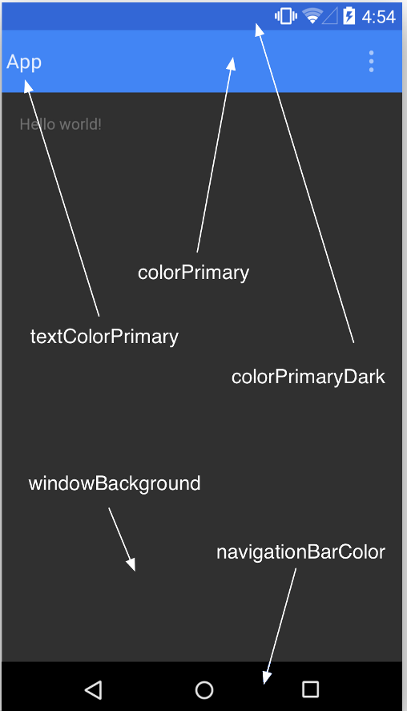
______________________________________________________________________________________
______________________________________________________________________________________
______________________________________________________________________________________
# 10. String Resource <a id="10"></a>
______________________________________________________________________________________
* **String** resource là các **string** được khai báo sẵn và được đặt tên trong file **strings.xml** nằm trong thư mục **res/values/strings.xml**

## 10.1. Plain String (String thô) <a id="10.1"></a>
______________________________________________________________________________________
* **plain string** ý nói đến các **string** được khai báo trong **strings.xml** mà chỉ chứa các ký tự bình thường và ký tự ``\n`` (xuống dòng).
* cách khai báo 1 **plain string**
    * mở file **strings.xml**
    * thêm thẻ ``<string></string>``
    * thêm thuộc tính ``name="[tên_của_string]"`` cho thẻ 
        * ``<string name="[tên_của_string]"></string>``
    * thêm giá trị của ``name`` string đó 
        * ``<string name="[tên_của_string]">[nội_dung_của_string]</string>``

* truy xuất đến 1 **plain string**
    * trong file **xml** hoặc file **AndroidManifest.xml** sử dụng thuộc tính ``android:text``:
        * ``android:text="@string/[tên_của_string]"``
    * trong file **java** gọi đến [tên_của_string] bằng cách truyền **R.string.[tên_của_string]** (vào resource, 
  vào string, lấy string có tên chỉ định)             
        ```java
        // Khai báo TextView chính là TextView từ XML resource, với id đã khai báo là activity_main_tv_empty
        TextView textView = (TextView) findViewById(R.id.[id_của_textview]);

        // Set plain text có tên là empty_note cho TextView
        textView.setText(R.string.[tên_của_string]);
        ```

## 10.2. Style String (String có kiểu mẫu) <a id="10.2"></a>
______________________________________________________________________________________
* **style string** ý nói đến các **string** được hiển thị đa dạng hơn **plain string**.

### 10.2.1. hiển thị các ký tự đặc biệt: ``'``, ``"``, ``\`` <a id="10.2.1"></a>
______________________________________________________________________________________
* ký tự khai báo sử dụng ký tự đặc biệt: ``\``
* để hiển thị các ký tự đặc biệt trên, trong nội dung của **string** ta thêm ký tự ``\`` trước những ký tự đặc biệt.
    * ``\'`` : để hiển thị ``'``
    * ``\"`` : để hiển thị ``"``
    * ``\\`` : để hiển thị ``\``

### 10.2.2. hiển thị các ký tự đặc biệt: ``&``, ``<``, ``>``, ``...`` <a id="10.2.2"></a>
______________________________________________________________________________________ 
* những ký tự phải dùng mã của chúng trong nội dung của **string** để hiển thị.
    * ``&amp`` (amp=ampersand): để hiển thị ``&``
    * ``&lt`` (lt=less than): để hiển thị ``<``
    * ``&gt`` (gt=greater than): để hiển thị ``>``
    * ``&#8230`` : để hiển thị ``...``

### 10.2.3. khai báo và truy xuất style string <a id="10.2.3"></a>
______________________________________________________________________________________     
* **style string** thực ra cũng là 1 **string**, và cách khai báo và truy xuất đến nó cũng tương tự như **plain string**.

### 10.2.4. style string với thẻ HTML <a id="10.2.4"></a>
______________________________________________________________________________________     
* trong nội dung của **string** dùng các thẻ **HTML** dùng để định dạng hiển thị, bao lấy nội dung cần định dạng.
    * **in đậm** : ``<b>nội dung cần in đậm</b>``
    * *in nghiêng* : ``<i>nội dung cần in nghiêng</i>``
    * <u>gạch chân</u> : ``<u>nội dung cần gạch chân</u>``
* truy xuất đến **string** có dùng thẻ **HTML**:
    * trong **xml**: tương tự như truy xuất đến 1 **string** bình thường.
    * trong **java** code: 
        * ``setText(R.string.empty_note);`` : nội dung sẽ được gán và hiển thị đầy đủ gồm cả các định dạng có từ thẻ **HTML**.
        * ``setText(getString(R.string.empty_note));`` : **getString()** sẽ loại bỏ các thẻ **HTML** từ đó làm mất định dạng từ thẻ **HTML**.

## 10.3. CDATA String (String theo cách viết CDATA) <a id="10.3"></a>
______________________________________________________________________________________        
* **CDATA String** là cách viết **string** để có thể áp dụng nhiều định dạng **HTML** hơn, thay vì là chỉ ``<b></b>, <i></i>,<u></u>``.
* cách áp dụng **CDATA String** vào nội dung của **string resource**:
    * ở phần nội dung của **string** được bao bởi cặp thẻ ``<CDATA></CDATA>``.
    * cặp thẻ ``<CDATA></CDATA>`` chứa bên trong nó là 1 nội dung **HTML**
* ví dụ về cách viết theo **CDATA**
```xml
<string name="example_CDATA_string">
    <CDATA>
        <html>
            <body>
                <h1>Trường hợp danh sách ghi chú trống</h1>
                <p>Khi danh sách ghi chú trống. bạn hãy nhấp vào nút dấu <b>+</b> nằm ở bên phải phía dưới màn hình, 
                và làm theo hướng dẫn để tạo ghi chú mới</p>
                <p><b><font color="#000FF">Chúc bạn vui vẻ</font></b></p>
            </body>
        </html>
    </CDATA>
</string>  
```

* Truy xuất đến CDATA String       
    * không thể truy xuất **CDATA String** thông qua file **xml**.
    * chỉ có thể truy xuất **CDATA String** thông qua file **java**, bằng cách dùng phương thức **getString()** 
  để lấy **string** sau đó truyền cho phương thức static **fromHtml()** từ class **Html** để lấy đúng nội dung cần hiển thị.
```java
// Khai báo TextView chính là TextView từ XML resource, với id đã khai báo là activity_main_tv_empty
TextView textView = (TextView) findViewById(R.id.[id_của_textView]);
 
// Set text có style là CDATA cho TextView
textView.setText(Html.fromHtml(getString(R.string.[name_của_CDATA_String])));
```

## 10.4. SpannableString (String theo kiểu Spannable) <a id="10.4"></a>  
______________________________________________________________________________________
* **SpannableString** là 1 **java class**, như vậy muốn định dạng 1 **string** bất kỳ mà không cần dùng cách viết của
**HTML** ta có thể dùng **SpannableString** để thay thế.
* để sử dụng **SpannableString** cho 1 **string** nào đó thì ta cũng cần phải có 1 **plain string** để áp dụng trong 
file **strings.xml**
```xml
<string name="example_SpannableString">In case the note list is empty\nWhen the note list is empty. 
You should click on the + button on the right-bottom of screen, 
and follow the instruction to create your first note.\n
Hope you enjoy
</string>
```
* sử dụng **SpannableString** để chỉnh sửa đoạn text trên được định dạng lại như sau:
    * (1) ``In case the note list is empty``: sẽ có màu đỏ
    * (2) ``+`` : font size gấp 2 lần các font xung quanh   
    * (3) ``follow the instruction`` : khi click vào sẽ có 1 thông báo kiểu **Toast**
    * (4) ``Hope you enjoy`` : khi click vào sẽ dẫn đến 1 đường dẫn website

* sử dụng **SpannableString** trong **java** code
```java
        // lấy plain string từ R.string.[name_của_plain_string] trả về cho CharSequence
        CharSequence charSequence = getText(R.string.example_SpannableString);
        // truyền đối tượng của CharSequence vào SpannableString constructor
        SpannableString spannableString = new SpannableString(charSequence);
        // set màu đỏ cho string (1) vị trí từ 0-30
        spannableString.setSpan(new ForegroundColorSpan(Color.RED), 0, 30, 0);
        // set size của string (2) gấp 2 lần so với các string xung quanh, từ vị trí 84-85
        spannableString.setSpan(new RelativeSizeSpan(2), 84, 85, 0);
        // tạo khả năng click cho string đồng thời sẽ hiển thị thông báo kiểu Toast khi click vào
        ClickableSpan clickableSpan = new ClickableSpan() {
            @Override
            public void onClick(@NonNull View widget) {
                Toast.makeText(MainActivity.this, "Will be implement later...", Toast.LENGTH_SHORT).show();
            }
        };
        // truyền khả năng click cho string (3) từ vị trí 128-150
        spannableString.setSpan(clickableSpan, 128, 150, 0);
        // set màu xanh cho string (3) từ vị trí 128-150
        spannableString.setSpan(new ForegroundColorSpan(Color.BLUE), 128, 150, 0);
        // set string (4) là 1 link liên kết (khi click vào sẽ dẫn đến đường dẫn của website chỉ định) từ vị trí 178-cuối string
        spannableString.setSpan(new URLSpan("https://google.com"), 178, charSequence.length(), 0);
        // set string (4) có màu đen
        spannableString.setSpan(new ForegroundColorSpan(Color.BLACK), 178, charSequence.length(), 0);
        // set string (4) có size gấp 2 lần string xung quanh
        spannableString.setSpan(new RelativeSizeSpan(2), 178, charSequence.length(), 0);
        // kích hoạt clickableSpann và URLSpan có thể hoạt động
        textView.setMovementMethod(LinkMovementMethod.getInstance());

        //  set spannableString vào textView
        textView.setText(spannableString);
```            

## 10.5. Sử Dụng Formatting String <a id="10.5"></a>  
______________________________________________________________________________________ 
* **Formatting String** dùng để đánh dấu 1 số vị trí trong **plain text** để hiển thị những string chỉ định theo định 
dạng được thiết lập trong **plain string**.
* có thể gọi **Formatting String** là string đánh dấu vị trí giữ chỗ hiển thị những string cần thiết trong tương lai
(khi chạy chương trình mới có nội dung hiển thị).
* cú pháp của **Formatting String**: ``%[thứ_tự_đối_số$]kiểu_định_dạng``
    * ``%`` : thông báo sau ``%`` là chuỗi định dạng, nếu sau ``%`` không có chuỗi định dạng thì ``%`` chỉ là 1 ký tự bình thường.
    * ``[thứ_tự_đối_số$]``: ``thứ_tự_đối_số`` là 1 số nguyên lớn hơn 0, là thứ tự tương ứng tham số được truyền vào 
  phương thức **getText()**, sau ``thứ_tự_đối_số`` bắt buộc là ký tự ``$``. đoạn định dạng này có thể không có trong
  **Formatting String** nếu chỉ có 1 vị trí cần hiển thị định dạng.
    * ``kiểu_định_dạng`` :
        * ``s`` : kiểu String
        * ``d`` : kiểu Integer
        * ``f`` : kiểu Float

### 10.5.1. Khai báo Formatting String trong plain string <a id="10.5.1"></a>          
______________________________________________________________________________________ 
* trong **plain string** thêm những **Formatting String** vào những vị trí mà trong tương lai khi chạy ứng dụng mới
biết được nội dung để hiển thị.
```xml
<string name="example_Formatting_String">Today is %1$s\nYou have %2$d note now. 
Let click + button to create new note.\n\nDid you see this %3$f number?
</string>
```

### 10.5.2. truy xuất đến Formatting String từ java code <a id="10.5.2"></a>          
______________________________________________________________________________________
* để truy xuất đến những **Formatting String** trong **xml** từ **java** code:
    * sử dụng phương thức **getString()** để lấy về 1 **string** từ **resource**
    * truyền vào **string resource** cần get string
    * truyền vào các tham số tương ứng với các thứ tự đối số **Formatting String** được đánh dấu trong **plain string**
```java
    textView = (TextView) findViewById(R.id.activity_main_tv_empty);
    // lấy thời gian lịch hệ thống
    Calendar calendar = Calendar.getInstance();
    // thiết lập định dạng cho Calendar chỉ hiển thị DD/MM/YYYY
    SimpleDateFormat simpleDateFormat = new SimpleDateFormat("dd/MMM/yyyy");
    // lấy chuỗi của Calendar theo định dạng của SimpleDateFormat
    String currentDate = simpleDateFormat.format(calendar.getTime());

    // Set text có các tham số truyền vào tương đương các định dạng %1$s, %2$d, %3$f trong XML
    textView.setText(getString(R.string.example_Formatting_String,currentDate, 0, 3.5f));
```   

## 10.6. plurals resource- Hiển thị String phụ thuộc vào số lượng của danh từ đếm được <a id="10.6"></a>  
______________________________________________________________________________________
* **plurals** resource được sử dụng cho những ngôn ngữ phân biệt danh từ đếm được là số ít hay số nhiều (như tiếng Anh).
* **plurals** resource được dùng để hiển thị chính xác **text** cần hiển thị theo số lượng danh từ.
    * 1 ghi chú: **1 note**
    * 3 ghi chú: **3 notes**

### 10.6.1. khai báo plurals resource trong strings.xml <a id="10.6.1"></a>    
______________________________________________________________________________________
* **plurals** resource cũng như **string** resource được khai báo trong file **res/values/strings.xml**
* cách khai báo **plurals** resource:
    * mở file **strings.xml**
    * thêm cặp thẻ ``<plurals> </plurals>``
    * thêm thuộc tính ``name`` cho thẻ ``<plural>``
    * thêm các cặp thẻ con ``<item></item>`` vào ``<plurals> </plurals>``
    * thêm thuộc tính ``quantity="giá_trị_số_lượng"`` : có các giá trị số lượng sau 
        * "one"
        * "two"
        * "few"
        * "many"
        * "other"
    * thêm nội dung text cần hiển thị cho item tương ứng
    * có thể áp dụng **Formatting String** vào nội dung của thẻ ``<item></item>`` nếu muốn 
* cú pháp chung của ``plurals``         
```xml
<?xml version="1.0" encoding="utf-8"?>
<resources>
    <plurals
        name="plural_name">
        <item
            quantity=["zero" | "one" | "two" | "few" | "many" | "other"]
            >text_string</item>
    </plurals>
</resources>
```

### 10.6.2. truy xuất nội dung của plurals resource từ java code  <a id="10.6.2"></a>    
______________________________________________________________________________________  
* **plurals** resource chỉ có thể được truy xuất từ **java** code, bằng cách sử dụng phương thức:
    * ``getResources().getQuantityString()`` để lấy string theo số lượng trong plurals resource
```java
// giả lập số lượng note
int numOfNotes = 1;

// setText cho TextView từ String lấy được từ plurals resource theo item chỉ định
textView.setText(getResources().getQuantityString(R.plurals.example_plurals, numOfNotes, numOfNotes));  
```
* giải thích các tham số truyền vào cho ``getQuantityString()``
    * ``R.plurals.example_plurals``:
        * ``R``: resource
        * ``plurals`` : loại resource là **plurals**
        * ``example_plurals`` : tên của loại resource chỉ định
    * ``numOfNotes`` thứ nhất: báo cho hệ thống biết lấy string số ít hay số nhiều bằng cách truyền vào 1 giá trị Integer      
    * ``numOfNotes`` thứ 2: tham số truyền vào cho đối số đặt chỗ **Formatting String** nếu có, số lượng tham số này 
  phụ thuộc vào số lượng đối số **Formatting String** khai báo trong **item** của **plurals**

## 10.7. String Array trong XML <a id="10.7"></a>  
______________________________________________________________________________________
* khai báo **string-array** trong **xml**.  
* cặp thẻ ``<string-array></string-array>`` giúp khai báo 1 mảng các **string** ngay trong **xml**.  

### 10.7.1. Khai báo string-array trong xml <a id="10.7.1"></a>
______________________________________________________________________________________
* **string-array** cũng là 1 loại **resource** nằm trong thư mục **res/values/strings.xml**
* cách thức khai báo trong **xml**
    * mở file **strings.xml**
    * thêm cặp thẻ ``<string-array></string-array>``
    * thêm thuộc tính ``name="name_string_array"``
    * thêm các **item** ``<item></item>``, mỗi **item** chứa 1 giá trị chuỗi tương ứng với 1 phần tử mảng.
* cú pháp chung trong **xml**
```xml
<?xml version="1.0" encoding="utf-8"?>
</resources> 
    <string-array name="name_of_string_array">
        <item>string1</item>
        <item>string2</item>
        <item>string3</item>
        <item>string4</item>
    </string-array>
</resources> 
```

### 10.7.2. Truy xuất string-array trong java code <a id="10.7.2"></a>
______________________________________________________________________________________
* **string-array** chỉ có thể được truy xuất bằng **java** code từ **resource array** ``R.array.name_of_string_array`` 
bằng phương thức:
    * ``String[] getResources().getStringArray(R.array.name_of_string_array)``
```java
String[] stringsArray = getResources().getStringArray(R.array.example_string_array);
``` 

## 10.8. String Resource Cho Ứng Dụng Hỗ Trợ Đa Ngôn Ngữ <a id="10.8"></a>
______________________________________________________________________________________
* để ứng dụng sẽ hiển thị những string có ngôn ngữ tương ứng với từng hệ thống.
* ví dụ: thiết bị sử dụng ngôn ngữ Trung Quốc, thì các chuỗi trên ứng dụng hoàn toàn hiển thị ký tự Trung Quốc.

### 10.8.1. Cách Tạo File Resource strings.xml Cho Từng Ngôn Ngữ <a id="10.8.1"></a>
______________________________________________________________________________________
#### Sử Dụng Translations Editor Tích Hợp Trong Android Studio
______________________________________________________________________________________

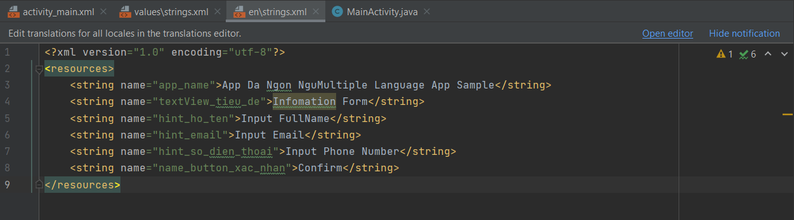

* có thể sử dụng Translations Editor để chỉnh sửa trực quan hơn, có 2 cách để mở Translations Editor.
  * trong file ``strings.xml`` bất kỳ sẽ có 1 thanh notification chữ màu xanh, click chọn Open Editor
  * nhấn Shift 2 lần để mở Pallet: nhập vào Translations Editor sau đó đường dẫn mở Translation Editor sẽ xuất hiện

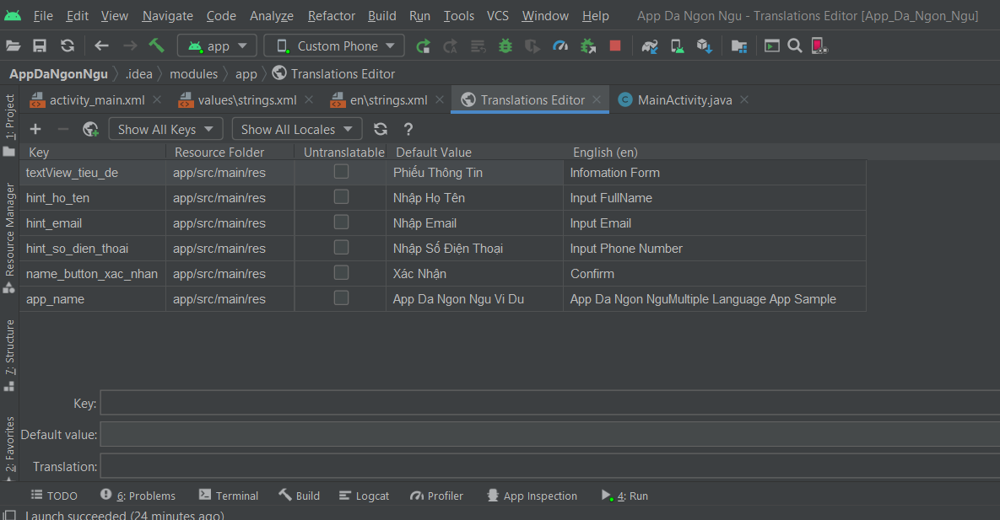

* Cách sử dụng Translation Editor:
  * add key: thêm key (tên của chuỗi cần hiển thị)
  * remove key: xóa key
  * add Locale: thêm vùng ngôn ngữ
  * bảng thông tin các string trong strings.xml
    * key (tên của string)
    * resource folder (thư mục của file chứa key)
    * Untranslatable (tùy chọn translate hay không cho key)
    * Default Value (giá trị mặc định của chuỗi sẽ hiển thị)
    * English (en) - cột này chỉ xuất hiện nếu có add Locale tương ứng (đây sẽ là giá trị chuyển đổi tương ứng với ngôn ngữ của Local)
  * tiến hành chọn vào 1 key cần translate ở cột ngôn ngữ chuyển đổi, sẽ có 3 trường dùng để nhập thông tin
    * key (tên key)
    * default value (giá trị mặc định của key)
    * Translation (giá trị của key ở Locale tương ứng)
* Sau khi chỉnh sửa ở Translation Editor, mọi thứ ở thư mục resource **res/** sẽ thay đổi tương ứng.

#### Thao Tác Trực Tiếp Với File XML
______________________________________________________________________________________
* chuột phải thư mục **res/** -> **New** -> **Android Resource Directory**
* Resource name (để mặc định hệ thống generate)
* Resource type (chọn loại values)
* chọn Locale -> chọn **\>>**
* chọn ngôn ngữ -> OK
* copy file ``strings.xml`` ở thư mục default resource **res/values/** copy paste vào thư mục alternative resource
* chỉnh sửa file ``strings.xml`` ở thư mục alternative tương ứng với ngôn ngữ hỗ trợ của thư mục đó.

### 10.8.2. Truy Xuất strings.xml <a id="10.8.2"></a>
______________________________________________________________________________________
* ở thành phần tương ứng cần sử dụng String Resource ta vẫn truy xuất gọi đến bình thường

______________________________________________________________________________________
______________________________________________________________________________________
______________________________________________________________________________________
# 11. Color Resource <a id="11"></a>
______________________________________________________________________________________
## 11.1. Hệ Màu Trong Android <a id="11.1"></a>
______________________________________________________________________________________
* trong **Android** có 2 hệ màu được sử dụng:
  * **RGB** (Red-Green-Blue)
    * hệ **RGB** gồm 3 màu cơ bản Red, Green, và Blue.
    * từ 3 màu cơ bản sẽ tạo ra nhiều màu sắc khác nhau bằng cách:
      * kết hợp từng màu cơ bản với nhau.
      * tăng giảm độ đậm nhạt của mỗi màu cơ bản
  * **ARGB** (Alpha-Red-Green-Blue)
    * hệ **ARGB** là hệ mở rộng của **RGB** bằng cách bổ sung giá trị **A** (Alpha) để điều khiển độ trong suốt của 
    3 màu cơ bản Red, Green, Blue.
    * cách kết hợp để tạo ra các màu sắc khác nhau cũng tương tự như hệ **RGB** chỉ mở rộng thêm thay đổi tăng giảm 
    độ trong suốt của giá trị **A**, khiến màu sắc của hệ **ARGB** đa dạng hơn.

## 11.2. Biểu Diễn Màu Sắc Với RGB và ARGB <a id="11.2"></a>
______________________________________________________________________________________
* để sử dụng 1 màu nào đó trong **Android**, ta phải gọi đến mã màu tương ứng của màu đó.
* cú pháp gọi mã màu của **RGB** và **ARGB**:
  * **RGB** : #RRGGBB
  * **ARGB** : #AARRGGBB
* các thành phần trong mã màu:
  * ``#`` : báo với hệ thống đây là chuỗi biễu diễn màu sắc
  * ``AA``, ``RR``, ``GG``, hay ``BB``: là giá trị **Hexa** để biểu diễn độ đậm nhạt của từng loại màu cơ bản trong 
  khoảng giá trị từ **00** đến **FF**.
    * **00** : là ĐẬM tối đa
    * **FF** : là NHẠT tối đa
* ví dụ:
  * ``#FF0000`` - ``RED``: RR (đậm tối đa), GG (nhạt tối đa), BB (nhạt tối đa)
  * ``#00FF00`` - ``GREEN``: RR (nhạt tối đa), GG (đậm tối đa), BB (nhạt tối đa)
  * ``#0000FF`` - ``BLUE``: RR (nhạt tối đa), GG (nhạt tối đa), BB (đậm tối đa)
  * ``#FFFF00`` - ``YELLOW``: RR (đậm tối đa), GG (đậm tối đa), BB (nhạt tối đa)
  * ``#F531C0`` - ``PINK``: RR (đậm F5), GG (đậm 31), BB (đậm C0)
  * ``#2DF531C0`` - ``LIGHT PINK`` : AA (2D), RR (F5), GG (31), BB (C0)

## 11.3. Khai Báo Màu Sắc Trong Resource Android <a id="11.3"></a>
______________________________________________________________________________________
* **color** cũng là một dạng **resource** trong Android, và nó được khai báo trong file **colors.xml**.
* đường dẫn đến file khai báo color: **res/values/colors.xml**
* cấu trúc của file **colors.xml**
```xml
<?xml version="1.0" encoding="utf-8"?>
<resource>
    <color name="tên_màu_1">mã_màu_1</color>
    <color name="tên_màu_2">mã_màu_2</color>
    <color name="tên_màu_3">mã_màu_4</color>
</resource>     
```
* trong file **colors.xml** là các thẻ ``<color></color>`` được chứa trong cặp thẻ ``<resource></resource>``
* thẻ ``<color>`` chứa thuộc tính ``name="tên_màu_1"`` đặt tên cho mã màu chỉ định.
* trong thẻ **color** chứa giá trị là mã màu tương ứng với **name**

## 11.4. Truy Xuất Đến Màu Đã Khai Báo Trong Resource <a id="11.4"></a>
______________________________________________________________________________________
### 11.4.1. Truy Xuất Color Từ XML <a id="11.4.1"></a>
______________________________________________________________________________________
* từ bất kỳ file xml, nếu có 1 thành phần nào trong giao diện có thuộc tính sử dụng đến **color**, 
ta có thể dễ dàng thiết lập **color** cho thuộc tính đó bằng cách gọi đến tên của **color** đã khai báo trong **resource**.
* ví dụ màu nền: 
```xml
android:background="@color/tên_màu"
```
* ví dụ màu text:
```xml
android:textColor="@color/tên_màu"
```

### 11.4.2. Truy Xuất Color Từ JAVA Code <a id="11.4.2"></a>
______________________________________________________________________________________
* trong **Java** code, để sử dụng 1 **color** nào đó đã được khai báo trong **resource**, ta thực hiện các bước sau:
  * ``Resources resource = getResources();`` : lấy 1 đối tượng **resource** 
  * ``int color = resource.getColor(R.color.tên_màu);`` : lấy giá trị kiểu **int** của **color** trong **resource**
  * giá trị **color** kiểu **int** sẽ được dùng trong 1 số phương thức cần màu sắc: **setTextColor()**, **setBackgroundColor()**...
    * ``TextView textView = findViewById(R.id.activity_main_tv_empty);`` 
    <br/>``textView.setTextColor(color);``
```java
Resources res = getResources();
int color = res.getColor(R.color.colorPrimary);
 
TextView textView = findViewById(R.id.activity_main_tv_empty);
textView.setTextColor(color); 
```

______________________________________________________________________________________
______________________________________________________________________________________
______________________________________________________________________________________
# 12. Dimension Resource (Dimension - Kích Thước) <a id="12"></a>
______________________________________________________________________________________
* **dimens.xml** resource là 1 loại **resource** trong **Android**, nó dùng để khai báo kích thước cho các thành phần
trong thiết kế giao diện ứng dụng.
* **dimens.xml** là 1 loại **resource** đơn giản nhưng quan trọng trong thiết kế ứng dụng **Android**, nó giúp linh hoạt
về kích thước cho vô vàn các loại màn hình của điện thoại **Android** trên thị trường.

## 12.1. Vị Trí Lưu Trữ Dimension Resource <a id="12.1"></a>
______________________________________________________________________________________
* **Dimension Resource** được khai báo trong file **dimens.xml**.
* thư mục lưu trữ của file **dimens.xml**:
  * default resource: **res/values/dimens.xml** hoặc
  * alternative resource: **res/values-xxx/dimens.xml** nếu dùng theo kiểu **resource chuyển đổi**
* nếu file **dimens.xml** chưa được tạo trong **res/values/** hay **res/values-xxx/** tương ứng thì ta chỉ việc thêm
file **dimens.xml** vào **default resource** hay **alternative resource** tương ứng.

## 12.2. Sử Dụng Dimension Resource <a id="12.2"></a>
______________________________________________________________________________________
### 12.2.1. Khai Báo Dimension Resource <a id="12.2.1"></a>
______________________________________________________________________________________
* cấu trúc của file **dimens.xml** được viết như sau:
```xml
<?xml version="1.0" encoding="utf-8"?>
<resources>
    <dimen name="tên_của_loại_dimension">[kích_thước][đơn_vị]</dimen>
</resources> 
```
* các thành phần bên trong file **dimens.xml**
  * khai báo file xml: ``<?xml version="1.0" encoding="utf-8"?>``
  * cặp thẻ khai báo resource: ``<resources> </resources> ``
  * các thẻ dimen con: ``<dimen> </dimen>``
    * thuộc tính của ``<dimen>``: ``name="tên_của_loại_kích_thước"``
    * giá trị của ``<dimen></dimen>``: ``[kích_thước][đơn_vị]``

### 12.2.2. Các Loại Đơn Vị Kích Thước Mà Android Hỗ Trợ <a id="12.2.2"></a>
______________________________________________________________________________________
* **dp** – Density-independent Pixel - đơn vị đề nghị nên dùng cho tất cả các kích thước bên trong 
ứng dụng, kể cả cho padding và margin.
* **sp** – Scale-independent Pixel –  Thông số này tương tự như dp, nhưng dùng khi định nghĩa font size.
* **pt** Point – 1 point = 1/72 inch dựa trên loại màn hình 72 dpi. nó sẽ giúp ích cho một số ứng dụng có làm việc với 
máy in, để đảm bảo kích thước thật trong qua trình thiết kế.
* **px** – Pixel – Dựa trên đơn vị pixel vật lý của thiết bị. pixel không giúp tạo được một giao diện nhất quán cho 
các tỉ lệ màn hình khác nhau ngoài thị trường. Do đó tốt nhất nên chọn dp hoặc sp để thay thế.
* **mm** – Milimet – Dựa trên đơn vị milimet thực tế. ứng dụng của nó cũng giống như với đơn vị pt.
* **in** – Inch – Dựa trên đơn vị inch thực tế.

### 12.2.3. Truy Xuất Dimension <a id="12.2.3"></a>
______________________________________________________________________________________
#### Truy Xuất Dimension Từ XML
______________________________________________________________________________________
* trong **Design** tab -> **Attributes** -> field liên quan đến kích thước -> chọn **dimen** đã khai báo trong **dimens.xml**
* trong **Text** tab, những thành phần có thuộc tính là kích thước, thay vì nhập thủ công kích thước cho thuộc tính đó,
ta có thể gọi đến tên của **dimen** đã khai báo trong **dimens.xml**: <br/>``@dimen/tên_dimen_đã_khai_báo``

#### Truy Xuất Dimension Từ Java Code
______________________________________________________________________________________
* trong **Java** code, nếu muốn sử dụng các **dimen** đã khai báo, ta truyền <br/>
``R.dimen.tên_dimen_đã_khai_báo`` <br/>
vào phương thức cần thiết.
* Ví dụ:
```java
ImageView imageView = (ImageView) findViewById(R.id.imageView);

imageView.getLayoutParams().width = getResources().getDimensionPixelSize(R.dimen.activity_horizontal_margin);
imageView.getLayoutParams().height = getResources().getDimensionPixelSize(R.dimen.activity_vertical_margin);
```

### 12.3.4 Tương Quan Giữa Các Đơn Vị Kích Thước Trong Thiết Kế Giao Diện Android <a id="12.3.4"></a>
______________________________________________________________________________________
* **px** – Pixel (điểm ảnh - chấm sáng) – Dựa trên đơn vị pixel vật lý của thiết bị.
* **Density** - mật độ:
  * **ppi** - Pixel Per Inch - Số lượng điểm ảnh trên diện tích 1 inch vuông trên màn hình vật lý của điện thoại.
  * **dpi** - tương tự như **ppi**.
* **dp** – Density-independent Pixel - đơn vị pixel độc lập với mật độ pixel vật lý.
______________________________________________________________________________________
#### **px** - Ví dụ về hiển thị 1 hình ảnh ``160px - 160*160 (px)`` trên các loại màn hình nếu chỉ định đơn vị là **px**:
* màn hình có **Density = 160 dpi (160x160 px/inch)** - hình ảnh sẽ hiển thị kích thước đúng 1 inch trên 1 inch màn hình vật lý.
* màn hình có **Density = 240 dpi (240x240 px/inch)** - hình ảnh sẽ hiển thị kích thước 2/3 inch trên 1 inch màn hình vật lý.
* màn hình có **Density = 320 dpi (320x320 px/inch)** - hình ảnh sẽ hiển thị kích thước 1/2 inch trên 1 inch màn hình vật lý.
* màn hình có **Density = 480 dpi (480x480 px/inch)** - hình ảnh sẽ hiện thị kích thước 1/3 inch trên 1 inch màn hình vật lý.
* _với cách sử dụng đơn vị **px** để hiển thị 1 hình trên các loại màn có **Density - dpi (ppi)** khác nhau, làm cho hình
được hiển thị không đồng nhất kích thước trên 1 inch vật lý, màn có **density - dpi (ppi)** càng cao, hình càng bị thu nhỏ
lại_
______________________________________________________________________________________
#### **dp** - Ví dụ về hiển thị 1 hình ảnh ``160px - 160*160 (px)`` trên các loại màn hình nếu chỉ định đơn vị là **dp**:
* khi sử dụng đơn vị kích thước cho hình ảnh trên là **dp**, nghĩa là ta có 1 hình ``160dp - 106*160 (dp)``.
* **dp** là đơn vị **Pixel** lý thuyết, nó độc lập với đơn vị **px - Pixel** vật lý:
* nếu sử dụng đơn vị **dp** làm kích thước, hệ thống **Android** sẽ tính toán quy đổi nó ra đơn vị **px** tương ứng cho
từng loại màn hình.

> cùng 1 kích thước có đơn vị là **dp**, **Android** sẽ quy đổi ra nhiều kích thước có đơn vị là **px** tương ứng với từng
> màn hình có **density** khác nhau

> Công thức Quy đổi **dp** sang **px** tương ứng với từng **density** của màn hình:
> **Android** sẽ lấy màn hình có **density = 160 dpi** làm chuẩn:
> 
> **px = dp * (dpi / 160)**

* hình ảnh có kích thước **160dp**
  * màn **Density = 160 dpi** - kích thước dp hiển thị = 160*(160/160) = 160px.
  * màn **Density = 240 dpi** - kích thước dp hiển thị = 160*(240/160) = 240px.
  * màn **Density = 320 dpi** - kích thước dp hiển thị = 160*(320/160) = 320px.
  * màn **Density = 480 dpi** - kích thước dp hiển thị = 160*(480/160) = 480px.

______________________________________________________________________________________
______________________________________________________________________________________
______________________________________________________________________________________
# 13. Các Loại Resource Khác <a id="13"></a>
______________________________________________________________________________________
## 13.1. bool resource <a id="13.1"></a>
______________________________________________________________________________________
* thư mục chứa: **res/values/**
* tên file: **bools.xml**
* cấu trúc file **bools.xml**:
  * chứa các thẻ con ``<bool></bool>`` bên trong cặp thẻ ``<resources> </resources>``
  * thẻ ``<bool>`` chứa thuộc tính ``name="name_của_bool"``
  * giá trị của thẻ ``<bool></bool>`` chỉ chứa 1 trong 2 giá trị ``true`` hoặc ``false``
```xml
<?xml version="1.0" encoding="utf-8"?>
<resources>
    <bool name="name_của_bool">[giá_trị_boolean]</bool>
</resources>
```
* từ bất kỳ file **xml**, thành phần nào có thuộc tính cần đến giá trị **bool** có thể gọi đến **bool resource** đó bằng
cách gọi đến tên của thẻ **bool** tương ứng: <br/>
``@bool/name_của_bool``
* từ bất kỳ file **java** code, có thể gọi đến thẻ **bool** cần sử dụng thông qua phương thức: <br/>
``boolean bool = getResources().getBoolean(R.bool.name_của_bool);``

## 13.2. bool resource <a id="13.2"></a>
______________________________________________________________________________________
* thư mục chứa: **res/values/**
* tên file: **ids.xml**
* cấu trúc file **ids.xml**:
  * chứa các thẻ con ``<item/>`` bên trong cặp thẻ ``<resources> </resources>``
  * thẻ ``<item/>`` chứa 2 thuộc tính:
    * thuộc tính ``type="id"``
    * thuộc tính ``name="name_id"``
  * thẻ ``<item/>`` không chứa giá trị
```xml
<?xml version="1.0" encoding="utf-8"?>
<resources>
    <item type="id" name="name_của_id"/>
</resources>
```
* từ bất kỳ file **xml**, khi khai báo **id** cho bất kỳ thành phần nào, **thay vì** thêm thuộc tính **id** và tạo **id**
cho thành phần đó bằng cú pháp: <br/>
``android:id="@+id/name_của_id"`` lưu ý: **@+id/** có dấu **+**<br/>
ta có thể thay thế bằng cách **thêm thuộc tính id, nhưng không tạo, mà gọi đến id đã khai báo trong id resource có sẵn** <br/>
``android:id="@id/name_của_id"`` lưu ý: **@id/** không có dấu **+**

## 13.3. integer resource <a id="13.3"></a>
______________________________________________________________________________________
* thư mục chứa: **res/values/**
* tên file: **integers.xml**
* cấu trúc file **integers.xml**:
  * chứa các thẻ con ``<integer> </integer>`` bên trong cặp thẻ ``<resources> </resources>``
  * thuộc tính của thẻ ``<integer>``: ``name="name_của_giá_trị_integer"``
  * giá trị của thẻ ``<integer> </integer>``: là 1 số nguyên **integer**
```xml
<?xml version="1.0" encoding="utf-8"?>
<resources>
    <integer name="name_của_giá_trị_integer">5</integer>
</resources>
```
* từ bất kỳ file **xml**, khi khai báo thuộc tính cho bất kỳ thành phần nào cần đến giá trị **integer**, chỉ cần gọi đến
**integer** resource tương ứng cho thuộc tính đó: <br/>
``@integer/name_của_giá_trị_integer``
* từ bất kỳ file **java** code nào, có thể gọi đến **integer** resource cần sử dụng bằng cách truyền tên của thẻ **integer**
tương ứng vào phương thức: <br/>
``int i = getResources().getInteger(R.integer.name_của_giá_trị_integer);``


## 13.3. integer-array resource <a id="13.3"></a>
______________________________________________________________________________________
* thư mục chứa: **res/values/**
* tên file: **integers.xml**
* cấu trúc file **integers.xml**:
    * chứa các thẻ con ``<integer-array> </integer-array>`` bên trong cặp thẻ ``<resources> </resources>``
    * thuộc tính của thẻ ``<integer-array>``: là ``name="name_của_integer_array"``
    * bên trong thẻ ``<integer-array> </integer-array>`` là các thẻ con ``<item></item>``
    * giá trị chứa của mỗi thẻ ``<item></item>`` là 1 phần tử **integer** của **integer_array**
```xml
<?xml version="1.0" encoding="utf-8"?>
<resources>
    <integer-array name="integer_array_sample">
        <item>1</item>
        <item>2</item>
        <item>3</item>
        <item>4</item>
    </integer-array>
</resources>
```

* cũng như **string-array**, **integer-array** cũng chỉ được truy xuất từ **Java** code, bằng cách truyền tên của **integer-array**
vào phương thức **getResource().getIntArray(R.array.name_của_integer_array)** <br/>
``int[] integerArray = getResources().getIntArray(R.array.name_của_integer_array);``

## 13.4. TypedArray resource <a id="13.4"></a>
______________________________________________________________________________________
* **TypedArray resource** khác với **string-array resource** hay **integer-array resource** ở đặc điểm đó là **resource** này
có thể khai báo bên trong nó bao nhiêu mảng, và mảng kiểu nào là tùy ý: mảng string, mảng integer, mảng color, mảng drawable, ...
* vấn đề là khi truy xuất từ **Java** code đến các mảng này, phải biết cần truy xuất đến **TypedArray** chứa phần tử kiểu gì, để
gọi phương thức cho chính xác.
* thư mục chứa: **res/values/**
* tên file: **typedarrays.xml**
* cấu trúc file **typedarrays.xml**:
  * bên trong cặp thẻ ``<resources></resources>`` là các cặp thẻ con ``<array></array>``
  * mỗi cặp thẻ con ``<array></array>`` đại diện cho 1 mảng, bên trong nó là các thẻ con ``<item></item>``, mảng thuộc kiểu nào thì phụ thuộc vào kiểu của **item** mà nó chứa
    * thẻ mở ``<array>`` chứa thuộc tính ``name="tên_của_mảng"`` là tên của mảng
    * các cặp thẻ con ``<item></item>`` chứa 1 giá trị đại diện cho 1 phần tử của mảng
```xml
<?xml version="1.0" encoding="utf-8"?>
<resources>
 
    <array name="array_of_string_sample">
        <item>Hello</item>
        <item>Yellow</item>
        <item>Code</item>
        <item>Books</item>
    </array>
 
    <array name="array_of_int_sample">
        <item>1</item>
        <item>2</item>
        <item>3</item>
        <item>4</item>
    </array>
 
    <array name="array_of_color_sample">
        <item>#FF0000</item>
        <item>#00FF00</item>
        <item>#0000FF</item>
    </array>
 
</resources>
```
* cũng như các **resource** dạng **array** như **string-array**, **integer-array**, **array** resource cũng chỉ có thể
truy cập từ **Java** code.
* với mỗi **array có 1 kiểu dữ liệu** nên phải dùng phương thức phù hợp với **kiểu của array** đó để lấy dữ liệu
```java
// Array of strings, sử dụng như resource string array
String[] strings = getResources().getStringArray(R.array.array_of_string_sample);

// Array of integers. sử dụng như resource integer array
int[] ints = getResources().getIntArray(R.array.array_of_int_sample);

// Array of color, cần đến TypedArray để lấy ra resource tương ứng
TypedArray colors = getResources().obtainTypedArray(R.array.array_of_color_sample);
int color = colors.getColor(0, 0);
```

______________________________________________________________________________________
______________________________________________________________________________________
______________________________________________________________________________________
# 14. Sử Dụng Drawable – Ảnh Bitmap <a id="14"></a>
______________________________________________________________________________________
## 14.1. Resource Hình Ảnh <a id="14.1"></a>
______________________________________________________________________________________
* Resource Hình Ảnh là những nguồn tài nguyên, nơi lưu trữ hình ảnh được sử dụng trong thiết kế giao diện ứng dụng.
* **ImageView, ImageButton, ...** là những **Widget** hoặc có thể là các **Layout** chỉ là nơi để hiển thị hình ảnh, còn
hình ảnh được lấy từ đâu, thì đó chính là **Resource Hình Ảnh**.

## 14.2. Ảnh Bitmap <a id="14.2"></a>
______________________________________________________________________________________
* **Bitmap** là các loại ảnh được tổ chức theo ma trận các điểm ảnh: **PNG, JPEG, JPG, TIFF, PSD, ...**
* **Android** chỉ hỗ trợ 3 loại ảnh **Bitmap**:
  * **PNG**: khuyến khích sử dụng
  * **JPG**: tạm chấp nhận sử dụng
  * **GIF**: hạn chế sử dụng

## 14.3. Thư Mục Lưu Trữ Ảnh Bitmap trong Resource <a id="14.3"></a>
______________________________________________________________________________________
* có 2 đường dẫn để lưu trữ hình ảnh trong **Project**
  * **drawable** - chứa ảnh thông thường
    * **res/drawable** (default resource)
    * **res/drawable-xxx** (alternative resource)
  * **mipmap** - chứa ảnh **icon**
    * **res/mipmap** (default resource)
    * **res/mipmap-xxx** (alternative resource)
* trong cùng 1 **Project** không được phép chứa 2 ảnh cùng tên nhưng khác định dạng

## 14.4. Truy Xuất Resource Ảnh <a id="14.4"></a>
______________________________________________________________________________________
### 14.4.1. Truy Xuất Từ XML <a id="14.4.1"></a>
______________________________________________________________________________________
* trong bất kỳ file **xml** hay cả file **AndroidManifest.xml** đều có thể truy xuất hình ảnh đều có thể truy xuất hình
ảnh từ **resource** nếu cần thiết.

#### Trong Design Tab
* trong hộp thoại **Attributes** -> chọn thuộc tính cần truy xuất hình ảnh -> chọn đường dẫn đến ảnh cần truy xuất.

#### Trong Text Tab
* trong thuộc tính cần gán giá trị là 1 hình ảnh, ta có thể truy xuất đến **resource bitmap** bằng cách gọi: <br/>
``@drawable/tên_file_ảnh`` hoặc ``@mipmap/tên_file_ảnh``
* khi gọi đến tên của file ảnh, không cần thêm đuôi mở rộng định dạng ảnh như **.PNG**, **.JPG**, hay **.GIF**, và như
vậy không được phép chứa 2 ảnh cùng tên nhưng khác định dạng trong cùng 1 project, vì như thế hệ thống sẽ không biết sẽ
gọi đến ảnh nào.

### 14.4.2. Truy Xuất Từ Java Code <a id="14.4.2"></a>
______________________________________________________________________________________
* trong **Java** code để truy xuất đến 1 hình ảnh trong **resource** ta cần truyền:
  * ``R.drawable.tên_file_ảnh`` (trả về giá trị kiểu int) - nếu ảnh lưu trong **drawable**
  * ``R.mipmap.tên_file_ảnh`` (trả về giá trị kiểu int) - nếu ảnh lưu trong **mipmap**  
* vào trong phương thức cần đến **resource ID**:
  * ``setImageResource()`` tương tự như thuộc tính ``android:src`` trong **xml**.
  * ``setBackgroundResource()`` tương tự như thuộc tính ``android:background`` trong **xml**
```java
ImageView imageView = (ImageView) findViewById(R.id.activity_main_imv_empty);
imageView.setImageResource(R.mipmap.tên_file_ảnh);
```

## 14.5. Sử Dụng Công Cụ Image Asset <a id="14.5"></a>
______________________________________________________________________________________
* **Image Asset** là công cụ tích hợp sẵn trong **Android Studio**.
* **Image Asset** giúp dễ dàng **import** một **icon** (được Google tích hợp sẵn, hoặc các ảnh tự design nhưng không
biết tùy chỉnh kích thước sao cho phù hợp) vào trong ứng dụng.

### 14.5.1. Khởi Động Image Asset <a id="14.5.1"></a>
______________________________________________________________________________________
* chuột phải vào thư mục **res/** -> **New** -> **Image Asset**.
* 1 cửa sổ **Pop-up** - **Configure Image Asset** xuất hiện, chứa các thành phần sau:
  * **Icon Type**: chọn loại **icon** theo các chủ đề:
    * **Launcher Icons**: tạo ra được bộ các icon cho app, với các kích cỡ icon ưng ý, và để sẵn vào trong thư mục **res/mipmap-xxx/**,
    Launcher Icons được chia ra làm 2 tùy chọn nhỏ hơn khi Android O (Android 8) ra đời.
    
        * **Launcher Icons (Adaptive and Legacy)**: hỗ trợ cả Adaptive icon và icon truyền thống ngày xưa trước Android 0 (Android 8).
    
        * **Launcher Icons (Legacy only)**: chỉ hỗ trợ bộ icon trước Android O (Android 8)
    
    * **Action Bar and Tab Icons**: tạo một bộ icon dùng cho action bar và tab, dĩ nhiên cũng có thể tận dụng tùy chọn
    này để tạo các icon cho các thành phần khác, kết quả của tùy chọn này chính là bộ ảnh được sắp xếp “ưng ý” trong các
    thư mục **res/drawable-xxx/** tương ứng.
    
    * **Notification Icons**: tạo một bộ icon dùng cho notification
    
  * **Name**: đặt tên cho **icon**

  * các **Tab cài đặt cho các Layer của Adaptive icon**:
    * Tab **Foregaround Layer** (lớp trên): cho phép chọn ảnh làm foreground. Đó có thể là một ảnh bitmap của bạn, hay ảnh từ 
    thư viện Clip Art của Google, thậm chí là text.
    * Tab **Background Layer** (lớp dưới): cho phép chọn ảnh làm **background**. Với 2 tùy chọn là màu sắc hoặc ảnh.
    * Tab **Legacy**: cho phép thiết lập các tùy chọn **icon** cho các hệ điều hành Android khác nhau, thường thì để 
    mặc định thông tin ở tab này.

### 14.5.2. Công Cụ Android Asset Studio <a id="14.5.2"></a>
______________________________________________________________________________________
* **Android Asset Studio** là 1 công cụ Online dùng để thiết kế các **Icon** cho **Android**<br/>
[Android Asset Studio Online](http://romannurik.github.io/AndroidAssetStudio/icons-launcher.html#foreground.type=clipart&foreground.clipart=android&foreground.space.trim=1&foreground.space.pad=0.25&foreColor=rgba(96%2C%20125%2C%20139%2C%200)&backColor=rgb(68%2C%20138%2C%20255)&crop=0&backgroundShape=square&effects=none&name=ic_launcher)
* các **icon** sau khi được **download** về từ **Android Asset Studio** là 1 package **.zip**:
  * chứa các **icon** theo từng thư mục cụ thể
  * giải nén package **.zip**
  * copy/paste từng bộ icon vào từng resource tương ứng trong project

## 14.6. Ứng Dụng Công Cụ Image Asset <a id="14.6"></a>
______________________________________________________________________________________
* các bước thông thường tạo icon bằng **Image Asset**:
  * chuẩn bị 1 file ảnh 480x480px, background trong suốt 
  * chuột phải thư mục **res/**
  * chọn **New**
  * chọn **Image Asset**
  * mục **Icon Type**: chọn **Launcher Icons (Adaptive and Legacy)**.
  * mục **Name**: để mặc định
  * tab **Foreground Layer** (lớp trên): 
    * **Layer Name**: để mặc định
    * **Asset Type**: chọn **image**
    * **Path**: trỏ đường dẫn đến ảnh làm **icon**
    * **Resize**: điều chỉnh hình ảnh vừa với khung chứa ở tất cả các hình trong bảng Preview
  * tab Background Layer** (lớp dưới):
    * **Layer Name**: để mặc định
    * **Asset Type**: chọn Color
    * **Color**: chọn hoặc nhập mã màu
  * chọn **Next**: cửa sổ xác nhận đồng thời hiển thị vị trí lưu trữ từng loại icon ở từng thư mục cụ thể.
  * chọn **Finish**: nếu hoàn toàn đồng ý
> khi run chương trình có thể xảy ra lỗi nếu trùng tên **icon** nhưng khác định dạng, chỉ cần xóa những icon không cần thiết trước đó.

#### Kiểm tra lại file AndroidManifest.xml
* nếu ta **không đổi tên icon** mà chỉ **đổi icon**, thì hệ thống sẽ tự động cập nhật lại **icon** mới.
* mở file **AndroidManifest.xml** kiểm tra thuộc tính ``android:icon`` ở thẻ ``<application>`` hình ảnh sẽ được thay đổi lại.

______________________________________________________________________________________
______________________________________________________________________________________
______________________________________________________________________________________
# 15. Sử Dụng Drawable – Ảnh 9-Patch & Ảnh Vector <a id="15"></a>
______________________________________________________________________________________
## 15.1. Ảnh 9-Patch <a id="15.1"></a>
______________________________________________________________________________________
* ảnh **9-Patch** cũng thuộc loại **resource hình ảnh**, nhưng nó linh động hơn so với định dạng ảnh thông thường ở đặc
điểm, khi nó được thực thi trên nhiều loại màn hình hay tình huống thực tế mà không làm hiển thị sai lệch hình ảnh.
* ví dụ: bong bóng chat (TextView) trong các ứng dụng chat, hay bong bóng nhắn tin, dù nội dung text có nhiều hay ít như thế nào, thì
hình ảnh bong bóng chỉ có lớn thêm chứ không bị méo mó ở những góc bo tròn.

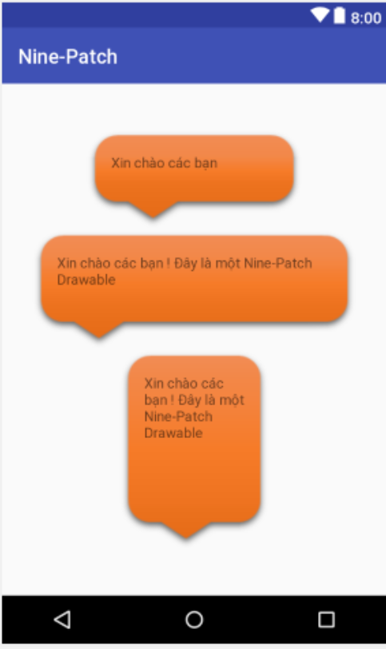

* ví dụ: thanh tìm kiếm (EditText) cho người dùng nhập nội dung tìm kiếm


### 15.1.1. Cấu Tạo Ảnh 9-Patch <a id="15.1.1"></a>
______________________________________________________________________________________
* Ảnh **9-patch** được cấu tạo từ 9 phần ghép lại với nhau tạo thành 1 ảnh, nên được gọi là ảnh 9-patch.
* hình ảnh mô tả:

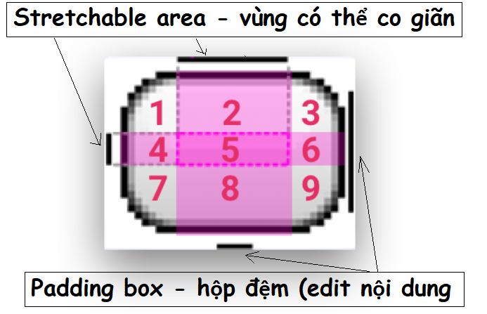

* hình ảnh trên gồm 9-patch ghép lại với nhau tạo thành 1 ảnh hoàn chỉnh, 9 patch gồm từ 1 đến 9.
* **Stretchable**:
  * đường ngang (horizontal) màu đen bên trên: chỉ định khu vực có thể kéo giãn theo chiều ngang thoải mái.
  * đường dọc (vertical) màu đen bên trái: chỉ định khu vực có thể kéo giãn theo chiều dọc thoải mái.
* **Padding**"
  * đường ngang (horizontal) màu đen bên dưới: chỉ định khu vực được đệm dữ liệu theo chiều rộng. 
  * được dọc (vertical) màu đen bên phải: chỉ định khu vực được đệm dữ liệu theo chiều cao.
* các patch [2, 4, 5, 6, 8] màu hồng là các patch có thể kéo giãn thoải mái.
* các patch [1, 3, 7, 9] màu trắng là các patch giữ nguyên kích thước khi toàn bộ ảnh bị kéo giãn.

### 15.1.2. Tạo Ảnh 9-Patch <a id="15.1.2"></a>
______________________________________________________________________________________
#### Tạo Ảnh 9-Patch Từ Công Cụ Tích Hợp Trên Android Studio
* Ví dụ, để tạo 1 **EditText** cho người dùng nhập nội dung vào, và nội dung này được sử dụng như là nội dung tìm kiếm, 
vì vậy **background** của **EditText** là hình ảnh 1 hộp tìm kiếm có đặc tính của ảnh 9-patch.
* để tạo 1 ảnh 9-patch, ta thực hiện các bước sau:
  * chuẩn bị 1 file ảnh để làm background với định dạng .png (chừa vùng biên ít nhất 1px)
  * copy/paste vào thư mục **res/drawable/
  * chuột phải vào ảnh vừa được paste vào -> chọn **Create 9-patch file**
  * hộp thoại hỏi thư mục lưu ảnh **.9.png**: mặc định lưu trong **res/drawable/**, có thể đổi tên file ảnh -> chọn OK
  * chọn đến file **.9.png** vừa được tạo trong **res/drawable/** -> click đúp mở file khu vực làm việc sẽ hiển thị
    * pane trái: là khu vực vẽ chỉ định các đường stretchable hay padding
    * pane phải: là khu vực xem preview
  * trong pane phải: click chuột (đảm bảo chỉ được rộng 1px, chiều dài tùy thuộc vào nhu cầu) vào các biên của ảnh, kéo
  chuột tạo thành các đường stretchable (top và left margin) và padding (bottom và right margin).
  * chọn **File** -> **Save All**

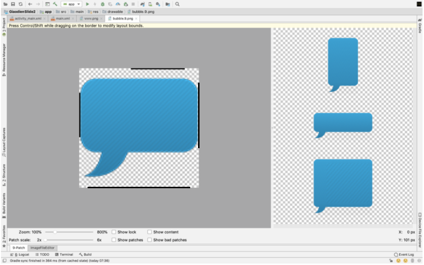

* để đảm bảo trường hợp ảnh 9-patch bị giảm tỉ lệ vẫn hiển thị phù hợp, chắc chắn rằng bất kỳ khu vực có thể co giãn
đều có kích thước 2x2px.
* lưu ý: chừa những khoảng an toàn, ví dụ ở những biên có màu sắc thay đổi nếu nằm trong khu vực co giãn có thể dẫn đến
màu sắc hiển thị không đúng.

#### Tạo Ảnh 9-Patch Từ Công Cụ Android Asset Studio Online
______________________________________________________________________________________
* ngoài việc tạo ảnh 9-patch từ công cụ tích hợp trên Android Studio, có thể dùng đến công cụ Online <br/>
[Android Asset Studio Online](https://romannurik.github.io/AndroidAssetStudio/nine-patches.html#&sourceDensity=320&name=example)
* cách sử dụng:
  * chuẩn bị 1 ảnh background để tạo ảnh 9-patch
  * truy cập vào [Android Asset Studio Online](https://romannurik.github.io/AndroidAssetStudio/nine-patches.html#&sourceDensity=320&name=example)
  * tuần tự các bước như hình mô tả sau:

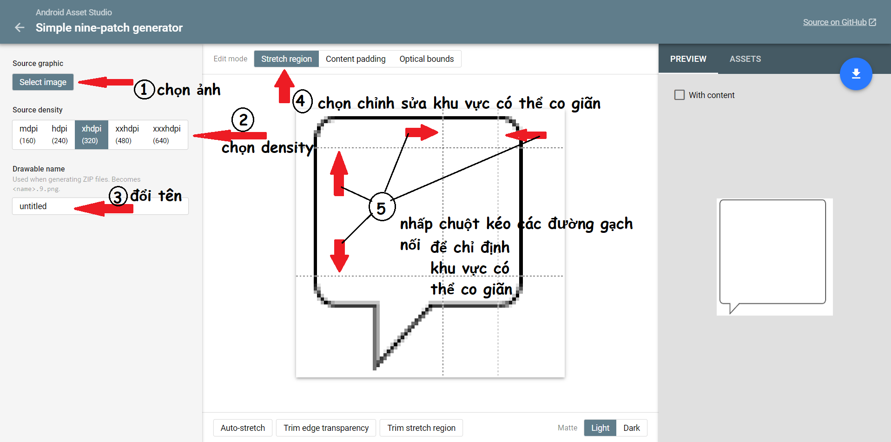

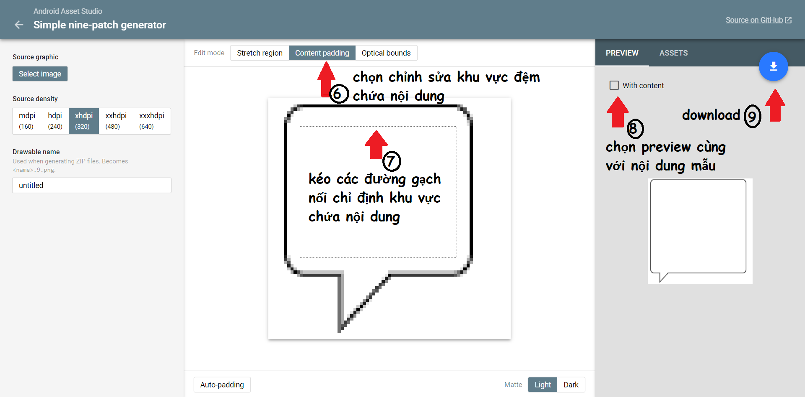

### 15.1.3. Lưu Trữ Ảnh 9-Patch <a id="15.1.3"></a>
______________________________________________________________________________________
* vì ảnh **9-patch** là 1 dạng **resource** linh động, nó có thể thay đổi linh hoạt ở mọi màn hình có kích thước khác nhau,
vì vậy, chỉ nên xem nó như 1 **default resource**, và vì nó không phải là **icon** nên thư mục chứa nó sẽ là: <br/>
**res/drawable/**

### 15.1.4. Truy Xuất Đến Ảnh 9-Patch <a id="15.1.4"></a>
______________________________________________________________________________________
* vì ảnh **9-patch** cũng chỉ là 1 **resource hình ảnh** nên các truy xuất nó cũng như những ảnh thông thường khác, có 2 cách truy xuất:
  * từ **xml** file
  * từ **java** code

## 15.2. Image Vector Resource <a id="15.2"></a>
______________________________________________________________________________________
#### Bitmap Image
______________________________________________________________________________________
* đối với những định dạng ảnh Bitmap thông thường như PNG, JPG, GIF... thực chất là các ma trận điểm ảnh với số lượng cố định, ví dụ:
  * ảnh bitmap 100\*100px là 1 ma trận có ngang 100px dài 100px
* đối với ảnh Bitmap 100*100px, nếu muốn hiển thị ảnh này ở kích thước 400*400px, thì mỗi px sẽ phải bị giãn nở ra, khiến toàn bộ ảnh sẽ có hiện tượng vỡ, nhòe, chính vì vậy khi tổ lưu trữ ảnh dạng Bitmap phải tạo ra nhiều _alternative resource_ để kịp thời linh động trong khi ứng dụng được chạy thực tế.

#### Vector Image
______________________________________________________________________________________
* có 2 định dạng ảnh Vector được Android hỗ trợ:
  * **SVG (Scalable Vector Graphic)**
  * **PSD (Adobe Photoshop Document)**.
* đối với ảnh Vector, nó không được cấu tạo cố định bởi các điểm ảnh (px).
* ảnh Vector chỉ chứa các thông số: đường thẳng, đường cong, màu sắc, ...., đến khi ảnh này được sử dụng trong thực tế
khi chạy chương trình, thì hệ thống của thiết bị hiện đang thực thi chương trình mới dựa vào các thông số mà vẽ ảnh lên
màn hình, chính vì vậy, dù ở bất cứ thiết bị màn hình nào ảnh Vector vẫn không bị vỡ nếu như tăng kích thước lên.
* ưu điểm của ảnh Vector:
  * hiển thị đẹp hơn và không bị vỡ ảnh ở bất kỳ màn hình nào
  * dung lượng Project sau khi Publish nhẹ hơn do không cần tạo nhiều **Alternative Resource**
  * tổ chức ảnh Vector vào Resource cũng đơn giản vì không phải băn khoăn lưu trữ ở đâu, vì nó là dạng resource tự linh động
* nhược điểm của ảnh Vector:
  * CPU ở thiết bị thực thi chương trình phải hoạt động hết công suất để vừa đọc thông số ảnh Vector vừa vẽ ảnh lên màn hình, nếu thiết bị vẽ nhiều ảnh Vector cùng lúc có thể gây giảm hiệu năng và trải nghiệm người dùng, Google khuyến cáo nên giới hạn kích thước của ảnh Vector là 200\*200dp khi được vẽ lên UI.
  * giới hạn về khả năng của CPU ở mỗi thiết bị có thể vẽ ảnh Vector lên màn hình sẽ gây ra tình trạng không hiển thị, hoặc mất nét, mất một số bộ phận của ảnh.
  * không được hỗ trợ từ Android 4.4 API 20 trở về trước, nếu muốn sử dụng ảnh Vector ở cả các hệ điều hành Android 4.4 API 20 trở về trước, phải xem xét lựa chọn cách thức tương thích ngược.

#### Lựa Chọn Phương Pháp Tương Thích Ngược Ảnh Vector Cho Android 4.4 API 20 Trở Về Trước
______________________________________________________________________________________
* khi khai báo **minSdkVersion** trong file **build.gradle** nhỏ hơn **21** (a số các project hiện nay vẫn còn hỗ trợ 
các hệ điều hành Android trước 5.0).
* khi đó nếu muốn sử dụng ảnh Vector trong Project ta phải lựa chọn 1 trong 2 cách sau để giải quyết vấn đề tương thích
ngược cho các hệ điều hành cũ hơn.
  * Chấp nhận Vector Asset Studio tạo ra 2 loại ảnh.
  * sử dụng Support Library

##### Chấp nhận Vector Asset Studio tạo ra 2 loại ảnh
______________________________________________________________________________________
* Vector Asset Studio sẽ tạo thêm một loại ảnh **.PNG** bên cạnh ảnh Vector.
* sử dụng phương pháp này, dung lượng cài đặt của Project sẽ tăng lên nếu có nhiều ảnh Vector trong Project.

##### Sử Dụng Support Library
______________________________________________________________________________________
* nếu sử dụng phương pháp này, ta cần khai báo sử dụng Support Library cho ảnh Vector
* cách thức thực hiện:
  * mở file **build.gradle** ở cấp **module**
  * thêm dòng khai báo: ``vectorDrawables.useSupportLibrary = true`` vào khối con ``defaultConfig`` trong khối ``android``
```xml
apply plugin: 'com.android.application'
  
android {
    compileSdkVersion 25
    buildToolsVersion '25.0.2'
    defaultConfig {
        applicationId "com.yellowcode.tournote"
        minSdkVersion 15
        targetSdkVersion 25
        versionCode 1
        versionName "1.0.0"
        testInstrumentationRunner "android.support.test.runner.AndroidJUnitRunner"
        vectorDrawables.useSupportLibrary = true
    }
    buildTypes {
        release {
            minifyEnabled false
            proguardFiles getDefaultProguardFile('proguard-android.txt'), 'proguard-rules.pro'
        }
    }
}
  
dependencies {
    compile fileTree(include: ['*.jar'], dir: 'libs')
    androidTestCompile('com.android.support.test.espresso:espresso-core:2.2.2', {
        exclude group: 'com.android.support', module: 'support-annotations'
    })
    compile 'com.android.support:appcompat-v7:25.3.1'
    testCompile 'junit:junit:4.12'
    compile 'com.android.support:design:25.3.1'
    compile 'com.android.support:recyclerview-v7:25.3.1'
}
```

### 15.2.1. Tổ Chức Image Vector Resource <a id="15.2.1"></a>
______________________________________________________________________________________
* có 2 định dạng ảnh Vector được Android hỗ trợ:
    * **SVG (Scalable Vector Graphic)**
    * **PSD (Adobe Photoshop Document)**
* do ảnh Vector là 1 dạng resource linh động thay đổi ở các loại màn hình, nên chỉ cần lưu trữ chúng vào thư mục **default resource**: <br/>
**res/drawable/**

### 15.2.2. Công Cụ Vector Asset Studio <a id="15.2.2"></a>
______________________________________________________________________________________
* để sử dụng công cụ Vector Asset Studio trong Android Studio ta thực hiện các bước sau:
  * chuột phải vào thư mục **res/** -> **New** -> **Vector Asset** -> cửa sổ Vector Asset Studio xuất hiện
  * trong cửa sổ Vector Asset Studio gồm các thành phần sau:
    * **Asset Type**: chọn nguồn chứa ảnh Vector, gồm 2 tùy chọn
      * **Clip Art**: chọn ảnh Vector dựng sẵn bởi Google
      * **Local File**: chọn ảnh Vector được lưu trữ ở Local, nếu chọn Local File, sẽ xuất hiện thêm tùy chọn 
        * **Path** dùng để chọn đường dẫn đến nơi chứa ảnh Vector.
    * **Name**: đặt tên cho file
    * **Size**: chỉ định kích thước của file, vì ảnh Vector co giãn thoải mái, nên kích thước này chỉ là tương đối,
    nó chỉ ảnh hưởng đến kích thước của ảnh PNG nếu sử dụng cách tương thích ngược tạo ra 2 loại định dạng cho cùng
    1 ảnh trong Project.
    * **Color**: thường thì các ảnh Vector là ảnh đơn sắc (1 màu), tùy chọn này chỉ định màu chủ đạo cho ảnh Vector
    * **Opacity**: độ trong suốt, mặc định 100%
    * **Enable auto mirroring for RTL layout**: chọn nếu ứng dụng hỗ trợ hệ ngôn ngữ **RTL**
    * chọn **Next** cửa sổ thông báo nơi lưu trữ file **xml** chứa thông tin ảnh Vector.
    * chọn **Finish** hoàn tất.
* sau khi kết thúc quá trình tạo ảnh Vector, 1 file ``tên_ảnh_vector.xml`` sẽ xuất hiện trong thư mục lưu trữ đã xác nhận
ở cửa sổ Vector Asset Studio.
* file ảnh vector xml này khi được mở lên sẽ có 2 cửa sổ, 1 cửa sổ chứa nội dung thông số của ảnh, 1 cửa sổ hiển thị preview
ảnh vector
* Ví dụ chọn hình Vector từ Clip Art

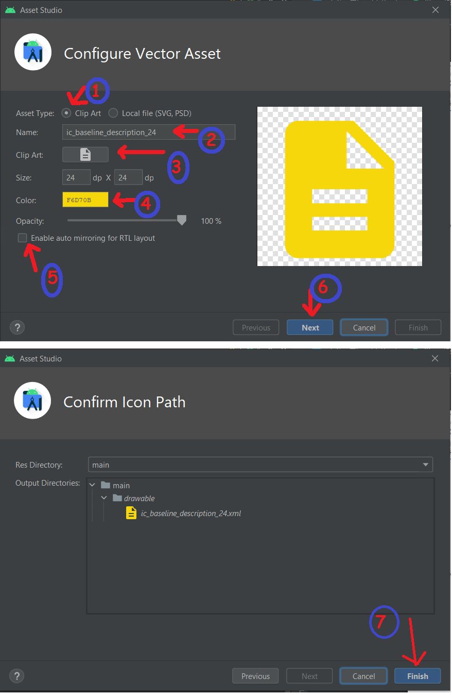

### 15.2.3. Sử Dụng Ảnh Vector <a id="15.2.3"></a>
______________________________________________________________________________________
#### Truy Xuất Từ XML
______________________________________________________________________________________
* truy xuất ảnh Vector từ XML có 2 cách tương ứng với 2 cách Tương Thích Ngược sử dụng lúc đầu

##### Nếu Sử Dụng Vector Asset Studio Tạo Ra 2 Loại Ảnh
______________________________________________________________________________________
* với cách truy xuất này, không cần quan tâm nhiều vấn đề, xem tên file ảnh vector xml như là ảnh thông thường, trong
bất kỳ file xml này cần sử dụng đến ảnh vector này chỉ cần gọi đến tên như ảnh thông thường thông qua thuộc tính
``android:src`` như sau:<br/>
``android:src="@drawable/tên_file_ảnh_vector"``
* hệ thống sẽ tự động gọi đến ảnh .PNG hoặc ảnh Vector tùy thuộc vào môi trường thực tế.

##### Nếu Sử Dụng Khai Báo Support Library Cho Ảnh Vector
______________________________________________________________________________________
* với cách truy xuất này, sẽ không có ảnh .PNG cho các hệ điều hành từ API 20 trở về trước, mà chỉ có ảnh Vector được tạo
ra.
* để các hệ điều hành cũ hiểu được, ta vẫn sẽ gọi đến tên của file ảnh, nhưng sử dụng thuộc tính ``app:srcCombat`` thay cho
thuộc tính ``android:src`` như sau:
``app:srcCompat="@drawable/tên_file_ảnh_vector"``

#### Truy Xuất Từ Java
______________________________________________________________________________________
* trong Java code không phân biệt ảnh Vector hay ảnh Bitmap, cách gọi là như nhau.
* chỉ cần truyền tham số ``R.drawable.tên_file_ảnh_vector`` cho hàm cần 1 Resource ID tương ứng:
* Ví dụ:
```java
// ImageView
ImageView imvTest = (ImageView) findViewById(R.id.id_của_ImageView);

// Set Image cho ImageView
imvTest.setImageResource(R.drawable.tên_file_ảnh_vector);
```

______________________________________________________________________________________
______________________________________________________________________________________
______________________________________________________________________________________
# 16. Sử Dụng Drawable – Ảnh Shape XML và Ảnh Layer List <a id="16"></a>
______________________________________________________________________________________
## 16.1. Ảnh Shape XML <a id="16.1"></a>
______________________________________________________________________________________
* ảnh Shape XML là hình ảnh dạng Shape (khối) được hệ thống vẽ lên màn hình thông qua file XML đã được định nghĩa trước đó.
* ảnh Shape XML giống ảnh Vector ở đặc điểm là hệ thống sẽ đọc file XML để vẽ nên hình ảnh lên màn hình.
* điểm khác biệt giữa ảnh Shape XML và ảnh Vector:

Đặc điểm          |ảnh Shape XML                             |ảnh Vector
:-----------------|:-----------------------------------------|:-----------------------------------------------
Độ phức tạp       |đơn giản (chỉ định nghĩa các hình khối)   |phức tạp (vì ảnh Vector biểu diễn phong phú)
Cách thức tạo ảnh |có thể định nghĩa thủ công trong file XML |dùng công cụ chuyên dụng để vẽ nên các ảnh **.svg** hoặc **.psd**, sau đó dùng Vector Asset Studio chuyển các ảnh Vector này về file **.xml**
Sử dụng CPU       |chỉ vẽ hình đơn giản, tốn ít CPU          |tốn nhiều CPU để vẽ ảnh Vector lên màn hình

### 16.1.1. Cách Vẽ Ảnh Shape XML <a id="16.1.1"></a>
______________________________________________________________________________________
* ảnh Shape XML là 1 file XMl sẽ được CPU vẽ lên màn hình khi chạy ứng dụng, nên nó chỉ cần được lưu trữ trong Default Resource.
* tốn ít CPU do đơn giản, nên tốc độ vẽ lên màn hình rất nhanh
* khuyết điểm của ảnh Shape XML là độ khó trong việc định nghĩa XML và hình ảnh vẽ ra không được đa dạng.
* thông thường với ảnh Shape XML chỉ vẽ được các hình đơn giản:
  * background có góc bo tròn cho Button
  * background có viền xám cho EditText

#### Cách Vẽ Ảnh Shape XML
______________________________________________________________________________________
* do ảnh Shape là dạng default resource không kén loại màn hình, nên ta để mặc định thư mục lưu trữ là **res/drawable/**
* vì là hình ảnh nên file UI XML của nó nằm ở **drawable** chứ không phải là **layout**
* Cấu trúc file XML đầy đủ để định nghĩa 1 ảnh Shape XML:
```xml
<?xml version="1.0" encoding="utf-8"?>
<shape
    xmlns:android="http://schemas.android.com/apk/res/android"
    android:shape=["rectangle" | "oval" | "line" | "ring"] >
    <corners
        android:radius="integer"
        android:topLeftRadius="integer"
        android:topRightRadius="integer"
        android:bottomLeftRadius="integer"
        android:bottomRightRadius="integer" />
    <gradient
        android:angle="integer"
        android:centerX="float"
        android:centerY="float"
        android:centerColor="integer"
        android:endColor="color"
        android:gradientRadius="integer"
        android:startColor="color"
        android:type=["linear" | "radial" | "sweep"]
        android:useLevel=["true" | "false"] />
    <padding
        android:left="integer"
        android:top="integer"
        android:right="integer"
        android:bottom="integer" />
    <size
        android:width="integer"
        android:height="integer" />
    <solid
        android:color="color" />
    <stroke
        android:width="integer"
        android:color="color"
        android:dashWidth="integer"
        android:dashGap="integer" />
</shape>
```
* các thành phần trong file XML định nghĩa ảnh Shape XML:
  * khai báo xml: ``<?xml version="1.0" encoding="utf-8"?>``
  * cặp thẻ cha khai báo đây là ảnh Shape XML: ``<shape></shape>``
  * thẻ mở **shape** - ``<shape>`` chứa các thuộc tính:
    * ``xmlns:android="http://schemas.android.com/apk/res/android"`` : khai báo sử dụng hệ thống Android
    * ``android:shape="loại_shape`` khai báo định nghĩa loại hình shape, có các loại sau:
      * ``"rectangle"``: hình chữ nhật (đây là hình mặc định - nếu không khai báo gì hệ thống tự hiểu là hình chữ nhật)
      * ``"oval"``: hình oval (chiều dai != chiều rộng), hình tròn (chiều dài = chiều rộng)
      * ``"line"``: đường thẳng, chiều dài kéo dãn hết không gian chứa nó, nếu chọn **line** shape sẽ cần khai báo thêm thẻ con ``<stroke/>``
      * ``"ring"``: hình "khuyên" tròn, biên của nó là vòng tròn bên trong và vòng tròn bên ngoài, nếu định nghĩa thuộc tính
      **shape** là **ring** thì cần khai báo thêm vài thuộc tính sau:
        * ``android:innerRadius="đường_kinh"`` hoặc ``android:innerRadiusRatio="tỉ_lệ"`` <br/>
        **innerRadius** dùng độ lớn, **innerRadiusRatio** dùng tỉ lệ để định nghĩa đường kính vòng tròn bên trong.
        * ``android:thickness="khoảng_cách"`` hoặc ``android:thicknessRatio="tỉ_lệ"`` <br/>
        **thickness** dùng độ lớn, **thicknessRatio** dùng tỉ lệ để định nghĩa khoảng cách giữa vòng tròn trong và vòng tròn ngoài.
        * ``android:useLevel=["true" | "false"]``: cho biết **ring** này có dùng drawable dạng LevelListDrawable hay không
  * bên trong thẻ ``<shape></shape>`` chứa các thẻ con sau:
    * ``<corners/>``: định nghĩa độ bo tròn cho các góc của hình **rectangle**
    * ``<gradient/>``: giúp chỉ định nhiều nhất 3 màu làm mốc, sau đó giúp vẽ ra dãy màu biến thiên dần theo 3 màu đó thông qua
    các thuộc tính:
      * thuộc tính chỉ định màu gốc
        * ``android:startColor="color"``
        * ``android:centerColor="integer"``
        * ``android:endColor="color"``
      * thuộc tính thêm của thẻ ``<gradient/>``:
        * ``android:type=["linear" | "radial" | "sweep"]`` chỉ định kiểu **gradient**
          * ``"linear"``: kiểu tuyến tính, kèm thuộc tính thêm
            * ``android:angle="integer"``: định nghĩa góc xoay của dãy màu với **type** là **linear**
          * ``"radial"``: kiểu rada, kèm thuộc tính thêm
            * ``android:gradientRadius="integer"``: định nghĩa bán kính của hình tròn rada
          * ``"sweep"``: kiểu rẻ quạt
    * ``<padding/>``: chỉ định khoảng cách top, bottom, left, right từ biên đến hình khối, có các thuộc tính
      * ``android:top="integer"``
      * ``android:bottom="integer"``
      * ``android:left="integer"``
      * ``android:right="integer"``
    * ``<size/>``: chỉ định height và width của hình khối, có các thuộc tính
      * ``android:height="integer"``
      * ``android:width="integer"``
    * ``<solid/>``: fill màu cho hình khối, do chỉ có tô 1 màu duy nhất, nên chỉ có 1 thuộc tính
      * ``android:color="color"``
    * ``<stroke/>``: định nghĩa về đường biên của hình khối
      * ``android:width="integer"``: độ dày của đường biên
      * ``android:color="color"``: màu của đường biên
      * 2 thuộc tính định nghĩa đường biên sẽ có dạng đứt nét
        * ``android:dashGap="integer"``: chỉ định khoảng cách giữa các đường đứt nét
        * ``android:dashWidth="integer"``: chỉ định độ dài của đường đứt nét
* Ví dụ:
```xml
<?xml version="1.0" encoding="utf-8"?>
<shape xmlns:android="http://schemas.android.com/apk/res/android"
    android:shape="rectangle">

    <corners android:radius="2dp" />
    <padding
        android:bottom="1dp"
        android:left="1dp"
        android:right="1dp"
        android:top="1dp" />
    <size
        android:width="40dp"
        android:height="20dp" />
    <solid android:color="@color/colorAccent" />
</shape>
```


* background rectangle
```xml
<?xml version="1.0" encoding="utf-8"?>
<shape xmlns:android="http://schemas.android.com/apk/res/android"
    android:shape="rectangle">
 
    <solid android:color="@color/colorAccent" />
 
    <corners android:radius="5dp" />
 
    <stroke
        android:width="2dp"
        android:color="@color/colorPrimary" />
</shape>
```
* oval
```xml
<?xml version="1.0" encoding="utf-8"?>
<shape xmlns:android="http://schemas.android.com/apk/res/android"
    android:shape="oval">
 
    <gradient
        android:angle="135"
        android:endColor="#FFFF00"
        android:startColor="#FFB000"
        android:type="linear" />
 
    <size
        android:width="40dp"
        android:height="40dp" />
 
</shape>
```
* ring
```xml
<?xml version="1.0" encoding="utf-8"?>
<shape xmlns:android="http://schemas.android.com/apk/res/android"
    android:shape="ring"
    android:innerRadiusRatio="6"
    android:thicknessRatio="4"
    android:useLevel="false">
 
    <gradient
        android:endColor="@color/colorAccent"
        android:startColor="@color/colorPrimary"
        android:gradientRadius="15dp"
        android:centerX="0.5"
        android:centerY="0.5"
        android:type="radial" />
 
    <size
        android:width="40dp"
        android:height="40dp" />
 
</shape>
```

### 16.1.2. Lưu Trữ Ảnh Shape XML <a id="16.1.2"></a>
______________________________________________________________________________________
* do ảnh Shape XML là dạng resource linh động, giống như ảnh 9-Patch hay ảnh Vector, nên không cần tạo thư mục **Alternative Resource**,
tất cả ảnh Shape XML đều có thể được lưu trữ ở thư mục **Default Resource**: <br/>
**res/drawable/**
* để tạo 1 file Shape XML:
  * chuột phải vào thư mục **res/drawable/** -> **New** -> **Drawable resource file**
  * Pop-up **New Drawable resource file** xuất hiện:
    * **File name**: nhập tên file ảnh Shape XML
    * **Root element**: nhập tên thẻ gốc ``shape``
    * click **OK**
  * click mở file Shape XML vừa tạo trong **res/drawable/**
  * thực hiện định nghĩa khai báo các thuộc tính cho hình Shape XML mong muốn

### 16.1.3. Truy Xuất Sử Dụng Ảnh Shape XML <a id="16.1.3"></a>
______________________________________________________________________________________
* truy xuất đến ảnh Shape XML cũng như ảnh Bitmap bình thường, có thể từ 2 nơi:
  * **xml** file
  * **java** code


## 16.2. Ảnh Layer List <a id="16.2"></a>
______________________________________________________________________________________
* ảnh Layer List xem như là ảnh mở rộng từ ảnh Shape XML.
* Shape XML chỉ là các hình khối đơn giản.
* thì Layer List kết hợp các Shape XML lại với nhau thành 1 List các Layer chồng lên nhau, tạo thành 1 hình ảnh phức tạp hơn.

### 16.2.1. Cách Vẽ Ảnh Layer List <a id="16.2.1"></a>
______________________________________________________________________________________
* ảnh Layer List cũng thuộc dạng ảnh Shape XML nên nó cũng có đặc tính linh động, vì vậy nó vẫn được lưu trữ ở thư mục Default Resource: <br/>
**res/drawable/**
* cách tạo ảnh Layer List cũng tương tự như tạo ảnh Shape XML, chỉ khác là thẻ Root là ``layer-list``
* cách truy xuất đến ảnh Layer List cũng tương tự như ảnh Shape XML

#### Cách Vẽ Ảnh Layer List
______________________________________________________________________________________
* ảnh Layer List là sự kết hợp của nhiều ảnh Shape XML với nhau.
* mỗi ảnh Shape XML được coi như là 1 item và được đặt trong thẻ ``<item/>``
* cấu trúc file xml của ảnh Layer List
```xml
<?xml version="1.0" encoding="utf-8"?>
<layer-list
    xmlns:android="http://schemas.android.com/apk/res/android" >
    <item
        android:id="@[+][package:]id/resource_name"
        android:top="dimension"
        android:right="dimension"
        android:bottom="dimension"
        android:left="dimension">
        
        <shape> </shape>
    </item>

    <item
            android:drawable="@[package:]drawable/drawable_resource"
            android:id="@[+][package:]id/resource_name"
            android:top="dimension"
            android:right="dimension"
            android:bottom="dimension"
            android:left="dimension" />
</layer-list>
```
* các thành phần trong file xml ảnh Layer List:
  * thẻ gốc ``<layer-list></layer-list>``: nó chỉ dùng để chứa các cặp thẻ ``<item></item>`` bên trong
  * thẻ ``<item>`` có vài thuộc tính bổ sung cho thẻ ``<shape></shape>`` (đại diện cho 1 Shape XML) mà nó chứa bên trong
    * ``android:drawable="@[package:]drawable/drawable_resource"``: chỉ định 1 drawable khác nếu không dùng shape xml
    * ``android:id="@[+][package:]id/resource_name"``: chỉ định id cho thẻ item
    * các thuộc tính chỉ định khoảng cách so với các biên của item
      * ``android:top="dimension"``
      * ``android:right="dimension"``
      * ``android:bottom="dimension"``
      * ``android:left="dimension"``
    * ngoài ra có thể thêm các thuộc tính khác như ``android:width, android:height, android:gravity``
    * ...

#### Các Ví Dụ Về Ảnh Layer List
______________________________________________________________________________________
* hình trái tim
```xml
<?xml version="1.0" encoding="utf-8"?>
<layer-list xmlns:android="http://schemas.android.com/apk/res/android">
 
    <item
        android:bottom="21dp"
        android:left="32dp"
        android:right="32dp"
        android:top="37dp">
        <rotate android:fromDegrees="45">
            <shape>
                <solid android:color="@color/colorPrimary" />
                <size
                    android:width="100dp"
                    android:height="100dp" />
            </shape>
        </rotate>
    </item>
 
    <item
        android:bottom="52dp"
        android:right="68dp">
        <shape android:shape="oval">
            <solid android:color="@color/colorPrimary" />
        </shape>
    </item>
 
    <item
        android:bottom="52dp"
        android:left="68dp">
        <shape android:shape="oval">
            <solid android:color="@color/colorPrimary" />
        </shape>
    </item>
 
</layer-list>
```
* mô phỏng gương soi
```xml
?xml version="1.0" encoding="utf-8"?>
<layer-list xmlns:android="http://schemas.android.com/apk/res/android">
 
    <item>
        <shape android:shape="oval">
            <solid android:color="@color/colorPrimaryDark" />
        </shape>
    </item>
 
    <item
        android:bottom="10dp"
        android:left="10dp"
        android:right="10dp"
        android:top="10dp">
        <shape android:shape="oval">
            <solid android:color="@color/colorAccent" />
        </shape>
    </item>
 
    <item
        android:bottom="20dp"
        android:left="20dp"
        android:right="20dp"
        android:top="20dp">
        <shape android:shape="oval">
            <solid android:color="@color/colorAccent" />
            <stroke
                android:width="1.5dp"
                android:color="@color/colorPrimary"
                android:dashGap="2dp"
                android:dashWidth="4dp" />
        </shape>
    </item>
 
</layer-list>
```
* Pin (kim) ghim trên Map
```xml
<?xml version="1.0" encoding="utf-8"?>
<layer-list xmlns:android="http://schemas.android.com/apk/res/android">
 
    <item
        android:width="20dp"
        android:height="20dp"
        android:left="6dp"
        android:top="28dp">
        <rotate
            android:fromDegrees="45"
            android:pivotX="75%"
            android:pivotY="40%">
            <shape android:shape="rectangle">
                <solid android:color="@color/colorPrimary" />
            </shape>
        </rotate>
    </item>
 
    <item
        android:width="32dp"
        android:height="40dp"
        android:bottom="8dp">
        <shape>
            <solid android:color="@color/colorPrimaryDark" />
            <corners android:radius="4dp" />
        </shape>
 
    </item>
 
    <item
        android:width="32dp"
        android:height="26dp"
        android:bottom="4dp"
        android:top="16dp">
        <shape>
            <solid android:color="@color/colorPrimary" />
            <corners
                android:bottomLeftRadius="4dp"
                android:bottomRightRadius="4dp" />
        </shape>
 
    </item>
 
</layer-list>
```

______________________________________________________________________________________
______________________________________________________________________________________
______________________________________________________________________________________
# 17. Sử Dụng Drawable State List– Ảnh State List & Các Ảnh Drawable Còn Lại <a id="17"></a>
______________________________________________________________________________________
* **State List** là 1 resource drawable XML, định nghĩa danh sách các trạng thái khác nhau cho 1 drawable chỉ định nào
đó mỗi khi có sự tương tác của user.
* có 2 dạng **State List** khác nhau:
  * Drawable State List (Ảnh State List)
  * Color State List (Màu State List)

## 17.1. Drawable State List - Ảnh State List <a id="17.1"></a>
______________________________________________________________________________________
### 17.1.1. Cấu Trúc File Drawable State List XML <a id="17.1.1"></a>
______________________________________________________________________________________
* cấu trúc XML của Drawable State List.
```xml
<?xml version="1.0" encoding="utf-8"?>
<selector xmlns:android="http://schemas.android.com/apk/res/android"
    android:constantSize=["true" | "false"]
    android:dither=["true" | "false"]
    android:variablePadding=["true" | "false"] >
    <item
        android:drawable="@[package:]drawable/drawable_resource"
        android:state_pressed=["true" | "false"]
        android:state_focused=["true" | "false"]
        android:state_hovered=["true" | "false"]
        android:state_selected=["true" | "false"]
        android:state_checkable=["true" | "false"]
        android:state_checked=["true" | "false"]
        android:state_enabled=["true" | "false"]
        android:state_activated=["true" | "false"]
        android:state_window_focused=["true" | "false"] />
</selector>
```
* các thành phần trong file Drawable State List
  * Root element: ``<selector></selector>`` - định nghĩa 1 Drawable State List, thẻ này chứa các **item** là các **widget**
  tương ứng với mỗi trạng thái khi được tương tác.
  * Child element: ``<item/>`` - chỉ định danh sách các trạng thái tương tác của người dùng sẽ gọi đến 1 resource drawable
  tương ứng, có các trạng thái sau trong thuộc tính của **item** và chúng chỉ mang giá trị ``true`` hoặc ``false``.
  * các trạng thái này sẽ chỉ định giá trị ``true`` hoặc ``false``, nếu trạng thái tương ứng của Widget bằng với giá trị 
  của trạng thái được khai báo, thì Resource Drawable tương ứng sẽ được gọi.
    * ``android:state_pressed=["true" | "false"]``: trạng thái touch, click hay press vào Widget
    * ``android:state_focused=["true" | "false"]``: trạng thái focus vào Widget (vd: user click vào EditText, EditText đó
    đã được focus)
    * ``android:state_hovered=["true" | "false"]``: trạng thái của Widget khi con trỏ chuột lướt qua (hover)
    * ``android:state_selected=["true" | "false"]``: trạng thái được chọn của Widget (công tắc switch, hay các console điều khiển)
    * ``android:state_checkable=["true" | "false"]``: trạng thái được phép chọn (checkable) của Widget
    * ``android:state_checked=["true" | "false"]``: trạng thái check hoặc uncheck của Widget
    * ``android:state_enabled=["true" | "false"]``: trạng thái được phép tương tác (enabled) của Widget
    * ``android:state_activated=["true" | "false"]``: trạng thái kích hoạt (activated) của Widget
    * ``android:state_window_focused=["true" | "false"]``: trạng thái focus của cửa sổ chứa Widget (vd: user đang tương tác với
    1 cửa sổ, thì 1 widget notification hiện lên, thì focus của cửa sổ chứa widget notification đó sẽ mang giá trị ``false``
    * ``android:drawable="@[package:]drawable/drawable_resource"``: resource drawable tương ứng được gọi nếu **item** đáp ứng đủ
    các trạng thái đã định nghĩa

### 17.1.2. Lưu Trữ Drawable State List <a id="17.1.2"></a>
______________________________________________________________________________________
#### Thư Mục Lưu Trữ
______________________________________________________________________________________
* tương tự như Shape XML, Drawable State List cũng được lưu trong thư mục **default resource**: <br/>
**res/drawable/**

#### Tạo Drawable State List
______________________________________________________________________________________
* các bước tạo Drawable State List:
  * chuột phải vào thư mục **res/drawable/** -> **New** -> **Drawable resource file**
  * Pop-up tạo mới drawable resource file hiển thị:
    * File name: đặt tên
    * Root element: đặt thẻ gốc - nhập selector
    * OK

### 17.1.3. Ví Dụ Và Truy Xuất Đến Drawable State List <a id="17.1.3"></a>
______________________________________________________________________________________
* kịch bản: có 1 Button và 1 Checkbox
  * trạng thái disabled: Button có màu GRAY
  * trạng thái pressed: Button đổi màu RED
  * trạng thái normal: Button có màu GREEN
* tạo 3 background cho 3 trạng thái của Button sử dụng Shape XML
* button_disable.xml
```xml
<?xml version="1.0" encoding="utf-8"?>
<shape xmlns:android="http://schemas.android.com/apk/res/android">
 
    <solid android:color="#5C5A5A" />
 
    <corners android:radius="5dp" />
 
</shape>
```
* button_pressed.xml
```xml
<?xml version="1.0" encoding="utf-8"?>
<shape xmlns:android="http://schemas.android.com/apk/res/android">
 
    <solid android:color="#FF0000" />
 
    <corners android:radius="5dp" />
 
</shape>
```
* button_normal.xml
```xml
<?xml version="1.0" encoding="utf-8"?>
<shape xmlns:android="http://schemas.android.com/apk/res/android">

    <solid android:color="#00FF00"/>
 
    <corners android:radius="5dp" />
 
</shape>
```
* định nghĩa 1 drawable state list có tên button.xml chứa đựng 3 item tương ứng với 3 trạng thái
```xml
<?xml version="1.0" encoding="utf-8"?>
<!--khi button ở trạng thái normal, button có màu xanh lá-->
<!--khi button được pressed=true , button đổi sang màu đỏ-->
<!--khi button bị disable, enable=false, button đổi sang màu -->
<selector xmlns:android="http://schemas.android.com/apk/res/android">
    <item
        android:drawable="@drawable/button_normal"
        android:state_pressed="false"/>
    <item
        android:drawable="@drawable/button_pressed"
        android:state_pressed="true" />
    <item
        android:drawable="@drawable/button_disable"
        android:state_enabled="false"/>
</selector>
```
* truy xuất đến button.xml trong file xml
```xml
    <Button
        android:id="@+id/button2"
        android:layout_width="wrap_content"
        android:layout_height="wrap_content"
        android:layout_marginTop="16dp"
        android:background="@drawable/button"
        android:text="Button"
        app:layout_constraintEnd_toEndOf="parent"
        app:layout_constraintHorizontal_bias="0.498"
        app:layout_constraintStart_toStartOf="parent"
        app:layout_constraintTop_toBottomOf="@+id/textView" />
```
* trong Java code, tùy theo trạng thái của Button được khai báo như thế nào mà hệ thống sẽ quyết định gọi đến State List
tương ứng.
* sử dụng 1 Checkbox để setEnable() cho Button
```java
        Button button = (Button) findViewById(R.id.button2);
        CheckBox checkBox = (CheckBox) findViewById(R.id.checkBox);
        
        checkBox.setOnCheckedChangeListener(new CompoundButton.OnCheckedChangeListener() {
            @Override
            public void onCheckedChanged(CompoundButton buttonView, boolean isChecked) {
                if (isChecked) {
                    button.setEnabled(false);
                } else {
                    button.setEnabled(true);
                }
            }
        });

        button.setOnClickListener(new View.OnClickListener() {
            @Override
            public void onClick(View v) {
            }
        });
```


## 17.2. Color State List - Màu State List <a id="17.2"></a>
______________________________________________________________________________________
* Colore State List dùng để chỉ định màu sắc theo trạng thái của Widget.
* Color State List cũng là 1 dạng Default Resource, nhưng khác Drawable State List ở đặc điểm:
  * nó sẽ chỉ định màu sắc tương ứng với trạng thái được chỉ định, không phải hình ảnh
  * nó được lưu trữ ở **res/color/**

* cấu trúc của Color State List gần giốn như Drawable State List.
* nhưng Color State List không có thuộc tính **drawable** để gọi hình ảnh nào đó, mà thay vào đó là thuộc tính **color**
để gọi đến màu nào đó tương ứng với trạng thái của **item**
```xml
<?xml version="1.0" encoding="utf-8"?>
<selector xmlns:android="http://schemas.android.com/apk/res/android" >
    <item
        android:color="hex_color"
        android:state_pressed=["true" | "false"]
        android:state_focused=["true" | "false"]
        android:state_selected=["true" | "false"]
        android:state_checkable=["true" | "false"]
        android:state_checked=["true" | "false"]
        android:state_enabled=["true" | "false"]
        android:state_window_focused=["true" | "false"] />
</selector>
```
### 17.2.1. Thư Mục Lưu Trữ Color State List Và Cách Tạo File Color State List <a id="17.2.1"></a>
______________________________________________________________________________________
#### Thư Mục Lưu Trữ
______________________________________________________________________________________
* khác với Drawable State List được lưu trữ trong thư mục **res/drawable/** được tạo sẵn.
* vì Color State List là 1 dạng resource color, nên ta phải tạo thư mục riêng cho nó.
* các bước tạo thư mục cho Color State List:
  * chuột phải vào thư mục **res/** -> **New** -> **Android Resource Directory**
  * Directory name: đặt tên cho thư mục -> color
  * Resource type: chỉ định loại resource -> color

#### Tạo File Color State List
______________________________________________________________________________________
* các bước tạo file Color State List
  * chuột phải vào thư mục **res/color/** -> **New** -> **Android Resource File**
  * chỉ định tên cho file Color State List -> OK -> file sẽ được tạo với Root element mặc định là **selector**

### 17.2.2. Truy Xuất Đến Resource Color State List <a id="17.2.2"></a>
______________________________________________________________________________________
#### Trong File XML
______________________________________________________________________________________
* truy xuất đến Resource Color State List giống như Resource Color thông thường, ở những thuộc tính cần thiết gọi đến 
color như sau: <br/>
``@color/tên_của_color_state_list``

#### Trong Java Code
______________________________________________________________________________________
* truy xuất đến Color State List trong Java Code cũng tương tự như truy xuất đến resource color thông thường, chỉ cần truyền
tham số: <br/>
``R.color.tên_của_color_state_list`` <br/>
vào phương thức cần thiết

### 17.2.3. Ví Dụ Sử Dụng Color State List <a id="17.2.3"></a>
______________________________________________________________________________________
* sử dụng Color State List để thiết lập màu sắc cho Màu Text của Button tùy theo từng trạng thái
  * disable: đen
  * pressed: xám đen
  * normal: trắng
```xml
<?xml version="1.0" encoding="utf-8"?>
<selector xmlns:android="http://schemas.android.com/apk/res/android">
    <item android:color="#4C4E4E" android:state_pressed="true" />
    <item android:color="@color/black" android:state_enabled="false" />
    <item android:color="@color/white" />
</selector>
```
* trong main_activity.xml phần Button textColor gọi Color State List
```xml
    <Button
        android:id="@+id/button2"
        android:layout_width="wrap_content"
        android:layout_height="wrap_content"
        android:layout_marginTop="16dp"
        android:background="@drawable/button"
        android:text="Button"
        android:textColor="@color/button_color"
        app:layout_constraintEnd_toEndOf="parent"
        app:layout_constraintHorizontal_bias="0.5"
        app:layout_constraintStart_toStartOf="parent"
        app:layout_constraintTop_toBottomOf="@+id/textView" />
```
* trong Java Code MainActivity.java phần set sự kiện click
```java
        button.setOnClickListener(new View.OnClickListener() {
            @Override
            public void onClick(View v) {

            }
        });

        checkBox.setOnCheckedChangeListener(new CompoundButton.OnCheckedChangeListener() {
            @Override
            public void onCheckedChanged(CompoundButton buttonView, boolean isChecked) {
                button.setEnabled(isChecked);
            }
        });
```


## 17.3. Các Resource Drawable Còn Lại <a id="17.3"></a>
______________________________________________________________________________________
### 17.3.1. Ảnh Dạng Level List <a id="17.3.1"></a>
______________________________________________________________________________________
* là 1 Drawable quản lý 1 danh sách các item là các drawable chuyển đổi lẫn nhau ở từng level.
* mỗi item đều có thuộc tính **maxLevel** hoặc **minLevel**
* nếu giá trị truyền vào phương thức **setLevel() = ["maxLevel" | "minLevel"]** thì drawable tương ứng ở sẽ được load lên màn hình.
* ví dụ như drawable hiển thị dung lượng pin.

#### Cấu Trúc File XML của Drawable Level List
______________________________________________________________________________________
```xml
<?xml version="1.0" encoding="utf-8"?>
<level-list
    xmlns:android="http://schemas.android.com/apk/res/android" >
    <item
        android:drawable="@drawable/drawable_resource"
        android:maxLevel="integer"
        android:minLevel="integer" />
</level-list>
```
* trong đó:
  * ``<level-list></level-list>``: là Root element, chứa các thẻ **item** là các drawable chuyển đổi lẫn nhau
  * ``<item/>``: là thẻ con chỉ định 1 drawable ở level chỉ định, có các thuộc tính
    * ``android:drawable="@drawable/drawable_resource"``: chỉ định drawable cho item
    * ``android:maxLevel="integer"``: chỉ định maxLevel mà item sẽ được load lên màn hình
    * ``android:minLevel="integer"``: chỉ định minLevel mà item sẽ được load lên màn hình
    
#### Lưu Trữ Drawable Level List
______________________________________________________________________________________
* Drawable Level List là dạng Default Resource nên thư mục lưu trữ sẽ là: <br/>
  **res/drawable/**

#### Cách Tạo Drawable Level List
______________________________________________________________________________________
* chuột phải vào thư mục **res/drawable/** -> **New** -> **Android Resource File**
* Pop-up tạo New Drawable Resource File hiển thị
  * File name: chỉ định tên của drawable level list
  * Root element: chỉ định thẻ Root: -> level-list
  * -> OK

#### Truy Xuất Resource
______________________________________________________________________________________
* trong Java: 
  * truy xuất đến file: ``R.drawable.filename``
  * phương thức drawable tương ứng với level: ``imageView.setImageLevel(int level);``
* trong XML: ``@[package:]drawable/filename``


### 17.3.2. Ảnh Transition <a id="17.3.2"></a>
______________________________________________________________________________________
* ảnh Transition (ảnh chuyển đổi) phù hợp với các loại Widget chỉ có 2 trạng thái tối đa.
* ảnh Transition giúp chuyển đổi trạng thái của Widget với hiệu ứng chuyển dần từ trạng thái này sang trạng thái kia.

#### Cấu Trúc File XML của Drawable Transition
______________________________________________________________________________________
```xml
<?xml version="1.0" encoding="utf-8"?>
<transition
xmlns:android="http://schemas.android.com/apk/res/android" >
    <item
        android:drawable="@[package:]drawable/drawable_resource"
        android:id="@[+][package:]id/resource_name"
        android:top="dimension"
        android:right="dimension"
        android:bottom="dimension"
        android:left="dimension" />
</transition>
```
* các thành phần trong file drawable transition
  * ``<transition></transition>``: thẻ Root chứa các thẻ child là ``<item/>
    * thuộc tính:
      * ``xmlns:android="http://schemas.android.com/apk/res/android"``: định nghĩa XML namespace
  * ``<item/>``: thẻ child, định nghĩa 1 phần trạng thái của Widget
    * thuộc tính:
      * ``android:drawable="@[package:]drawable/drawable_resource"``: chỉ định drawable với trạng thái tương ứng
      * ``android:id="@[+][package:]id/resource_name"``: chỉ định ``id`` cho drawable này, ``id`` này có thể được
      sử dụng ở Java code như: ``View.findViewById()`` or ``Activity.findViewById()``
      * ``android:top="dimension"``: cách trên cùng
      * ``android:right="dimension"``: cách bên phải
      * ``android:bottom="dimension"``: cách phía dưới
      * ``android:left="dimension"``: cách bên trái
      * ``android:width="dimension"``: chiều ngang của drawable
      * ``android:height="dimension"``: chiều cao của drawable

#### Lưu Trữ Drawable Transition
______________________________________________________________________________________
* Drawable Transition là dạng Default Resource nên thư mục lưu trữ sẽ là: <br/>
  **res/drawable/**

#### Cách Tạo Drawable Transition
______________________________________________________________________________________
* chuột phải vào thư mục **res/drawable/** -> **New** -> **Android Resource File**
* Pop-up tạo New Drawable Resource File hiển thị
    * File name: chỉ định tên của drawable Transition
    * Root element: chỉ định thẻ Root: -> transition
    * -> OK

#### Truy Xuất Resource Transition
______________________________________________________________________________________
* trong Java
  * thực hiện các bước sau:
    * ``TransitionDrawable transiotionDrawable = (TransitionDrawable) imageView.getDrawable();``
    * từ đối tượng ``transitionDrawable`` gọi đến 1 trong 2 phương thức:
      * chuyển ngược: ``transitionDrawable.reverseTransition(int);``
      * chuyển xuôi: ``transitionDrawable.startTransition(int);``
* trong XML:
  * ``android:src="@drawable/tên_transition_drawable"`` hoặc
  * ``android:background="@drawable/tên_transition_drawable``

### 17.3.3. Ảnh Inset <a id="17.3.3"></a>
______________________________________________________________________________________
* ảnh Inset là ảnh thu nhỏ của Drawable được chỉ định, nhưng với kích thước thay đổi so với Drawable gốc.
* ảnh Inset giúp tiết kiệm không gian Resource, không phải tạo nhiều drawable có kích thước khác nhau.
* ảnh Inset giúp tiết kiệm thời gian tạo thuộc tính canh chỉnh cho những View khác nhau trong cùng 1 màn hình.

#### Cấu Trúc File XML của Drawable Inset
______________________________________________________________________________________
```xml
<inset
    xmlns:android="http://schemas.android.com/apk/res/android"
    android:drawable="@drawable/drawable_resource"
    android:insetTop="dimension"
    android:insetRight="dimension"
    android:insetBottom="dimension"
    android:insetLeft="dimension">
</inset>
```
* các thành phần trong file xml drawable inset
  * ``<inset></inset>``: thẻ Root inset, thẻ này không chứa thẻ con nào, nó chỉ có các thuộc tính thay đổi so với drawable gốc
    * thuộc tính:
      * ``xmlns:android="http://schemas.android.com/apk/res/android"``: khai báo namespace android
      * ``android:drawable="@drawable/drawable_resource"``: chỉ định drawable resource
      * các thuộc tính canh chỉnh, kích thước của drawable gốc so với View chứa
        * ``android:insetTop="dimension"``: cách top View chứa drawable
        * ``android:insetRight="dimension"``: cách right View chứa
        * ``android:insetBottom="dimension"``: cách bottom
        * ``android:insetLeft="dimension"``: cách left

#### Lưu Trữ Drawable Inset
______________________________________________________________________________________
* Drawable Inset là dạng Default Resource nên thư mục lưu trữ sẽ là: <br/>
  **res/drawable/**

#### Cách Tạo Drawable Inset
______________________________________________________________________________________
* chuột phải vào thư mục **res/drawable/** -> **New** -> **Android Resource File**
* Pop-up tạo New Drawable Resource File hiển thị
    * File name: chỉ định tên của drawable Inset
    * Root element: chỉ định thẻ Root: -> inset
    * -> OK

#### Truy Xuất Resource Inset
______________________________________________________________________________________
* trong XML: từ những thuộc tính cần đến 1 drawable chỉ cần gọi đến tên của drawable inset
  * ``@drawable/tên_inset_drawable``
* trong Java: chỉ cần truyền giá trị sau vào phương thức cần thiết
  * ``R.drawable.tên_inset_drawable``

### 17.3.4. Ảnh Clip <a id="17.3.4"></a>
______________________________________________________________________________________
* ảnh Clip là resource drawable hỗ trợ việc hiển thị hình ảnh được cắt xén từ 1 drawable được chỉ định.
* hỗ trợ hướng cắt, phần bị cắt, tỉ lệ cắt dựa vào level
* ví dụ: hiển thị hình ảnh loading theo tỉ lệ

#### Cấu Trúc File XML của Drawable Clip
______________________________________________________________________________________
```xml
<clip
    xmlns:android="http://schemas.android.com/apk/res/android"
    android:drawable="@drawable/drawable_resource"
    android:clipOrientation=["horizontal" | "vertical"]
    android:gravity=["top" | "bottom" | "left" | "right" | "center_vertical" |
                     "fill_vertical" | "center_horizontal" | "fill_horizontal" |
                     "center" | "fill" | "clip_vertical" | "clip_horizontal"]>
</clip>
```
* các thành phần trong drawable clip xml
  * ``<clip></clip>``: thẻ Root clip, chỉ chứa các thuộc tính
  * các thuộc tính:
    * ``android:drawable="@drawable/drawable_resource"``: chỉ định drawable gốc sẽ được cắt xén
    * ``android:clipOrientation="hướng_cắt"``: chỉ định hướng cắt, có 2 hướng
      * ``"horizontal"`` và ``"vertical"``
    * ``android:gravity="vị_trí_bắt_đầu"``: vị trí bắt đầu cắt

#### Lưu Trữ Drawable Clip
______________________________________________________________________________________
* Drawable Clip là dạng Default Resource nên thư mục lưu trữ sẽ là: <br/>
  **res/drawable/**

#### Cách Tạo Drawable Clip
______________________________________________________________________________________
* chuột phải vào thư mục **res/drawable/** -> **New** -> **Android Resource File**
* Pop-up tạo New Drawable Resource File hiển thị
    * File name: chỉ định tên của drawable Clip
    * Root element: chỉ định thẻ Root: -> clip
    * -> OK

#### Truy Xuất Resource Clip
______________________________________________________________________________________
* trong XML: từ những thuộc tính cần đến 1 drawable chỉ cần gọi đến tên của drawable clip
    * ``@drawable/tên_clip_drawable``
* trong Java: thực hiện các bước sau
  * tạo đối tượng ClipDrawable để lấy các phương thức cần thiết của đối tượng drawable này từ đối tượng View đã
  được gán ảnh Clip Drawable, ở đây ví dụ là imageView
    * ``ClipDrawable clipDrawable = (ClipDrawable) imageView.getDrawable();``
      * các phương thức có thể sử dụng của ClipDrawable
        * ``clipDrawable.getLevel()``: trả về level hiện tại
  * set image được clip ở level tương ứng cho View
    * ``imageView.setImageLevel(clipDrawable.getLevel() + [giá_trị_level])``


______________________________________________________________________________________
______________________________________________________________________________________
______________________________________________________________________________________
# 18. Convert Ảnh Bitmap sang Ảnh Webp <a id="18"></a>
______________________________________________________________________________________
## Giới Thiệu Định Dạng Ảnh WebP
______________________________________________________________________________________
* trong Project Android, nguyên nhân dẫn đến kích thước của toàn bộ ứng dụng cài đặt lớn chính là từ resource ảnh (Drawable, Mipmap).
* để giảm kích thước của ứng dụng khi được publish, Google tích hợp công cụ **Convert to WebP**.
* **Convert to WebP** giúp chuyển đổi các ảnh có định dạng **PNG, BMP, JPG, và GIF sang dạng WebP**.
* Định dạng WebP là một định dạng ảnh của Google, định dạng này có thể làm giảm kích thước lên đến 25% so với ảnh gốc.

>định dạng WebP 
> >chỉ được hỗ trợ từ hệ điều hành Android 4.0 (API level 14) trở lên.
> 
> >WebP có transparent thì được hỗ trợ từ hệ điều hành Android 4.3 (API level 18) trở lên.
> 
> >Do đó để xài tốt được định dạng này trên ứng dụng, 
> >nên set tối thiểu cho minSdkVersion trong build.gradle từ 14, tốt nhất là từ 18.

## Cách Chuyển Đổi Sang WebP
______________________________________________________________________________________
1. Ở cửa sổ Project, tìm thư mục resource chứa ảnh. click phải chuột vào bất kỳ file ảnh nào, hoặc vào thư mục ảnh. 
Rồi chọn Convert to WebP… như hình sau.

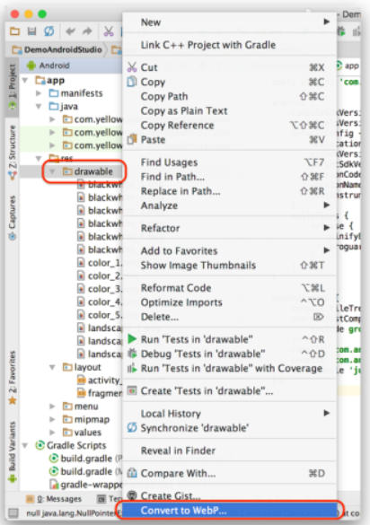

2. Dialog Converting Images to WebP xuất hiện với các tùy chọn. 
Các tùy chọn mặc định này sẽ phụ thuộc vào thông số minSdkVersion.

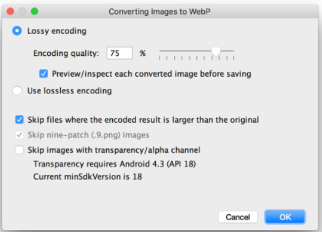

3. **Lossy encoding**: giúp giảm dung lượng ảnh rất tốt, nhưng cũng làm mất đi chất lượng ảnh. 
   1. **Encoding quality**: tùy chỉnh được chất lượng nén ảnh còn lại (như hình cho thấy con số chất lượng cần giữ lại là 75%). 
   2. **Preview/inspect each converted image before saving**: xem qua mỗi ảnh trước khi tiến hành chuyển đổi hay không.
4. **Use lossless encoding**: tùy chọn này chỉ được dùng khi **minSdkVersion** của ứng dụng từ **18** trở lên, 
không làm mất đi chất lượng ảnh, nhưng bù lại thì dung lượng ảnh sẽ không giảm đi nhiều.
5. các tùy chọn còn lại:
   1. skip file kết quả nén lớn hơn bản gốc
   2. skip 9-patch (mặc định luôn check)
   3. skip image với transparency/alpha chanel (nếu nhỏ hơn Android 4.3 API 18 thì check vào tùy chọn này)
6. **OK**: có 2 trường hợp:
   1. **Use lossless encoding** hệ thống thực hiện chuyển đổi ngay. 
   2. **Lossy encoding** và có check **Preview…** -> **Preview Dialog** sẽ hiển thị
7. **Preview Dialog**
    1. điều chỉnh tỉ lệ chất lượng ảnh, càng thấp -> kích thước càng nhỏ
    2. **Next** nếu còn ảnh cần chuyển đổi, **Finish** kết thúc chuyển đổi.

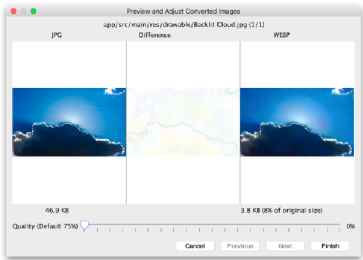

______________________________________________________________________________________
______________________________________________________________________________________
______________________________________________________________________________________
# 19. ActionBar - TittleBar <a id="19"></a>
______________________________________________________________________________________
* ActionBar hay TittleBar (ở cách gọi của các đời Android cũ), là nơi hiển thị
  * Label (Tittle)
  * Button
* ActionBar giúp kết nối giữa các màn hình với nhau (nhờ vào các Button), giúp user hiểu rõ chức năng và sự liền mạch của
ứng dụng nhờ vào Label (Tittle)

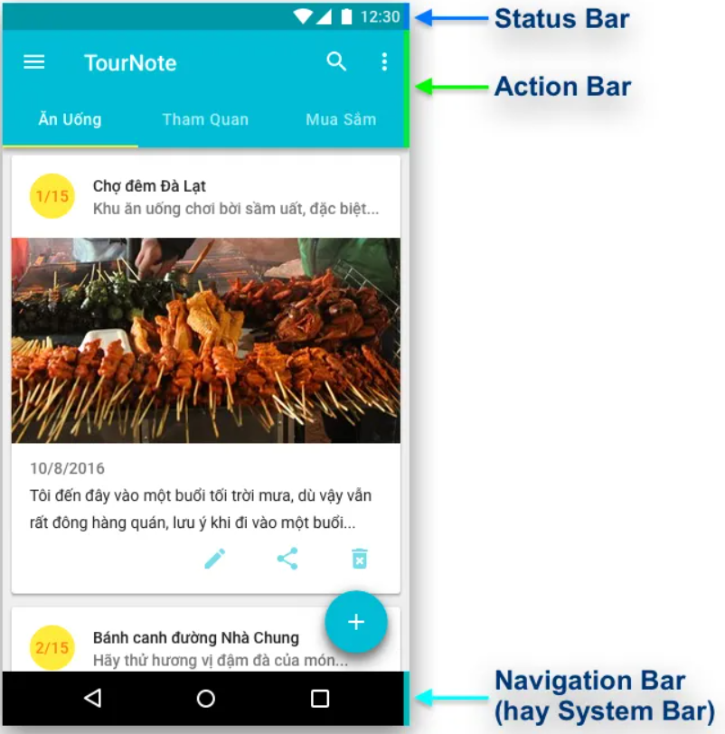

## 19.1. Xây Dựng ActionBar Trong XML <a id="19.1"></a>
______________________________________________________________________________________
* khi tạo 1 Project thì mặc định ActionBar cũng hiển thị sẵn TittleBar là tên của Màn hình nên chưa cần quan tâm.
* để đặt các Button vào ActionBar, Android bắt buộc làm theo những bước sau:
  * chuẩn bị drawable các icon
  * các resource cần thiết: strings.xml,...
  * tạo thư mục **menu/** trong thư mục **res/**: right click **res/** -> **New** -> **Android Resource Directory**
    * Name: menu
    * Type: menu
  * tạo file ``main_actions.xml`` trong thư mục **res/menu/**: right click **res/menu** -> **New** -> **Android Resource File**
    * Name: đặt tên (vd: main_actions)
    * OK
  * xây dựng các Button cho Menu, bằng cách khai báo các item là các button tương ứng trong file main_actions.xml như sau:
```xml
<?xml version="1.0" encoding="utf-8"?>
<menu xmlns:android="http://schemas.android.com/apk/res/android"
    xmlns:app="http://schemas.android.com/apk/res-auto">
  
    <item
        android:id="@+id/add"
        android:icon="@drawable/ic_action_new"
        app:showAsAction="always"
        android:title="@string/add"/>
    <item
        android:id="@+id/reset"
        android:icon="@drawable/ic_action_refresh"
        app:showAsAction="always|withText"
        android:title="@string/reset"/>
    <item
        android:id="@+id/about"
        android:icon="@drawable/ic_action_about"
        app:showAsAction="never"
        android:title="@string/about">
    </item>
  
</menu>
```
* các thành phần trong file khai báo button của menu xml
  * ``<menu></menu>``: thẻ Root, chứa các thẻ Child **item** là các **Button** tương ứng, thẻ **menu** có 2 thuộc tính:
    * thuộc tính:
      * ``xmlns:android="http://schemas.android.com/apk/res/android"``: khai báo namespace android
      * ``xmlns:app="http://schemas.android.com/apk/res-auto"``: khai báo namespace app
  * ``<item></item>``: thẻ Child, là các Button tương ứng, là thẻ con của thẻ **menu**
    * thuộc tính:
      * ``android:id="@+id/add"``: khai báo **id** cho drawable Button, ID này sẽ được dùng ở Java code
      * ``android:icon="@drawable/ic_action_about"``: chỉ định drawable Button cho item
      * ``android:title="@string/reset"``: chỉ định title cho item
      * ``app:showAsAction="never"``: giúp xác định độ ưu tiên hiển thị Button lên ActionBar, các cấp độ ưu tiên
        * **(cao)** ``always``: có thể thêm ``"|withText"`` để hiển thị **title** song song với Button
        * **(trung)** ``ifRoom``: có thể thêm ``"|withText"`` để hiển thị **title** song song với Button
        * **(thấp)** ``never``: cấp độ này luôn mang Button vào menu mở rộng
        * ``collapseActionView``
      * ``android:orderInCategory="3"``: chỉ định thứ tự hiển thị của item trong menu, nếu không thêm thuộc tính này, order
      mặc định của item là 0
* 1 item có thể chứa 1 menu bên trong nó, thuộc tính vẫn khai báo bình thường
* ví dụ ta có file ``menu_demo.xml`` trong thư mục **res/menu/**
```xml
<?xml version="1.0" encoding="utf-8"?>
<menu xmlns:android="http://schemas.android.com/apk/res/android"
    xmlns:app="http://schemas.android.com/apk/res-auto">
    <item
        android:id="@+id/menu_setting"
        android:icon="@android:drawable/ic_menu_add"
        android:title="Setting"
        app:showAsAction="always" />
    <item
        android:id="@+id/menu_share"
        android:orderInCategory="1"
        android:title="Share" />
    <item
        android:id="@+id/menu_search"
        android:orderInCategory="2"
        android:title="Search" />
    <item
        android:id="@+id/menu_contact"
        android:orderInCategory="3"
        android:title="Contact">
        <menu>
            <item
                android:id="@+id/menu_contact_phone_number"
                android:orderInCategory="1"
                android:title="Phone Number" />
            <item
                android:id="@+id/menu_contact_email"
                android:orderInCategory="2"
                android:title="Email" />
        </menu>
    </item>
</menu>
```

## 19.2. Thao Tác Với Các Button Của ActionBar Trong Java Code <a id="19.2"></a>
______________________________________________________________________________________
* mặc dù đã khai báo menu các Button trong XML, nhưng vẫn chưa hiển thị lên màn hình, ta cần phải gọi đến nó ở Java code.
* do trong thư mục **res/menu/** sẽ chứa nhiều file menu, mỗi file menu định nghĩa 1 ActionBar cho 1 màn hình hiển thị (
trong ứng dụng có rất nhiều màn hình hiển thị chuyển đổi qua lại với nhau).
* để chỉ định file menu nào cho ActionBar của màn hình nào, ta cần <u>_override_</u> phương thức:<br/>
**onCreateOptionsMenu()** <br/>
trong file Java của màn hình đó như sau:
```java
@Override
public boolean onCreateOptionsMenu(Menu menu) {
    getMenuInflater().inflate(R.menu.[tên_của_action_menu], menu);
          
    return super.onCreateOptionsMenu(menu);
}
```
* chỉ định Resource menu của action đã khai báo tương ứng vào trong **onCreateOptionsMenu()**
  * ``getMenuInflater().inflate(R.menu.[tên_của_action_menu], menu);``
    * lấy resource menu đã định nghĩa trong xml ``R.menu.[tên_của_action_menu]``
    * gắn nó vào ``menu`` của màn hình hiện tại
    * sau khi khai báo menu, tiếp tục định nghĩa sự kiện click cho các Button.
    * đối với Button của ActionBar ta phải <u>_override_</u> phương thức:<br/>
  **onOptionsItemSelected()** <br/>
  phương thức này truyền vào cho ta 1 MenuItem, ta sẽ lấy **id** của từng **item** và thực hiện logic click cho chúng
```java
@Override
public boolean onOptionsItemSelected(MenuItem item) {
    switch (item.getItemId()) {
        case R.id.add:
            // Làm gì đó
            return true;
        case R.id.reset:
            // Làm cái gì đó
            return true;
        case R.id.about:
            // Làm bất cứ cái gì đó
            return true;
    }
          
    return super.onOptionsItemSelected(item);
}
```
## 19.3. ActionBar Và ToolBar <a id="19.3"></a>
______________________________________________________________________________________
* Từ phiên bản Android 5.0, Google có định nghĩa thêm một khái niệm ToolBar. 
* Thực chất thì ToolBar cũng là một ActionBar nhưng có sự linh động hơn. 
* ToolBar cũng được hỗ trợ tương thích ngược cho các hệ điều hành cũ hơn thông qua thư viện appcompat-v7. 

## 19.4. Thực Hành Xây Dựng ActionBar cho TourBook <a id="19.4"></a>
______________________________________________________________________________________
* xây dựng Button tìm kiếm luôn hiển thị trên ActionBar
* 2 Button: Về Ứng Dụng và Giúp Đỡ được thu gọn vào trong menu mở rộng
* chuẩn bị resource drawable: Button kính lúp
  * dùng công cụ **Image Asset** tích hợp sẵn, hoặc **Android Asset Studio Online**
* định nghĩa các item cho ActionBar ``main_actions.xml``
```xml
<?xml version="1.0" encoding="utf-8"?>
<menu xmlns:android="http://schemas.android.com/apk/res/android"
      xmlns:app="http://schemas.android.com/apk/res-auto">
    <item
            android:id="@+id/search"
            android:icon="@drawable/ic_action_search"
            android:title="@string/menu_item_search"
            app:showAsAction="always" />
    <item
            android:id="@+id/about"
            android:title="@string/menu_item_about_app"
            app:showAsAction="never"/>
    <item
            android:id="@+id/help"
            android:title="@string/menu_item_help"
            app:showAsAction="never"/>
</menu>
```
* thao tác với các Button của ActionBar trong Java
  * vào lớp **MainActivity.java** và override phương thức **onCreateOptionMenu()**
  * thêm dòng lệnh:
    * ``getMenuInflater().inflate(R.menu.[tên_của_action_menu], menu);``
```java
@Override
public boolean onCreateOptionsMenu(Menu menu) {
    getMenuInflater().inflate(R.menu.main_actions, menu);
    return super.onCreateOptionsMenu(menu);
}
```
* bắt sự kiện các Button của ActionBar được chọn
    * vào lớp **MainActivity.java** và override phương thức **onOptionsItemSelected(MenuItem item)**
    * get id của item bên trong phương thức này:
    **item.getItemId()**
    * thực hiện logic click với từng id được trả về của mỗi Button khi được click vào 
```java
    @Override
    public boolean onOptionsItemSelected(@NonNull MenuItem item) {
        switch (item.getItemId()) {
            case R.id.search:
                Toast.makeText(this, "Search button is selected", Toast.LENGTH_SHORT).show();
                break;
            case R.id.about:
                Toast.makeText(this, "About button is selected", Toast.LENGTH_SHORT).show();
                break;
            case R.id.help:
                Toast.makeText(this, "Help button is selected", Toast.LENGTH_SHORT).show();
                break;
        }

        return super.onOptionsItemSelected(item);
    }
```

## 19.5. Pop-up Menu <a id="19.5"></a>
______________________________________________________________________________________
* Pop-up menu là 1 dạng menu hiển thị trong màn hình, khi click vào 1 View nào đó trên màn hình, 1 Menu danh sách các item
sẽ xổ xuống.

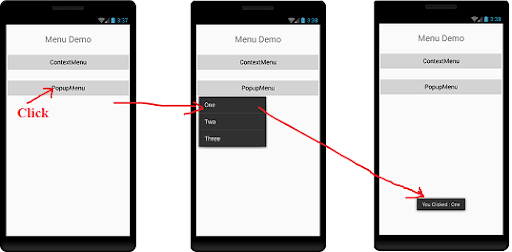

### 19.5.1. Xây Dựng Resource Menu Cho Pop-up Menu <a id="19.5.1"></a>
______________________________________________________________________________________
* các bước định nghĩa 1 UI XML cho Pop-up Menu cũng tương tự như ActionBar Menu.
* tạo 1 thư mục **menu** trong **res/**
* tạo 1 file XML định nghĩa các item cho Pop-up menu, với Root element cũng là **menu**.
* ví dụ tạo 1 file UI XML cho Pop-up menu có tên là ``menu_popup_demo.xml``
```xml
<?xml version="1.0" encoding="utf-8"?>
<menu xmlns:android="http://schemas.android.com/apk/res/android">
    <item
        android:id="@+id/menu_them"
        android:orderInCategory="1"
        android:title="Thêm" />
    <item
        android:id="@+id/menu_xoa"
        android:orderInCategory="2"
        android:title="Xóa" />
    <item
        android:id="@+id/menu_sua"
        android:orderInCategory="3"
        android:title="Sửa" />
</menu>
```

### 19.5.2. Xây Dựng UI XML Ở Màn Hình Sẽ Hiển Thị PopupMenu <a id="19.5.2"></a>
______________________________________________________________________________________
* ví dụ ở MainAcitivty ta cần 1 Button khi nhấn vào sẽ hiển thị 1 Menu.
* tiến hành thêm Button vào MainActivity
```xml
<?xml version="1.0" encoding="utf-8"?>
<androidx.constraintlayout.widget.ConstraintLayout 
    xmlns:android="http://schemas.android.com/apk/res/android"
    xmlns:app="http://schemas.android.com/apk/res-auto"
    xmlns:tools="http://schemas.android.com/tools"
    android:layout_width="match_parent"
    android:layout_height="match_parent"
    tools:context=".MainActivity">

    <Button
        android:id="@+id/button_popup_menu"
        android:layout_width="wrap_content"
        android:layout_height="wrap_content"
        android:layout_marginTop="76dp"
        android:text="Pop-Up Menu"
        app:layout_constraintEnd_toEndOf="parent"
        app:layout_constraintHorizontal_bias="0.498"
        app:layout_constraintStart_toStartOf="parent"
        app:layout_constraintTop_toTopOf="parent" />
</androidx.constraintlayout.widget.ConstraintLayout>
```

### 19.5.3. Xử Lý Logic Code Để Gắn PopupMenu Vào View, Và Xử lý Sự Kiện Click Trên PopupMenu <a id="19.5.3"></a>
______________________________________________________________________________________
* tiến hành xử lý logic code cho Button và Pop-up Menu ở MainActivity.java
* đầu tiên ta khởi tạo và ánh xạ Button, Button này sẽ là điểm neo để gắn Pop-up Menu vào.
```java
Button buttonPopup = (Button) findViewById(R.id.button_popup_menu);
```
* logic là khi user nhấn vào Button thì Pop-up Menu sẽ hiển thị, tiến hành bắt sự kiện click cho Button
* trong sự kiện click của Button, tiến hành hiển thị UI của Pop-up Menu, bằng cách:
  * xây dựng Pop-up Menu trực tiếp trong sự kiện click của Button
  * hoặc gọi phương thức dùng để hiển thị Pop-up Menu xây dựng ở bên ngoài, ví dụ ``showMenu()``
* xây dựng phương thức ``showMenu()`` dùng để hiển thị PopupMenu và xử lý sự kiện khi click vào các item trên PopupMenu
```java
package com.hienqp.popupmenudemo;

import androidx.appcompat.app.AppCompatActivity;
import androidx.appcompat.widget.PopupMenu;

import android.os.Bundle;
import android.view.MenuItem;
import android.view.View;
import android.widget.Button;

public class MainActivity extends AppCompatActivity {
    Button buttonPopup;

    @Override
    protected void onCreate(Bundle savedInstanceState) {
        super.onCreate(savedInstanceState);
        setContentView(R.layout.activity_main);

        buttonPopup = (Button) findViewById(R.id.button_popup_menu);

        buttonPopup.setOnClickListener(new View.OnClickListener() {
            @Override
            public void onClick(View v) {
                showMenu();
            }
        });
    }

    private void showMenu() {
        // khởi tạo 1 đối tượng PopupMenu tồn tại ở Context MainActivity.this, được gắn vào Button chỉ định
        androidx.appcompat.widget.PopupMenu popupMenu = new androidx.appcompat.widget.PopupMenu(MainActivity.this, buttonPopup);
        // lấy UI của Pop-up menu đã xây dựng gán cho đối tượng PopupMenu vừa tạo
        popupMenu.getMenuInflater().inflate(R.menu.popup_menu_demo, popupMenu.getMenu());
        // sau khi có giao diện cho đối tượng PopupMenu, tiến hành show nó ra để nó có thể hiển thị
        popupMenu.show();
        // xử lý sự kiện khi click vào 1 trong các item trong PopupMenu
        popupMenu.setOnMenuItemClickListener(new PopupMenu.OnMenuItemClickListener() {
            @Override
            public boolean onMenuItemClick(MenuItem item) {
                switch (item.getItemId()) {
                    case R.id.menu_them:
                        buttonPopup.setText("Menu Thêm");
                        break;
                    case R.id.menu_xoa:
                        buttonPopup.setText("Menu Xóa");
                        break;
                    case R.id.menu_sua:
                        buttonPopup.setText("Menu Sửa");
                        break;
                }
                return false;
            }
        });
    }
}
```


## 19.6. Context Menu <a id="19.6"></a>
______________________________________________________________________________________
* Context Menu thường được hiển thị sau khi có sự kiện Long Click của View nào đó.
* về mặc hình thức hiển thị nó tương tự như Dialog Menu

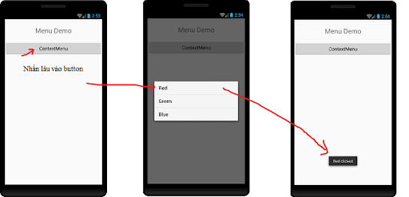

### 19.6.1. Xây Dựng UI Resource Cho Context Menu <a id="19.6.1"></a>
______________________________________________________________________________________
* xây dựng file UI XML cho Context Menu tương tự như ActionBar Menu, Popup Menu.
* ta cần tạo 1 thư mục chứa loại resource menu: 
  * chuột phải **res/** -> **New** -> **Android Resource Directory** -> chọn type là **menu** -> OK
* tạo file XML UI của Context Menu với Root element là **menu**, ví dụ: ``menu_context_demo.xml``
```xml
<?xml version="1.0" encoding="utf-8"?>
<menu xmlns:android="http://schemas.android.com/apk/res/android">
    <item android:title="Màu Vàng" android:id="@+id/item_vang"/>
    <item android:title="Màu Xanh" android:id="@+id/item_xanh"/>
    <item android:title="Màu Đỏ" android:id="@+id/item_do"/>
</menu>
```

### 19.6.2. Xây Dựng UI Resource Cho Màn Hình Chứa Context Menu <a id="19.6.2"></a>
______________________________________________________________________________________
* ở màn hình chính ta thêm Button chính là nơi sẽ gắn Context Menu vào
* vì ứng dụng xử lý sự kiện lúc này là click vào menu sẽ đổi màu tương ứng cho màn hình chính, nên phải có ID cho ConstraintLayout
```xml
<?xml version="1.0" encoding="utf-8"?>
<androidx.constraintlayout.widget.ConstraintLayout xmlns:android="http://schemas.android.com/apk/res/android"
    xmlns:app="http://schemas.android.com/apk/res-auto"
    xmlns:tools="http://schemas.android.com/tools"
    android:id="@+id/layout_main_screen"
    android:layout_width="match_parent"
    android:layout_height="match_parent"
    tools:context=".MainActivity" >

    <Button
        android:id="@+id/button_change_color"
        android:layout_width="wrap_content"
        android:layout_height="wrap_content"
        android:layout_marginTop="48dp"
        android:text="Chọn Màu"
        app:layout_constraintEnd_toEndOf="parent"
        app:layout_constraintHorizontal_bias="0.498"
        app:layout_constraintStart_toStartOf="parent"
        app:layout_constraintTop_toTopOf="parent" />
</androidx.constraintlayout.widget.ConstraintLayout>
```

### 19.6.3. Xử Lý Logic Ở Màn Hình Chứa Context Menu <a id="19.6.3"></a>
______________________________________________________________________________________
* đối với Context Menu, sử dụng phương thức override là ``onCreateContextMenu()`` để create Context Menu.
```java
@Override
public void onCreateContextMenu(ContextMenu menu, View v, ContextMenu.ContextMenuInfo menuInfo) {
    // gán layout đã xây dựng cho Context Menu thông qua
    getMenuInflater().inflate(R.menu.menu_context_demo, menu);
    super.onCreateContextMenu(menu, v, menuInfo);
}
```
* trong phương thức dùng để create Context Menu, ta gán layout cho Context Menu thông qua phương thức <br/> 
``getMenuInflater().inflate(R.menu.menu_context_demo, menu);``
  * tham số:
    * ``R.menu.menu_context_demo``: layout chỉ định cho menu (menu_context_demo)
    * ``menu``: đối tượng menu Context được truyền vào khi override onCreateContextMenu()
* ngoài ra trong ``onCreateContextMenu()`` ta có thể sử dụng phương thức set title và set icon cho Context Menu thông qua
đối tượng menu được truyền vào bởi hệ thống
  * ``menu.setHeaderTitle("Chọn Màu");``: chỉ định tiêu đề cho Context menu
  * ``menu.setHeaderIcon(R.mipmap.ic_launcher_round);``: chỉ định icon nằm trên thanh tiêu đề của Context Menu
* ở ``onCreate()`` ta đăng ký View sẽ được dùng cho Context Menu, thì lúc này Context menu mới có thể hiển thị khi Long Click
vào View đã đăng ký cho Context Menu.
```java
@Override
protected void onCreate(Bundle savedInstanceState) {
    super.onCreate(savedInstanceState);
    setContentView(R.layout.activity_main);

    mainScreen = (ConstraintLayout) findViewById(R.id.layout_main_screen);
    buttonChangeColor = (Button) findViewById(R.id.button_change_color);

    // đăng ký View cho Context Menu
    registerForContextMenu(buttonChangeColor);
}
```
* sau khi thực hiện đầy đủ các bước trên, để bắt sự kiện cho Context menu ta override phương thức<br/>
``onContextItemSelected()``
* phương thức này sẽ truyền vào 1 Menu các Item cho ta sử dụng, bằng cách getItemId() của từng Item để sử dụng logic code
```java
@Override
public boolean onContextItemSelected(@NonNull MenuItem item) {
    switch (item.getItemId()) {
        case R.id.item_do: mainScreen.setBackgroundColor(Color.RED);
            break;
        case R.id.item_vang: mainScreen.setBackgroundColor(Color.YELLOW);
            break;
        case R.id.item_xanh: mainScreen.setBackgroundColor(Color.BLUE);
            break;
    }
    return super.onContextItemSelected(item);
}
```
#### Source Code Đầy Đủ Của MainActivity.java Lúc Này
```java
package com.hienqp.contextmenu;

import androidx.annotation.NonNull;
import androidx.appcompat.app.AppCompatActivity;
import androidx.constraintlayout.widget.ConstraintLayout;

import android.graphics.Color;
import android.os.Bundle;
import android.view.ContextMenu;
import android.view.MenuItem;
import android.view.View;
import android.widget.Button;

public class MainActivity extends AppCompatActivity {
    ConstraintLayout mainScreen;
    Button buttonChangeColor;

    @Override
    protected void onCreate(Bundle savedInstanceState) {
        super.onCreate(savedInstanceState);
        setContentView(R.layout.activity_main);

        mainScreen = (ConstraintLayout) findViewById(R.id.layout_main_screen);
        buttonChangeColor = (Button) findViewById(R.id.button_change_color);

        // đăng ký View cho Context Menu
        registerForContextMenu(buttonChangeColor);
    }

    @Override
    public void onCreateContextMenu(ContextMenu menu, View v, ContextMenu.ContextMenuInfo menuInfo) {
        // gán layout đã xây dựng cho Context Menu thông qua
        getMenuInflater().inflate(R.menu.menu_context_demo, menu);

        menu.setHeaderTitle("Chọn Màu");
        menu.setHeaderIcon(R.mipmap.ic_launcher);

        super.onCreateContextMenu(menu, v, menuInfo);
    }

    @Override
    public boolean onContextItemSelected(@NonNull MenuItem item) {
        switch (item.getItemId()) {
            case R.id.item_do: mainScreen.setBackgroundColor(Color.RED);
                break;
            case R.id.item_vang: mainScreen.setBackgroundColor(Color.YELLOW);
                break;
            case R.id.item_xanh: mainScreen.setBackgroundColor(Color.BLUE);
                break;
        }
        return super.onContextItemSelected(item);
    }
}
```

## 19.7. Alert Dialog <a id="19.7"></a>
______________________________________________________________________________________
* Alert Dialog thường dùng để hiển thị 1 hộp thoại nhỏ lên màn hình để xác nhận hành động của user.

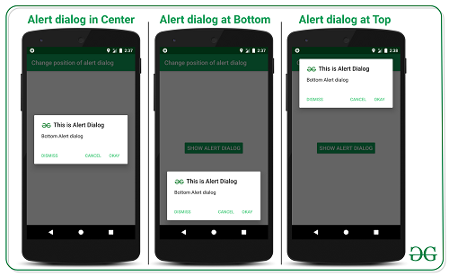

* giả sử ta có 1 ListView hiển thị các Item là các phần tử của 1 ArrayList<String> thông qua ArrayAdapter
* bắt sự kiện Long Click sẽ hiển thị 1 Dialog xác nhận với user có muốn xóa Item được chọn hay không.

### 19.7.1. Xây Dựng UI Cho Activity Chứa ListView <a id="19.7.1"></a>
______________________________________________________________________________________
```xml
<?xml version="1.0" encoding="utf-8"?>
<androidx.constraintlayout.widget.ConstraintLayout xmlns:android="http://schemas.android.com/apk/res/android"
    xmlns:app="http://schemas.android.com/apk/res-auto"
    xmlns:tools="http://schemas.android.com/tools"
    android:layout_width="match_parent"
    android:layout_height="match_parent"
    tools:context=".MainActivity">

    <ListView
        android:id="@+id/listview_name"
        android:layout_width="0dp"
        android:layout_height="0dp"
        app:layout_constraintBottom_toBottomOf="parent"
        app:layout_constraintEnd_toEndOf="parent"
        app:layout_constraintStart_toStartOf="parent"
        app:layout_constraintTop_toTopOf="parent" />
</androidx.constraintlayout.widget.ConstraintLayout>
```

### 19.7.2. Xử Lý Logic Ở MainActivity.java <a id="19.7.2"></a>
______________________________________________________________________________________
#### Xây Dựng DataSource, Adapter (vd: ArrayAdapter), AdapterView (vd: ListView)
______________________________________________________________________________________
* khai báo toàn cục DataSource, Adapter, AdapterView
```java
ListView listView;
ArrayAdapter adapter;
ArrayList<String> dataSource;
```
* ánh xạ và khởi tạo các đối tượng toàn cục
```java
listView = (ListView) findViewById(R.id.listview_name);
dataSource = new ArrayList<>();
addNameToArrayNameDataSource();
```
* thêm data cho DataSource thông qua phương thức trung gian
```java
    private void addNameToArrayNameDataSource() {
        dataSource.add("Android");
        dataSource.add("PHP");
        dataSource.add("IOS");
        dataSource.add("JAVA");
        dataSource.add("C++");
        dataSource.add("Kotlin");
        dataSource.add(".NET");
        dataSource.add("JavaScript");
        dataSource.add("C#");
        dataSource.add("Unity3D");
        dataSource.add("NodeJS");
    }
```
* kết nối Adapter với DataSource, và layout cho mỗi item
```java
adapter = new ArrayAdapter(MainActivity.this, android.R.layout.simple_list_item_1, dataSource);
```
* gắn Adapter lên ListView
```java
listView.setAdapter(adapter);
```
#### Xử Lý Sự Kiện Cho ListView
______________________________________________________________________________________
* sau khi ListView đã hiển thị và lấy được dữ liệu từ DataSource thông qua Adapter.
* tiến hành xử lý sự kiện khi user click (vd dùng Long Click) vào 1 Item thì Alert Dialog sẽ hiển thị.
* như vậy trong sự kiện click trên ListView sẽ show Alert Dialog, xây dựng 1 phương thức show Alert Dialog bên ngoài.
```java
listView.setOnItemLongClickListener(new AdapterView.OnItemLongClickListener() {
    @Override
    public boolean onItemLongClick(AdapterView<?> parent, View view, int position, long id) {
        confirmDelete(position);
        return false;
    }
});
```
* phương thức show Alert Dialog
```java
private void confirmDelete(int position) {
    AlertDialog.Builder alertDialog = new AlertDialog.Builder(MainActivity.this);
    alertDialog.setTitle("Thông Báo !!!");
    alertDialog.setIcon(R.mipmap.ic_launcher);
    alertDialog.setMessage("Bạn có muốn xóa môn học [ " + dataSource.get(position) + " ] hay không ???");

    alertDialog.setPositiveButton("Có", new DialogInterface.OnClickListener() {
        @Override
        public void onClick(DialogInterface dialog, int which) {
            dataSource.remove(position);
            adapter.notifyDataSetChanged();
        }
    });

    alertDialog.setNegativeButton("Không", new DialogInterface.OnClickListener() {
        @Override
        public void onClick(DialogInterface dialog, int which) {

        }
    });

    alertDialog.show();
}
```

#### Các Bước Xây Dựng 1 Alert Dialog
______________________________________________________________________________________
* xây dựng 1 Alert Dialog ở Context MainActivity
```java
AlertDialog.Builder alertDialog = new AlertDialog.Builder(MainActivity.this);
```
* 1 số phương thức hữu dụng của Alert Dialog
  * ``alertDialog.setTitle("Thông Báo !!!");``
    * set title cho Alert Dialog
  * ``alertDialog.setIcon(R.mipmap.ic_launcher);``
    * set icon cho Alert Dialog
  * ``alertDialog.setMessage("Bạn có muốn xóa môn học [ " + dataSource.get(position) + " ] hay không ???");``
    * set nội dung thông báo hiển thị cho user biết hoạt động hiện tại
  * ``alertDialog.setPositiveButton(String, new DialogInterface.OnClickListener() {});``
    * xây dựng PositiveButton với 2 tham số
      * ``String``: 
        * 1 String tên của Button
      * ``new DialogInterface.OnClickListener() {}``
        * gọi phương thức trừu tượng OnClickListener() ở DialogInterface để override phương thức ``onClick()``
        * phương thức ``onClick()`` là nởi sẽ xử lý sự kiện khi user chọn PositiveButton
  * ``alertDialog.setNegativeButton(String, new DialogInterface.OnClickListener() {});``
    * xây dụng NegativeButton với 2 tham số (thường thì Button này dùng để user hủy bỏ hành động trước đó, nên thường
    không có xử logic ở đây)
      * ``String``
        * 1 String tên của Button
      * ``new DialogInterface.OnClickListener() {}``
          * gọi phương thức trừu tượng OnClickListener() ở DialogInterface để override phương thức ``onClick()``
          * phương thức ``onClick()`` là nởi sẽ xử lý sự kiện khi user chọn NegativeButton
  * ``alertDialog.show();``
    * đây là phương thức rất quan trọng, sau khi xây dựng nội dung và các phương thức xử lý sự kiện trên Alert Dialog,
    phải gọi phương thức show() để Alert Dialog có thể hiển thị lên màn hình

#### MainActivity.java Hoàn Chỉnh
______________________________________________________________________________________
```java
package com.hienqp.alertdialogdemo;

import androidx.appcompat.app.AlertDialog;
import androidx.appcompat.app.AppCompatActivity;

import android.content.DialogInterface;
import android.os.Bundle;
import android.view.View;
import android.widget.AdapterView;
import android.widget.ArrayAdapter;
import android.widget.ListView;

import java.util.ArrayList;

public class MainActivity extends AppCompatActivity {
    ListView listView;
    ArrayAdapter adapter;
    ArrayList<String> dataSource;

    @Override
    protected void onCreate(Bundle savedInstanceState) {
        super.onCreate(savedInstanceState);
        setContentView(R.layout.activity_main);

        listView = (ListView) findViewById(R.id.listview_name);
        dataSource = new ArrayList<>();
        addNameToArrayNameDataSource();
        adapter = new ArrayAdapter(MainActivity.this, android.R.layout.simple_list_item_1, dataSource);
        listView.setAdapter(adapter);

        listView.setOnItemLongClickListener(new AdapterView.OnItemLongClickListener() {
            @Override
            public boolean onItemLongClick(AdapterView<?> parent, View view, int position, long id) {
                confirmDelete(position);
                return false;
            }
        });
    }

    private void confirmDelete(int position) {
        AlertDialog.Builder alertDialog = new AlertDialog.Builder(MainActivity.this);
        alertDialog.setTitle("Thông Báo !!!");
        alertDialog.setIcon(R.mipmap.ic_launcher);
        alertDialog.setMessage("Bạn có muốn xóa môn học [ " + dataSource.get(position) + " ] hay không ???");

        alertDialog.setPositiveButton("Có", new DialogInterface.OnClickListener() {
            @Override
            public void onClick(DialogInterface dialog, int which) {
                dataSource.remove(position);
                adapter.notifyDataSetChanged();
            }
        });

        alertDialog.setNegativeButton("Không", new DialogInterface.OnClickListener() {
            @Override
            public void onClick(DialogInterface dialog, int which) {

            }
        });

        alertDialog.show();
    }

    private void addNameToArrayNameDataSource() {
        dataSource.add("Android");
        dataSource.add("PHP");
        dataSource.add("IOS");
        dataSource.add("JAVA");
        dataSource.add("C++");
        dataSource.add("Kotlin");
        dataSource.add(".NET");
        dataSource.add("JavaScript");
        dataSource.add("C#");
        dataSource.add("Unity3D");
        dataSource.add("NodeJS");
    }
}
```

## 19.8. Custom 1 Alert Dialog <a id="19.8"></a>
______________________________________________________________________________________
* xây dựng 1 Alert Dialog với giao diện tùy chỉnh như:
  * vị trí hiển thị
  * hình ảnh
  * màu sắc kích thước chữ
  * ...

### 19.8.1. Xây Dựng UI XML Cho Custom Alert Dialog <a id="19.8.1"></a>
______________________________________________________________________________________
* ví dụ xây dựng 1 Alert Dialog hiển thị form đăng nhập tài khoản mật khẩu.
* chuột phải thư mục **res/layout/** -> **New** -> **Layout Resource File**
  * nhập tên layout dialog (dialog_custom_demo)
  * OK
* file UI XML Custom Dialog ``dialog_custom_demo.xml``
```xml
<?xml version="1.0" encoding="utf-8"?>
<LinearLayout xmlns:android="http://schemas.android.com/apk/res/android"
    android:layout_width="match_parent"
    android:layout_height="match_parent"
    android:background="#0CE8C7"
    android:orientation="vertical">

    <TextView
        android:layout_width="match_parent"
        android:layout_height="wrap_content"
        android:gravity="center"
        android:padding="10dp"
        android:text="Đăng Nhập Hệ Thống"
        android:textColor="#F00"
        android:textSize="30sp"
        android:textStyle="bold" />

    <EditText
        android:id="@+id/edittext_username"
        android:layout_width="match_parent"
        android:layout_height="wrap_content"
        android:layout_marginTop="20dp"
        android:hint="User Name"
        android:paddingLeft="10dp"
        android:paddingRight="10dp" />

    <EditText
        android:id="@+id/edittext_password"
        android:layout_width="match_parent"
        android:layout_height="wrap_content"
        android:layout_marginTop="10dp"
        android:hint="Password"
        android:inputType="textPassword"
        android:paddingLeft="10dp"
        android:paddingRight="10dp" />

    <LinearLayout
        android:layout_width="match_parent"
        android:layout_height="wrap_content"
        android:layout_marginTop="20dp"
        android:gravity="center"
        android:orientation="horizontal"
        android:padding="10dp"
        android:weightSum="10">

        <Button
            android:id="@+id/button_confirm"
            android:layout_width="wrap_content"
            android:layout_height="wrap_content"
            android:layout_weight="5"
            android:text="Đồng Ý" />

        <Button
            android:id="@+id/button_cancel"
            android:layout_width="wrap_content"
            android:layout_height="wrap_content"
            android:layout_marginLeft="20dp"
            android:layout_weight="5"
            android:text="Hủy" />
    </LinearLayout>

</LinearLayout>
```

### 19.8.2. Xây Dựng Logic Ở MainActivity.java <a id="19.8.2"></a>
______________________________________________________________________________________
* giả sử yêu cầu là khi nhấn vào 1 TextView thì sẽ bắt sự kiện click ở đó và show 1 Dialog dùng để đăng nhập.

#### khai báo, ánh xạ, và bắt sự kiện click cho TextView
______________________________________________________________________________________
```java
TextView textViewLogin;

@Override
protected void onCreate(Bundle savedInstanceState) {
    super.onCreate(savedInstanceState);
    setContentView(R.layout.activity_main);

    textViewLogin = (TextView) findViewById(R.id.textview_login);
    textViewLogin.setOnClickListener(new View.OnClickListener() {
        @Override
        public void onClick(View v) {
            dialogLogin();
        }
    });
}
```
* khi có sự kiện click sẽ gọi đến phương thức hiển thị Dialog mà ta xây dựng ``dialogLogin()``

#### xây dựng phương thức ``dialogLogin()``
______________________________________________________________________________________
* khai báo 1 Dialog và gắn Dialog đó vào Context chứa Dialog
  * ``Dialog dialog = new Dialog(MainActivity.this);``
* xử lý thanh tiêu đề mặc định của Dialog trong hệ thông
  * set nội dung cho thanh tiêu đề với **setTitle()**
    * ``dialog.setTitle("THÔNG BÁO");``
  * hoặc bỏ luôn tính năng thanh tiêu đề mặc định, LƯU Ý GỌI PHƯƠNG THỨC NÀY TRƯỚC **setContentView()**
    * ``dialog.requestWindowFeature(Window.FEATURE_NO_TITLE);``
* Dialog lúc này chưa có Layout của nó, tiến hành thiết lập Layout đã dựng trước đó cho Dialog
  * ``dialog.setContentView(R.layout.dialog_custom_demo);``
* có thể tùy chọn tính năng không hủy Dialog khi nhấn vào bên ngoài UI của Dialog
  * ``dialog.setCanceledOnTouchOutside(false);``
* ánh xạ các View bên trong UI XML của Dialog.
* lúc này các View đã dựng trước đó của **dialog_custom_demo.xml** được quản lý bởi **dialog** thông qua **setContentView()**
* vì vậy để ánh xạ các View trong XML đã dựng trước đó phải thông qua đối tượng Diaglog đang quản lý các View đó
```java
EditText edittextUserName = (EditText) dialog.findViewById(R.id.edittext_username);
EditText edittextPassword = (EditText) dialog.findViewById(R.id.edittext_password);
Button buttonConfirm = (Button) dialog.findViewById(R.id.button_confirm);
Button buttonCancel = (Button) dialog.findViewById(R.id.button_cancel);
```
* xử lý sự kiện ở các Button của Dialog
```java
buttonConfirm.setOnClickListener(new View.OnClickListener() {
    @Override
    public void onClick(View v) {
        String username = edittextUserName.getText().toString().trim();
        String password = edittextPassword.getText().toString().trim();
        if (username.equals("jackpq") && password.equals("123")) {
            Toast.makeText(MainActivity.this, "Đăng Nhập Thành Công", Toast.LENGTH_SHORT).show();
            dialog.dismiss();
        } else {
            Toast.makeText(MainActivity.this, "Sai Username hoặc Password", Toast.LENGTH_SHORT).show();
        }
    }
});

buttonCancel.setOnClickListener(new View.OnClickListener() {
    @Override
    public void onClick(View v) {
        // sử dụng 1 trong 2 phương thức sau để hủy 1 Dialog
//        dialog.cancel();
        dialog.dismiss();
    }
});
```
* cuối cùng là phương thức quan trọng dùng để hiển thị Dialog sau khi xây dựng các logic cho Dialog, nếu không có phương thức này
Dialog sẽ không hiển thị.
  * ``dialog.show();``
* 2 phương thức có thể dùng để đóng Dialog bất cứ khi nào trong xử lý logic
  * ``dialog.cancel();``
  * ``dialog.dismiss();``

#### File MainActivity.java Hoàn Chỉnh
______________________________________________________________________________________
```java
package com.hienqp.customalertdialogdemo;

import androidx.appcompat.app.AppCompatActivity;

import android.app.Dialog;
import android.os.Bundle;
import android.view.View;
import android.view.Window;
import android.widget.Button;
import android.widget.EditText;
import android.widget.TextView;
import android.widget.Toast;

public class MainActivity extends AppCompatActivity {
    TextView textViewLogin;

    @Override
    protected void onCreate(Bundle savedInstanceState) {
        super.onCreate(savedInstanceState);
        setContentView(R.layout.activity_main);

        textViewLogin = (TextView) findViewById(R.id.textview_login);
        textViewLogin.setOnClickListener(new View.OnClickListener() {
            @Override
            public void onClick(View v) {
                dialogLogin();
            }
        });
    }

    private void dialogLogin() {
        Dialog dialog = new Dialog(MainActivity.this);

//        // set nội dung trên thanh title cho dialog
//        dialog.setTitle("THÔNG BÁO");
        // hoặc bỏ tính năng thanh title cho dialog, lưu ý gọi phương thức này trước setContentView cho Dialog
        dialog.requestWindowFeature(Window.FEATURE_NO_TITLE);

        dialog.setContentView(R.layout.dialog_custom_demo);
        dialog.setCanceledOnTouchOutside(false);

        EditText edittextUserName = (EditText) dialog.findViewById(R.id.edittext_username);
        EditText edittextPassword = (EditText) dialog.findViewById(R.id.edittext_password);
        Button buttonConfirm = (Button) dialog.findViewById(R.id.button_confirm);
        Button buttonCancel = (Button) dialog.findViewById(R.id.button_cancel);

        buttonConfirm.setOnClickListener(new View.OnClickListener() {
            @Override
            public void onClick(View v) {
                String username = edittextUserName.getText().toString().trim();
                String password = edittextPassword.getText().toString().trim();
                if (username.equals("jackpq") && password.equals("123")) {
                    Toast.makeText(MainActivity.this, "Đăng Nhập Thành Công", Toast.LENGTH_SHORT).show();
                    dialog.dismiss();
                } else {
                    Toast.makeText(MainActivity.this, "Sai Username hoặc Password", Toast.LENGTH_SHORT).show();
                }
            }
        });

        buttonCancel.setOnClickListener(new View.OnClickListener() {
            @Override
            public void onClick(View v) {
                // sử dụng 1 trong 2 phương thức sau để hủy 1 Dialog
//                dialog.cancel();
                dialog.dismiss();
            }
        });

        dialog.show();
    }
}
```

______________________________________________________________________________________
______________________________________________________________________________________
______________________________________________________________________________________
# 20. Xây Dựng Navigation Drawer và DrawerLayout <a id="20"></a> 
______________________________________________________________________________________

## 20.1. Giới Thiệu Về Navigation Drawer <a id="20.1"></a>
______________________________________________________________________________________
* Navigation Drawer (Left Menu hay Slide Menu) là menu (thường được gọi là icon Hamburger) được ẩn phía bên trái của ActionBar, nó được giới thiệu vào năm 2013, sau ActionBar 2 năm.
* cũng như ActionBar, Navigation Drawer có tác dụng đem lại cho user trải nghiệm rõ ràng hơn trên các ứng dụng phức tạp.
* Navigation Drawer thường chứa các chức năng chính của ứng dụng giống như ActionBar (thường chỉ chứa các chức năng quan
trọng và được truy xuất thường xuyên), so với ActionBar thì Navigation Drawer mới chính thức là xương sống kết nối giữa 
các màn hình ứng dụng.


## 20.2. DrawerLayout <a id="20.1"></a>
______________________________________________________________________________________
* FrameLayout, LinearLayout, RelativeLayout, TableLayout và ConstraintLayout là những Layout thường được dùng để thiết
kế giao diện màn hình ứng dụng.
* **DrawerLayout** thì lại là 1 Layout đặc trưng, mục đích chính là tạo ra giao diện ngoài việc chứa giao diện của màn hình
chính, nó còn chứa giao diện của Navigation Drawer (Left Menu hay Slide Menu).
* **DrawerLayout** nằm trong **package** **support-v4** và **support-v13** để hỗ trợ tương thích ngược đến các hệ điều 
hành cũ hơn.

### 20.2.1. Cacs Bước Xây Dụng DrawerLayout <a id="20.2.1"></a>
______________________________________________________________________________________
#### Bước 1: Khai Báo Thư Viện Cho File Gradle Module
______________________________________________________________________________________
* để xây dựng DrawerLayout ta phải khai báo thư viện hỗ trợ design DrawerLayout trong file **build.gradle** cấp **module**.
1. mở file **build.gradle** cấp **module**
2. tìm đến khối **dependencies {}**
3. thêm dòng khai báo thư viện: <br/>``implementation 'com.android.support:design:28.0.0'`` <br/>như sau:
```js
dependencies {
    //noinspection GradleCompatible
    implementation 'com.android.support:design:28.0.0'
}
```
4. nhấn **Sync Now** để đồng bộ cho project

#### Bước 2: Tiến Hành Thiết Kế Giao Diện XML
______________________________________________________________________________________
* **DrawerLayout** là Layout dùng để design giao diện có chứa **Navigation Drawer**, vì vậy ở giao diện màn hình nào cần
đến 1 **Navigation Drawer** thì Root Layout của màn hình đó chính là **DrawerLayout**.
1. tạo **DrawerLayout** làm Root Layout, trong **DrawerLayout** tiến hành thêm vào 2 thành phần con
2. thành phần con thứ nhất: Layout của màn hình chính (xây dựng như bình thường)
3. thành phần con thứ hai: Layout của Navigation Drawer, tốt nhất là sử dụng Layout **NavigationView**, **NavigationView** extends
từ **FrameLayout** nên bản thân nó không linh động trong thiết kế, ta có thể lồng vào **NavigationView** các Layout con khác, như
**LinearLayout** chẳng hạn.

>NavigationView là một layout được chuyên dùng trong Navigation Drawer, nó giúp định nghĩa ra một menu layout chuẩn, 
> với các màu sắc và kích cỡ mặc định, và khi sử dụng nó, bạn không cần phải lo lắng canh chỉnh chiều rộng của 
> left menu này như thế nào.

## 20.3. DrawerLayout Example <a id="20.3"></a>
______________________________________________________________________________________
* thực hành xây dựng DrawerLayout cho TourBook

### 20.3.1. Khai Báo Thư Viện Trong Gradle Module <a id="20.3.1"></a>
______________________________________________________________________________________
* khai báo thư viện ``implementation 'com.android.support:design:28.0.0'`` vào khối **dependencies**
```js
plugins {
    id 'com.android.application'
}

android {
    compileSdk 30

    defaultConfig {
        applicationId "com.hienqp.tourbook"
        minSdk 21
        targetSdk 30
        versionCode 1
        versionName "1.0.0"

        testInstrumentationRunner "androidx.test.runner.AndroidJUnitRunner"
    }

    buildTypes {
        release {
            minifyEnabled false
            proguardFiles getDefaultProguardFile('proguard-android-optimize.txt'), 'proguard-rules.pro'
        }
    }
    compileOptions {
        sourceCompatibility JavaVersion.VERSION_1_8
        targetCompatibility JavaVersion.VERSION_1_8
    }
}

dependencies {

    implementation 'androidx.appcompat:appcompat:1.3.1'
    implementation 'com.google.android.material:material:1.4.0'
    implementation 'androidx.constraintlayout:constraintlayout:2.1.0'
    testImplementation 'junit:junit:4.+'
    androidTestImplementation 'androidx.test.ext:junit:1.1.3'
    androidTestImplementation 'androidx.test.espresso:espresso-core:3.4.0'
    //noinspection GradleCompatible
    implementation 'com.android.support:design:28.0.0'
}
```
### 20.3.2. Thêm Các Resource Cần Thiết <a id="20.3.2"></a>
______________________________________________________________________________________
#### Drawable cho các Icon
______________________________________________________________________________________
* icon cho left menu

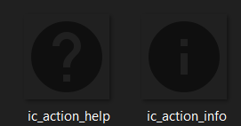

#### Dimension cho các thiết kế trong Navigation Drawer theo chuẩn Material của Google
______________________________________________________________________________________
```xml
<?xml version="1.0" encoding="utf-8"?>
<resources>
    <!-- Default screen margins, per the Android Design guidelines. -->
    <dimen name="activity_horizontal_margin">16dp</dimen>
    <dimen name="activity_vertical_margin">16dp</dimen>

    <!-- Main Activity components -->
    <dimen name="empty_icon_width">60dp</dimen>
    <dimen name="empty_icon_height">60dp</dimen>
    <dimen name="navigation_header_height">160dp</dimen>
    <dimen name="navigation_item_height">48dp</dimen>
    <dimen name="navigation_item_icon_size">24dp</dimen>
</resources>
```

### 20.3.3. Thiết Kế DrawerLayout Cho Màn Hình <a id="20.3.3"></a>
______________________________________________________________________________________
* các thành phần chính của DrawerLayout cho màn hình ứng dụng
  * Root Layout: DrawerLayout
  * Component thứ nhất (màn hình chính - Layout màn hình chính)
  * Component thứ hai (màn hình Navigation Drawer - NavigationView Layout)
     * thuộc tính của NavigationView
       * ``android:layout_width="wrap_content"``
       * ``android:layout_height="match_parent"``
       * ``android:layout_gravity="start"``: neo NavigationView vào start của Layout chứa nó (là DrawerLayout)
       * ``android:fitsSystemWindows="true"``: kích thước vừa với cửa sổ hệ thống
```xml
<?xml version="1.0" encoding="utf-8"?>
<androidx.drawerlayout.widget.DrawerLayout
    xmlns:android="http://schemas.android.com/apk/res/android"
    xmlns:app="http://schemas.android.com/apk/res-auto"
    xmlns:tools="http://schemas.android.com/tools"
    android:layout_width="match_parent"
    android:layout_height="match_parent"
    android:id="@+id/activity_main_drawer">

<!--    Component 1: Main Screen-->
    <androidx.constraintlayout.widget.ConstraintLayout
        android:layout_width="match_parent"
        android:layout_height="match_parent"
        tools:context=".MainActivity">

        <TextView
            android:id="@+id/activity_main_tv_empty"
            style="@style/InformationTextView"
            android:text="@string/mainscreen_empty_note"
            app:layout_constraintBottom_toBottomOf="parent"
            app:layout_constraintLeft_toLeftOf="parent"
            app:layout_constraintRight_toRightOf="parent"
            app:layout_constraintTop_toTopOf="parent" />

        <ImageView
            android:id="@+id/imageView"
            android:layout_width="@dimen/empty_icon_width"
            android:layout_height="@dimen/empty_icon_height"
            android:layout_marginStart="8dp"
            android:layout_marginTop="8dp"
            android:layout_marginEnd="8dp"
            android:layout_marginBottom="8dp"
            android:scaleType="fitCenter"
            app:layout_constraintEnd_toEndOf="parent"
            app:layout_constraintStart_toStartOf="parent"
            app:layout_constraintTop_toBottomOf="@+id/activity_main_tv_empty"
            app:srcCompat="@drawable/empty_note" />

    </androidx.constraintlayout.widget.ConstraintLayout>

<!--    Component 2: Navigation Drawer-->
<!--    NavigationView là một layout được chuyên dùng trong Navigation Drawer, nó giúp định nghĩa
ra một menu layout chuẩn, với các màu sắc và kích cỡ mặc định, và khi sử dụng nó, bạn không cần
phải lo lắng canh chỉnh chiều rộng của left menu này như thế nào.-->
    <com.google.android.material.navigation.NavigationView
        android:layout_width="wrap_content"
        android:layout_height="match_parent"
        android:layout_gravity="start"
        android:fitsSystemWindows="true">

<!--        NavigationView chỉ là Layout chứa-->
<!--        để giao diện linh hoat, bên trong NavigationView nên chứa LinearLayout-->
<!--        bên trong LinearLayout khai báo thêm 3 LinearLayout con chồng lên nhau-->
<!--        3 LinearLayout con chính là 3 thành phần trong Navigation Drawer mong muốn-->
<!--        thành phần 1: Header-->
<!--        thành phần 2: Infor-->
<!--        thành phần 3: Help-->
        <LinearLayout
            android:layout_width="match_parent"
            android:layout_height="wrap_content"
            android:background="@color/white"
            android:orientation="vertical">

<!--            Header-->
            <LinearLayout
                android:layout_width="match_parent"
                android:layout_height="@dimen/navigation_header_height"
                android:background="@color/colorPrimary"
                android:gravity="bottom"
                android:orientation="vertical"
                android:paddingBottom="@dimen/activity_vertical_margin"
                android:paddingTop="@dimen/activity_vertical_margin"
                android:paddingLeft="@dimen/activity_horizontal_margin"
                android:paddingRight="@dimen/activity_horizontal_margin"
                android:theme="@style/ThemeOverlay.AppCompat.Dark">

                <ImageView
                    android:layout_width="wrap_content"
                    android:layout_height="wrap_content"
                    android:id="@+id/activity_main_imv_avatar"
                    android:paddingTop="@dimen/activity_vertical_margin"
                    android:src="@mipmap/ic_launcher_round"/>
                <TextView
                    android:id="@+id/activity_main_tv_user_name"
                    android:layout_width="match_parent"
                    android:layout_height="wrap_content"
                    android:paddingTop="@dimen/activity_vertical_margin"
                    android:text="HienQP Studio"
                    android:textAppearance="@style/TextAppearance.AppCompat.Body1"/>
                <TextView
                    android:id="@+id/activity_main_tv_email"
                    android:layout_width="wrap_content"
                    android:layout_height="wrap_content"
                    android:text="hienpham5290@gmail.com" />

            </LinearLayout>
<!--            Info-->
            <LinearLayout
                android:layout_width="match_parent"
                android:layout_height="@dimen/navigation_item_height"
                android:background="@color/white"
                android:gravity="center_vertical"
                android:orientation="horizontal"
                android:paddingLeft="@dimen/activity_horizontal_margin"
                android:paddingRight="@dimen/activity_horizontal_margin">

                <ImageView
                    android:layout_width="@dimen/navigation_item_icon_size"
                    android:layout_height="@dimen/navigation_item_icon_size"
                    android:src="@drawable/ic_action_info"/>
                <TextView
                    android:layout_width="match_parent"
                    android:layout_height="wrap_content"
                    android:layout_marginLeft="32dp"
                    android:text="@string/menu_item_about_app"/>

            </LinearLayout>
<!--            Help-->
            <LinearLayout
                android:layout_width="match_parent"
                android:layout_height="@dimen/navigation_item_height"
                android:background="@color/white"
                android:gravity="center_vertical"
                android:orientation="horizontal"
                android:paddingLeft="@dimen/activity_horizontal_margin"
                android:paddingRight="@dimen/activity_horizontal_margin">

                <ImageView
                    android:layout_width="@dimen/navigation_item_icon_size"
                    android:layout_height="@dimen/navigation_item_icon_size"
                    android:src="@drawable/ic_action_help"/>
                <TextView
                    android:layout_width="match_parent"
                    android:layout_height="wrap_content"
                    android:layout_marginLeft="32dp"
                    android:text="@string/menu_item_help"/>
            </LinearLayout>

        </LinearLayout>

    </com.google.android.material.navigation.NavigationView>
</androidx.drawerlayout.widget.DrawerLayout>
```

### 20.3.4. Truy Xuất Navigation Drawer Từ Java Code <a id="20.3.4"></a>
______________________________________________________________________________________
* với việc thiết kế DrawerLayout trong XML đã giúp Navigation Drawer tồn tại, nhưng để hiển thị lên màn hình, cần
phải thực hiện 1 số bước ở Java Code
* thêm 2 dòng lệnh sau vào phương thức **onCreate()** để đảm bảo icon Navigation Drawer xuất hiện trên ActionBar
```java
    @Override
    protected void onCreate(Bundle savedInstanceState) {
        super.onCreate(savedInstanceState);
        setContentView(R.layout.activity_main);

        // hiển thị nút Home trên ActionBar
        getSupportActionBar().setDisplayHomeAsUpEnabled(true);
        // cho phép tương tác nút Home trên ActionBar
        getSupportActionBar().setHomeButtonEnabled(true);
    }
```
* truy xuất đến DrawerLayout thông qua id của nó để có thể thiết lập logic code cho nó
```java
public class MainActivity extends AppCompatActivity {
    // Khai Báo DrawerLayout
    private DrawerLayout drawerLayout;

    @Override
    protected void onCreate(Bundle savedInstanceState) {
        super.onCreate(savedInstanceState);
        setContentView(R.layout.activity_main);

        // Ánh Xạ đến ID của DrawerLayout trong XML
        drawerLayout = (DrawerLayout) findViewById(R.id.activity_main_drawer);

        // hiển thị nút Home trên ActionBar
        getSupportActionBar().setDisplayHomeAsUpEnabled(true);
        // cho phép tương tác nút Home trên ActionBar
        getSupportActionBar().setHomeButtonEnabled(true);
    }
}
```
* khai báo thành phần ActionBarDrawerToggle, thành phần này được gắn vào icon Navigation Drawer của DrawerLayout, và làm nhiệm vụ đóng mở NavigationView
* khai báo ActionBarDrawerToggle ta cần thêm 2 resource string **navigation_drawer_open** và **navigation_drawer_close** được định nghĩa trong resource strings.xml
* **strings.xml**
```xml
    <string name="navigation_drawer_open" translatable="false">Open navigation drawer</string>
    <string name="navigation_drawer_close" translatable="false">Close navigation drawer</string>
```
* khai báo ActionBarDrawerToggle
```java
private ActionBarDrawerToggle drawerToggle;
drawerToggle = new ActionBarDrawerToggle(
        MainActivity.this, drawerLayout, 
        R.string.navigation_drawer_open, 
        R.string.navigation_drawer_close);
```
* gắn ActionBarDrawerToggle vào ActionBar
```java
drawerLayout.addDrawerListener(drawerToggle);
```
* sau khi khai báo và gắn vào ActionBar, ta cần đồng bộ ActionBarDrawerToggle với Activity trong 2 phương thức override 
  * **onPostCreate()**
  * **onConfigurationChanged()**
```java
    @Override
    protected void onPostCreate(Bundle savedInstanceState) {
        super.onPostCreate(savedInstanceState);
        // Sync the toggle state after onRestoreInstanceState has occurred.
        drawerToggle.syncState();
    }
    @Override
    public void onConfigurationChanged(Configuration newConfig) {
        super.onConfigurationChanged(newConfig);
        drawerToggle.onConfigurationChanged(newConfig);
    }
```
* bắt sự kiện trong phương thức override **onOptionsItemSelected()**, nếu MenuItem tồn tại thì bật ActionBarDrawerToggle
```java
    @Override
    public boolean onOptionsItemSelected(@NonNull MenuItem item) {
        if (actionBarDrawerToggle.onOptionsItemSelected(item)) {
            return true;
        }
    }
```

______________________________________________________________________________________
______________________________________________________________________________________
______________________________________________________________________________________
# 21. Làm Quen Với Activity <a id="21"></a>
______________________________________________________________________________________
## 21.1. Activity Là Gì <a id="21.1"></a>
______________________________________________________________________________________
* Activity đại diện cho một chức năng của app, là một giao diện màn hình, nơi user tương tác trực tiếp với app. 
* Một ứng dụng có thể có một hoặc nhiều Activity. 
* Một Activity từ khi được gọi đến khi kết thúc sẽ có những trạng thái (state) khác nhau.
* Ví dụ về các Activity trong ứng dụng

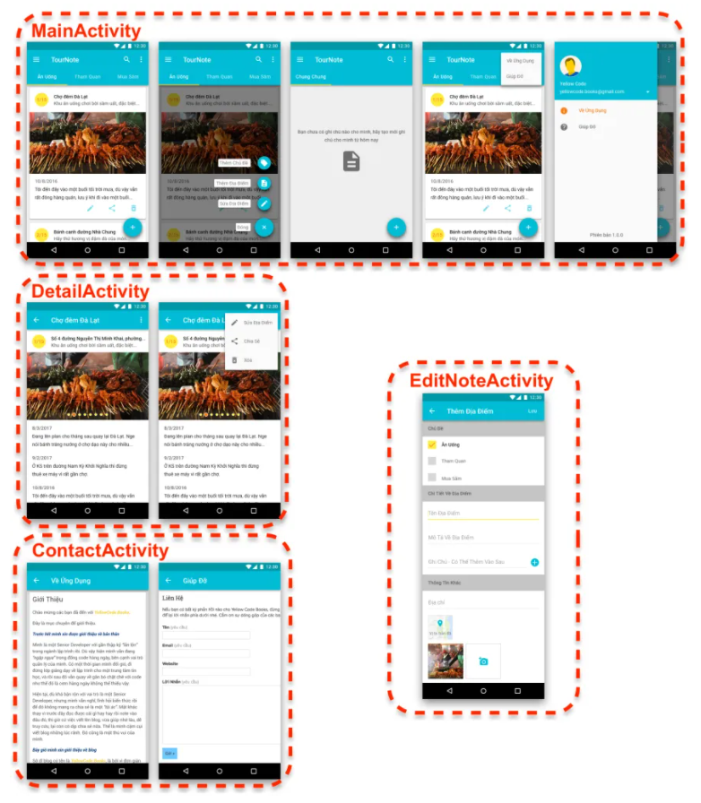

* như ví dụ ở ứng dụng trên, ta thấy có các Activity sau:
  * MainActivity
    * Đảm nhiệm vai trò hiển thị danh sách các ghi chú mà người dùng đã tạo trước đó theo chủ đề (mỗi chủ đề là một tab). 
    * Mỗi ghi chú này chỉ được hiển thị vắn tắt thông tin. 
    * Ngoài ra MainActivity còn chứa đựng Navigation Drawer (chính là left menu)
  * DetailActivity
    * Đảm nhiệm vai trò hiển thị đầy đủ thông tin của một ghi chú, khi mà người dùng click chọn vào một phần tử trên 
    danh sách các ghi chú ở MainActivity.
  * EditActivity
    * Giao diện này sẽ được dùng chung cho cà trường hợp tạo mới lẫn sửa chữa một ghi chú.
  * ContactActivity
    * Giao diện giới thiệu ứng dụng và liên hệ tác giả. 

## 21.2. Tạo Mới Một Activity Như Thế Nào <a id="21.2"></a>
______________________________________________________________________________________
* không khó để tạo 1 Activity, nhưng phải đầy đủ trình tự các bước sau:
  * tạo bộ đôi: XyzActivity.java và activity_xyz.xml
  * khai báo Activity với AndroidManifest.xml
  * sử dụng Intent để kích hoạt Activity

### 21.2.1. Bộ Đôi Activity Java và Activity XML <a id="21.2.1"></a>
______________________________________________________________________________________
* 1 Activity phải có bộ đôi java và xml đi kèm với nhau: ví dụ tạo Activity Xyz ta phải tạo
  * XyzActivity.java
  * activity_xyz.xml
* activity_xyz.xml
  * chịu trách nhiệm chính trong việc hiển thị UI của màn hình (file xml)
* XyzActivity.java
  * chịu trách nhiệm xử lý logic cho màn hình (file java).

### 21.2.2. Khai Báo Activity Mới Với Manifest <a id="21.2.2"></a>
______________________________________________________________________________________
* mỗi Activity khi tạo mới đều phải được khai báo thành một thẻ activity trong file AndroidManifest.xml
* nếu sử dụng công cụ để tạo bộ java và xml cho Activity, thì mặc định hệ thống sẽ khai báo luôn vào AndroidManifest.xml

### 21.2.3. Sử Dụng Intent Để Kích Hoạt Activity <a id="21.2.3"></a>
______________________________________________________________________________________
* Intent là một đối tượng message bạn có thể sử dụng để request một hành động từ một vài component trong ứng dụng
* Intent có 2 loại chính là Explicit Intent và Implicit Intent
  * Explicit Intent (intent tường minh):
    * là intent xác định rõ và cụ thể các thành phần tham gia hành động.
    * ```
      Intent intent = new Intent(MainActivity.this, DialerActivity.class);
      startActivity(intent);
      ```
    * ví dụ trên đã xác định chính xác Activity nhận intent đó là DialerActivity
  * Implicit Intent (Intent ngầm định):
    * là intent chỉ ra hành động cần được thực hiện (action) và dữ liệu cho hành động đó (data).

## 21.3. Thực Hành Tạo Mới 1 Activity <a id="21.3"></a>
______________________________________________________________________________________
### 21.3.1. Tạo Bộ Đôi Activity Java và XML <a id="21.3.1"></a>
______________________________________________________________________________________
* chuột phải vào thư mục **src/main/java/[package name]/** của Project
* chọn **New** -> **Activity** -> **Empty Activity** (hoặc loại Activity khác tùy mục đích)
* dialog **Configure Activity** hiển thị, có các thành phần sau:
  * Activity Name: chỉ định tên cho Activity muốn tạo
  * Generate Layout File: tùy chọn này sẽ đồng thời tạo file XML của Activity
  * Layout Name: tên của file XML Activity được tạo tự động (để mặc định theo hệ thống)
  * Launcher Activity: tùy chọn chỉ định Activity này sẽ là Activity mặc định được mở khi ứng dụng được thực thi (1 ứng dụng
  chỉ có duy nhất 1 Activity là mặc định Launcher)
  * Package name: để mặc định
  * Source language: chọn ngôn ngữ chính của Activity (Java, Kotlin, ...)
  * Finish: hoàn thành quá trình tạo Activity
* sau khi hoàn thành quá trình tạo Activity:
  * Activity Java sẽ nằm ở thư mục **java/[package name]/**
  * Activity XML sẽ nằm ở thư mục **res/layout/**

### 21.3.2. Khai Báo Activity Mới Trong AndroidManifest.xml <a id="21.3.2"></a>
______________________________________________________________________________________
* mặc định thì hệ thống sẽ tự động khai báo Activity mới trong file AndroidManifest.xml
* trong file AndroidManifest.xml Activity sẽ được khai báo với thẻ ``<activity></activity>`` trong thẻ ``<application></application>``
* khi mới được khởi tạo thẻ ``<activity></activity>`` chỉ chứa 1 thuộc tính là tên của Activity
```xml
<activity android:name=".ContactActivity"></activity>
```

### 21.3.3. Sử Dụng Intent Kích Hoạt Activity Mới <a id="21.3.3"></a>
______________________________________________________________________________________
* ở vị trí Widget bất kỳ, nếu ta muốn thiết lập logic code cho nó là khi nhấn vào sẽ chuyển Activity, ta chỉ cần thêm
khai báo Intent và kích hoạt Intent ở đó.
* chúng ta sẽ phải khởi tạo Intent explicit (tường minh) để chứa đựng thông tin để kích hoạt 1 Activity bất kỳ từ Activity hiện tại.<br/>
``Intent intent = new Intent(MainActivity.this, ContactActivity.class);``
  * ``MainActivity.this``: tham số này là **Context**, chính là ở màn hình hiện tại
  * ``ContactActivity.class``: tham số này là Activity cần được kích hoạt
* kích hoạt Intent bằng phương thức:<br/>
``startActivity(intent);``

### 21.3.4. Xây Dựng Chức Năng Back Trên ActionBar Của Activity Hiện Tại Để Trở Về Activity Trước <a id="21.3.4"></a>
______________________________________________________________________________________
* thay vì để user sử dụng nút Back của hệ thống ở NavigationBar để trở về Activity trước từ Activity hiện tại.
* ta có thể xây dựng nút Back riêng trên ActionBar của Activity hiện tại để trở về Activity trước.
* thêm vào phương thức **onCreate()** của Activity hiện tại 2 câu lệnh hiển thị và cho phép tương tác với nút Back trên ActionBar
```java
// hiển thị nút Home trên ActionBar
getSupportActionBar().setDisplayHomeAsUpEnabled(true);
// cho phép tương tác nút Home trên ActionBar
getSupportActionBar().setHomeButtonEnabled(true);
```
* sử dụng phương thức override **onOptionsItemSelected()** để bắt sự kiện click vào các item trên ActionBar.
* tiến hành lấy ID của Item được truyền vào phương thức override **onOptionsItemSelected()**
  * nếu trùng với ID của nút Back: ``android.R.id.home`` tiến hành kết thúc Activity hiện tại
  * gọi phương thức ngay sau khi bắt được ID của nút Back: ``finish()`` để kết thúc Activity hiện tại
>**android.R.id.home** : là ID hệ thống mặc định cấp cho nút Back trên ActionBar
> 
> **finish()**: là phương thức để kết thúc 1 Activity

## 21.4. Explicit Intent (Intent Tường Minh) - Implicit Intent (Intent Không Tường Minh) <a id="21.4"></a>
______________________________________________________________________________________
### 21.4.1. Explicit Intent (Intent Tường Minh) <a id="21.4.1"></a>
______________________________________________________________________________________
* Explicit intent trong Android còn được gọi là **Intent tường minh** vì nó **chỉ rõ component** sẽ nhận và xử lý. 
* Thông thường những intent này sẽ **không cần** gán bổ sung thêm các **thuộc tính** khác như **action, data**.
* **Explicit intent** thường được **sử dụng** để khởi chạy các component **trong cùng một ứng dụng**.
* Bằng cách sử dụng explicit intent, ta có thể gửi hoặc chia sẻ dữ liệu / nội dung từ activity này sang activity khác.
* Ví dụ: bằng cách sử dụng explicit intent, chúng ta có thể khởi chạy một activity mới (trong cùng ứng dụng) để đáp lại 
hành động của người dùng.

### 21.4.2. Sử Dụng Explicit Intent (Intent Tường Minh) <a id="21.4.2"></a>
______________________________________________________________________________________
#### Khởi Tạo Đối Tượng Explicit Intent
* để khởi tạo 1 đối tượng Intent Tường minh ta sử dụng Constructor của nó
  * ``public Intent(Context packageContext, Class<?> cls)``
  * có 2 tham số được truyền vào:
    * Context: màn hình nơi đang hiển thị
    * Class: External **.class** cần được kích hoạt 

#### Kích Hoạt Explicit Intent
* sau khi khởi tạo đối tượng Explicit Intent có đầy đủ Context **.this** và External **.class**.
* sử dụng phương thức khởi chạy Intent để kích hoạt thành phần External
  * ``public void startActivity(Intent intent)``
  * tham số truyền vào:
    * là đối tượng Explicit Intent đã được khai báo đầy đủ

### 21.4.3. Ví Dụ Sử Dụng Explicit Intent Để Kích Hoạt 1 Activity Khác <a id="21.4.3"></a>
______________________________________________________________________________________
* giả sử ta có 2 Activity: MainActivity, SecondActivity
* trên MainActivity có 1 Button
* khi nhấn vào Button thì trong sự kiện click là logic chuyển sang SecondActivity
* trong sự kiện click của Button, ta xây dựng Intent Explicit, và kích hoạt SecondActivity
* tiến hành tạo mới SecondActivity (SecondActivity.java và activity_second.xml)

#### UI XML activity_main.xml
```xml
<?xml version="1.0" encoding="utf-8"?>
<androidx.constraintlayout.widget.ConstraintLayout xmlns:android="http://schemas.android.com/apk/res/android"
    xmlns:app="http://schemas.android.com/apk/res-auto"
    xmlns:tools="http://schemas.android.com/tools"
    android:layout_width="match_parent"
    android:layout_height="match_parent"
    tools:context=".MainActivity"
    android:background="#FF0">


    <Button
        android:id="@+id/button_activity_main"
        android:layout_width="wrap_content"
        android:layout_height="wrap_content"
        android:layout_marginTop="50dp"
        android:text="MainActivity"
        app:layout_constraintEnd_toEndOf="parent"
        app:layout_constraintStart_toStartOf="parent"
        app:layout_constraintTop_toTopOf="parent" />
</androidx.constraintlayout.widget.ConstraintLayout>
```

#### Logic Code MainActivity.java
```java
package com.hienqp.explicitintentdemo;

import androidx.appcompat.app.AppCompatActivity;

import android.content.Intent;
import android.os.Bundle;
import android.view.View;
import android.widget.Button;

public class MainActivity extends AppCompatActivity {
    Button buttonMainActivity;

    @Override
    protected void onCreate(Bundle savedInstanceState) {
        super.onCreate(savedInstanceState);
        setContentView(R.layout.activity_main);

        buttonMainActivity = (Button) findViewById(R.id.button_activity_main);
        buttonMainActivity.setOnClickListener(new View.OnClickListener() {
            @Override
            public void onClick(View v) {
                Intent intent = new Intent(MainActivity.this, SecondActivity.class);
                startActivity(intent);
            }
        });
    }
}
```
______________________________________________________________________________________
### Explicit Intent - startActivityForResult() - setResult() - finish() - onActivityResult()
______________________________________________________________________________________
* giả sử ta cần xây dựng ứng dụng có 2 Activity (MainActivity, EditNameActivity).
* yêu cầu: 
  * khi user nhấn Button, sẽ chuyển từ MainActivity sang EditNameActivity.
  * ở EditNameActivity, user nhập tên ở EditText, sau đó nhấn Button xác nhận, sẽ quay trở lại MainActivity
  * khi MainActivity được mở lại, trên TextView của MainActivity sẽ hiển thị nội dung đã nhập ở EditNameActivity
* cách thức thực hiện:
  * ở MainActivity:
    * khai báo 1 REQUEST_CODE 
      * ``private static final int REQUEST_CODE_EXAMPLE = 4234124;``
    * trong sự kiện click vào Button di chuyển sang EditNameActivity
    * khai báo Explicit Intent với đầy đủ component là Context (MainAcitivty.this) và External (EditNameActivity.class)
      * ``Intent intent = new Intent(MainActivity.this, EditNameActivity.class);``
    * start EditNameActivity với phương thức ``startActivityForResult()`` để start Activity nhận Result
      * ``startActivityForResult(intent, REQUEST_CODE_EXAMPLE);``
  * ở EditNameActivity
    * khai báo 1 key để định danh dữ liệu mà EditNameActivity sẽ truyền đi
      * ``public static final String KEY_EDIT = "KEY_EDIT";``
    * trong sự kiện click vào Button xác nhận để setResult sau đó quay trở lại MainActivity
    * ta khai báo 1 Intent để chứa dữ liệu không chứa các component Context và External (do không dùng để kích hoạt Activity)
      * ``Intent data = new Intent();``
    * đưa dữ liệu vào Intent vừa tạo để lưu trữ dữ liệu, với key định danh cho dữ liệu đã khai báo ở trên
      * ``data.putExtra(EditNameActivity.KEY_EDIT, newName);``
    * gọi phương thức setResult() để thiết lập Result sẽ trả về cho MainActivity đã gọi kích hoạt EditNameActivity
    * với key định danh cho dữ liệu Result là ``Activity.RESULT_OK`` của hệ thống
    * Result này sẽ được nhận trong phương thức ``onActivityResult()`` ở MainActivity 
      * ``setResult(Activity.RESULT_OK, data);``
    * sau khi setResult() gọi finish() để đóng EditNameActivity, kết thúc sự kiện Button xác nhận
      * ``finish();``
    * trong EditNameActivity ta override thêm phương thức ``onBackPressed()``
    * phương thức này sẽ bắt sự kiện user nhấn vào nút Back (xem như user hủy thao tác)
    * trong sự kiện ``onBackPressed()`` ta setResult với key RESULT là CANCELED trước lời gọi ``super.onBackPressed()``
      * ``setResult(Activity.RESULT_CANCELED);``
  * trở lại MainActivity
    * override phương thức ``onActivityResult()``
    * nếu có Resutl trả về phương thức này sẽ được kích hoạt (vì hoạt động giữa MainActivity và EditNameActivity là yêu cầu và nhận kết quả)
      * ``protected void onActivityResult(int requestCode, int resultCode, @Nullable Intent data) { }``
      * từ phương thức ``onActivityResult()`` ta nhận được 3 tham số
        * ``requestCode``: code định danh yêu cầu được gửi từ MainActivity
        * ``resultCode``: code định danh kết quả trả về từ EditNameActivity
        * ``data``: chính là Intent chứa dữ liệu kết quả từ EditNameActivity
      * trong phương thức ``onActivityResult()`` (hay trong sự kiện có kết quả trả về từ Activity nào đó - EditNameActivity)
      * ta kiểm tra 
        * ``requestCode`` có đúng là Request Code của MainActivity đã gửi đi
        * ``resultCode`` có đúng là Result Code để định danh kết quả của EditNameActivity trả về
        * ``data`` dữ liệu trả về có khác null hay không
        * nếu thỏa 3 điều kiện trên tiến hành thực hiện logic code ở MainActivity với những dữ liệu nhận được

##### MainActivity.java
______________________________________________________________________________________
```java
package com.hienqp.explicitintentactivityforresult;

import androidx.annotation.Nullable;
import androidx.appcompat.app.AppCompatActivity;

import android.app.Activity;
import android.content.Intent;
import android.os.Bundle;
import android.view.View;
import android.widget.Button;
import android.widget.TextView;
import android.widget.Toast;

public class MainActivity extends AppCompatActivity {
    /* REQUEST_CODE là một giá trị int dùng để định danh mỗi request.
    Khi nhận được kết quả,
    hàm callback sẽ trả về cùng REQUEST_CODE này để ta có thể xác định và xử lý kết quả. */
    private static final int REQUEST_CODE_EXAMPLE = 4234124;

    TextView textViewDisplayName;
    Button buttonEdit;

    @Override
    protected void onCreate(Bundle savedInstanceState) {
        super.onCreate(savedInstanceState);
        setContentView(R.layout.activity_main);

        textViewDisplayName = (TextView) findViewById(R.id.textView_display_name);
        buttonEdit = (Button) findViewById(R.id.button_edit);

        buttonEdit.setOnClickListener(new View.OnClickListener() {
            @Override
            public void onClick(View v) {
                // Tạo 1 Intent để start EditNameActivity
                Intent request = new Intent(MainActivity.this, EditNameActivity.class);

                // start EditNameActivity với REQUEST_CODE_EXAMPLE đã được khai báo trước đó
                startActivityForResult(request, REQUEST_CODE_EXAMPLE);
            }
        });
    }

    // Khi Result được trả về từ Activity khác, hàm onActivityResult sẽ được gọi.
    @Override
    protected void onActivityResult(int requestCode, int resultCode, @Nullable Intent data) {
        super.onActivityResult(requestCode, resultCode, data);

        // Kiểm tra requestCode có trùng với REQUEST_CODE vừa dùng
        if (requestCode == MainActivity.REQUEST_CODE_EXAMPLE) {

            // resultCode được set bởi EditNameActivity
            // RESULT_OK chỉ ra rằng kết quả này đã thành công
            if (resultCode == Activity.RESULT_OK) {

                // Nhận dữ liệu Intent trả về từ EditNameActivity
                String editName = data.getStringExtra(EditNameActivity.KEY_EDIT);

                textViewDisplayName.setText(editName);

                Toast.makeText(MainActivity.this, "Không có dữ liệu trả về từ EditNameActivity", Toast.LENGTH_SHORT).show();

                // có thể thông báo yêu cầu user thực hiện lại hành động
                // vì khi khối else được thực hiện có nghĩa là user không hành động theo ta muốn
                // mà thao tác sai là nhấn vào nút Back mà không xác nhận Button
                Toast.makeText(MainActivity.this, "Vui lòng nhập dữ liệu và nhấn xác nhận", Toast.LENGTH_SHORT).show();
            }
        }
    }
}
```

##### EditNameActivity.java
______________________________________________________________________________________
```java
package com.hienqp.explicitintentactivityforresult;

import androidx.appcompat.app.AppCompatActivity;

import android.app.Activity;
import android.content.Intent;
import android.os.Bundle;
import android.view.View;
import android.widget.Button;
import android.widget.EditText;

public class EditNameActivity extends AppCompatActivity {
    public static final String KEY_EDIT = "KEY_EDIT";

    EditText editTextEditName;
    Button buttonConfirm;

    @Override
    protected void onCreate(Bundle savedInstanceState) {
        super.onCreate(savedInstanceState);
        setContentView(R.layout.activity_edit_name);

        editTextEditName = (EditText) findViewById(R.id.editText_edit_name);
        buttonConfirm = (Button) findViewById(R.id.button_confirm);

        buttonConfirm.setOnClickListener(new View.OnClickListener() {
            @Override
            public void onClick(View v) {
                // dữ liệu Result dùng để trả về
                String newName = editTextEditName.getText().toString();

                // khởi tạo 1 Intent, mà Intent này không dùng để kích hoạt Activity
                Intent data = new Intent();

                // đưa dữ liệu vào trong Intent
                data.putExtra(EditNameActivity.KEY_EDIT, newName);

                // setResult EditNameActivity sẽ trả về cho MainActivity đã gọi nó (start)
                setResult(Activity.RESULT_OK, data);

                // sau khi set Result phải gọi finish() để đóng EditNameActivity
                // phương thức finish() phải gọi sau setResult()
                finish();
            }
        });
    }

    @Override
    public void onBackPressed() {
        // nếu user không có hành động xác nhận như nhấn vào Button xác nhận
        // mà nhấn vào nút Back
        // ta đặt setResult là RESULT_CANCELED thể hiện lấy dữ liệu thất bại
        // khi này sẽ không có data được trả về, chỉ đơn giản là khi nhấn Back thì quay trở lại Activity trước
        setResult(Activity.RESULT_CANCELED);

        super.onBackPressed();
    }
}
```

>Dữ liệu chỉ có thể được trả về khi bạn gọi hàm finish(). Cần phải gọi hàm setResult() trước khi gọi finish(), nếu không kết quả sẽ không được trả về.

>Chắc chắn rằng Activity không đặt launchMode là singleTask, khi đó Activity sẽ chạy ở một task riêng và vì thế bạn sẽ không nhận được kết quả từ Activity đó. Khi đó nó sẽ ngay lập tức gọi onActivityResult() với resultCode = Activity.RESULT_CANCELED.

>Cần chú ý khi sử dụng launchMode là singleInstance. Trên thiết bị trước Lollipop (Android 5.0, API 21) các Activity sẽ không trả về kết quả.

### 21.4.4. Implicit Intent (Intent Không Tường Minh) <a id="21.4.4"></a>
______________________________________________________________________________________
* Implicit Intent trong Android còn gọi là **Intent không tường minh** vì nó **không chỉ định** tên của **component** sẽ bắt đầu.
* **Implicit Intent** sẽ không chỉ định tên của component bắt đầu mà thay vào đó, 
  * nó **chỉ rõ Action** cần được thực hiện 
  * và **dữ liệu Data** cho Action đó
  * sau đó cho phép một **component từ ứng dụng khác xử lý**.
* Ví dụ: Bằng cách sử dụng Implicit Intent, ta có thể yêu cầu một ứng dụng khác hiển thị vị trí của người dùng (như Grab, Maps,..).

#### Cách Dùng Implicit Intent
______________________________________________________________________________________
* để sử dụng Implicit Intent ta thực hiện các bước sau:
  * khai báo Intent nhưng không chỉ rõ tường minh các component (không giống Explit Intent)
    * ``Intent intent = new Intent();``
  * thiết lập Action cho Intent vừa khai báo, ví dụ ở đây là Action mở trình duyệt
    * ``intent.setAction(Intent.ACTION_VIEW);``
  * thiết lập Data cho Action vừa khai báo, ví dụ tên đường dẫn của 1 Website
    * ``intent.setData(Uri.parse("https://khoapham.vn"));``
  * kích hoạt Intent (tương tự như Explicit Intent)
    * ``startActivity(intent);``

#### Ví Dụ Sử Dụng Implicit Intent Kích Hoạt Trình Duyệt Hệ Thống Để Truy Cập Website Chỉ Định
______________________________________________________________________________________
* giả sử trong màn hình ứng dụng ta có 1 Button.
* khi click vào Button, sẽ mở trình duyệt của hệ thống theo dữ liệu URI truyền vào.
  * Action cần dùng: 
    * ``Intent.ACTION_VIEW``
  * Data cho action: 
    * ``Uri.parse("https://khoapham.vn")``
```java
package com.hienqp.implicitintentdemo;

import androidx.appcompat.app.AppCompatActivity;

import android.content.Intent;
import android.net.Uri;
import android.os.Bundle;
import android.view.View;
import android.widget.ImageView;

public class MainActivity extends AppCompatActivity {
    ImageView imageViewWebBrowser;

    @Override
    protected void onCreate(Bundle savedInstanceState) {
        super.onCreate(savedInstanceState);
        setContentView(R.layout.activity_main);

        imageViewWebBrowser = (ImageView) findViewById(R.id.imageView_web_browser);
        imageViewWebBrowser.setOnClickListener(new View.OnClickListener() {
            @Override
            public void onClick(View v) {
                Intent intent = new Intent();
                intent.setAction(Intent.ACTION_VIEW);
                intent.setData(Uri.parse("https://khoapham.vn"));
                startActivity(intent);
            }
        });
    }
}
```

#### Ví Dụ Sử Dụng Implicit Intent Kích Hoạt Chương Trình Nhắn Tin Hệ Thống Để User Soạn Tin Nhắn
______________________________________________________________________________________
* giả sử trong ứng dụng có 1 Button, khi user nhấn vào Button, sẽ mở trình soạn thảo tin nhắn trong hệ thống kèm với số
điện thoại và nội dung mẫu tin nhắn cho trước
* set Action cho Intent:
  * ``intent.setAction(Intent.ACTION_SENDTO);``
* set mẫu tin nhắn cho trước, 
  * dùng **putExtra()**, 
    * với ``key = "sms_body"`` (giá trị key này là bắt buộc)
    * ``value ="nội dung soạn sẵn cho user"``
  * VD: ``intent.putExtra("sms_body", "Chào bạn....");``
* set Data cho action SENDTO (chính là chuỗi số điện thoại đích - cũng parse() nó thành URI)
  * bắt buộc trong chuỗi số điện thoại trước nó phải có
    * `"sms:"`` (bắt buộc để hệ thống xác định data này dùng để gửi sms)
  * ``intent.setData(Uri.parse("sms:9999999999"));``
* ví dụ
```java
package com.hienqp.implicitintentuseactionsendto;

import androidx.appcompat.app.AppCompatActivity;

import android.content.Intent;
import android.net.Uri;
import android.os.Bundle;
import android.view.View;
import android.widget.ImageView;

public class MainActivity extends AppCompatActivity {
    ImageView imageViewSendMessageTo;

    @Override
    protected void onCreate(Bundle savedInstanceState) {
        super.onCreate(savedInstanceState);
        setContentView(R.layout.activity_main);

        imageViewSendMessageTo = (ImageView) findViewById(R.id.imageView_send_message_to);
        imageViewSendMessageTo.setOnClickListener(new View.OnClickListener() {
            @Override
            public void onClick(View v) {
                Intent intent = new Intent();

                intent.setAction(Intent.ACTION_SENDTO);
                // có thể set nội dung sẵn mẫu sms hoặc không
//                intent.putExtra("sms_body", "Chào bạn....");
                intent.setData(Uri.parse("sms:9999999999"));

                startActivity(intent);
            }
        });

    }
}
```

#### Ví Dụ Sử Dụng Implicit Intent Kích Hoạt Chương Trình Gọi Thoai Hệ Thống Để User Thực Hiện Cuộc Gọi
______________________________________________________________________________________
* xây dựng 1 ứng dụng có 1 Button, khi user nhấn vào Button thì sẽ mở trình gọi điện mặc định trên hệ thống và gọi vào 
số điện thoại đã thiết lập sẵn.
* những thứ cần thiết lập
  * ``<uses-permission android:name="android.permission.CALL_PHONE"/>``
    * xin quyền user để ứng dụng có thể thực hiện gọi đến ứng dụng gọi điện thoại.
    * thêm thẻ ``uses-permission`` trong thẻ ``manifest``
  * ``intent.setAction(Intent.ACTION_CALL);``
    * set Action mở trình gọi điện mặc định trên thiết bị ``Intent.ACTION_CALL``
  * ``intent.setData(Uri.parse("tel:9999999999"));``
    * set Data cho action, là số điện thoại dùng để gọi khi mở trình gọi thoại mặc định
    * là 1 chuỗi số điện thoại, trước số điện thoại bắt buộc phải có ``tel:`` (bắt buộc)
    * sau đó chuỗi này phải được parse về kiểu Uri
* các thiết lập về khai báo Implicit Intent và kích hoạt đều như bình thường
* ví dụ:
  * AndroidManifest.xml
```xml
<?xml version="1.0" encoding="utf-8"?>
<manifest xmlns:android="http://schemas.android.com/apk/res/android"
    package="com.hienqp.implicitintentuseactioncall">

    <uses-permission android:name="android.permission.CALL_PHONE"/>
    <application
        android:allowBackup="true"
        android:icon="@mipmap/ic_launcher"
        android:label="@string/app_name"
        android:roundIcon="@mipmap/ic_launcher_round"
        android:supportsRtl="true"
        android:theme="@style/Theme.ImplicitIntentUseActionCall">
        <activity
            android:name=".MainActivity"
            android:exported="true">
            <intent-filter>
                <action android:name="android.intent.action.MAIN" />

                <category android:name="android.intent.category.LAUNCHER" />
            </intent-filter>
        </activity>
    </application>

</manifest>
```
  * MainActivity.java
```java
package com.hienqp.implicitintentuseactioncall;

import androidx.appcompat.app.AppCompatActivity;

import android.content.Intent;
import android.net.Uri;
import android.os.Bundle;
import android.view.View;
import android.widget.ImageView;

public class MainActivity extends AppCompatActivity {
    ImageView imageViewCall;

    @Override
    protected void onCreate(Bundle savedInstanceState) {
        super.onCreate(savedInstanceState);
        setContentView(R.layout.activity_main);

        imageViewCall = (ImageView) findViewById(R.id.imageView_call);
        imageViewCall.setOnClickListener(new View.OnClickListener() {
            @Override
            public void onClick(View v) {
                Intent intent = new Intent();

                intent.setAction(Intent.ACTION_CALL);
                intent.setData(Uri.parse("tel:9999999999"));

                startActivity(intent);
            }
        });
    }
}
```

#### Ví Dụ Sử Dụng Implicit Intent Kích Hoạt Chương Trình Camera Hệ Thống Để User Thực Hiện Capture Picture
______________________________________________________________________________________
* giả sử ta muốn xây dựng 1 ứng dụng khi user nhấn vào 1 View nào đó, thì sẽ mở chương trình Camera mặc định của hệ
thống để user thực hiện capture 1 picture, sau khi thực hiện xong, sẽ trả về dữ liệu là 1 hình Bitmap.
* do ta sẽ khởi động Activity của chương trình Camera, nên sẽ phải sử dụng ``startActivityForResult()`` để nhận dữ liệu kết quả trả về.
* các bước thực hiện:
  * khai báo 1 REQUEST_CODE để định danh yêu cầu gửi đi và kết quả trả về
    * ``private static final int REQUEST_IMAGE_CAPTURE = 1;``
  * ở sự kiện click Button
    * khai báo Intent với component chỉ định là ``MediaStore.ACTION_IMAGE_CAPTURE``
      * ``Intent intent = new Intent(MediaStore.ACTION_IMAGE_CAPTURE);``
    * tiến hành khởi động Intent để mở chương trình Camera
      * ``startActivityForResult(intent, MainActivity.REQUEST_IMAGE_CAPTURE);``
  * override phương thức ``onActivityResult()``, khi có kết quả trả về phương thức này sẽ bật, tiến hành xử lý sự kiện ở đây
    * phương thức này được hệ thống truyền vào 3 tham số để ta xử lý
      * ``requestCode``: Request code định danh yêu cầu từ Activity gọi
      * ``resultCode``: Result code định danh kết quả trả về từ Activitiy được gọi
      * ``data``: gói dữ liệu trả về kiểu Intent, ta có thể lấy 1 Bundle từ nó
    * đầu tiên kiểm tra cả 3 tham số
      * ``if (requestCode == MainActivity.REQUEST_IMAGE_CAPTURE && resultCode == Activity.RESULT_OK && data != null) { }``
    * nếu thỏa điều kiện, tiến hành lấy gói Bundle từ Intent data
      * ``Bundle bundle = data.getExtras();``
    * có được Bundle, tiến hành lấy dữ liệu kiểu Bitmap trong gói Bundle
    * lưu ý: ``key`` ở đây bắt buộc phải là chuỗi ``"data"``
      * ``Bitmap bitmap = (Bitmap) bundle.get("data");``
    * tiến hành xử lý logic với ảnh Bitmap có được
      * ``imageViewDisplay.setImageBitmap(bitmap);``
* CODE LOGIC HOÀN CHỈNH Ở MainActivity.java
```java
package com.hienqp.usemediastoreactionimagecapture;

import androidx.annotation.Nullable;
import androidx.appcompat.app.AppCompatActivity;

import android.app.Activity;
import android.content.Intent;
import android.graphics.Bitmap;
import android.os.Bundle;
import android.provider.MediaStore;
import android.view.View;
import android.widget.Button;
import android.widget.ImageView;

public class MainActivity extends AppCompatActivity {
    Button buttonCapture;
    ImageView imageViewDisplay;

    private static final int REQUEST_IMAGE_CAPTURE = 1;


    @Override
    protected void onCreate(Bundle savedInstanceState) {
        super.onCreate(savedInstanceState);
        setContentView(R.layout.activity_main);

        buttonCapture = (Button) findViewById(R.id.button_capture);
        imageViewDisplay = (ImageView) findViewById(R.id.imageView_display);

        buttonCapture.setOnClickListener(new View.OnClickListener() {
            @Override
            public void onClick(View v) {
                Intent intent = new Intent(MediaStore.ACTION_IMAGE_CAPTURE);
                startActivityForResult(intent, MainActivity.REQUEST_IMAGE_CAPTURE);
            }
        });
    }

    @Override
    protected void onActivityResult(int requestCode, int resultCode, @Nullable Intent data) {
        if (requestCode == MainActivity.REQUEST_IMAGE_CAPTURE && resultCode == Activity.RESULT_OK && data != null) {
            Bundle bundle = data.getExtras();
            Bitmap bitmap = (Bitmap) bundle.get("data");
            imageViewDisplay.setImageBitmap(bitmap);
        }

        super.onActivityResult(requestCode, resultCode, data);
    }
}
```

#### Intent Camera Runtime Permission - Xin Quyền Sử Dụng Camera Từ Android 6.0 API 23
______________________________________________________________________________________
* từ Android 6.0 API 23 trở lên, Android bắt buộc ứng dụng phải xin quyền sử dụng Camera của hệ thống từ user.
* thiết lập ``<uses-permission/>`` ở AndroidManifest.xml để xin quyền user sử dụng CAMERA
  * ``<manifest> <uses-permission android:name="android.permission.CAMERA"/> </manifest>`` 
* ở sự kiện click Button, thiết lập logic code hỏi xin quyền sử dụng CAMERA từ user, user sẽ có lựa chọn Deny hoặc Allow.
* gọi phương thức ``ActivityCompat.requestPermissions()`` trong sự kiện click Button và truyền vào 3 tham số
  * ``MainActivity.this``: Activity hiện tại thực hiện logic code
  * ``new String[]{Manifest.permission.CAMERA}``: mảng String liệt kê các quyền từ Manifest.permission, ở đây ta chỉ cần 1 permission.CAMERA
  * ``MainActivity.REQUEST_IMAGE_CAPTURE``: Request Code để định danh Request từ Activity gửi yêu cầu
* sau khi hỏi user permission.CAMERA, có 2 trường hợp, user đồng ý hoặc không đồng ý.
* tiến hành override phương thức ``onRequestPermissionsResult()`` để kiểm tra câu trả lời của user với Request tương ứng
* phương thức này sẽ được gọi sau khi có câu trả lời xác nhận cho việc xin quyền ở trên, có 2 tham số ta sử dụng để kiểm tra
  * ``requestCode``: Request code từ Activity gửi yêu cầu
    * ``requestCode == MainActivity.REQUEST_IMAGE_CAPTURE``
  * ``grantResults``: mảng int các quyền được trả về từ câu trả lời của user
    * ``grantResults.length > 0``: kiểm tra có câu trả lời hay không
    * ``grantResults[0] == PackageManager.PERMISSION_GRANTED``: câu trả lời có khớp với quyền đã xin hay không
  * sau khi thỏa cả 3 điều kiện trên, tức là user đã đồng ý cho ứng dụng sử dụng Camera hệ thống.
  * ta tiến hành xử lý gọi Activity của Camera hệ thống như bình thường
    * ``Intent takePictureIntent = new Intent(MediaStore.ACTION_IMAGE_CAPTURE);``
    * ``startActivityForResult(takePictureIntent, MainActivity.REQUEST_IMAGE_CAPTURE);``
* CODE LOGIC HOÀN CHỈNH Ở MainActivity.java
```java
package com.hienqp.intentcameraruntimepermissionapi23;

import androidx.annotation.NonNull;
import androidx.annotation.Nullable;
import androidx.appcompat.app.AppCompatActivity;
import androidx.core.app.ActivityCompat;

import android.Manifest;
import android.app.Activity;
import android.content.Intent;
import android.content.pm.PackageManager;
import android.graphics.Bitmap;
import android.os.Bundle;
import android.provider.MediaStore;
import android.view.View;
import android.widget.Button;
import android.widget.ImageView;
import android.widget.Toast;

public class MainActivity extends AppCompatActivity {
    private static final int REQUEST_IMAGE_CAPTURE = 1;

    Button buttonCapture;
    ImageView imageViewDisplay;

    @Override
    protected void onCreate(Bundle savedInstanceState) {
        super.onCreate(savedInstanceState);
        setContentView(R.layout.activity_main);

        imageViewDisplay = (ImageView) findViewById(R.id.imageView_display);
        buttonCapture = (Button) findViewById(R.id.button_capture);
        buttonCapture.setOnClickListener(new View.OnClickListener() {
            @Override
            public void onClick(View v) {
                /** Android 5.1 API 22 trở xuống */
//                Intent takePictureIntent = new Intent(MediaStore.ACTION_IMAGE_CAPTURE);
//                startActivityForResult(takePictureIntent, MainActivity.REQUEST_IMAGE_CAPTURE);

                /** Android 6.0 API 23 trở lên */
                // khi click vào View mở trình Camera hệ thống, gọi phương thức ActivityCompat.requestPermission() để hỏi xin quyền từ user
                ActivityCompat.requestPermissions(
                        MainActivity.this,
                        new String[]{Manifest.permission.CAMERA},
                        MainActivity.REQUEST_IMAGE_CAPTURE);

            }
        });
    }

    @Override
    public void onRequestPermissionsResult(int requestCode, @NonNull String[] permissions, @NonNull int[] grantResults) {
        if (requestCode == MainActivity.REQUEST_IMAGE_CAPTURE && grantResults.length > 0 && grantResults[0] == PackageManager.PERMISSION_GRANTED) {
            Intent takePictureIntent = new Intent(MediaStore.ACTION_IMAGE_CAPTURE);
            startActivityForResult(takePictureIntent, MainActivity.REQUEST_IMAGE_CAPTURE);
        } else {
            Toast.makeText(MainActivity.this, "Bạn đã không cho phép sử dụng Camera", Toast.LENGTH_SHORT).show();
        }

        super.onRequestPermissionsResult(requestCode, permissions, grantResults);
    }

    @Override
    protected void onActivityResult(int requestCode, int resultCode, @Nullable Intent data) {
        if (requestCode == MainActivity.REQUEST_IMAGE_CAPTURE && resultCode == Activity.RESULT_OK && data != null) {
            Bundle bundle = data.getExtras();
            Bitmap bitmap = (Bitmap) bundle.get("data");

            imageViewDisplay.setImageBitmap(bitmap);
        }

        super.onActivityResult(requestCode, resultCode, data);
    }
}
```

#### Intent Bài Tập - Game Chọn Hình Đúng
______________________________________________________________________________________

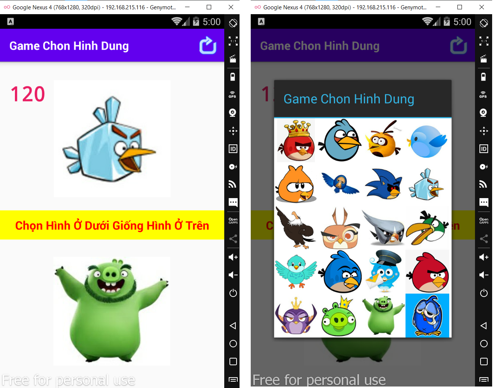

* giải thích cách hoạt động của game
  * game có 2 màn hình:
    * màn hình MainActivity: hiển thị câu hỏi, chọn câu trả lời, menu reload câu hỏi, textView hiển thị điểm số.
    * màn hình ListAnswerActivity: hiển thị danh sách các đáp án lựa chọn cho câu hỏi
  * màn hình MainActivity:
    * lấy mảng ArrayList\<String> tên của các hình từ Resource string-array XML
    * lấy id Resource của hình ảnh drawable tương ứng với từng phần tử trên trong ArrayList\<String>
    * mỗi lần re-run sẽ thay đổi câu hỏi
    * có menu button reload để thay đổi câu hỏi
    * kích hoạt ListAnswerActivity, và set lại imageView hiển thị câu trả lời từ Result nhận được ở ListAnswerActivity
    * xử lý sự kiện tương ứng với kết quả trả về: cộng điểm, trừ điểm (khi chọn sai, khi nhấn Back button)
    * khi kết quả đúng sẽ tự động reload câu hỏi sau 2 giây
  * màn hình ListAnswerActivity:
    * hiển thị dạng Activity dạng Dialog
    * sử dụng ScrollView cho TableLayout của ListAnswerActivity
    * sủ dụng for-loop để:
      * add từng imageView vào từng tableRow
      * add từng tableRow vào TableLayout
    * xử lý sự kiện khi click vào mỗi imageView và trả kết quả về cho MainActivity
    * xử lý sự kiện khi user nhấn vào button Back của hệ thống
* các điểm cần lưu ý:
  * lấy ID của hình ảnh drawable tự động từ các tham số: tên hình có trong mảng, loại resource (nhập chuỗi "drawable" chính xác), getPackageName()
    * ``int pictureOfBirdID = getResources().getIdentifier(MainActivity.arrayListNameOfBird.get(7), "drawable", getPackageName());``
    * câu lệnh trên lấy trong Resource, Identifier - ID của hình ảnh trong drawable với tên tương ứng, trong Resource drawable ở package hiện tại
  * để ListAnswerActivity hiển thị dạng Dialog
    * thiết lập theme của ListAnswerActivity có style dạng Theme.Holo.Dialog trong AndroidManifest.xml
      * ``<activity
        android:name=".ListAnswerActivity"
        android:exported="true"
        android:theme="@android:style/Theme.Holo.Dialog"> </activity>``
    * ListAnswerActivity phải extends Activity (không phải AppCompatActivity)
  * thiết lập Layout cho ImageView
```java
float dip = 75f;
Resources r = getResources();
int px = (int) TypedValue.applyDimension(
        TypedValue.COMPLEX_UNIT_DIP,
        dip,
        r.getDisplayMetrics()
);
TableRow.LayoutParams layoutParams = new TableRow.LayoutParams(px, px);
imageView.setLayoutParams(layoutParams);
```
* **AndroidManifest.xml**
```xml
<?xml version="1.0" encoding="utf-8"?>
<manifest xmlns:android="http://schemas.android.com/apk/res/android"
    xmlns:tools="http://schemas.android.com/tools"
    package="com.hienqp.gamechonhinhdung">

    <application
        android:allowBackup="true"
        android:icon="@mipmap/ic_launcher"
        android:label="@string/app_name"
        android:roundIcon="@mipmap/ic_launcher_round"
        android:supportsRtl="true"
        android:theme="@style/Theme.GameChonHinhDung">
        <activity
            android:name=".ListAnswerActivity"
            android:exported="true"
            android:theme="@android:style/Theme.Holo.Dialog"> </activity>
        <activity
            android:name=".MainActivity"
            android:exported="true">
            <intent-filter>
                <action android:name="android.intent.action.MAIN" />

                <category android:name="android.intent.category.LAUNCHER" />
            </intent-filter>
        </activity>
    </application>

</manifest>
```
* **activity_main.xml**
```xml
<?xml version="1.0" encoding="utf-8"?>
<androidx.constraintlayout.widget.ConstraintLayout xmlns:android="http://schemas.android.com/apk/res/android"
    xmlns:app="http://schemas.android.com/apk/res-auto"
    xmlns:tools="http://schemas.android.com/tools"
    android:layout_width="match_parent"
    android:layout_height="match_parent"
    tools:context=".MainActivity">

    <ImageView
        android:id="@+id/imageView_question"
        android:layout_width="200dp"
        android:layout_height="200dp"
        android:layout_marginTop="32dp"
        android:src="@drawable/b1"
        app:layout_constraintEnd_toEndOf="parent"
        app:layout_constraintStart_toStartOf="parent"
        app:layout_constraintTop_toTopOf="parent" />

    <TextView
        android:id="@+id/textView"
        android:background="#FF0"
        android:textSize="20sp"
        android:textColor="#F00"
        android:textStyle="bold"
        android:gravity="center"
        android:layout_width="match_parent"
        android:layout_height="50dp"
        android:text="Chọn Hình Ở Dưới Giống Hình Ở Trên"
        app:layout_constraintBottom_toTopOf="@+id/imageView_answer"
        app:layout_constraintEnd_toEndOf="parent"
        app:layout_constraintStart_toStartOf="parent"
        app:layout_constraintTop_toBottomOf="@+id/imageView_question" />

    <ImageView
        android:id="@+id/imageView_answer"
        android:layout_width="200dp"
        android:layout_height="200dp"
        android:layout_marginBottom="32dp"
        android:src="@drawable/question"
        app:layout_constraintBottom_toBottomOf="parent"
        app:layout_constraintEnd_toEndOf="parent"
        app:layout_constraintHorizontal_bias="0.497"
        app:layout_constraintStart_toStartOf="parent" />

    <TextView
        android:id="@+id/textView_score"
        android:layout_width="wrap_content"
        android:layout_height="wrap_content"
        android:layout_marginStart="16dp"
        android:layout_marginTop="32dp"
        android:text="100"
        android:textAllCaps="false"
        android:textColor="#E91E63"
        android:textSize="34sp"
        android:textStyle="bold"
        android:typeface="monospace"
        app:layout_constraintStart_toStartOf="parent"
        app:layout_constraintTop_toTopOf="parent" />
</androidx.constraintlayout.widget.ConstraintLayout>
```
* **MainActivity.java**
```java
package com.hienqp.gamechonhinhdung;

import androidx.annotation.NonNull;
import androidx.annotation.Nullable;
import androidx.appcompat.app.AppCompatActivity;

import android.app.Activity;
import android.content.Intent;
import android.os.Bundle;
import android.os.CountDownTimer;
import android.view.Menu;
import android.view.MenuItem;
import android.view.View;
import android.widget.ImageView;
import android.widget.TextView;
import android.widget.Toast;

import java.util.ArrayList;
import java.util.Arrays;
import java.util.Collections;

public class MainActivity extends AppCompatActivity {
    private static final int REQUEST_CODE_PICTURE = 1;

    ImageView imageViewQuestion;
    ImageView imageViewAnswer;
    TextView textViewScore;
    int totalScore = 100;
    public static ArrayList<String> arrayListNameOfBird;

    String pictureNameQuestion;

    @Override
    protected void onCreate(Bundle savedInstanceState) {
        super.onCreate(savedInstanceState);
        setContentView(R.layout.activity_main);

        imageViewQuestion = (ImageView) findViewById(R.id.imageView_question);
        imageViewAnswer = (ImageView) findViewById(R.id.imageView_answer);
        textViewScore = (TextView) findViewById(R.id.textView_score);

        textViewScore.setText(String.valueOf(totalScore));

        String[] stringsNameOfBird = getResources().getStringArray(R.array.birdList);
        arrayListNameOfBird = new ArrayList<>(Arrays.asList(stringsNameOfBird));

        refreshArrayList();

        // sự kiện click chọn đáp án ở imageViewAnswer
        imageViewAnswer.setOnClickListener(new View.OnClickListener() {
            @Override
            public void onClick(View v) {
                startActivityForResult(new Intent(MainActivity.this, ListAnswerActivity.class), MainActivity.REQUEST_CODE_PICTURE);
            }
        });
    }

    @Override
    protected void onActivityResult(int requestCode, int resultCode, @Nullable Intent data) {
        // kiểm tra các điều kiện của kết quả trả về có khớp hay không
        if (requestCode == MainActivity.REQUEST_CODE_PICTURE && resultCode == Activity.RESULT_OK && data != null) {
            String pictureNameResult = data.getStringExtra(ListAnswerActivity.KEY_PICTURE);
            int pictureIdResult = getResources().getIdentifier(pictureNameResult, "drawable", getPackageName());

            imageViewAnswer.setImageResource(pictureIdResult);
            
            // kiểm tra câu trả lời
            if (pictureNameResult.equals(pictureNameQuestion)) {
                Toast.makeText(MainActivity.this, "Chính Xác \nBạn được cộng 10 điểm", Toast.LENGTH_SHORT).show();
                totalScore += 10;
                // đổi hình câu hỏi
                new CountDownTimer(2000, 100) {
                    @Override
                    public void onTick(long millisUntilFinished) {

                    }

                    @Override
                    public void onFinish() {
                        refreshArrayList();
                    }
                }.start();
            } else {
                Toast.makeText(MainActivity.this, "Sai Rồi \nBạn bị trừ 5 điểm", Toast.LENGTH_SHORT).show();
                totalScore -= 5;
            }
            textViewScore.setText(String.valueOf(totalScore));
        }

        // nếu user nhấn vào nút BACK hệ thống mà không chọn hình bất kỳ
        if (resultCode == Activity.RESULT_CANCELED) {
            Toast.makeText(MainActivity.this, "Bạn muốn xem lại à\nBạn bị trừ 20 điểm", Toast.LENGTH_SHORT).show();
            totalScore -= 20;
            textViewScore.setText(String.valueOf(totalScore));
        }

        super.onActivityResult(requestCode, resultCode, data);
    }

    @Override
    public boolean onCreateOptionsMenu(Menu menu) {
        getMenuInflater().inflate(R.menu.reload, menu);
        return super.onCreateOptionsMenu(menu);
    }

    @Override
    public boolean onOptionsItemSelected(@NonNull MenuItem item) {
        if (item.getItemId() == R.id.menu_reload) {
            refreshArrayList();
        }
        return super.onOptionsItemSelected(item);
    }

    private void refreshArrayList() {
        // trộn mảng với Collections
        Collections.shuffle(arrayListNameOfBird);

        // lấy ID của Resource có tên chỉ định trong loại "drawable" (bắt buộc chính xác), ở Package chỉ định
        int pictureOfBirdID = getResources().getIdentifier(MainActivity.arrayListNameOfBird.get(7), "drawable", getPackageName());
        imageViewQuestion.setImageResource(pictureOfBirdID);
        pictureNameQuestion = MainActivity.arrayListNameOfBird.get(7);
    }
}
```
* **activity_list_answer.xml**
```xml
<?xml version="1.0" encoding="utf-8"?>
<androidx.constraintlayout.widget.ConstraintLayout xmlns:android="http://schemas.android.com/apk/res/android"
    xmlns:app="http://schemas.android.com/apk/res-auto"
    xmlns:tools="http://schemas.android.com/tools"
    android:layout_width="match_parent"
    android:layout_height="match_parent"
    tools:context=".ListAnswerActivity"
    android:background="#FFFFFF">

    <ScrollView
        android:layout_width="match_parent"
        android:layout_height="match_parent">
        <TableLayout
            android:gravity="center"
            android:background="#FFFFFF"
            android:id="@+id/tableLayout_list_answer"
            android:layout_width="wrap_content"
            android:layout_height="wrap_content"
            app:layout_constraintBottom_toBottomOf="parent"
            app:layout_constraintEnd_toEndOf="parent"
            app:layout_constraintHorizontal_bias="0.0"
            app:layout_constraintStart_toStartOf="parent"
            app:layout_constraintTop_toTopOf="parent"
            app:layout_constraintVertical_bias="0.0">

            <TableRow
                android:layout_width="match_parent"
                android:layout_height="match_parent" />

            <TableRow
                android:layout_width="match_parent"
                android:layout_height="match_parent" />

            <TableRow
                android:layout_width="match_parent"
                android:layout_height="match_parent" />

            <TableRow
                android:layout_width="match_parent"
                android:layout_height="match_parent" />
        </TableLayout>
    </ScrollView>


</androidx.constraintlayout.widget.ConstraintLayout>
```
* **ListAnswerActivity.java**
```java
package com.hienqp.gamechonhinhdung;


import android.app.Activity;
import android.content.Intent;
import android.content.res.Resources;
import android.os.Bundle;
import android.util.TypedValue;
import android.view.View;
import android.widget.ImageView;
import android.widget.TableLayout;
import android.widget.TableRow;

import java.util.Collections;

public class ListAnswerActivity extends Activity {
    public static final String KEY_PICTURE = "KEY_PICTURE";

    TableLayout tableLayoutListAnswer;

    @Override
    protected void onCreate(Bundle savedInstanceState) {
        super.onCreate(savedInstanceState);
        setContentView(R.layout.activity_list_answer);

        tableLayoutListAnswer = (TableLayout) findViewById(R.id.tableLayout_list_answer);

        int row = 5;
        int column = 4;
        int position = -1;

        Collections.shuffle(MainActivity.arrayListNameOfBird);

        // tạo dòng và cột
        for (int i = 1; i <= row; i++) {
            TableRow tableRow = new TableRow(ListAnswerActivity.this);

            // tạo cột
            for (int j = 1; j <= column; j++) {
                ImageView imageView = new ImageView(ListAnswerActivity.this);

                // thiết lập Layout cho ImageView
                // Converts 14 dip into its equivalent px
                float dip = 75f;
                Resources r = getResources();
                int px = (int) TypedValue.applyDimension(
                        TypedValue.COMPLEX_UNIT_DIP,
                        dip,
                        r.getDisplayMetrics()
                );
                TableRow.LayoutParams layoutParams = new TableRow.LayoutParams(px, px);
                imageView.setLayoutParams(layoutParams);

                // lấy hình ảnh và gán vào ImageView
                position++;
                if (MainActivity.arrayListNameOfBird.get(position) != null) {
                    int pictureOfBirdID = getResources().getIdentifier(MainActivity.arrayListNameOfBird.get(position), "drawable", getPackageName());
                    imageView.setImageResource(pictureOfBirdID);
                }

                // gắn imageView vào tableRow
                tableRow.addView(imageView);

                // gắn sự kiện click cho imageView
                final int finalPosition = position; // vị trí cố định của imageView chỉ định
                imageView.setOnClickListener(new View.OnClickListener() {
                    @Override
                    public void onClick(View v) {
//                        Toast.makeText(ListAnswerActivity.this, MainActivity.arrayListNameOfBird.get(finalPosition), Toast.LENGTH_SHORT).show();
                        Intent data = new Intent();
                        data.putExtra(ListAnswerActivity.KEY_PICTURE, MainActivity.arrayListNameOfBird.get(finalPosition));
                        setResult(Activity.RESULT_OK, data);
                        finish();
                    }
                });
            }

            // add tableRow vào tableLayoutListAnswer
            tableLayoutListAnswer.addView(tableRow);
        }
    }

    @Override
    public void onBackPressed() {
        setResult(Activity.RESULT_CANCELED);
        super.onBackPressed();
    }
}
```
* **strings.xml**
```xml
<resources>
    <string name="app_name">Game Chon Hinh Dung</string>

    <string-array name="birdList">
        <item>b1</item>
        <item>b2</item>
        <item>b3</item>
        <item>b4</item>
        <item>b5</item>
        <item>b6</item>
        <item>b7</item>
        <item>b8</item>
        <item>b9</item>
        <item>b10</item>
        <item>b11</item>
        <item>b12</item>
        <item>b13</item>
        <item>b14</item>
        <item>b15</item>
        <item>b16</item>
        <item>b17</item>
        <item>b18</item>
        <item>b19</item>
        <item>b20</item>
    </string-array>
</resources>
```
* **reload.xml**
```xml
<?xml version="1.0" encoding="utf-8"?>
<menu xmlns:android="http://schemas.android.com/apk/res/android"
    xmlns:app="http://schemas.android.com/apk/res-auto">
    <item
        android:id="@+id/menu_reload"
        android:icon="@drawable/reload_ic"
        android:title="Reload"
        app:showAsAction="always|withText" />
</menu>
```


______________________________________________________________________________________
______________________________________________________________________________________
______________________________________________________________________________________
# 22. Back Stack - Ngăn Xếp Thu Hồi <a id="22"></a>
______________________________________________________________________________________
* Back Stack được hệ thống dùng để quản lý việc hiển thị các Activity
* dẫn nhập: 
  * các màn hình bên trong một ứng dụng Android sẽ luân phiên hiển thị ra như thế nào
  * Một màn hình hiển thị ra thì màn hình kia đi về đâu, có bị xóa khỏi hệ thống không
  * Tại sao nhấn nút Back ở System Bar lại giúp quay về màn hình trước trong khi chúng ta chẳng có code gì chỗ này cả
  * nhấn nhiều nút Back thì sẽ đi đến đâu

## 22.1. Back, Home Và Overview <a id="22.1"></a>
______________________________________________________________________________________
* Back, Home và Overview là 3 nút điều hướng nằm ở NavigationBar.

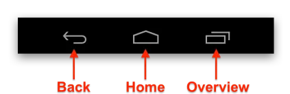

* Back: 
  * có chức năng đóng Activity hiện tại và trở về Activity trước đó
  * nếu không còn Activity nào để trở lại, thì vẫn đóng Activity hiện tại và trở về màn hình chính
  * việc dùng nút Back trở lại màn hình chính sẽ không hoàn toàn tắt ứng dụng
    * ứng dụng sẽ sống 1 khoảng thời gian, nếu người dùng muốn quay lại sử dụng có thể dùng ngay mà không cần khởi chạy lại từ đầu
    * nếu vượt quá giới hạn thời gian cho phép, ứng dụng lúc này mới tắt hoàn toàn
* Home:
  * có chức năng lập tức trở lại màn hình chính từ bất kỳ Activity nào trong ứng dụng
  * nó không làm tắt ứng dụng, hay Activity hiện tại mà sẽ đưa vào Background và đợi ở đó

## 22.2. Task Là Gì <a id="22.2"></a>
______________________________________________________________________________________
* Task là tác vụ, nhiệm vụ, công việc.
* mỗi ứng dụng trong Android khi được khởi chay sẽ được hệ thống Android xem như là 1 Task.
* cách thức hệ thống làm việc với Task
  * khi user khởi chạy 1 ứng dụng từ icon của màn hình chính, hay từ danh sách các Task được mở khi nhấn vào nút Overview
  * hệ thống sẽ kiểm tra Task hiện tại của ứng dụng có tồn tại không:
    * nếu chưa có: hệ thống sẽ tạo mới 1 Task cho ứng dụng đó
    * nếu đã có: nghĩa là Task của ứng dụng đang chạy, nhưng ứng dụng bị đưa vào Background do nhấn vào nút Home
      * hệ thống sẽ kiểm tra Task đang chạy của ứng dụng tìm vài thông tin, trong đó có thông tin về Activity mà Task đó 
      đang hiển thị, để tiếp tục hiển thị lại Activity lúc Task bị đưa vào Background
      
* trong Task của mỗi ứng dụng sẽ chứa đựng thông tin về Back Stack, chính Back Stack sẽ nói cho hệ thống biết nên hiển
thị Activity nào của ứng dụng

## 22.3. Back Stack Là Gì <a id="22.3"></a>
______________________________________________________________________________________
* Back Stack là nơi lưu trữ các Activity theo kiểu LIFO (vào sau ra trước).
* 1 ứng dụng khi được khởi chạy thì Task của ứng dụng đó sẽ được tạo, và Task đó chứa 1 vài thông tin trong đó có Back Stack
* Back Stack sẽ chứa danh sách các Activity được kích hoạt theo tuần tự kích hoạt.
* Activity được đưa vào Back Stack gần nhất sẽ là Activity hiển thị lên màn hình ứng dụng.
* Activity bị hủy sẽ bị xóa khỏi Back Stack và màn hình ứng dụng sẽ hiển thị Activity trước Activity bị hủy.
* đến khi không còn Activity nào trong Back Stack có nghĩa là ứng dụng đã bị tắt hoàn toàn và không còn Activity nào hiển thị được nữa.

### 22.3.1. Ví dụ về Back Stack với TourNote <a id="22.3.1"></a>
______________________________________________________________________________________
* khi TourNote được khởi chạy, hệ thống sẽ tạo Task cho TourNote, trong Task này có Back Stack, Back Stack sẽ thêm Activity
launcher (MainActivity) của TourNote vào.

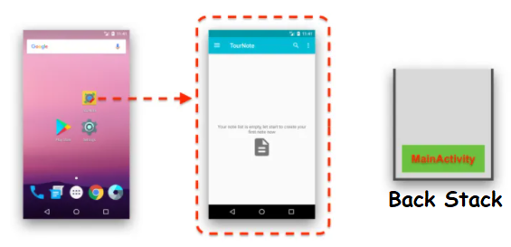

* từ MainActivity kích hoạt ContactActivity, việc kích hoạt này sẽ đặt thêm ContactActivity vào Back Stack lên trên MainActivity
trong Back Stack, lúc này MainActivity được đưa vào Background (không hiển thị nhưng cũng không bị hủy), còn ContactActivity
sẽ được hiển thị lên màn hình ứng dụng vì nó nằm trên cùng trong Back Stack.

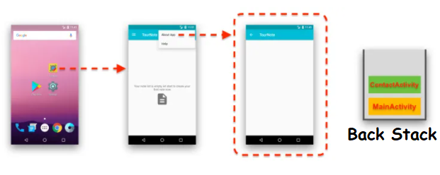

#### Tình Huống Back Stack Với Nút Back
* với tình huống ứng dụng đang ở ContactActivity như trên.
* nếu user nhấn nút Back (finish() được gọi), ContactActivity sẽ bị xóa khỏi Back Stack, ContactActivity trong ứng dụng sẽ bị hủy.
* trong Back Stack lúc này Activity phía dưới sẽ là MainActivity là Activity nằm trên cùng trong Back Stack, và MainActivity sẽ được
kích hoạt và hiển thị (được đưa trở lại từ Background).

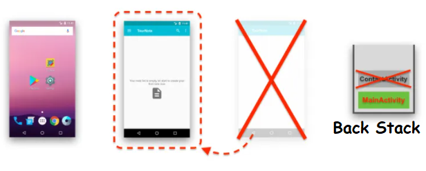

* nếu user nhấn nút Back lần nữa, MainActivity trong Back Stack sẽ bị xóa, và vì MainActivity là Activity cuối cùng trong Back Stack,
không còn Activity nào để chỉ định hiển thị lên màn hình ứng dụng, lúc này xem như ứng dụng đã bị tắt, màn hình chính của điện thoại
sẽ được hiển thị.

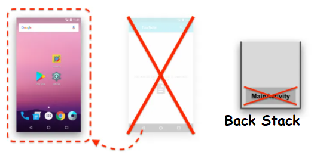

#### Tình Huống Back Stack Với Nút Home
* với tình huống ứng dụng đang ở ContactActivity như trên.
* nếu user nhấn nút Home thì không có Activity nào bị xóa khỏi Back Stack.
* thông tin của Task TourNote trong đó có Back Stack sẽ được giữ lại, nhưng tất cả sẽ được đưa về Background để đợi.
* Task TourNote được đưa về Background và nhường chỗ cho Task khác chính là Task màn hình chính.

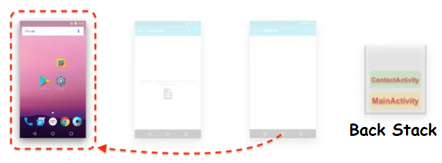

* nếu user kích hoạt lại Task TourNote, nếu Task TourNote chưa bị xóa (Task có thể bị xóa nếu ở Background quá lâu, hoặc chiếm
dụng tài nguyên hệ thống như Ram, hoặc bị xóa do chính user xóa trong danh sách Tash khi nhấn vào nút Overview).
* thì hệ thống sẽ kiểm tra Back Stack của Task, xem Activity nào đang nằm trên cùng, thì Activity đó sẽ được hiển thị lên màn hình ứng dụng

### 22.3.2. Những Khả Năng Của Back Stack <a id="22.3.2"></a>
______________________________________________________________________________________
* chúng ta có thể đặt mọi Activity vào Back Stack
* 1 Activity có thể được đặt nhiều lần vào Back Stack, từ lần thứ 2 trở đi là bản copy của Activity
* ví dụ: ở MainActivity -> kích hoạt ContactActivity -> (không finish() ContactActivity) kích hoạt MainActivity (bản copy)
* tuy nhiên việc đặt quá nhiều bản sao của Activity sẽ khiến ứng dụng bị rối, user sẽ khó sử dụng

______________________________________________________________________________________
______________________________________________________________________________________
______________________________________________________________________________________
# 23. Vòng Đời Activity <a id="23"></a>
______________________________________________________________________________________
## 23.1. Vòng Đời Activity Là Gì <a id="23.1"></a>
______________________________________________________________________________________
* vòng đời Activity là quá trình 1 Activity từ lúc được tạo (creating), trải qua các trạng thái như dừng (stopping), tiếp
tục (resuming),... cho đến khi bị hủy (destroying).
* ví dụ 1 Activity đang phát video, user đột ngột chuyển sang màn hình (Activity) khác, hoặc ứng dụng khác, hoặc có cuộc
gọi đến, thì Activity đang phát video đó phải biết lắng nghe các trạng thái:
  * phải biết và lưu lại mọi trạng thái của nó, bao gồm cả đoạn video đang xem dang dở.
  * các tài nguyên hệ thống nếu có phải được giải phóng tạm thời.
  * nếu user quay trở lại xem video, họ sẽ tiếp tục xem tiếp video chứ không bị reset lại từ đầu.

## 23.2. Sơ Đồ Minh Họa Vòng Đời Activity <a id="23.2"></a>
______________________________________________________________________________________
* sơ đồ minh họa đầy đủ và rõ ràng về vòng đời của 1 Activity

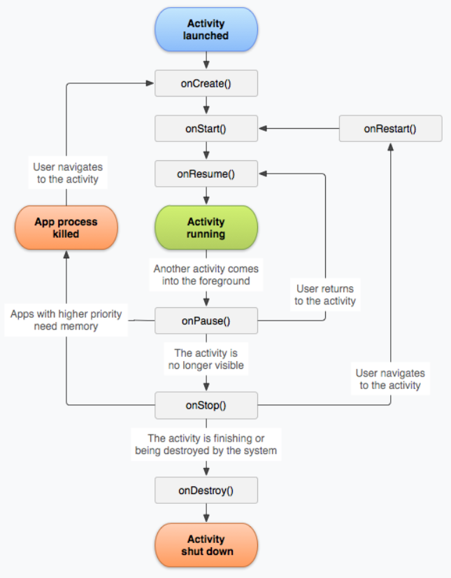

* các phương thức được mô tả trong sơ đồ, chính là các ``callback`` hay các lời gọi về:
  * onCreate()
  * onStart()
  * onRestart()
  * onResume()
  * onPause()
  * onStop()
  * onDestroy()
* các callback trên chính là các phương thức override từ các phương thức sẵn của lớp cha, để khi hệ thống cần, hệ thống
sẽ gọi đến các phương thức đó trong ứng dụng.

### 23.2.1. Mô Tả Sơ Đồ Vòng Đời Activity <a id="23.2.1"></a>
______________________________________________________________________________________
* Sơ đồ bắt đầu từ khi Activity launched, tức là khi Activity được kích hoạt, và được hệ thống để vào BackStack.
  * Sau khi kích hoạt, lần lượt các callback ``onCreate()``, ``onStart()``, ``onResume()`` sẽ được hệ thống gọi đến.
  * Sau khi gọi đến các callback trên, thì Activity mới chính thức được xem là đang chạy (Activity running).
* sau khi Activity running tiếp diễn theo trình tự sau:
  * nếu có bất kỳ Activity nào khác chiếm quyền hiển thị, tức là đang bị Activity khác đè lên, thì Activity hiện tại sẽ rơi vào trạng thái ``onPause()``.
  * tiếp tục nếu Activity khác hiển thị mà làm cho Activity đang running không còn nhìn thấy nữa thì ``onStop()`` sẽ được gọi tiếp theo nữa. 
* Nếu Acvitity đã vào ``onPause()`` rồi, tức là đang bị Activity khác đè lên, mà người dùng sau đó quay về lại Activity cũ, thì ``onResume()`` được gọi. 
* Còn nếu Activity đã vào ``onStop()`` rồi, mà user quay về lại Activity thì ``onRestart()`` được gọi.
* trong cả hai trường hợp Activity rơi vào ``onPause()`` hoặc ``onStop()`` quá lâu, nó sẽ rất dễ bị hệ thống thu hồi 
(tức là hủy luôn) để giải phóng tài nguyên, khi này nếu quay lại Activity cũ, ``onCreate()`` sẽ được gọi chứ không phải ``onResume()`` hay ``onRestart()``.
* Và cuối cùng, nếu một Activity bị hủy một cách có chủ đích, chẳng hạn như người dùng nhấn nút Back ở System Bar, 
hay hàm **finish()** gọi,… thì ``onDestroy()`` sẽ được kích hoạt và Activity kết thúc vòng đời của nó.

### 23.2.2. Các Trạng Thái Chính Trong Vòng Đời Activity <a id="23.2.2"></a>
______________________________________________________________________________________
#### Hoạt Động (Active)
______________________________________________________________________________________
* Khi Activity được kích hoạt, và được hệ thống để vào BackStack, nó sẽ bước vào trạng thái active. 
* Với trạng thái active, người dùng hoàn toàn có thể nhìn thấy và tương tác với Activity của ứng dụng.

#### Tạm Dừng (Pause)
______________________________________________________________________________________
* Trạng thái tạm dừng xảy ra khi mà Activity vẫn đang chạy, user vẫn nhìn thấy, nhưng Activity khi này lại bị che một phần bởi một thành phần nào đó. 
  * Chẳng hạn như khi bị một dialog đè lên .
* cái sự che Activity này không phải hoàn toàn. Chính vì vậy mà Activity tuy được user nhìn thấy nhưng không tương tác được.

#### Dừng (Stop)
______________________________________________________________________________________
* Activity bị che khuất hoàn toàn bởi một thành phần giao diện nào đó, hoặc bởi một ứng dụng khác. 
* Và tất nhiên lúc này user không thể nhìn thấy Activity đó được nữa.
* Hành động mà khi user nhấn nút Home ở System Bar để đưa ứng dụng của bạn về background, 
cũng khiến Activity đang hiển thị trong ứng dụng rơi vào trạng thái dừng này.

#### Chết (Dead)
______________________________________________________________________________________
* Nếu Activity được lấy ra khỏi BackStack, chúng sẽ bị hủy và vào trạng thái này. 
  * xảy ra khi user nhấn nút Back ở System Bar để thoát một Activity. 
  * Hoặc lời gọi hàm finish() từ một Activity để “giết chính nó”. 
  * Cũng có khi ứng dụng ở trạng thái background quá lâu, hệ thống có thể sẽ thu hồi tài nguyên bằng cách dừng hẳn các Activity trong ứng dụng, 
  làm cho tất cả các Activity đều vào trạng thái này.

* Khi vào trạng thái dead, Activity sẽ kết thúc vòng đời của nó.

### 23.2.3. Làm Quen Với Các Callback <a id="23.2.3"></a>
______________________________________________________________________________________
* Sau đây là tất cả các callback nên biết.
* không nhất thiết phải hiện thực cho tất cả các callback này trong 1 Activity. Chỉ cần dùng đủ thôi.

#### 1 - onCreate()
______________________________________________________________________________________
* ``onCreate()``  là **callback tối thiểu** trong một Activity phải thực hiện.
* Callback ``onCreate()`` được gọi khá sớm, ngay khi Activity được kích hoạt, và thậm chí user còn chưa nhìn thấy gì 
của Activity cả, thì callback này đã được gọi rồi. 
* callback này chỉ được **gọi một lần duy nhất** khi Activity được khởi tạo. 
* Nó có thể được gọi lại nếu:
  * thống xóa Activity này đi để lấy lại tài nguyên của hệ thống, nhưng rất hiếm khi xảy ra. 
  * khi user xoay màn hình ngang/dọc.
* Do đặc tính được gọi khá sớm và chỉ được gọi một lần duy nhất trong vòng đời của nó như vậy.
  * nên nó sẽ được tận dụng để load giao diện cho Activity ở giai đoạn này, thông qua phương thức setContentView(). 
  * Ngoài giao diện ra, có thể khởi tạo các logic nào đó chỉ chạy một lần ban đầu, như :
    * các lời gọi API
    * load database
    * tạo item list
    * tạo Navigation Drawer
    * và nhiều logic khác
* Tham số ``savedInstanceState`` được truyền vào ``onCreate()`` sẽ được mình nói đến ở bài viết về lưu trữ trong Android sau nhé.

#### 2 - onStart()
______________________________________________________________________________________
* sau khi gọi đến ``onCreate()``, hệ thống sẽ gọi đến ``onStart()``. 
* Hoặc hệ thống cũng sẽ gọi lại ``onStart()`` sau khi gọi ``onRestart()`` nếu trước đó nó bị che khuất bởi Activity nào 
khác (một màn hình khác hoặc một ứng dụng khác) che hoàn toàn và rơi vào ``onStop()``.
* Khi hệ thống gọi đến callback này thì Activity chuẩn bị (có nghĩa là chưa) được nhìn thấy và tương tác với người dùng. 
Bởi đặc tính này mà ``onStart()`` ít được dùng đến.

#### 3 - onResume()
______________________________________________________________________________________
* Khi hệ thống gọi đến callback này thì người dùng sẽ nhìn thấy và đã tương tác được với giao diện.
* ``onResume()`` được gọi khi 
  * Activity được khởi tạo rồi và bước qua ``onStart()``. 
  * Hoặc khi Activity bị một giao diện nào khác che đi một phần (hoặc toàn phần), rồi sau đó quay lại Activity hiện tại. 
* có thể thấy rằng callback này được gọi rất nhiều lần trong một vòng đời của nó.
* Chính đặc điểm gọi nhiều lần này của ``onResume()`` mà ta có thể tận dụng để quay lại tác vụ mà người dùng đang bị 
dang dở khi ``onPause()`` được gọi.
* Chẳng hạn như user đang soạn nội dung cho TourNote
  * có cuộc gọi đến, 
  * ta sẽ lưu tạm nội dung này khi callback onPause(), 
  * để rồi khi onResume() được gọi lại sau đó, khi người dùng kết thúc cuộc gọi và quay lại TourNote, 
  * ta sẽ khôi phục nội dung đó để người dùng tiếp tục sử dụng TourNote như chưa có bất kỳ gián đoạn nào.

#### 4 - onPause()
______________________________________________________________________________________
* Thông thường nếu có một thành phần nào đó che Activity hiện tại mà user vẫn nhìn thấy Activity đó 
(nhìn thấy chứ không tương tác được). Chẳng hạn một popup hiện lên trên Activity. Thì ``onPause()`` của Activity sẽ được gọi.
* Sau này khi user quay lại Activity thì ``onResume()`` sẽ được gọi.
* có thể thấy rằng ``onPause()`` cũng sẽ được gọi khá nhiều lần trong một vòng đời Activity. 
* Theo như Google thì ``onPause()`` được gọi đến khá nhanh, nếu ta muốn lưu trữ dữ liệu như mình nói trên kia, thì nên lưu những gì nhanh gọn lẹ thôi. 
* Nếu ta muốn lưu trữ các dữ liệu nặng, hoặc gọi API kết nối server chỗ này, nhiều khả năng ứng dụng sẽ không kịp thực hiện. 
* Do đó, thay vì làm các thao tác nặng nề ở ``onPause()``, ta có thể cân nhắc gọi chúng ở ``onStop()``.

#### 5 - onStop()
______________________________________________________________________________________
* ``onStop()`` được gọi khi Activity không còn được nhìn thấy nữa
  * có thể một màn hình nào khác che lên hoàn toàn
  * có thể một ứng dụng nào đó vào foreground
  * hoặc user nhấn nút Home để về màn hình chính
* có thể tận dụng ``onStop()`` 
  * để lưu trữ dữ liệu ứng dụng. 
  * Hoặc để giải phóng các tài nguyên đang dùng. 
  * Ngưng các API còn đang gọi dang dở.
* Tuy nhiên khi ``onStop()`` được gọi không phải là lúc kết thúc Activity. 
* từ trạng thái ``onStop()`` user hoàn toàn có thể quay lại sử dụng Activity sau đó mà không cần phải khởi động lại Activity, 
khi này thì phương thức ``onRestart()``, ``onStart()``, ``onResume()`` được gọi kế tiếp nhau.

#### 6 - onRestart()
______________________________________________________________________________________
* nếu Activity rơi vào trạng thái ``onStop()`` vì bất cứ lý do gì, user vẫn có thể quay trở lại Activity để tiếp tục sử dụng, 
mà không cần phải khởi chạy lại ứng dụng, lúc này ``onRestart()`` được gọi, sau khi ``onRestart()`` được gọi ngay lập tức
``onStart()`` cũng được gọi.

#### 7 - onDestroy()
______________________________________________________________________________________
* Trước khi Activity “chết”, hệ thống sẽ gọi đến callback ``onDestroy()`` này của Activity.
* có thể tận dụng callback này để giải phóng các tài nguyên hệ thống mà ở ``onStop()`` ta chưa gọi đến.
* vòng đời của Activity kết thúc ở đây.

## 23.3. Thực Hành Tìm Hiểu Vòng Đời Của MainActivity <a id="23.3"></a>
______________________________________________________________________________________
* để hiểu rõ và hình dung được cách 1 Activity trải qua các trạng thái của nó từ lúc ``onCreate()`` đến ``onDestroy()``.
* tiến hành override tất cả các callback của 1 Activity vào MainActivity của TourNote.
* ở mỗi callback thực hiện in ra log để biểu diễn Activity đang ở trạng thái nào của vòng đời.
* sau đó run ứng dụng, thực hiện các thao tác:
  * chuyển sang ContactActivity
  * quay trở lại MainActivity
  * nhấn nút Home từ MainActivity
  * mở lại ứng dụng từ Task List khi nhấn Overview
  * nhấn nút Back từ MainActivity
* đồng thời kiểm tra Log.d được hiển thị trong logcat monitor với TAG là "MainActivity Lifecycle"
```java
package com.hienqp.tourbook;

import androidx.annotation.NonNull;
import androidx.annotation.Nullable;
import androidx.appcompat.app.ActionBarDrawerToggle;
import androidx.appcompat.app.AppCompatActivity;
import androidx.drawerlayout.widget.DrawerLayout;

import android.content.Intent;
import android.content.res.Configuration;
import android.graphics.Color;
import android.graphics.drawable.StateListDrawable;
import android.os.Bundle;
import android.text.Html;
import android.text.SpannableString;
import android.text.method.LinkMovementMethod;
import android.text.style.ClickableSpan;
import android.text.style.ForegroundColorSpan;
import android.text.style.RelativeSizeSpan;
import android.text.style.URLSpan;
import android.util.Log;
import android.view.Menu;
import android.view.MenuItem;
import android.view.View;
import android.widget.Button;
import android.widget.CheckBox;
import android.widget.CompoundButton;
import android.widget.ImageView;
import android.widget.TextView;
import android.widget.Toast;

import java.text.SimpleDateFormat;
import java.util.Calendar;

public class MainActivity extends AppCompatActivity {
    // TAG log
    private static final String TAG = "MainActivity Lifecycle";

    // Khai Báo DrawerLayout
    private DrawerLayout drawerLayout;
    // Khai Báo ActionBarDrawerToggle
    private ActionBarDrawerToggle actionBarDrawerToggle;

    @Override
    protected void onCreate(Bundle savedInstanceState) {
        super.onCreate(savedInstanceState);
        setContentView(R.layout.activity_main);

        // Ánh Xạ đến ID của DrawerLayout trong XML
        drawerLayout = (DrawerLayout) findViewById(R.id.activity_main_drawer);

        // Khởi tạo ActionBarDrawerToggle
        actionBarDrawerToggle = new ActionBarDrawerToggle(
                MainActivity.this,
                drawerLayout ,
                R.string.navigation_drawer_open,
                R.string.navigation_drawer_close);

        // gắn ActionBarDrawerToggle vào DrawerLayout
        drawerLayout.addDrawerListener(actionBarDrawerToggle);

        // hiển thị nút Home trên ActionBar
        getSupportActionBar().setDisplayHomeAsUpEnabled(true);
        // cho phép tương tác nút Home trên ActionBar
        getSupportActionBar().setHomeButtonEnabled(true);

        Log.d(TAG, "===== onCreate =====");
    }

    @Override
    protected void onStart() {
        super.onStart();

        Log.d(TAG, "===== onStart =====");
    }

    @Override
    protected void onResume() {
        super.onResume();

        Log.d(TAG, "===== onResume =====");
    }

    @Override
    protected void onPause() {
        super.onPause();

        Log.d(TAG, "===== onPause =====");
    }

    @Override
    protected void onStop() {
        super.onStop();

        Log.d(TAG, "===== onStop =====");
    }

    @Override
    protected void onRestart() {
        super.onRestart();

        Log.d(TAG, "===== onRestart =====");
    }

    @Override
    protected void onDestroy() {
        super.onDestroy();

        Log.d(TAG, "===== onDestroy =====");
    }

    @Override
    protected void onPostCreate(@Nullable Bundle savedInstanceState) {
        super.onPostCreate(savedInstanceState);
        // Sync the toggle state after onRestoreInstanceState has occurred.
        actionBarDrawerToggle.syncState();
    }

    @Override
    public void onConfigurationChanged(@NonNull Configuration newConfig) {
        super.onConfigurationChanged(newConfig);
        actionBarDrawerToggle.onConfigurationChanged(newConfig);
    }

    @Override
    public boolean onCreateOptionsMenu(Menu menu) {
        getMenuInflater().inflate(R.menu.main_actions, menu);
        return super.onCreateOptionsMenu(menu);
    }

    @Override
    public boolean onOptionsItemSelected(@NonNull MenuItem item) {
        if (actionBarDrawerToggle.onOptionsItemSelected(item)) {
            return true;
        }
        switch (item.getItemId()) {
            case R.id.search:
                Toast.makeText(this, "Search button is selected", Toast.LENGTH_SHORT).show();
                return true;
            case R.id.about:
                Intent intent = new Intent(MainActivity.this, ContactActivity.class);
                startActivity(intent);
                return true;
            case R.id.help:
                intent = new Intent(MainActivity.this, ContactActivity.class);
                startActivity(intent);
                return true;
        }

        return super.onOptionsItemSelected(item);
    }
}
```

## 23.4. 1 ví dụ khác về Lifecycle của Activity <a id="23.4"></a>
______________________________________________________________________________________
* giả sử có 2 Activity (MainActivity.java, SecondActivity.java)
* dùng Intent để kích hoạt lẫn nhau giữa các Activity thông qua sự kiện click vào Button trên màn hình
* mỗi Activity đều override các phương thức trạng thái lifecylce của Activity
* sử dụng Log.d(String, String) để kiểm tra ứng dụng đang ở trạng thái nào, Activity nào thông qua các thao tác chuyển
màn hình đối với ứng dụng.
______________________________________________________________________________________
* MainActivity.java
```java
package com.hienqp.activitylifecycle;

import androidx.appcompat.app.AppCompatActivity;

import android.content.Intent;
import android.os.Bundle;
import android.util.Log;
import android.view.View;
import android.widget.Button;

public class MainActivity extends AppCompatActivity {
    Button buttonMainActivity;

    @Override
    protected void onCreate(Bundle savedInstanceState) {
        super.onCreate(savedInstanceState);
        setContentView(R.layout.activity_main);

        buttonMainActivity = (Button) findViewById(R.id.button_activity_main);
        buttonMainActivity.setOnClickListener(new View.OnClickListener() {
            @Override
            public void onClick(View v) {
                Intent intent = new Intent(MainActivity.this, SecondActivity.class);
                startActivity(intent);
            }
        });

        Log.d("TAG", "onCreate: Main");
    }

    @Override
    protected void onStart() {
        super.onStart();

        Log.d("TAG", "onStart: Main");
    }

    @Override
    protected void onResume() {
        super.onResume();

        Log.d("TAG", "onResume: Main");
    }

    @Override
    protected void onPause() {
        super.onPause();

        Log.d("TAG", "onPause: Main");
    }

    @Override
    protected void onStop() {
        super.onStop();

        Log.d("TAG", "onStop: Main");
    }

    @Override
    protected void onRestart() {
        super.onRestart();

        Log.d("TAG", "onRestart: Main");
    }

    @Override
    protected void onDestroy() {
        super.onDestroy();

        Log.d("TAG", "onDestroy: Main");
    }
}
```
______________________________________________________________________________________
* SecondActivity.java
```java
package com.hienqp.activitylifecycle;

import androidx.appcompat.app.AppCompatActivity;

import android.content.Intent;
import android.os.Bundle;
import android.util.Log;
import android.view.View;
import android.widget.Button;

public class SecondActivity extends AppCompatActivity {
    Button buttonSecondActivity;

    @Override
    protected void onCreate(Bundle savedInstanceState) {
        super.onCreate(savedInstanceState);
        setContentView(R.layout.activity_second);

        buttonSecondActivity = (Button) findViewById(R.id.button_activity_second);
        buttonSecondActivity.setOnClickListener(new View.OnClickListener() {
            @Override
            public void onClick(View v) {
                Intent intent = new Intent(SecondActivity.this, MainActivity.class);
                startActivity(intent);
            }
        });

        Log.d("TAG", "onCreate: Second");
    }

    @Override
    protected void onStart() {
        super.onStart();

        Log.d("TAG", "onStart: Second");
    }

    @Override
    protected void onResume() {
        super.onResume();

        Log.d("TAG", "onResume: Second");
    }

    @Override
    protected void onPause() {
        super.onPause();

        Log.d("TAG", "onPause: Second");
    }

    @Override
    protected void onStop() {
        super.onStop();

        Log.d("TAG", "onStop: Second");
    }

    @Override
    protected void onRestart() {
        super.onRestart();

        Log.d("TAG", "onRestart: Second");
    }

    @Override
    protected void onDestroy() {
        super.onDestroy();

        Log.d("TAG", "onDestroy: Second");
    }
}
```

______________________________________________________________________________________
______________________________________________________________________________________
______________________________________________________________________________________
# 24. Truyền Dữ Liệu Qua Lại Giữa Các Activity <a id="24"></a>
______________________________________________________________________________________
## 24.1. Tại Sao Phải Truyền Dữ Liệu Qua Lại Giữa Các Activity <a id="24.1"></a>
______________________________________________________________________________________
* các Activity đều tồn tại độc lập và có vòng đời riêng của nó từ lúc được tạo đến lúc bị hủy.
* nhưng trong 1 ứng dụng, dữ liệu của các Activity có thể được sử dụng lẫn nhau.
* do đó cần phải có cơ chế để các Activity truyền dữ liệu cho nhau, để ứng dụng có thể hoàn thiện chức năng của mình.
* ví dụ ta có 1 ứng dụng email:
  * có ListActivity hiển thị danh sách các email.
  * có DetailActivity hiển thị chi tiết nội dung của 1 email cụ thể trong ListActivity.
  * giả sử ở ListActivity, user nhấn vào 1 email, ngay lập tức nội dung chi tiết của email đó phải được hiển thị lên DetailActivity.
  * lúc đó ListActivity đã truyền thông tin của item email được chọn đo cho DetailActivity, DetailActivity sẽ hiện thị nội dung chi tiết
  của email tương ứng.
  * nếu user đọc xong email, tiến hành xóa email đang đọc, khi này ứng dụng sẽ quay ListActivity.
  * khi user xóa email, đồng thời DetailActivity cũng sẽ truyền thông tin email này đã được xóa cho ListActivity.
  * và khi quay lại ListActivity, email đã bị xóa bên DetailActivity sẽ không có nằm trong danh sách của ListActivity.

## 24.2. Cách Truyền Dữ Liệu Qua Lại Giữa Các Activity <a id="24.2"></a>
______________________________________________________________________________________
* để có thể truyền dữ liệu giữa các Activity ta phải dùng đến Intent.
* ta sẽ đưa dữ liệu vào Intent, và yêu cầu thành phần này chuyển dữ liệu đi.
* dùng Intent để truyền dữ liệu, hệ thống sẽ đảm bảo dữ liệu được gửi qua nguyên vẹn và kịp thởi ở Activity mới.

>như vậy Intent ngoài việc dùng để kích hoạt 1 Activity, nó còn có nhiệm vụ truyền dữ liệu giữa các Activity.

>không nên dùng thuộc tính static để truyền dữ liệu giữa các Activity, static chỉ nên được sử dụng để:
> >làm hằng số
> 
> >làm các giá trị dùng chung

## 24.3. Hình Thức Truyền Dữ Liệu Được Sử Dụng Trong Intent <a id="24.3"></a>
______________________________________________________________________________________
* để truyền dữ liệu qua lại giữa các Activity, ta sẽ đưa dữ liệu cho Intent, và yêu cầu Intent chuyển đi.
* dữ liệu đưa vào và lấy ra khỏi Intent sẽ được tổ chức theo kiểu các cặp ``key/value``.
* ``key``: là 1 chuỗi dùng để định danh và xác định ``value`` theo ``key``.
* ``value``: là dữ liệu tương ứng với ``key`` được đưa vào Intent.
* khi đưa vào Intent cặp ``key/value`` thì khi lấy ra phải đúng ``key`` và đúng kiểu dữ liệu của ``value``.
* tuy chỉ có 1 cách truyền dữ liệu là dùng Intent, nhưng lại có 2 hình thức sử dụng:
  * Extra
  * Bundle

### 24.3.1. Dùng Extra <a id="24.3.1"></a>
______________________________________________________________________________________
* đây là hình thức dễ nhất dùng để truyền và nhận dữ liệu với Intent.

#### Gửi Dữ Liệu
______________________________________________________________________________________
* để sử dụng hình thức Extra gửi dữ liệu thông qua Intent, ta thực hiện các bước sau:
  * khai báo Intent với Activity hiện tại và Activity cần kích hoạt.
  * sử dụng các phương thức overloading ``putExtra(key, value)`` để đặt dữ liệu vào Intent.
    * ``key``: là chuỗi định danh cho value tương ứng
    * ``value``: là giá trị cần chuyển đi tương ứng với key
  * sau khi hoàn tất đặt dữ liệu vào Intent, ta có thể kích hoạt Activity mới với ``startActivity(Intent);``
* có rất nhiều phương thức ``putExtra(key, value)``, chúng được nạp chồng để có thể gửi nhiều loại dữ liệu khác nhau.
* phương thức ``putExtra(key, value)`` dùng trong hình thức Extra không có ký tự **'s'** sau Extra.
* trong các phương thức ``putExtra()``, có 1 phương thức được dùng để gửi dữ liệu có giá trị kiểu
  * Parcelable
  * Serializable <br/>
  2 kiểu này sẽ tìm hiểu sau, vì tính phức tạp của chúng
* ví dụ gửi dữ liệu bằng Intent với hình thức Extra từ Activity nguồn.
```java
Intent intent = new Intent(this, ContactActivity.class);
        intent.putExtra("Key_1", "Truyền một String");  // Truyền một String
        intent.putExtra("Key_2", 5);                    // Truyền một Int
        intent.putExtra("Key_3", true);                 // Truyền một Boolean
        startActivity(intent);
```

#### Nhận Dữ Liệu
______________________________________________________________________________________
* ở Activity nguồn, sau khi đã đưa dữ liệu cho Intent và kích hoạt Activity đích, thì ở Activity đích nếu muốn nhận dữ liệu
mà Intent đang giữ, phải làm như sau:
  * ở ``onCreate()`` hoặc bất cứ nơi nào trong Activity đích ta thêm vào phương thức để nhận dữ liệu trong Intent.
    * ``Intent intent = getIntent();``
  * sau đó tiến hành nhận value với key tương ứng bằng phương thức.
    * ``T get[T]Extra(key)`` hoặc ``T get[T]Extra(key, defaultValue)`` - ([T] là kiểu dữ liệu của ``value`` muốn lấy)
    * có 2 loại phương thức ``get[T]Extra()`` để nhận dữ liệu :
      * ``T get[T]Extra(key)`` với chỉ 1 tham số ``key`` nếu biết chính xác sẽ nhận được ``value``
      * ``T get[T]Extra(key, defaultValue)`` với 1 tham số ``key``, và 1 tham số ``defaultValue`` là value mặc định sẽ nhận được nếu không nhận được
      value tương ứng với key truyền vào phương thức (ví dụ nhận dữ liệu sai kiểu của value, hoặc sai giá trị key).
* ví dụ nhận dữ liệu bằng Intent với hình thức Extra tại Activity đích.
```java
@Override
protected void onCreate(Bundle savedInstanceState) {
    super.onCreate(savedInstanceState);
    setContentView(R.layout.activity_contact);
  
    // Các dòng code khác...
  
    Intent intent = getIntent();
    String value1 = intent.getStringExtra("Key_1");
    int value2 = intent.getIntExtra("Key_2", 0);
    boolean value3 = intent.getBooleanExtra("Key_3", false);
}
```

### 24.3.2. Dùng Bundle <a id="24.3.2"></a>
______________________________________________________________________________________
* nếu Extra sẽ gửi và nhận dữ liệu với từng cặp ``key/value`` riêng biệt.
* thì Bundle, các cặp ``key/value`` sẽ được:
  * truyền vào trong 1 đối tượng Bundle và gửi đi duy nhất đối tượng Bundle.
  * nhận dữ liệu của từng key phải thông qua đối tượng Bundle.
* Bundle có cách quản lý giống như Map collection, nhưng Bundle có thể chứa bất kỳ kiểu giá trị value nào trong nó.

#### Gửi Dữ Liệu
______________________________________________________________________________________
* cách thức truyền dữ liệu vào Bundle và gửi Bundle đi:
  * khai báo Intent với Activity hiện tại và Activity cần kích hoạt.
    * ``Intent intent = new Intent(this, ContactActivity.class);``
  * khai báo 1 đối tượng Bundle với Constructor mặc định.
    * ``Bundle bundle = new Bundle();``
  * thực hiện đặt dữ liệu ``key/value`` vào Bundle với phương thức ``put[T](key, value)`` tương ứng
    * ``bundle.put[T](key, value)``: key có kiểu chuỗi, [T] là kiểu của value
  * đặt Bundle vào Intent với phương thức ``putExtras(Bundle)``.
    * ``intent.putExtras(bundle);`` hoặc
    * ``intent.putExtra("key_bundle", bundle);``
  * kích hoạt Activity đích, sau khi kết thúc quá trình đặt Bundle vào Intent
    * ``startActivity(intent);``
* ví dụ về cách truyền dữ liệu từ Activity nguồn đến Activity đích bằng Intent với hình thức Bundle.
```java
Intent intent = new Intent(this, ContactActivity.class);

Bundle bundle = new Bundle();

bundle.putString("Key_1", "Truyền một String"); // Truyền một String
bundle.putInt("Key_2", 5);                      // Truyền một Int
bundle.putBoolean("Key_3", true);               // Truyền một Boolean
        
intent.putExtras(bundle);
// intent.putExtra("key_bundle", bundle);

startActivity(intent);
```

#### Nhận Dữ Liệu
______________________________________________________________________________________
* nếu gửi dữ liệu với hình thức Bundle là **put** dữ liệu vào Bundle, rồi **put** Bundle vào Intent, sau đó yêu cầu
Intent truyền nguyên Bundle đi từ Activity nguồn, thì với bên nhận tại Activity đích.
* tại Activity đích nhận dữ liệu, sẽ tạo 1 Intent, rồi **get** Bundle từ Intent, sau đó **get** từng dữ liệu từ Bundle.
* các thức nhận dữ liệu với hình thức Bundle bằng cách dùng Intent nhận dữ liệu tại Activity đích:
  * lấy đối tượng Intent tại Activity đích (Intent này là Intent đã tạo và đi theo qua Activity đích).
    * ``Intent intent = getIntent();``
  * lấy đối tượng Bundle từ trong Intent bằng phương thức ``getExtras()``.
    * ``Bundle bundle = intent.getExtras();`` hoặc
    * ``Bundle bundle = intent.getExtra("key");``
  * lấy từng dữ liệu value trong Bundle với phương thức ``get[T]()`` tương ứng ([T] là kiểu dữ liệu tương ứng của value).
    * có 2 loại phương thức lấy dữ liệu trong Bundle.
      * ``T get[T](key)``: với chỉ 1 tham số key, nếu biết chính xác value có tồn tại.
      * ``T get[T](key, defaultValue)``: với 1 tham số key, và 1 tham số defaultValue là giá trị mặc định sẽ trả về, nếu
      với key tương ứng mà không có giá trị value nào được trả về.
* để chắc chắn trước khi lấy dữ liệu trong Bundle nên kiểm tra Bundle có tồn tại hay không (có khác ``null`` hay không).
* ví dụ về lấy dữ liệu trong Bundle được truyền qua bằng Intent ở Activity đích.
```java
@Override
protected void onCreate(Bundle savedInstanceState) {
    super.onCreate(savedInstanceState);
    setContentView(R.layout.activity_contact);
  
    // Các dòng code khác...
  
    Intent intent = getIntent();
    Bundle bundle = intent.getExtras();
    if (bundle != null) {
        String value1 = bundle.getString("Key_1", "");
        int value2 = bundle.getInt("Key_2", 0);
        boolean value3 = bundle.getBoolean("Key_3", false);
    }
}
```

### 24.3.3. Dùng Extra Để Gửi Và Nhận Dữ Liệu Kiểu Object <a id="24.3.3"></a>
______________________________________________________________________________________
#### Gửi Dữ Liệu Kiểu Object Với Kiểu Extra
______________________________________________________________________________________
* nếu muốn Intent gửi thông tin 1 đối tượng sang 1 Activity khác, ta ép kiểu đối tượng sang Serializable khi đưa vào Intent
* vẫn sử dụng phương thức **putExtra()**, nhưng value là đối tượng được đưa vào Intent phải được ``implements Serializable``.
* các lệnh khai báo kích hoạt Intent được thiết lập bình thường ở Activity gửi dữ liệu
* ví dụ ta có 1 đối tượng student của class Student.
```java
package com.hienqp.explicitintentputgetobject;

import java.io.Serializable;

public class Student implements Serializable {
    private String fullName;
    private int yearBirth;

    public Student(String fullName, int yearBirth) {
        this.fullName = fullName;
        this.yearBirth = yearBirth;
    }

    public String getFullName() {
        return fullName;
    }

    public void setFullName(String fullName) {
        this.fullName = fullName;
    }

    public int getYearBirth() {
        return yearBirth;
    }

    public void setYearBirth(int yearBirth) {
        this.yearBirth = yearBirth;
    }
}
```
* ở Activity gửi dữ liệu
```java
@Override
protected void onCreate(Bundle savedInstanceState) {
    super.onCreate(savedInstanceState);
    setContentView(R.layout.activity_main);
    
    buttonSendData = (Button) findViewById(R.id.button_send_data);
    buttonSendData.setOnClickListener(new View.OnClickListener() {
    @Override
    public void onClick(View v) {
        Intent intent = new Intent(MainActivity.this, SecondActivity.class);

        Student student1 = new Student("Jack P", 1990);

        intent.putExtra(SecondActivity.KEY_OF_SECOND_ACTIVITY, student1);

        startActivity(intent);
        }
    });
}
```

#### Nhận Dữ Liệu Kiểu Object Với Kiểu Extra
______________________________________________________________________________________
* ở Activity nhận dữ liệu, để nhận dữ liệu của đối tượng có kiểu Object, ta dùng phương thức getSerializableExtra.
* khi dữ liệu được trả về có kiểu Serializable, ta thực hiện ép kiểu sang kiểu của đối tượng cần nhận
* ví dụ để nhận dữ liệu của đối tượng student có kiểu là Student, ta khai báo 1 đối tượng để hứng dữ liệu.
* các khai báo Intent ở Activity cần nhận dữ liệu được thiết lập bình thường.
* sau đó lấy dữ liệu Serializable đã ép kiểu sang kiểu Student
```java
@Override
protected void onCreate(Bundle savedInstanceState) {
    super.onCreate(savedInstanceState);
    setContentView(R.layout.activity_second);

    textViewResult = (TextView) findViewById(R.id.textView_get_data);

    Intent intent = getIntent();

    Student student = (Student) intent.getSerializableExtra(SecondActivity.KEY_OF_SECOND_ACTIVITY);

    textViewResult.setText(student.getFullName() + " - " + student.getYearBirth());
}
```

### 24.3.4. Dùng Bundle Để Gửi Và Nhận Dữ Liệu Kiểu Object <a id="24.3.4"></a>
______________________________________________________________________________________
#### Gửi Dữ Liệu Kiểu Object Với Kiểu Bundle
______________________________________________________________________________________
* khác với cách gửi dữ liệu kiểu đối tượng theo cách Extra.
* với cách gửi dữ liệu kiểu đối tượng theo cách Bundle:
  * đầu tiên kiểu dữ liệu đối tượng cần gửi thông qua Bundle phải ``implements Serializable`` (tương tự Extra)
  * đưa dữ liệu đối tượng vào Bundle ta dùng phương thức khác với cách Extra (Extra dùng phương thức putExtra())
    * ``bundle.putSerializable(String key, Object obj);``
```java
    @Override
    protected void onCreate(Bundle savedInstanceState) {
        super.onCreate(savedInstanceState);
        setContentView(R.layout.activity_main);

        Student student_send = new Student("Jack Pham", 1990);
        String[] arrayCourse = {"Android", "IOS", "PHP", "NodeJS"};

        buttonSendData = (Button) findViewById(R.id.button_sent_data);
        buttonSendData.setOnClickListener(new View.OnClickListener() {
            @Override
            public void onClick(View v) {
                Intent intent = new Intent(MainActivity.this, SecondActivity.class);
                Bundle bundle = new Bundle();

                bundle.putString(SecondActivity.KEY_STRING, "Khoa Pham Training !!!");
                bundle.putInt(SecondActivity.KEY_INT, 2021);
                bundle.putStringArray(SecondActivity.KEY_ARRAY, arrayCourse);

                // đưa dữ liệu đối tượng vào Bundle
                bundle.putSerializable(SecondActivity.KEY_OBJECT, student_send);

                /** có thể sử dụng 1 trong 2 phương thức putExtra() hoặc putExtras() */
                intent.putExtra(SecondActivity.KEY_BUNDLE, bundle);
//                intent.putExtras(bundle);

                startActivity(intent);
            }
        });
    }
```

#### Nhận Dữ Liệu Kiểu Object Với Kiểu Bundle
______________________________________________________________________________________
* tương tự như nhận dữ liệu đối tượng theo cách Extra:
  * dùng phương thức getSerializable() để nhận dữ liệu sau đó ép kiểu về kiểu đối tượng cần nhận
    * ``Student studentData = (Student) bundle.getSerializable(SecondActivity.KEY_OBJECT);``
* khi nhận Bundle phải kiểm tra Bundle có khác null hay không
```java
    @Override
    protected void onCreate(Bundle savedInstanceState) {
        super.onCreate(savedInstanceState);
        setContentView(R.layout.activity_second);

        textViewGetData = (TextView) findViewById(R.id.textView_get_data);

        Intent intent = getIntent();
        Bundle bundle = intent.getBundleExtra(SecondActivity.KEY_BUNDLE);

        // phải kiểm tra Bundle có khác null hay không
        if (bundle != null) {
            String stringData = bundle.getString(SecondActivity.KEY_STRING);
            int numberData = bundle.getInt(SecondActivity.KEY_INT, 0);
            String[] arrayData = bundle.getStringArray(SecondActivity.KEY_ARRAY);
            Student studentData = (Student) bundle.getSerializable(SecondActivity.KEY_OBJECT);

            textViewGetData.setText(stringData + "\n" + numberData + "\n" + arrayData[0] + "\n" + studentData.getFirstName() + " - " + studentData.getYearBirth());
        }

    }
```

## 24.4. Thực Hành Gửi Dữ Liệu Từ MainActivity Qua ContactActivity <a id="24.4"></a>
______________________________________________________________________________________
* yêu cầu: (tạm thời chỉ code logic xác nhận ContactActivity có nhận đúng value từ MainActivity hay không)
  * từ MainActivity, nếu user nhấn vào item about, thì khi ContactActivity hiển thị sẽ Toast cho user biết đang chọn about.
  * từ MainActivity, nếu user nhấn vào item help, thì khi ContactActivity hiển thị sẽ Toast cho user biết đang chọn help.

### 24.4.1. Khai Báo Các Key Với Thuộc Tính Tĩnh (static) và Hằng Số (final) Ở Activity Đích <a id="24.4.1"></a>
______________________________________________________________________________________
* khi dùng Intent để gửi và nhận dữ liệu dù với hình thức Extra hay Bundle thì dữ liệu đặt vào là các cặp ``key/value``.
* để đảm bảo truyền và nhận chính xác ``key/value`` vào bất kỳ phương thức nào thì ta nên khai báo nó toàn cục với static và final.
* và vì nó cũng được sử dụng bên Activity nguồn nên Access Modifier của nó là public.
* các cặp giá trị ``key`` và ``value`` nên được khai báo bên Activity đích thì đảm bảo tốt hơn về mặc logic code.
* hoặc có thể khai báo ở 1 lớp riêng biệt để quản lý.
______________________________________________________________________________________
* tiến hành khai báo ``key`` và ``value`` trong lớp ContactActivity.java
* vì ta đang tương tác với ContactActivity nên nó phải có ``key`` và ``value`` của riêng nó để xác định chính xác 
truyền và nhận đúng dữ liệu của nó.
```java
package com.hienqp.tourbook;

import androidx.annotation.NonNull;
import androidx.appcompat.app.AppCompatActivity;

import android.os.Bundle;
import android.view.MenuItem;

public class ContactActivity extends AppCompatActivity {
    public static final String KEY_SHOW_WHAT = "show_what";
    public static final String VALUE_SHOW_ABOUT = "show_about";
    public static final String VALUE_SHOW_HELP = "show_help";

    @Override
    protected void onCreate(Bundle savedInstanceState) {
        super.onCreate(savedInstanceState);
        setContentView(R.layout.activity_contact);

        // hiển thị nút Home trên ActionBar
        getSupportActionBar().setDisplayHomeAsUpEnabled(true);
        // cho phép tương tác nút Home trên ActionBar
        getSupportActionBar().setHomeButtonEnabled(true);

    }

    @Override
    public boolean onOptionsItemSelected(@NonNull MenuItem item) {
        switch (item.getItemId()) {
            case android.R.id.home:
                finish();
                return true;
        }
        return super.onOptionsItemSelected(item);
    }
}
```

### 24.4.2. Gửi Dữ Liệu Từ Activity Nguồn (MainActivity) Với Key Của Activity Đích (ContactActivity) <a id="24.4.2"></a>
______________________________________________________________________________________
* dùng hình thức Bundle của Intent tại nơi sẽ kích hoạt Activity đích để đặt dữ liệu vào Intent.
* về mặt logic:
  * khi user nhấn vào item bất kỳ nào mà chuyển sang ContactActivity.
  * tiến hành đóng gói dữ liệu vào Bundle.
  * đưa dữ liệu Bundle cho Intent.
  * cuối cùng mới tiến hành kích hoạt, lúc này Intent đã có được dữ liệu, và khi qua ContactActivity nếu muốn nhận dữ liệu
  chỉ việc gọi dữ liệu đó ra.
______________________________________________________________________________________
* tại nơi mà logic code sẽ kích hoạt ContactActivity ở MainAcitivity.
  * khai báo Intent với Activity nguồn và Activity đích sẽ được kích hoạt.
  * khai báo Bundle
  * đặt dữ liệu vào Bundle
  * đặt Bundle vào Intent
  * kích hoạt Activity đích.
* logic code tại nơi kích hoạt ContactActivity ở MainActivity
```java
    @Override
    public boolean onOptionsItemSelected(@NonNull MenuItem item) {
        if (actionBarDrawerToggle.onOptionsItemSelected(item)) {
            return true;
        }
        switch (item.getItemId()) {
            case R.id.search:
                Toast.makeText(this, "Search button is selected", Toast.LENGTH_SHORT).show();
                return true;
            case R.id.about:
                Intent intent = new Intent(MainActivity.this, ContactActivity.class);

                Bundle bundle = new Bundle();
                bundle.putString(ContactActivity.KEY_SHOW_WHAT, ContactActivity.VALUE_SHOW_ABOUT);

                intent.putExtras(bundle);

                startActivity(intent);
                return true;
            case R.id.help:
                intent = new Intent(MainActivity.this, ContactActivity.class);

                bundle = new Bundle();
                bundle.putString(ContactActivity.KEY_SHOW_WHAT, ContactActivity.VALUE_SHOW_HELP);

                intent.putExtras(bundle);

                startActivity(intent);
                return true;
        }

        return super.onOptionsItemSelected(item);
    }
```

### 24.4.3. Nhận Dữ Liệu Ở ContactActivity <a id="24.4.3"></a>
______________________________________________________________________________________
* như yêu cầu của bài học này chỉ đơn giản là show ra bằng chứng đã nhận đúng value được truyền từ MainActivity ở ContactActivity
bằng cách Toast lên màn hình ở ContactActivity.
```java
package com.hienqp.tourbook;

import androidx.annotation.NonNull;
import androidx.appcompat.app.AppCompatActivity;

import android.content.Intent;
import android.os.Bundle;
import android.view.MenuItem;
import android.widget.Toast;

public class ContactActivity extends AppCompatActivity {
    public static final String KEY_SHOW_WHAT = "show_what";
    public static final String VALUE_SHOW_ABOUT = "show_about";
    public static final String VALUE_SHOW_HELP = "show_help";

    @Override
    protected void onCreate(Bundle savedInstanceState) {
        super.onCreate(savedInstanceState);
        setContentView(R.layout.activity_contact);

        // hiển thị nút Home trên ActionBar
        getSupportActionBar().setDisplayHomeAsUpEnabled(true);
        // cho phép tương tác nút Home trên ActionBar
        getSupportActionBar().setHomeButtonEnabled(true);

        Intent intent = getIntent();
        Bundle bundle = intent.getExtras();

        if (bundle != null) {
            String valueShow = bundle.getString(ContactActivity.KEY_SHOW_WHAT, "");
            Toast.makeText(ContactActivity.this, "Show value" + valueShow, Toast.LENGTH_SHORT).show();
        }

    }

    @Override
    public boolean onOptionsItemSelected(@NonNull MenuItem item) {
        switch (item.getItemId()) {
            case android.R.id.home:
                finish();
                return true;
        }
        return super.onOptionsItemSelected(item);
    }
}
```


______________________________________________________________________________________
______________________________________________________________________________________
______________________________________________________________________________________
# 25. Làm Quen Với Fragment <a id="25"></a>
______________________________________________________________________________________
* Fragment có vai trò làm giảm tải gánh nặng của Activity.
* nếu ở 1 màn hinh lớn như Tablet, hay các điện thoại có kích thước màn hình lớn, việc 1 Activity sẽ phải gồng gánh
các chức năng sẽ làm Activity hoạt động không hiệu quả trong việc đa dụng trên các thể loại màn hình khác nhau.

## 25.1. Fragment Là Gì <a id="25.1"></a>
______________________________________________________________________________________
* Fragment có chức năng tương tự như 1 Activity là hiển thị giao diện, nhưng nó được quản lý bởi Activity.

#### Các Đặc Điểm Của Fragment
______________________________________________________________________________________
* quản lý 1 không gian màn hình hoặc toàn bộ màn hình của Activity quản lý nó.
* 1 Fragment phải nằm trong 1 Activity (vì Activity quản lý Fragment).
* nhiều Fragment có thể nằm trong 1 Activity.
* nếu có nhiều Fragment nằm trong 1 Activity, các Fragment đó có thể:
  * đồng thời hiển thị trong Activity đó.
  * luân phiên hiển thị trong Activity đó (tùy theo nhiệm vụ của Fragment).
* 1 Fragment có thể được khai báo và sử dụng bởi nhiều Activity khác nhau.
* Fragment cũng có vòng đời của riêng nó, nhưng vòng đời của nó phụ thuộc cao vào vòng đời của Activity quản lý nó.

## 25.2. Tại Sao Lại Dùng Fragment <a id="25.2"></a>
______________________________________________________________________________________
* khi 1 ứng dụng được thiết kế ra, ta hoàn toàn có thể nắm được cần đến bao nhiều Activity trong ứng dụng đó.
* nhưng đối với Fragment, tùy vào nhu cầu thực tế của từng Activity mà ta nên sử dụng và sử dụng bao nhiêu Fragment cho
Activity đó.
* vì vậy, đôi khi có những ứng dụng hoàn toàn không dùng đến Fragment, có ứng dụng lại sử dụng nhiều Fragment trong quá
trình xây dựng ứng dụng.
* ưu điểm khi dùng Fragment trong Activity sẽ tiết kiệm thời gian thiết kế và sửa lỗi.
* sử dụng Fragment giúp giảm tải công việc khi phải thiết kế giao diện có thể linh động trên nhiều màn hình kích cỡ khác nhau.
* ví dụ minh họa sử dụng Fragment:

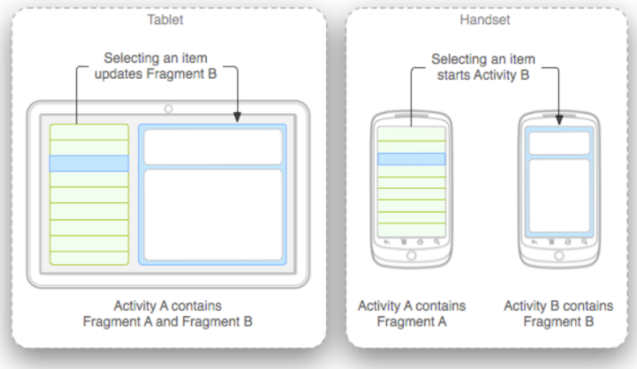

* với hình minh họa 1 ứng dụng như trên ta có yêu cầu của ứng dụng như sau:
  * khi hiển thị trên màn hình lớn
    * thì giao diện hiển thị kiểu danh sách các item ở phía trái
    * click vào từng item sẽ hiển thị nội dung chi tiết của item đó ở phía phải
  * với thiết bị có màn hình nhỏ
    * danh sách các item được hiển thị hết toàn màn hình
    * và click vào từng item sẽ dẫn sang màn hình khác hiển thị nội dung của item đó
* nếu chỉ dùng Activity để thực hiện yêu cầu trên:
  * để tự động hiển thị danh sách và nội dung cùng nhau ở màn hình lớn
  * và hiển thị danh sách tách biệt với nội dung của nó ở màn hình nhỏ trên đây
  * thì vẫn thiết kế được nhưng rất phức tạp
* nếu dùng Fragment trong thiết kế:
  * khi hiển thị trên màn hình lớn hiển thị cả hai Fragment A và Fragment B lên cùng một Activity.
    * Fragment A là danh sách các item
    * Fragment B là nội dung của từng item
  * với thiết bị có màn hình nhỏ có thể hiển thị Fragment A và Fragment B thay phiên nhau
    * trên cùng một Activity 
    * hoặc khác Activity là do ta thiết kế
* Cách tổ chức các thành phần UI như vậy lên các Fragment rồi biến tấu chúng trên từng vùng của Activity 
vừa linh động, dễ dàng, hiệu quả.
* Ngoài sự linh động của UI khi sử dụng Fragment với màn hình nhỏ (phone) và lớn (tablet), thì còn có thể tổ chức 
sự linh động đối với các chế độ xoay màn hình của cùng một thiết bị. 

## 25.3. Fragment Và Sự Tương Thích Ngược <a id="25.3"></a>
______________________________________________________________________________________
* Fragment ra đời để hỗ trợ giao diện trên tablet. Nên Fragment rất gắn liền với sự ra đời của tablet. 
* hệ điều hành đánh dấu cho việc hỗ trợ chính thức tablet chính là hệ điều hành **Android 3.0 (APL level 11)**.
* nếu project khai báo minSdkVersion từ 11 trở lên, thì nếu sử dụng Fragment mọi thứ hoạt động bình thường. 
* nếu minSdkVersion nhỏ hơn 11, hệ thống vẫn có hỗ trợ tương thích ngược đối với API < 11,
nhưng sẽ có một chút khác biệt đối với việc quyết định sử dụng lớp Fragment. Khác biệt đó như sau.
  * Khi xây dựng Fragment, sẽ luôn có hai lựa chọn Fragment ở hai package khác nhau 
    * Một Fragment thuộc về **android.app**
    * một Fragment thuộc về **android.support.v4.app** <br/> 
    Tất nhiên, chỉ nên sử dụng một trong hai thôi.

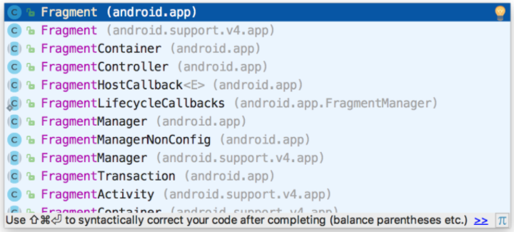

* Sau đây là cách chọn lựa Fragment.
  * Nếu **minSdkVersion >= 11**
    * sử dụng Fragment trong gói **android.app**
    * sử dụng phương thức ``getFragmentManager()`` khi cần hiển thị động Fragment lên Activity.
  * Nếu **minSdkVersion < 11** 
    * sử dụng Fragment trong gói tương thích ngược **android.support.v4.app**
    * phải dùng phương thức ``getSupportFragmentManager()`` cho mục đích hiển thị động Fragment. 
    * Và Activity quản lý Fragment khi này 
      * không phải Activity thường 
      * mà phải là FragmentActivity. 
        * Tuy nhiên nếu Activity hiện tại đang kế thừa từ AppCompatActivity rồi thì cũng yên tâm nhé, 
        * vì AppCompatActivity vừa hỗ trợ ActionBar đến các hệ điều hành Android cũ hơn, cũng vừa hỗ trợ cả Fragment.


## 25.4. Cách Xây Dựng Một Fragment <a id="25.4"></a>
______________________________________________________________________________________
* việc tổ chức và quản lý UI của Fragment rất giống với Activity.
* nếu như Activity được điểu khiển bởi bộ đôi Java và XML thì Fragment cũng như vậy.
* UI của Fragment được quản lý bởi bộ đôi:
  * XyzFragment.java
    * chịu trách nhiệm xử lý các logic
  * fragment_xyz.xmml
    * chịu trách nhiệm hiển thị UI
* việc khởi tạo Fragment cũng được thực hiện bởi wizard tích hợp sẵn trong Android Studio
* điểm khác biệt của Fragment so với Activity
  * không cần phải khai báo trong AndroidManifest.xml, vì đây không phải là thành phần cơ bản trong ứng dụng
  * không cần sử dụng Intent để kích hoạt 1 Fragment

### 25.4.1. Các Bước Tạo Mới 1 Fragment <a id="25.4.1"></a>
______________________________________________________________________________________
* chúng ta vẫn sẽ dùng wizard để tạo mới Fragment. Cách tạo này sẽ giúp tạo bộ java và xml.
* để tạo mới Fragment ta thực hiện các bước sau:
  * chuột phải vào thư mục **main/java/[package name]/** -> **New** -> **Fragment** -> chọn 1 Fragment template
  * sau khi chọn 1 template Fragment, 1 dialog tùy chỉnh Fragment mới sẽ xuất hiện gồm các nội dung sau:
    * Fragment name: tên của Fragment java (nên đặt theo mẫu XyzFragment)
    * Fragment Layout name: tên của Fragment xml (hệ thống sẽ tự tạo theo Fragment java với mẫu - fragment_xyz)
    * Source language: chỉ định ngôn ngữ dùng lập trình trên Fragment java (Java hoặc Kotlin)
    * Finish: hoàn tất quá trình tạo Fragment
  * sau khi hoàn tất tạo mới Fragment, 1 file XyzFragment.java và 1 file fragment_xyz.xml sẽ được tạo ra

### 25.4.2. Làm Quen Với Fragment <a id="25.4.2"></a>
______________________________________________________________________________________
#### Giao Diện Của Fragment (File XML)
______________________________________________________________________________________
* về file giao diện của Fragment XML cũng sử dụng các thành phần không khác file giao diện của Activity XML.
* giả sử ta muốn giao diện của **fragment_first.xml** là ``LinearLayout`` theo hướng ``vertical`` và sẽ có 2 ``Button``.
* tiến hành chỉnh sửa lại như sau:
```xml
<?xml version="1.0" encoding="utf-8"?>
<LinearLayout xmlns:android="http://schemas.android.com/apk/res/android"
    xmlns:tools="http://schemas.android.com/tools"
    android:layout_width="match_parent"
    android:layout_height="match_parent"
    android:orientation="vertical"
    tools:context=".FirstFragment">

    <!-- TODO: Update blank fragment layout -->
    <Button
        android:id="@+id/btnItem1"
        android:layout_width="match_parent"
        android:layout_height="wrap_content"
        android:text="Item 1"/>

    <Button
        android:id="@+id/btnItem2"
        android:layout_width="match_parent"
        android:layout_height="wrap_content"
        android:text="Item 2"/>
</LinearLayout>
```

#### Logic Của Fragment (File Java)
______________________________________________________________________________________
* nếu Activity: phương thức ``onCreate()`` là phương thức dùng để khởi tạo Activity
* thì Fragment: phương thức ``onCreateView()`` là phương thức dùng để khởi tạo Fragment
* đây là phương thức ``onCreateView()`` mặc định khi tạo mới 1 Fragment, nó được cấp 2 tham số để bên trong sử dụng
bởi hệ thống:
  * 1 đối tượng của lớp **LayoutInflater**
  * 1 đối tượng của lớp **ViewGroup**
```java
    @Override
    public View onCreateView(LayoutInflater inflater, ViewGroup container,
                             Bundle savedInstanceState) {
        // Inflate the layout for this fragment
        return inflater.inflate(R.layout.fragment_first, container, false);
    }
```
* qua dòng code mặc định trên ta thấy:
  * Fragment không dùng phương thức ``setContentView()`` để đọc file XML UI như với Activity.
  * thay vào đó nó gọi phương thức ``inflate()`` của lớp **LayoutInflater**, phương thức này:
    * chỉ định 1 XML UI: ở đây là ``R.layout.fragment_first``
    * sau đó gắn XML UI này vào 1 ViewGroup: ở đây là ``container``
  * phương thức này trả về chính là 1 đối tượng View, ở đây là View của Fragment
* tiến hành tạo sự kiện click cho 2 Button đã tạo ở XML UI Fragment.
  * nếu với Activity, để gọi 1 đối tượng trong XML UI từ Java code, ta gọi **id** của đối tượng đó thông qua phương thức:
    * ``findViewById()``
  * thì ở Fragment, ta sẽ gọi **id** của 1 đối tượng trong XML UI từ Java code cũng tương tự, nhưng phải thông qua 1 cấp View của Fragment:
    * ``view.findViewById()``
    * ``view`` này chính là đối tượng được trả về bởi phương thức ``inflate()``
  * các bước tiến hành:
    * lấy đối tượng View của Fragment hiện tại
      * ``View view = inflater.inflate(R.layout.fragment_first, container, false);``
    * truy xuất các Button trong XML UI thông qua ``view`` vừa có được
      * ``Button btnItem1 = (Button) view.findViewById(R.id.btnItem1);``
      * ``Button btnItem2 = (Button) view.findViewById(R.id.btnItem2);``
    * set sự kiện click cho các Button
      * ```java
        btnItem1.setOnClickListener(new View.OnClickListener() {
            @Override
            public void onClick(View v) {
                Toast.makeText(getActivity(), "Button 1 clicked", Toast.LENGTH_SHORT).show();
            }
        });
        ```
      * ```java
        btnItem2.setOnClickListener(new View.OnClickListener() {
            @Override
            public void onClick(View v) {
                Toast.makeText(getActivity(), "Button 2 clicked", Toast.LENGTH_SHORT).show();
            }
        });
        ```
    * sau khi hoàn tất trả về đối tượng View của Fragment
>phương thức makeText kiểu Toast ở Fragment dùng có đôi chút khác biệt so với ở Activity.
> >ở Activity: tham số Context truyền vào là của Activity cần hiển thị thông báo kiểu Toast
> 
> >ở Fragment: tham số Context truyền vào là Activity quản lý nó, được lấy bởi phương thức **getActivity()**

______________________________________________________________________________________
______________________________________________________________________________________
______________________________________________________________________________________
# 26. Tiếp Tục Làm Quen Vơi Fragment <a id="26"></a>
______________________________________________________________________________________
## 26.1. Fragment Thông Báo Tương Tác Cho Activity Như Thế Nào <a id="26.1"></a>
______________________________________________________________________________________
* để Fragment có thể thông báo ngược lại Activity các sự kiện ở trong Fragment, ta phải tạo **interface callback**
trong Fragment.
* ví dụ, trong FirstFragment user nhấn vào 1 Button bất kỳ, thì Fragment phải thông báo cho Activity quản lý nó biết
sự kiện này.
______________________________________________________________________________________
* trong FirstFragment được quản lý bởi MainActivity ta thêm vào:
______________________________________________________________________________________
* 1 interface dùng để bật lắng nghe tương tác với Fragment (ví dụ interface tên: OnFragmentInteractionListener)
* tên interface này ta có thể đặt theo mục đích cần sử dụng.
* bên trong interface listener này ta định nghĩa các phương thức trừu tượng đại diện cho 1 hành động nào đó muốn thông báo
ra bên ngoài Fragment.
```java
    public interface OnFirstFragmentInteractionListener {
    }        
```
______________________________________________________________________________________
* thêm thuộc tính toàn cục access modifier là private có kiểu của interface listener vừa tạo.
```java
private OnFirstFragmentInteractionListener mListener;
```
______________________________________________________________________________________
* override phương thức ``onAttach()``, phương thức này có nhiệm vụ khởi tạo thuộc tính trên khi Fragment đã được gắn
vào Activity (Activity quản lý Fragment phải implement interface listener của Fragment).
```java
    @Override
    public void onAttach(@NonNull Context context) {
        super.onAttach(context);
        if (context instanceof OnFirstFragmentInteractionListener) {
            mListener = (OnFirstFragmentInteractionListener) context;
        } else {
            throw new RuntimeException(context.toString()
                    + " must implement OnFragmentInteractionListener");
        }
    }
```
______________________________________________________________________________________
* tại nơi diễn ra sự kiện tương tác ở Fragment, thuộc tính kiểu interface listener sẽ gọi đến phương thức trừu tượng
biểu diễn sự tương tác tương ứng trên Fragment.
* chính Activity quản lý Fragment phải implement các phương thức trừu tượng của interface listener của Fragment sẽ 
phải định nghĩa các hành động cụ thể, khi Fragment được tương tác và thông báo cho Activity).
* ví dụ ở đây là khi item trên Fragment được press, sẽ gửi 1 context cho Activity.
```java
        btnItem1.setOnClickListener(new View.OnClickListener() {
            @Override
            public void onClick(View v) {
                if (mListener != null) {
                    mListener.onItemPressed("This is a content when Button 1 click");
                }
            }
        });

        btnItem2.setOnClickListener(new View.OnClickListener() {
            @Override
            public void onClick(View v) {
                if (mListener != null) {
                    mListener.onItemPressed("Hey, this is a Button 2 content");
                }
            }
        });
```
______________________________________________________________________________________
* cuối cùng override phương thức ``onDetach()`` trên Fragment
* khi Fragment rơi vào trạng thái bị gỡ khỏi Activity thì thuộc tính kiểu interface listener dùng để gửi thông báo cũng
bị hủy (gán ``null``)
```java
    @Override
    public void onDetach() {
        super.onDetach();
        mListener = null;
    }
```
______________________________________________________________________________________
### 26.1.1. Hoàn Thiện FirstFragment <a id="26.1.1"></a>
______________________________________________________________________________________
#### Định Nghĩa interface Trong FirstFragment
______________________________________________________________________________________
* ta sẽ định nghĩa 1 interface dùng để thông báo tương tác trên FirstFragment cho Activity quản lý nó.
* trong interface này định nghĩa 1 phương thức trừu tượng có chức năng thông báo cho Activity quản lý FirstFragment.
* tham số truyền vào cho phương thức trừu tượng này là 1 String.
* khi Activity quản lý FirstFragment implement interface này sẽ nhận được String thông báo từ Fragment.
```java
    public interface OnFirstFragmentInteractionListener {
        // TODO: Update argument type and name
        void onItemPressed(String content);
    }
```
#### Khai Báo Thuộc Tính Kiểu Của interface Thông Báo Tương Tác
______________________________________________________________________________________
* khai báo 1 thuộc tính có kiểu của interface thông báo tương tác trong FirstFragment.
* access modifier của thuộc tính này là private vì chỉ dùng trong phạm vi FirstFragment.
* thuộc tính này dùng để quản lý phương thức tương tác trong interface tương tác.
```java
    private OnFirstFragmentInteractionListener mListener;
```
#### Khởi Tạo Giá Trị Cho Thuộc Tính Kiểu interface Tương Tác
______________________________________________________________________________________
* khi FirstFragment ở trạng thái được gắn vào Activity thì thuộc tính quản lý phương thức thông báo được khởi tạo.
```java
    @Override
    public void onAttach(Context context) {
        super.onAttach(context);
        if (context instanceof OnFirstFragmentListener) {
            mListener = (OnFirstFragmentListener) context;
        } else {
            throw new RuntimeException(context.toString()
                    + " must implement OnFragmentInteractionListener");
        }
    }
```
#### Xây Dựng Logic Ở Sự Kiện Tương Tác Trong Fragment
______________________________________________________________________________________
* tại nơi diễn ra sự kiện tương tác trong Fragment
* thuộc tính quản lý chức năng tương tác sẽ sử dụng chức năng tương ứng đã định nghĩa trong interface bật tương tác.
```java
        btnItem1.setOnClickListener(new View.OnClickListener() {
            @Override
            public void onClick(View v) {
                if (mListener != null) {
                    mListener.onItemPressed("This is a content when Button 1 click");
                }
            }
        });

        btnItem2.setOnClickListener(new View.OnClickListener() {
            @Override
            public void onClick(View v) {
                if (mListener != null) {
                    mListener.onItemPressed("Hey, this is a Button 2 content");
                }
            }
        });
```
#### Xử Lý Khi FirstFragment Bị onDetach() Khỏi Activity
______________________________________________________________________________________
* override phương thức ``onDetach()`` trong FirstFragment, để khi FirstFragment bị Detach khỏi Activity, sẽ giải phóng
thuộc tính quản lý chức năng tương tác (thiết lập giá trị ``null``).
```java
    @Override
    public void onDetach() {
        super.onDetach();
        mListener = null;
    }
```
#### Source Code Của FirstFragment
______________________________________________________________________________________
```java
package com.hienqp.tourbook;

import android.content.Context;
import android.os.Bundle;

import androidx.annotation.NonNull;
import androidx.fragment.app.Fragment;

import android.view.LayoutInflater;
import android.view.View;
import android.view.ViewGroup;
import android.widget.Button;

/**
 * A simple {@link Fragment} subclass.
 * Use the {@link FirstFragment#newInstance} factory method to
 * create an instance of this fragment.
 */
public class FirstFragment extends Fragment {
    private OnFirstFragmentInteractionListener mListener;

    // TODO: Rename parameter arguments, choose names that match
    // the fragment initialization parameters, e.g. ARG_ITEM_NUMBER
    private static final String ARG_PARAM1 = "param1";
    private static final String ARG_PARAM2 = "param2";

    // TODO: Rename and change types of parameters
    private String mParam1;
    private String mParam2;

    public FirstFragment() {
        // Required empty public constructor
    }

    /**
     * Use this factory method to create a new instance of
     * this fragment using the provided parameters.
     *
     * @param param1 Parameter 1.
     * @param param2 Parameter 2.
     * @return A new instance of fragment FirstFragment.
     */
    // TODO: Rename and change types and number of parameters
    public static FirstFragment newInstance(String param1, String param2) {
        FirstFragment fragment = new FirstFragment();
        Bundle args = new Bundle();
        args.putString(ARG_PARAM1, param1);
        args.putString(ARG_PARAM2, param2);
        fragment.setArguments(args);
        return fragment;
    }

    @Override
    public void onCreate(Bundle savedInstanceState) {
        super.onCreate(savedInstanceState);
        if (getArguments() != null) {
            mParam1 = getArguments().getString(ARG_PARAM1);
            mParam2 = getArguments().getString(ARG_PARAM2);
        }
    }

    @Override
    public View onCreateView(LayoutInflater inflater, ViewGroup container,
                             Bundle savedInstanceState) {
        // Inflate the layout for this fragment
        View view = inflater.inflate(R.layout.fragment_first, container, false);

        Button btnItem1 = (Button) view.findViewById(R.id.btnItem1);
        Button btnItem2 = (Button) view.findViewById(R.id.btnItem2);
        
        btnItem1.setOnClickListener(new View.OnClickListener() {
            @Override
            public void onClick(View v) {
                if (mListener != null) {
                    mListener.onItemPressed("This is a content when Button 1 click");
                }
            }
        });

        btnItem2.setOnClickListener(new View.OnClickListener() {
            @Override
            public void onClick(View v) {
                if (mListener != null) {
                    mListener.onItemPressed("Hey, this is a Button 2 content");
                }
            }
        });

        return view;
    }

    @Override
    public void onAttach(@NonNull Context context) {
        super.onAttach(context);
        if (context instanceof OnFirstFragmentInteractionListener) {
            mListener = (OnFirstFragmentInteractionListener) context;
        } else {
            throw new RuntimeException(context.toString()
                    + " must implement OnFragmentInteractionListener");
        }
    }

    @Override
    public void onDetach() {
        super.onDetach();
        mListener = null;
    }

    public interface OnFirstFragmentInteractionListener {
        // TODO: Update argument type and name
        void onItemPressed(String content);
    }
}
```

## 26.2. Fragment Nhận Dữ Liệu Từ Activity Khi Được Khởi Tạo Như Thế Nào <a id="26.2"></a>
______________________________________________________________________________________
* nếu FirstFragment có nhiệm cụ hiển thị các item, và sẽ thông báo cho Activity quản lý nó là item nào được tương tác bên
trong nó.
* thì SecondFragment ta tạo cho nó chức năng nhận dữ liệu từ Activity quản lý nó, sẽ hiển thị nội dung của item tương ứng
khi được tương tác ở FirstFragment.
* tóm lại có 1 Activity sẽ quản lý cả 2 Fragment này, và làm nhiệm vụ trung gian lắng nghe sự kiện ở FirstFragment và yêu
cầu SecondFragment thực hiện công việc mà FirstFragment thông báo.
* tiến hành tạo SecondFragment như khi tạo FirstFragment.

### 26.2.1. Tạo Giao Diện Cho SecondFragment <a id="26.2.1"></a>
______________________________________________________________________________________
#### chỉnh sửa TextView cho SecondFragment XML
______________________________________________________________________________________
```xml
<?xml version="1.0" encoding="utf-8"?>
<FrameLayout
    xmlns:android="http://schemas.android.com/apk/res/android"
    xmlns:tools="http://schemas.android.com/tools"
    android:layout_width="match_parent"
    android:layout_height="match_parent"
    tools:context=".SecondFragment">

    <!-- TODO: Update blank fragment layout -->
    <TextView
        android:id="@+id/tvContent"
        android:layout_width="match_parent"
        android:layout_height="match_parent"
        android:text="Content" />

</FrameLayout>
```
#### Làm Quen Với Các Dòng Code Factory Method
______________________________________________________________________________________
* mặc định khi tạo mới 1 Fragment hệ thống sẽ tạo các Factory Methods mặc định.
* có các dòng code liên quan đến Factory Method trong Fragment khi được tạo mới như sau:
* các tham số **public static final String** dùng làm ``key`` dùng cho Bundle, giúp Bundle truyền nhận dữ liệu từ Activity
vào Fragment.
```java
    private static final String ARG_PARAM1 = "param1";
    private static final String ARG_PARAM2 = "param2";
```
* các thuộc tính là ``value`` lấy ra từ Bundle tương ứng với từng ``key`` ở trên.
```java
    private String mParam1;
    private String mParam2;
```
* phương thức public static ``newInstance()`` sẽ là đầu vào dữ liệu cho SecondFragment.
  * ở nơi nào đó khi gọi đến phương thức static này sẽ phải truyền vào dữ liệu theo các tham số **param1, param2**.
  * bên trong phương thức này sẽ tự động tạo ra Bundle.
  * sau đó tạo ra các bộ ``key/value`` đặt vào Bundle.
  * rồi gửi qua Fragment (SecondFragment) được khởi tạo ngay chính trong phương thức này luôn.
```java
    public static SecondFragment newInstance(String param1, String param2) {
        SecondFragment fragment = new SecondFragment();
        Bundle args = new Bundle();
        args.putString(ARG_PARAM1, param1);
        args.putString(ARG_PARAM2, param2);
        fragment.setArguments(args);
        return fragment;
    }
```
* ở phương thức ``onCreate()`` thì các bộ ``key/value`` sẽ được lấy ra dùng thông qua Bundle đã được đóng gói và truyền 
qua ở ``newInstance()``.
```java
    @Override
    public void onCreate(Bundle savedInstanceState) {
        super.onCreate(savedInstanceState);
        if (getArguments() != null) {
            mParam1 = getArguments().getString(ARG_PARAM1);
            mParam2 = getArguments().getString(ARG_PARAM2);
        }
    }
```
* trên đây là những phương thức và giá trị chung, khi sử dụng thực tế có thể sửa đổi tùy theo mục đích.

### 26.2.2. Hoàn Thiện Code Cho SecondFragment <a id="26.2.2"></a>
______________________________________________________________________________________
#### Định Nghĩa Key Để Lấy Nội Dung
______________________________________________________________________________________
* do SecondFragment chỉ cần 1 nội dung đưa vào để hiển thị lên TextView.
* nên ta chỉ cần 1 bộ ``key/value`` để lấy thông tin nội dung là đủ.
```java
    private static final String ARG_CONTENT = "content";
```

#### Định Nghĩa Value
______________________________________________________________________________________
* chỉ có 1 ``key`` nên chỉ cần định nghĩa 1 ``value``.
```java
    private String mContent;
```

#### Phương Thức Khởi Tạo newInstance
______________________________________________________________________________________
* chỉ cần truyền một tham số String vào phương thức. Và đóng gói một bộ key/value vào Bundle rồi truyền qua Fragment
  vừa được tạo.
* trong phương thức ``newInstance()``
  * khởi tạo 1 đối tượng Fragment cần nhận dữ liệu.
  * khởi tạo 1 đối tượng Bundle để đóng gói dữ liệu.
  * put dữ liệu vào Bundle (``key`` của Fragment, ``value`` là nội dung truyền vào ``newInstance()``)
  * truyền dữ liệu cho Fragment với phương thức ``setArguments()``
```java
    public static SecondFragment newInstance(String content) {
        SecondFragment fragment = new SecondFragment();
        Bundle bundle = new Bundle();
        bundle.putString(ARG_CONTENT, content);
        fragment.setArguments(bundle);
        return fragment;
    }
```

#### Lấy Value Từ Bundle Khi Tạo Fragment Ở onCreate()
______________________________________________________________________________________
* trong phương thức ``onCreate()`` khi tạo Fragment, cũng là lúc lấy ``value`` từ Bundle được truyền qua.
```java
    @Override
    public void onCreate(Bundle savedInstanceState) {
        super.onCreate(savedInstanceState);
        if (getArguments() != null) {
            mContent = getArguments().getString(ARG_CONTENT);
        }
    }
```

#### Sử Dụng Value Lấy Được Ở Fragment
______________________________________________________________________________________
* hoàn thiện phương thức onCreateView() ở SecondFragment này sao cho có thể hiển thị nội dung lên TextView.
```java
    @Override
    public View onCreateView(LayoutInflater inflater, ViewGroup container,
                             Bundle savedInstanceState) {
        // Inflate the layout for this fragment
        View view = inflater.inflate(R.layout.fragment_second, container, false);

        TextView tvContent = (TextView) view.findViewById(R.id.tvContent);
        if (!TextUtils.isEmpty(mContent)) {
            tvContent.setText(mContent);
        }

        return view;
    }
```

#### Source Code Hoàn Thiện Cho SecondFragment
______________________________________________________________________________________
```java
package com.hienqp.tourbook;

import android.os.Bundle;

import androidx.fragment.app.Fragment;

import android.text.TextUtils;
import android.view.LayoutInflater;
import android.view.View;
import android.view.ViewGroup;
import android.widget.TextView;


public class SecondFragment extends Fragment {

    private static final String ARG_CONTENT = "content";

    private String mContent;

    public SecondFragment() {
        // Required empty public constructor
    }

    // TODO: Rename and change types and number of parameters
    public static SecondFragment newInstance(String content) {
        SecondFragment fragment = new SecondFragment();
        Bundle bundle = new Bundle();
        bundle.putString(ARG_CONTENT, content);
        fragment.setArguments(bundle);
        return fragment;
    }

    @Override
    public void onCreate(Bundle savedInstanceState) {
        super.onCreate(savedInstanceState);
        if (getArguments() != null) {
            mContent = getArguments().getString(ARG_CONTENT);
        }
    }

    @Override
    public View onCreateView(LayoutInflater inflater, ViewGroup container,
                             Bundle savedInstanceState) {
        // Inflate the layout for this fragment
        View view = inflater.inflate(R.layout.fragment_second, container, false);

        TextView tvContent = (TextView) view.findViewById(R.id.tvContent);
        if (!TextUtils.isEmpty(mContent)) {
            tvContent.setText(mContent);
        }

        return view;
    }
}
```

______________________________________________________________________________________
______________________________________________________________________________________
______________________________________________________________________________________
# 27. Hiển Thị Fragment <a id="27"></a>
______________________________________________________________________________________
* để Activity lắng nghe sự kiện tương tác trên Fragment nó quản lý, ta phải tạo cài đặt interface callback trên Fragment.
* sau đó Activity phải implement interface callback đó, và override phương thức cài định nghĩa ở interface callback.
* để nhận dữ liệu từ Activity, Activity cũng phải đóng gói dữ liệu vào Bundle và gửi vào Fragment từ Activity.

## 27.1. Các Cách Thức Hiển Thị Fragment <a id="27.1"></a>
______________________________________________________________________________________
* Hiển thị Fragment bao gồm:
  * cách sắp xếp các Fragment lên Activity
  * hiển thị Fragment lên màn hình
  * tương tác giữa các Fragment với nhau
* Có 2 cách để hiển thị Fragment:
  * hiển thị tĩnh
  * hiển thị động
* Hiển thị Fragment theo kiểu tĩnh nghĩa là:
  * các Fragment sẽ được cố định trên màn hình tại vị trí chỉ định cho trước
  * không có sự luân chuyển hay thay thế các Fragment.
  * cách hiển thị này thường không có sự linh động cao.
  * ưu điểm là tốc độ thời gian dành cho việc thiết kế sẽ nhanh, vì quá trình cài đặt đơn giản ít code.
* Hiển thị Fragment theo kiểu động nghĩa là:
  * các Fragment sẽ được luân phiên hay thay thế cho nhau, ở bất cứ vị trí nào trên màn hình tùy theo quá trình cài đặt code.
  * cách hiển thị theo kiểu động sẽ linh động nhưng tốn thời gian cho việc thiết kế code Java.

### 27.1.1. Cách Hiển Thị Fragment Theo Kiểu Tĩnh <a id="27.1.1"></a>
______________________________________________________________________________________
* yêu cầu hiển thị Fragment như hình sau trên MainActivity.java

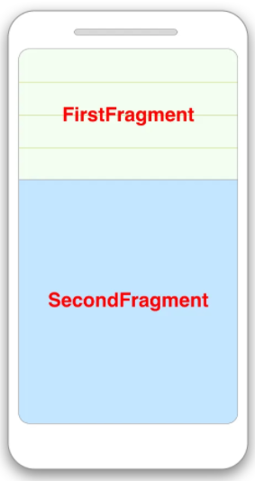

#### Các Bước Để Thiết Lập Hiển Thị Fragment Theo Kiểu Tĩnh
______________________________________________________________________________________
* mở file Activity XML (activity_main.xml), nơi sẽ hiển thị Fragment theo yêu cầu.
  * thuộc tính quan trọng ở Layout chứa Fragment:
    * ``tools:context="com.hienqp.tourbook.MainActivity"``: chỉ định Context là Activity
    * ``android:id="@+id/activity_main_content"``: chỉ định id cho Activity
* thêm số lượng Layout Fragment (tùy theo mục đích cần bao nhiêu Fragment) vào khu vực cần hiển thị Fragment.
  * ``<fragment/>`` là thẻ Layout chỉ định sẽ hiển thị Fragment. vì ở đây là Layout nên nó cũng có đặc điểm như các
  Layout khác, ta có thể chỉ định kích thước, vị trí hiển thị, tùy theo mục đích.
    * thuộc tính:
      * ``android:name="com.hienqp.tourbook.FirstFragment"``: chỉ định Fragment sẽ hiển thị ở Layout fragment này
      * ``android:layout_width="match_parent"``: chỉ định chiều rộng hiển thị Fragment
      * ``android:layout_height="0dp"``: chỉ định chiều cao hiển thị Fragment
* với những Fragment chuyên hiển thị dữ liệu, ta có thể thực thi ứng dụng.
* nhưng vì FirstFragment có định nghĩa:
  * interface callback: ``OnFirstFragmentInteractionListener`` chỉ định chức năng thông báo
  * phương thức override: ``onAttach()`` có kiểm tra nếu Activity không implement interface callback sẽ báo lỗi
* nên ta phải implement interface callback ở MainActivity.java và implement phương thức trừu tương của interface callback
```java
public class MainActivity extends AppCompatActivity implements FirstFragment.OnFirstFragmentInteractionListener {
    
}
```
```java
    @Override
    public void onItemPressed(String content) {

    }
```
* sau khi hoàn tất các bước trên ta có thể thực thi ứng dụng để xem giao diện của các Fragment hiển thị theo kiểu tĩnh.
#### activity_main.xml Hoàn Thiện
______________________________________________________________________________________
```xml
<?xml version="1.0" encoding="utf-8"?>
<androidx.drawerlayout.widget.DrawerLayout xmlns:android="http://schemas.android.com/apk/res/android"
    xmlns:app="http://schemas.android.com/apk/res-auto"
    xmlns:tools="http://schemas.android.com/tools"
    android:id="@+id/activity_main_drawer"
    android:layout_width="match_parent"
    android:layout_height="match_parent">

    <!--    Component 1: Main Screen-->
    <LinearLayout
        android:id="@+id/activity_main_content"
        android:layout_width="match_parent"
        android:layout_height="match_parent"
        android:orientation="vertical"
        tools:context="com.hienqp.tourbook.MainActivity">

        <fragment
            android:name="com.hienqp.tourbook.FirstFragment"
            android:layout_width="match_parent"
            android:layout_height="0dp"
            android:layout_weight="1" />

        <fragment
            android:name="com.hienqp.tourbook.SecondFragment"
            android:layout_width="match_parent"
            android:layout_height="0dp"
            android:layout_weight="2" />

<!--bỏ TextView và ImageView để đặt 2 Fragment-->
        <!--        <TextView-->
        <!--            android:id="@+id/activity_main_tv_empty"-->
        <!--            style="@style/InformationTextView"-->
        <!--            android:text="@string/mainscreen_empty_note"-->
        <!--            app:layout_constraintBottom_toBottomOf="parent"-->
        <!--            app:layout_constraintLeft_toLeftOf="parent"-->
        <!--            app:layout_constraintRight_toRightOf="parent"-->
        <!--            app:layout_constraintTop_toTopOf="parent" />-->

        <!--        <ImageView-->
        <!--            android:id="@+id/imageView"-->
        <!--            android:layout_width="@dimen/empty_icon_width"-->
        <!--            android:layout_height="@dimen/empty_icon_height"-->
        <!--            android:layout_marginStart="8dp"-->
        <!--            android:layout_marginTop="8dp"-->
        <!--            android:layout_marginEnd="8dp"-->
        <!--            android:layout_marginBottom="8dp"-->
        <!--            android:scaleType="fitCenter"-->
        <!--            app:layout_constraintEnd_toEndOf="parent"-->
        <!--            app:layout_constraintStart_toStartOf="parent"-->
        <!--            app:layout_constraintTop_toBottomOf="@+id/activity_main_tv_empty"-->
        <!--            app:srcCompat="@drawable/empty_note" />-->

    </LinearLayout>

    <!--    Component 2: Navigation Drawer-->
    <!--    NavigationView là một layout được chuyên dùng trong Navigation Drawer, nó giúp định nghĩa
    ra một menu layout chuẩn, với các màu sắc và kích cỡ mặc định, và khi sử dụng nó, bạn không cần
    phải lo lắng canh chỉnh chiều rộng của left menu này như thế nào.-->
    <com.google.android.material.navigation.NavigationView
        android:layout_width="wrap_content"
        android:layout_height="match_parent"
        android:layout_gravity="start"
        android:fitsSystemWindows="true">

        <!--        NavigationView chỉ là Layout chứa-->
        <!--        để giao diện linh hoat, bên trong NavigationView nên chứa LinearLayout-->
        <!--        bên trong LinearLayout khai báo thêm 3 LinearLayout con chồng lên nhau-->
        <!--        3 LinearLayout con chính là 3 thành phần trong Navigation Drawer mong muốn-->
        <!--        thành phần 1: Header-->
        <!--        thành phần 2: Infor-->
        <!--        thành phần 3: Help-->
        <LinearLayout
            android:layout_width="match_parent"
            android:layout_height="wrap_content"
            android:background="@color/white"
            android:orientation="vertical">

            <!--            Header-->
            <LinearLayout
                android:layout_width="match_parent"
                android:layout_height="@dimen/navigation_header_height"
                android:background="@color/colorPrimary"
                android:gravity="bottom"
                android:orientation="vertical"
                android:paddingLeft="@dimen/activity_horizontal_margin"
                android:paddingTop="@dimen/activity_vertical_margin"
                android:paddingRight="@dimen/activity_horizontal_margin"
                android:paddingBottom="@dimen/activity_vertical_margin"
                android:theme="@style/ThemeOverlay.AppCompat.Dark">

                <ImageView
                    android:id="@+id/activity_main_imv_avatar"
                    android:layout_width="wrap_content"
                    android:layout_height="wrap_content"
                    android:paddingTop="@dimen/activity_vertical_margin"
                    android:src="@mipmap/ic_launcher_round" />

                <TextView
                    android:id="@+id/activity_main_tv_user_name"
                    android:layout_width="match_parent"
                    android:layout_height="wrap_content"
                    android:paddingTop="@dimen/activity_vertical_margin"
                    android:text="HienQP Studio"
                    android:textAppearance="@style/TextAppearance.AppCompat.Body1" />

                <TextView
                    android:id="@+id/activity_main_tv_email"
                    android:layout_width="wrap_content"
                    android:layout_height="wrap_content"
                    android:text="hienpham5290@gmail.com" />

            </LinearLayout>
            <!--            Info-->
            <LinearLayout
                android:layout_width="match_parent"
                android:layout_height="@dimen/navigation_item_height"
                android:background="@color/white"
                android:gravity="center_vertical"
                android:orientation="horizontal"
                android:paddingLeft="@dimen/activity_horizontal_margin"
                android:paddingRight="@dimen/activity_horizontal_margin">

                <ImageView
                    android:layout_width="@dimen/navigation_item_icon_size"
                    android:layout_height="@dimen/navigation_item_icon_size"
                    android:src="@drawable/ic_action_info" />

                <TextView
                    android:layout_width="match_parent"
                    android:layout_height="wrap_content"
                    android:layout_marginLeft="32dp"
                    android:text="@string/menu_item_about_app" />

            </LinearLayout>
            <!--            Help-->
            <LinearLayout
                android:layout_width="match_parent"
                android:layout_height="@dimen/navigation_item_height"
                android:background="@color/white"
                android:gravity="center_vertical"
                android:orientation="horizontal"
                android:paddingLeft="@dimen/activity_horizontal_margin"
                android:paddingRight="@dimen/activity_horizontal_margin">

                <ImageView
                    android:layout_width="@dimen/navigation_item_icon_size"
                    android:layout_height="@dimen/navigation_item_icon_size"
                    android:src="@drawable/ic_action_help" />

                <TextView
                    android:layout_width="match_parent"
                    android:layout_height="wrap_content"
                    android:layout_marginLeft="32dp"
                    android:text="@string/menu_item_help" />
            </LinearLayout>

        </LinearLayout>

    </com.google.android.material.navigation.NavigationView>
</androidx.drawerlayout.widget.DrawerLayout>
```

#### MainActivity.java Hoàn Thiện
______________________________________________________________________________________
```java
package com.hienqp.tourbook;

import androidx.annotation.NonNull;
import androidx.annotation.Nullable;
import androidx.appcompat.app.ActionBarDrawerToggle;
import androidx.appcompat.app.AppCompatActivity;
import androidx.drawerlayout.widget.DrawerLayout;

import android.content.Intent;
import android.content.res.Configuration;
import android.graphics.Color;
import android.graphics.drawable.StateListDrawable;
import android.os.Bundle;
import android.text.Html;
import android.text.SpannableString;
import android.text.method.LinkMovementMethod;
import android.text.style.ClickableSpan;
import android.text.style.ForegroundColorSpan;
import android.text.style.RelativeSizeSpan;
import android.text.style.URLSpan;
import android.util.Log;
import android.view.Menu;
import android.view.MenuItem;
import android.view.View;
import android.widget.Button;
import android.widget.CheckBox;
import android.widget.CompoundButton;
import android.widget.ImageView;
import android.widget.TextView;
import android.widget.Toast;

import java.text.SimpleDateFormat;
import java.util.Calendar;

public class MainActivity extends AppCompatActivity implements FirstFragment.OnFirstFragmentInteractionListener {
    // TAG log
    private static final String TAG = "MainActivity Lifecycle";

    // Khai Báo DrawerLayout
    private DrawerLayout drawerLayout;
    // Khai Báo ActionBarDrawerToggle
    private ActionBarDrawerToggle actionBarDrawerToggle;
    // khai báo Intent

    @Override
    protected void onCreate(Bundle savedInstanceState) {
        super.onCreate(savedInstanceState);
        setContentView(R.layout.activity_main);

        // Ánh Xạ đến ID của DrawerLayout trong XML
        drawerLayout = (DrawerLayout) findViewById(R.id.activity_main_drawer);

        // Khởi tạo ActionBarDrawerToggle
        actionBarDrawerToggle = new ActionBarDrawerToggle(
                MainActivity.this,
                drawerLayout ,
                R.string.navigation_drawer_open,
                R.string.navigation_drawer_close);

        // gắn ActionBarDrawerToggle vào DrawerLayout
        drawerLayout.addDrawerListener(actionBarDrawerToggle);

        // hiển thị nút Home trên ActionBar
        getSupportActionBar().setDisplayHomeAsUpEnabled(true);
        // cho phép tương tác nút Home trên ActionBar
        getSupportActionBar().setHomeButtonEnabled(true);
        
    }

    @Override
    protected void onPostCreate(@Nullable Bundle savedInstanceState) {
        super.onPostCreate(savedInstanceState);
        // Sync the toggle state after onRestoreInstanceState has occurred.
        actionBarDrawerToggle.syncState();
    }

    @Override
    public void onConfigurationChanged(@NonNull Configuration newConfig) {
        super.onConfigurationChanged(newConfig);
        actionBarDrawerToggle.onConfigurationChanged(newConfig);
    }

    @Override
    public boolean onCreateOptionsMenu(Menu menu) {
        getMenuInflater().inflate(R.menu.main_actions, menu);
        return super.onCreateOptionsMenu(menu);
    }

    @Override
    public boolean onOptionsItemSelected(@NonNull MenuItem item) {
        if (actionBarDrawerToggle.onOptionsItemSelected(item)) {
            return true;
        }
        switch (item.getItemId()) {
            case R.id.search:
                Toast.makeText(this, "Search button is selected", Toast.LENGTH_SHORT).show();
                return true;
            case R.id.about:
                Intent intent = new Intent(MainActivity.this, ContactActivity.class);

                Bundle bundle = new Bundle();
                bundle.putString(ContactActivity.KEY_SHOW_WHAT, ContactActivity.VALUE_SHOW_ABOUT);

                intent.putExtras(bundle);

                startActivity(intent);
                return true;
            case R.id.help:
                intent = new Intent(MainActivity.this, ContactActivity.class);

                bundle = new Bundle();
                bundle.putString(ContactActivity.KEY_SHOW_WHAT, ContactActivity.VALUE_SHOW_HELP);

                intent.putExtras(bundle);

                startActivity(intent);
                return true;
        }

        return super.onOptionsItemSelected(item);
    }

    @Override
    public void onItemPressed(String content) {

    }
}
```

### 27.1.2. Cách Hiển Thị Fragment Theo Kiểu Động <a id="27.1.2"></a>
______________________________________________________________________________________
* vẫn với yêu cầu thiết kế hiển thị 2 Fragment như trên.
* nhưng ta sẽ thiết kế các Fragment được hiển thị theo kiểu động hơn.
* nghĩa là thay vì ta đặt cố định 2 Layout để hiện thị 2 Fragment ở vị trí cố định như cách tĩnh trên.
* ta sẽ thiết lập 2 vùng không gian trong Activity, dùng để gọi đến Fragment tương ứng bằng logic code Java.
* 2 vùng không gian này thực chất cũng sẽ là 2 Layout dùng để hiện thị Fragment, nhưng sẽ linh động hiển thị Fragment như sau:
  * có thể tùy ý thêm bất kỳ Fragment nào vào nó.
  * có thể tùy ý gỡ Fragment ra khỏi vùng không gian đó và thay thế bằng Fragment khác.

#### Thiết Kế Giao Diện Ở Activity Sẽ Chứa 2 Vùng Không Gian Dùng Để Hiển Thị Fragment
______________________________________________________________________________________
* sử dụng FrameLayout để chỉ định vùng không gian sẽ chứa Fragment.
* khai báo FrameLayout như các Layout bình thường với các thuộc tính bình thường của Layout.
```xml
<?xml version="1.0" encoding="utf-8"?>
<androidx.drawerlayout.widget.DrawerLayout
        xmlns:android="http://schemas.android.com/apk/res/android"
        xmlns:tools="http://schemas.android.com/tools"
        android:id="@+id/activity_main_drawer"
        android:layout_width="match_parent"
        android:layout_height="match_parent"
        tools:context=".MainActivity">

    <!--    Component 1: Main Screen-->
    <LinearLayout
            android:id="@+id/activity_main_content"
            android:layout_width="match_parent"
            android:layout_height="match_parent"
            android:orientation="vertical">

        <!--        <fragment-->
        <!--            android:layout_width="match_parent"-->
        <!--            android:layout_height="0dp"-->
        <!--            android:layout_weight="1"-->
        <!--            android:name="com.hienqp.tourbook.FirstFragment"/>-->

        <!--        <fragment-->
        <!--            android:layout_width="match_parent"-->
        <!--            android:layout_height="0dp"-->
        <!--            android:layout_weight="2"-->
        <!--            android:name="com.hienqp.tourbook.SecondFragment"/>-->
        <FrameLayout
                android:id="@+id/firstFrame"
                android:layout_width="match_parent"
                android:layout_height="0dp"
                android:layout_weight="1"/>

        <FrameLayout
                android:id="@+id/secondFrame"
                android:layout_width="match_parent"
                android:layout_height="0dp"
                android:layout_weight="2"/>

        <!--bỏ TextView và ImageView để nhường chỗ hiển thị Fragment-->
        <!--        <TextView-->
        <!--            android:id="@+id/activity_main_tv_empty"-->
        <!--            style="@style/InformationTextView"-->
        <!--            android:text="@string/mainscreen_empty_note"-->
        <!--            app:layout_constraintBottom_toBottomOf="parent"-->
        <!--            app:layout_constraintLeft_toLeftOf="parent"-->
        <!--            app:layout_constraintRight_toRightOf="parent"-->
        <!--            app:layout_constraintTop_toTopOf="parent" />-->

        <!--        <ImageView-->
        <!--            android:id="@+id/imageView"-->
        <!--            android:layout_width="@dimen/empty_icon_width"-->
        <!--            android:layout_height="@dimen/empty_icon_height"-->
        <!--            android:layout_marginStart="8dp"-->
        <!--            android:layout_marginTop="8dp"-->
        <!--            android:layout_marginEnd="8dp"-->
        <!--            android:layout_marginBottom="8dp"-->
        <!--            android:scaleType="fitCenter"-->
        <!--            app:layout_constraintEnd_toEndOf="parent"-->
        <!--            app:layout_constraintStart_toStartOf="parent"-->
        <!--            app:layout_constraintTop_toBottomOf="@+id/activity_main_tv_empty"-->
        <!--            app:srcCompat="@drawable/empty_note" />-->

    </LinearLayout>

    <!--    Component 2: Navigation Drawer-->
    <!--    NavigationView là một layout được chuyên dùng trong Navigation Drawer, nó giúp định nghĩa
    ra một menu layout chuẩn, với các màu sắc và kích cỡ mặc định, và khi sử dụng nó, bạn không cần
    phải lo lắng canh chỉnh chiều rộng của left menu này như thế nào.-->
    <com.google.android.material.navigation.NavigationView
            android:layout_width="wrap_content"
            android:layout_height="match_parent"
            android:layout_gravity="start"
            android:fitsSystemWindows="true">

        <!--        NavigationView chỉ là Layout chứa-->
        <!--        để giao diện linh hoat, bên trong NavigationView nên chứa LinearLayout-->
        <!--        bên trong LinearLayout khai báo thêm 3 LinearLayout con chồng lên nhau-->
        <!--        3 LinearLayout con chính là 3 thành phần trong Navigation Drawer mong muốn-->
        <!--        thành phần 1: Header-->
        <!--        thành phần 2: Infor-->
        <!--        thành phần 3: Help-->
        <LinearLayout
                android:layout_width="match_parent"
                android:layout_height="wrap_content"
                android:background="@color/white"
                android:orientation="vertical">

            <!--            Header-->
            <LinearLayout
                    android:layout_width="match_parent"
                    android:layout_height="@dimen/navigation_header_height"
                    android:background="@color/colorPrimary"
                    android:gravity="bottom"
                    android:orientation="vertical"
                    android:paddingLeft="@dimen/activity_horizontal_margin"
                    android:paddingTop="@dimen/activity_vertical_margin"
                    android:paddingRight="@dimen/activity_horizontal_margin"
                    android:paddingBottom="@dimen/activity_vertical_margin"
                    android:theme="@style/ThemeOverlay.AppCompat.Dark">

                <ImageView
                        android:id="@+id/activity_main_imv_avatar"
                        android:layout_width="wrap_content"
                        android:layout_height="wrap_content"
                        android:paddingTop="@dimen/activity_vertical_margin"
                        android:src="@mipmap/ic_launcher_round" />

                <TextView
                        android:id="@+id/activity_main_tv_user_name"
                        android:layout_width="match_parent"
                        android:layout_height="wrap_content"
                        android:paddingTop="@dimen/activity_vertical_margin"
                        android:text="HienQP Studio"
                        android:textAppearance="@style/TextAppearance.AppCompat.Body1" />

                <TextView
                        android:id="@+id/activity_main_tv_email"
                        android:layout_width="wrap_content"
                        android:layout_height="wrap_content"
                        android:text="hienpham5290@gmail.com" />

            </LinearLayout>
            <!--            Info-->
            <LinearLayout
                    android:layout_width="match_parent"
                    android:layout_height="@dimen/navigation_item_height"
                    android:background="@color/white"
                    android:gravity="center_vertical"
                    android:orientation="horizontal"
                    android:paddingLeft="@dimen/activity_horizontal_margin"
                    android:paddingRight="@dimen/activity_horizontal_margin">

                <ImageView
                        android:layout_width="@dimen/navigation_item_icon_size"
                        android:layout_height="@dimen/navigation_item_icon_size"
                        android:src="@drawable/ic_action_info" />

                <TextView
                        android:layout_width="match_parent"
                        android:layout_height="wrap_content"
                        android:layout_marginLeft="32dp"
                        android:text="@string/menu_item_about_app" />

            </LinearLayout>
            <!--            Help-->
            <LinearLayout
                    android:layout_width="match_parent"
                    android:layout_height="@dimen/navigation_item_height"
                    android:background="@color/white"
                    android:gravity="center_vertical"
                    android:orientation="horizontal"
                    android:paddingLeft="@dimen/activity_horizontal_margin"
                    android:paddingRight="@dimen/activity_horizontal_margin">

                <ImageView
                        android:layout_width="@dimen/navigation_item_icon_size"
                        android:layout_height="@dimen/navigation_item_icon_size"
                        android:src="@drawable/ic_action_help" />

                <TextView
                        android:layout_width="match_parent"
                        android:layout_height="wrap_content"
                        android:layout_marginLeft="32dp"
                        android:text="@string/menu_item_help" />
            </LinearLayout>

        </LinearLayout>

    </com.google.android.material.navigation.NavigationView>
</androidx.drawerlayout.widget.DrawerLayout>
```

#### Logic Code Ở MainActivity.java
__________________________________________________________________________________________________
* mở file MainActivity.java để thiết lập logic hiển thị và tương tác giữa các Fragment.
* vẫn phải giữ dòng code ``implements FirstFragment.OnFirstFragmentInteractionListener`` của MainActivity và 
implement phương thức ``onItemPressed()`` đã thêm vào ở mục trên. 
* Vì bất cứ khi nào có thêm FirstFragment vào Activity, buộc phải có các dòng code này.

##### Một Số Lớp Quan Trọng Dùng Để Thao Tác Hiển Thị Fragment Kiểu Động
__________________________________________________________________________________________________
* trước khi vào thiết lập logic code để thao tác hiển thị Fragment kiểu động, ta cần biết 1 số lớp quan trọng sau:

###### FragmentManager
* Đây là một lớp dùng để quản lý các Fragment
* lớp này được tích hợp vào trong mỗi Activity để giúp các Activity có thể thao tác với các Fragment 1 cách linh động như:
  * thêm (add)
  * xóa (remove)
  * thay thế (replace)
* vì là lớp liên quan đến Fragment, nên FragmentManager cũng hỗ trợ thêm package hỗ trợ tương thích ngược:
  * package ``android.app.FragmentManager`` hỗ trợ cho Project khai báo ``minSdkVersion >= 11``
    * FragmentManager ở gói này sẽ được gọi thông qua phương thức ``getFragmentManager()`` của Activity
  * package ``android.support.v4.app.FragmentManager`` hỗ trợ cho Project khai báo ``minSdkVersion < 11``
  * FragmentManager ở gói này sẽ được gọi thông qua phương thức ``getSupportFragmentManager()`` của Activity
* 1 số phương thức hữu dụng của FragmentManager:
  * ``findFragmentById(int)``:
    * tham số truyền vào cho phương thức này là 1 ID:
      * có thể là ID của thẻ ``<fragment/>`` nếu sử dụng kiểu tĩnh để hiển thị Fragment
      * hoặc ID của 1 Layout sẽ chứa Fragment nếu sử dụng kiểu động để hiển thị Fragment
      * kết quả trả về là 1 Fragment được chứa trong Layout có ID được truyền vào
  * ``beginTransaction()``:
    * trả về 1 đối tượng FragmentTransaction

###### FragmentTransaction
* khi đã có được đối tượng FragmentManager, ta có thể thực hiện thêm, xóa, thay thế Fragment dựa vào FragmentTransaction.
* đối tượng FragmentTransaction được lấy từ phương thức ``beginTransaction()`` thông qua đối tượng FragmentManager.
* FragmentTransaction hỗ trợ các phương thức sau:
  * ``add(Layout, Fragment)``: 
    * nếu Layout dùng để chứa Fragment chưa có Fragment nào, phương thức này sẽ add Fragment chỉ định vào Layout chỉ định
  * ``replace()``:
    * thay thế 1 Fragment đang có sẵn ở 1 Layout bằng 1 Fragment khác
  * ``remove()``:
    * gỡ bỏ 1 Fragment ra khỏi Layout
  * ``addToBackStack()``:
    * phương thức dùng thêm sau 1 trong 2 phương thức ``remove()`` hoặc ``replace()``.
    * dùng để đưa Fragment vào Back Stack (Background) nếu Fragment đó trước đó bị ``replace()`` hoặc ``remove()``, thì
    Fragment đó sẽ không bị xóa khỏi hệ thống, giúp user có thể quay trở lại sử dụng Fragment đó khi cần.
  * ``commit()``:
    * phương thức dùng để xác nhận hành động với Fragment
    * sau khi thao tác với Fragment bởi các phương thức trên, ta phải gọi thêm phương thức ``commit()`` để xác nhận với hệ thống

##### Thao Tác Ở MainActivity.java
__________________________________________________________________________________________________
###### add() FirstFragment vào firstFrame
* trong phương thức ``onCreate()`` tiến hành dùng FragmentManager để ``add()`` Fragment và Layout chứa Fragment trong ``activity_main.xml``
```java
    @Override
    protected void onCreate(Bundle savedInstanceState) {
        super.onCreate(savedInstanceState);
        setContentView(R.layout.activity_main);

        // Ánh Xạ đến ID của DrawerLayout trong XML
        drawerLayout = (DrawerLayout) findViewById(R.id.activity_main_drawer);

        // Khởi tạo ActionBarDrawerToggle
        actionBarDrawerToggle = new ActionBarDrawerToggle(MainActivity.this, drawerLayout, R.string.navigation_drawer_open, R.string.navigation_drawer_close);

        // gắn ActionBarDrawerToggle vào DrawerLayout
        drawerLayout.addDrawerListener(actionBarDrawerToggle);

        // hiển thị nút Home trên ActionBar
        getSupportActionBar().setDisplayHomeAsUpEnabled(true);
        // cho phép tương tác nút Home trên ActionBar
        getSupportActionBar().setHomeButtonEnabled(true);


        fragmentManager = getFragmentManager();
        fragmentTransaction = fragmentManager.beginTransaction();
        firstFragment = new FirstFragment();
        fragmentTransaction.add(R.id.firstFrame, firstFragment);
        fragmentTransaction.commit();
        
    }
```
###### replace() Fragment ở secondFrame
* do ActivityMain.java đã implement phương thức ``onItemPressed(String)`` của interface callback ``OnFirstFragmentInteractionListener``.
* ở mỗi Button trên FirstFragment có thiết lập sự kiện khi user nhấn vào Button, thì sẽ trả về 1 String, mà String đó chính là value
của SecondFragment.
* vậy logic ở đây:
  * user nhấn vào Button, gán nội dung ``value`` tương ứng cho SecondFragment
  * ở phương thức implement ``onItemPressed(String)`` sẽ khởi tạo SecondFragment, đồng thời hiển thị ``value``.
    * mỗi lần user nhấn 1 Button khác nhau, sẽ có được String nội dung cho ``onItemPressed()``
    * khi SecondFragment được khởi tạo bằng phương thức static sẽ đồng thời lấy nội dung được truyền vào ``onItemPressed()``
    * vì mỗi lần nhấn Button ở FirstFragment sẽ thay đổi SecondFragment với nội dung tương ứng, nên sử dụng ``replace()`` 
    để luân chuyển nội dung ở SecondFragment

```java
    @Override
    public void onItemPressed(String content) {
        FragmentManager fragmentManager = getSupportFragmentManager();
        FragmentTransaction fragmentTransaction = fragmentManager.beginTransaction();
        SecondFragment secondFragment = SecondFragment.newInstance(content);
        fragmentTransaction.replace(R.id.secondFrame, secondFragment);
        fragmentTransaction.commit();
    }
```

##### MainActivity.java Hoàn Thiện Với SecondFragment
__________________________________________________________________________________________________
```java
package com.hienqp.tourbook;

import androidx.annotation.NonNull;
import androidx.annotation.Nullable;
import androidx.appcompat.app.ActionBarDrawerToggle;
import androidx.appcompat.app.AppCompatActivity;
import androidx.drawerlayout.widget.DrawerLayout;
import androidx.fragment.app.FragmentManager;
import androidx.fragment.app.FragmentTransaction;


import android.content.Intent;
import android.content.res.Configuration;
import android.os.Bundle;
import android.view.Menu;
import android.view.MenuItem;
import android.widget.Toast;

public class MainActivity extends AppCompatActivity implements FirstFragment.OnFirstFragmentInteractionListener {

    // Khai Báo DrawerLayout
    private DrawerLayout drawerLayout;
    // Khai Báo ActionBarDrawerToggle
    private ActionBarDrawerToggle actionBarDrawerToggle;
    // khai báo Intent

    @Override
    protected void onCreate(Bundle savedInstanceState) {
        super.onCreate(savedInstanceState);
        setContentView(R.layout.activity_main);

        // Ánh Xạ đến ID của DrawerLayout trong XML
        drawerLayout = (DrawerLayout) findViewById(R.id.activity_main_drawer);

        // Khởi tạo ActionBarDrawerToggle
        actionBarDrawerToggle = new ActionBarDrawerToggle(
                MainActivity.this,
                drawerLayout ,
                R.string.navigation_drawer_open,
                R.string.navigation_drawer_close);

        // gắn ActionBarDrawerToggle vào DrawerLayout
        drawerLayout.addDrawerListener(actionBarDrawerToggle);

        // hiển thị nút Home trên ActionBar
        getSupportActionBar().setDisplayHomeAsUpEnabled(true);
        // cho phép tương tác nút Home trên ActionBar
        getSupportActionBar().setHomeButtonEnabled(true);


        androidx.fragment.app.FragmentManager fragmentManager = getSupportFragmentManager();
        androidx.fragment.app.FragmentTransaction fragmentTransaction = fragmentManager.beginTransaction();
        FirstFragment firstFragment = new FirstFragment();
        fragmentTransaction.add(R.id.firstFrame, firstFragment);
        fragmentTransaction.commit();


        // VD sử dụng CDATA String
//        usesCDATAString();

        // VD sử dụng SpannableString class
//        usesSpannableString();

        // VD sử dụng Formatting String
//        usesFormattingString();

        // VD sử dụng plurals string
//        usesPluralsString();

        // VD sử dụng string array để lấy về mảng String
//        usesStringArrayResource();
    }

    @Override
    protected void onPostCreate(@Nullable Bundle savedInstanceState) {
        super.onPostCreate(savedInstanceState);
        // Sync the toggle state after onRestoreInstanceState has occurred.
        actionBarDrawerToggle.syncState();
    }

    @Override
    public void onConfigurationChanged(@NonNull Configuration newConfig) {
        super.onConfigurationChanged(newConfig);
        actionBarDrawerToggle.onConfigurationChanged(newConfig);
    }

    @Override
    public boolean onCreateOptionsMenu(Menu menu) {
        getMenuInflater().inflate(R.menu.main_actions, menu);
        return super.onCreateOptionsMenu(menu);
    }

    @Override
    public boolean onOptionsItemSelected(@NonNull MenuItem item) {
        if (actionBarDrawerToggle.onOptionsItemSelected(item)) {
            return true;
        }
        switch (item.getItemId()) {
            case R.id.search:
                Toast.makeText(this, "Search button is selected", Toast.LENGTH_SHORT).show();
                return true;
            case R.id.about:
                Intent intent = new Intent(MainActivity.this, ContactActivity.class);

                Bundle bundle = new Bundle();
                bundle.putString(ContactActivity.KEY_SHOW_WHAT, ContactActivity.VALUE_SHOW_ABOUT);

                intent.putExtras(bundle);

                startActivity(intent);
                return true;
            case R.id.help:
                intent = new Intent(MainActivity.this, ContactActivity.class);

                bundle = new Bundle();
                bundle.putString(ContactActivity.KEY_SHOW_WHAT, ContactActivity.VALUE_SHOW_HELP);

                intent.putExtras(bundle);

                startActivity(intent);
                return true;
        }

        return super.onOptionsItemSelected(item);
    }

    @Override
    public void onItemPressed(String content) {
        FragmentManager fragmentManager = getSupportFragmentManager();
        FragmentTransaction fragmentTransaction = fragmentManager.beginTransaction();
        SecondFragment secondFragment = SecondFragment.newInstance(content);
        fragmentTransaction.replace(R.id.secondFrame, secondFragment);
        fragmentTransaction.commit();
    }

}
```

## 27.2. Nâng Cao Hiển Thị Fragment Theo Kiểu Động <a id="27.2"></a>
______________________________________________________________________________________
* yêu cầu hiển thị Fragment theo chiều màn hình:
  * màn hình đứng:
    * hiển thị FirstFragment lên toàn màn hình danh sách các item
    * hiển thị SecondFragment lên màn hình thay thế cho FirstFragment khi 1 item được click ở FirstFragment
  * màn hình ngang:
    * hiển thị FirstFragment bên trái và SecondFragment bên phải
    * khi item trên FirstFragment được click thì sẽ hiển thị nội dung tương ứng ở SecondFragment

### 27.2.1. Xây Dựng Giao Diện Cho Các Màn Hình Ngang/Dọc <a id="27.2.1"></a>
______________________________________________________________________________________
#### Giao Diện Hiển Thị Fragment Ở Màn Hình portrait (DỌC)
______________________________________________________________________________________
* thư mục **default resource**: **res/layout/**
* chỉnh sửa file giao diện xml: ``activity_mail.xml``
* vì ở màn hình **portrait** (màn hình mặc định) chỉ cần 1 FrameLayout để ``add()`` và ``replace()`` Fragment.
* file ``activity_main.xml`` chỉnh sửa như sau ở khu vực sẽ hiển thị Fragment:
```xml
    <LinearLayout
        android:id="@+id/activity_main_content"
        android:layout_width="match_parent"
        android:layout_height="match_parent"
        android:orientation="vertical">

        <FrameLayout
            android:layout_width="match_parent"
            android:layout_height="match_parent"
            android:id="@+id/portraitFrame"/>

    </LinearLayout>
```

#### Giao Diện Hiển Thị Fragment Ở Màn Hình landscape (NGANG)
______________________________________________________________________________________
* vì giao diện **landscape** là giao diện chuyển đối, nên file giao diện xml cũng thuộc thư mục **alternative resource**.
* chuột phải vào thư mục **res/** -> **New** -> **Android Resource Directory**
* dialog **New Resource Directory** xuất hiện:
  * Directory name: chỉ định tên của thư mục resource (để mặc định hệ thống tự generate)
  * Resource type: chỉ định loại resource (chọn layout)
  * Availible qualifiers: (chọn loại alternative có sẵn)
    * chọn Orientation (chọn hướng chuyển đổi)
    * chọn ``>>`` để thêm loại qualifier vào resource
    * Choosen qualifiers: danh sách các qualifiers đã chọn
    * Screen orientation: chỉ định loại qualifier cho resource (chọn landscape)
  * nhấn OK để hoàn tất tạo thư mục resource
* sau khi chọn landscape:
  * alternative resource: **res/layout-port/** được tạo
* nếu chọn portrait:
  * alternative resource: **res/layout-land/** sẽ được tạo
* vì ở màn hình landscape ta chỉ thay đổi ở phần hiển thị Fragment là sẽ hiển thị 2 Fragment cùng thời điểm.
* nên ta chỉ chỉnh sửa ở phần hiển thị Fragment, còn lại giữ nguyên.
* tiến hành copy file ``activity_main.xml``, paste vào thư mục **res/layout-land/**, tiến hành chỉnh sửa.
* **res/layout-land/activity_main.xml** sau khi chỉnh sửa như sau:
```xml
    <!--    Component 1: Main Screen-->
    <LinearLayout
        android:id="@+id/activity_main_content"
        android:layout_width="match_parent"
        android:layout_height="match_parent"
        android:orientation="horizontal">

        <!--        Frame hiển thị 2 Fragment ở màn hình landscape-->
        <FrameLayout
            android:id="@+id/landscape_firstFrame"
            android:layout_width="0dp"
            android:layout_height="match_parent"
            android:layout_weight="1" />

        <FrameLayout
            android:id="@+id/landscape_secondFrame"
            android:layout_width="0dp"
            android:layout_height="match_parent"
            android:layout_weight="2" />


    </LinearLayout>
```


#### Logic Code Hiển Thị Fragment Tùy Theo Hướng Màn Hình
______________________________________________________________________________________
* vì hiện tại cần hiển thị Fragment theo hướng màn hình portrait hoặc landscape.
* nên ở ``onCreate()`` phải kiểm tra Layout của Activity hiện tại là portrait hay landscape
* sau đó mới ``add()`` Fragment tương ứng vào FrameLayout.

##### Logic Code Ở MainActivity.onCreate()
______________________________________________________________________________________
###### Xử Lý Với FirstFragment
______________________________________________________________________________________
```java
    @Override
    protected void onCreate(Bundle savedInstanceState) {
        super.onCreate(savedInstanceState);
        setContentView(R.layout.activity_main);

        // Ánh Xạ đến ID của DrawerLayout trong XML
        drawerLayout = (DrawerLayout) findViewById(R.id.activity_main_drawer);

        // Khởi tạo ActionBarDrawerToggle
        actionBarDrawerToggle = new ActionBarDrawerToggle(
                MainActivity.this,
                drawerLayout ,
                R.string.navigation_drawer_open,
                R.string.navigation_drawer_close);

        // gắn ActionBarDrawerToggle vào DrawerLayout
        drawerLayout.addDrawerListener(actionBarDrawerToggle);

        // hiển thị nút Home trên ActionBar
        getSupportActionBar().setDisplayHomeAsUpEnabled(true);
        // cho phép tương tác nút Home trên ActionBar
        getSupportActionBar().setHomeButtonEnabled(true);
        
        // tạo đối tượng FirstFragment
        FirstFragment firstFragment = new FirstFragment();
        // hiển thị Fragment tùy theo portrait hoặc landscape
        // nếu portrait_Frame != null tức là đang ở portrait mode
        if (findViewById(R.id.portrait_Frame) != null) {
            if (savedInstanceState != null) {
                getSupportFragmentManager().executePendingTransactions();
                Fragment fragmentByID = getSupportFragmentManager().findFragmentById(R.id.portrait_Frame);
                if (fragmentByID != null) {
                    getSupportFragmentManager().beginTransaction().remove(fragmentByID).commit();
                }
            }
            // add new FirstFragment
            getSupportFragmentManager().beginTransaction().add(R.id.portrait_Frame, firstFragment);
        } else {
            // đang ở landscape mode
            // remove Fragment đang tồn tại trước khi add mới
            if (savedInstanceState != null) {
                getSupportFragmentManager().executePendingTransactions();

                // remove firstFragment
                Fragment firstFragmentByID = getSupportFragmentManager().findFragmentById(R.id.landscape_firstFrame);
                if (firstFragmentByID != null) {
                    getSupportFragmentManager().beginTransaction().remove(firstFragmentByID).commit();
                }

                // remove secondFragment
                Fragment secondFragmentByID = getSupportFragmentManager().findFragmentById(R.id.landscape_secondFrame);
                if (secondFragmentByID != null) {
                    getSupportFragmentManager().beginTransaction().remove(secondFragmentByID).commit();
                }
            }
            // add new FirstFragment
            getSupportFragmentManager().beginTransaction().add(R.id.landscape_firstFrame, firstFragment).commit();
        }
    }
```
* đầu tiên ta tạo đối tượng của FirstFragment, đối tượng này được dùng để gắn vào FrameLayout
```java
FirstFragment firstFragment = new FirstFragment();
```
###### Kiểm Tra Ở Portrait mode
* kiểm tra ID của Layout portrait có đang tồn tại ở Activity hay không
```java
if (findViewById(R.id.portrait_Frame) != null) {
}
```
* check ``savedInstanceState != null``:
  * ``savedInstanceState`` là 1 Bundle do hệ thống xây dựng để lập trình viên và cả hệ thống tận dụng khi:
    * cần lưu giá trị user
    * hoặc lưu trạng thái của 1 số component của hệ thống
    * việc lưu này đôi khi được thực hiện một cách tự động
    * ví dụ khi xoay màn hình ứng dụng, giá trị ``savedInstanceState`` khi này sẽ khác ``null``
  * do đó việc kiểm tra ``savedInstanceState`` khác ``null`` để gỡ các Fragment đã ``add`` trước đó và ``add`` vào 1 Fragment khác
```java
if (savedInstanceState != null) {
}
```
* sau khi check ``savedInstanceState`` khác ``null``, yêu cầu hệ thống xử lý transaction theo kiểu bất đồng bộ, để tránh độ
trễ khi gỡ Fragment hiện tại ra khỏi hệ thống càng nhanh càng tốt.
* vì nếu gọi ``FragmentTransaction.commit()`` 1 cách bình thường, hệ thống sẽ đưa transaction này vào hàng đợi, gây nên độ trễ.
```java
getSupportFragmentManager().executePendingTransactions();
```
* sau khi yêu cầu hệ thống xử lý transaction theo kiểu bất đồng bộ, tiến hành tìm Fragment hiện tại đang gắn trên Frame thông qua ID của Frame
```java
Fragment firstFragmentByID = getSupportFragmentManager().findFragmentById(R.id.landscape_firstFrame);
```
* nếu tìm thấy Fragment hiện tại có đang tồn tại trên FrameLayout, tiến hành gỡ nó ra khỏi Frame
```java
if (fragmentByID != null) {
    getSupportFragmentManager().beginTransaction().remove(fragmentByID).commit();
}
```
* sau khi hoàn tất gỡ Fragment cũ, tiến hành gắn FirstFragment lên FrameLayout, vì ở portrait mode nên ta phải tiến hành
remove và add luân phiên Fragment.
```java
getSupportFragmentManager().beginTransaction().add(R.id.portrait_Frame, firstFragment);
```
###### Nếu Ở Landscape mode
* nếu ở landscape mode
  * gỡ 2 Fragment hiện đang tồn tại ở 2 FrameLayout ra khỏi màn hình
  * sau đó thêm FirstFragment vào

###### Xử Lý Với SecondFragment
______________________________________________________________________________________
* ở portrait mode (màn hình đứng)
  * khi có sự kiện click Button ở FirstFragment trên FrameLayout, sẽ tiến hành thay thế SecondFragment lên FrameLayout
* ở landscape mode (màn hình ngang)
  * khi có sự kiện click Button ở ở FirstFragment trên FrameLayout chứa FirstFragment, sẽ tiến hành thay thế 
  SecondFragment tương ứng với content trên FrameLayout chứa SecondFragment
* chỉnh sửa ở phương thức ``onItemPressed(String)`` để thực hiện thao tác với SecodnFragment khi bắt được sự kiện click
Button ở FirstFragment
```java
    @Override
    public void onItemPressed(String content) {
        // code xử lý SecondFragment tùy theo mode portrait hay landscape
        SecondFragment secondFragment = SecondFragment.newInstance(content);
        // kiểm tra phải ở portrait mode hay không
        if (findViewById(R.id.portrait_Frame) != null) {
            FragmentManager fragmentManager = getSupportFragmentManager();
            FragmentTransaction fragmentTransaction = fragmentManager.beginTransaction();
            fragmentTransaction.replace(R.id.portrait_Frame, secondFragment);
            fragmentTransaction.addToBackStack(null);
            fragmentTransaction.commit();
        } else {
            // landscape mode
            getSupportFragmentManager().beginTransaction().replace(R.id.landscape_firstFrame, secondFragment);
        }
    }
```

### 27.2.2. File MainActivity.java Hoàn Thiện Cho Màn Hình Portrait và Landscape <a id="27.2.2"></a>
______________________________________________________________________________________
```java
package com.hienqp.tourbook;

import androidx.annotation.NonNull;
import androidx.annotation.Nullable;
import androidx.appcompat.app.ActionBarDrawerToggle;
import androidx.appcompat.app.AppCompatActivity;
import androidx.drawerlayout.widget.DrawerLayout;
import androidx.fragment.app.Fragment;
import androidx.fragment.app.FragmentManager;
import androidx.fragment.app.FragmentTransaction;


import android.content.Intent;
import android.content.res.Configuration;
import android.os.Bundle;
import android.view.Menu;
import android.view.MenuItem;
import android.widget.Toast;

public class MainActivity extends AppCompatActivity implements FirstFragment.OnFirstFragmentInteractionListener {

    // Khai Báo DrawerLayout
    private DrawerLayout drawerLayout;
    // Khai Báo ActionBarDrawerToggle
    private ActionBarDrawerToggle actionBarDrawerToggle;
    // khai báo Intent

    @Override
    protected void onCreate(Bundle savedInstanceState) {
        super.onCreate(savedInstanceState);
        setContentView(R.layout.activity_main);

        // Ánh Xạ đến ID của DrawerLayout trong XML
        drawerLayout = (DrawerLayout) findViewById(R.id.activity_main_drawer);

        // Khởi tạo ActionBarDrawerToggle
        actionBarDrawerToggle = new ActionBarDrawerToggle(
                MainActivity.this,
                drawerLayout ,
                R.string.navigation_drawer_open,
                R.string.navigation_drawer_close);

        // gắn ActionBarDrawerToggle vào DrawerLayout
        drawerLayout.addDrawerListener(actionBarDrawerToggle);

        // hiển thị nút Home trên ActionBar
        getSupportActionBar().setDisplayHomeAsUpEnabled(true);
        // cho phép tương tác nút Home trên ActionBar
        getSupportActionBar().setHomeButtonEnabled(true);


        // hiển thị FirstFragment theo kiểu mặc định portrait
//        androidx.fragment.app.FragmentManager fragmentManager = getSupportFragmentManager();
//        androidx.fragment.app.FragmentTransaction fragmentTransaction = fragmentManager.beginTransaction();
//        FirstFragment firstFragment = new FirstFragment();
//        fragmentTransaction.add(R.id.firstFrame, firstFragment);
//        fragmentTransaction.commit();

        // tạo đối tượng FirstFragment
        FirstFragment firstFragment = new FirstFragment();
        // hiển thị Fragment tùy theo portrait hoặc landscape
        // nếu portrait_Frame != null tức là đang ở portrait mode
        if (findViewById(R.id.portrait_Frame) != null) {
            if (savedInstanceState != null) {
                getSupportFragmentManager().executePendingTransactions();
                Fragment fragmentById = getSupportFragmentManager().findFragmentById(R.id.portrait_Frame);
                if (fragmentById != null) {
                    getSupportFragmentManager().beginTransaction().remove(fragmentById).commit();
                }
            }
            // add new FirstFragment
            getSupportFragmentManager().beginTransaction().add(R.id.portrait_Frame, firstFragment).commit();
        } else {
            // đang ở landscape mode
            // remove Fragment đang tồn tại trước khi add mới
            if (savedInstanceState != null) {
                getSupportFragmentManager().executePendingTransactions();
                Fragment firstFragmentById = getSupportFragmentManager().findFragmentById(R.id.landscape_firstFrame);
                if (firstFragmentById != null) {
                    getSupportFragmentManager().beginTransaction().remove(firstFragmentById).commit();
                }
                Fragment secondFragmentById = getSupportFragmentManager().findFragmentById(R.id.landscape_secondFrame);
                if (secondFragmentById != null) {
                    getSupportFragmentManager().beginTransaction().remove(secondFragmentById).commit();
                }
            }
            // add new FirstFragment
            getSupportFragmentManager().beginTransaction().add(R.id.landscape_firstFrame, firstFragment).commit();
        }
    }

    @Override
    protected void onPostCreate(@Nullable Bundle savedInstanceState) {
        super.onPostCreate(savedInstanceState);
        // Sync the toggle state after onRestoreInstanceState has occurred.
        actionBarDrawerToggle.syncState();
    }

    @Override
    public void onConfigurationChanged(@NonNull Configuration newConfig) {
        super.onConfigurationChanged(newConfig);
        actionBarDrawerToggle.onConfigurationChanged(newConfig);
    }

    @Override
    public boolean onCreateOptionsMenu(Menu menu) {
        getMenuInflater().inflate(R.menu.main_actions, menu);
        return super.onCreateOptionsMenu(menu);
    }

    @Override
    public boolean onOptionsItemSelected(@NonNull MenuItem item) {
        if (actionBarDrawerToggle.onOptionsItemSelected(item)) {
            return true;
        }
        switch (item.getItemId()) {
            case R.id.search:
                Toast.makeText(this, "Search button is selected", Toast.LENGTH_SHORT).show();
                return true;
            case R.id.about:
                Intent intent = new Intent(MainActivity.this, ContactActivity.class);

                Bundle bundle = new Bundle();
                bundle.putString(ContactActivity.KEY_SHOW_WHAT, ContactActivity.VALUE_SHOW_ABOUT);

                intent.putExtras(bundle);

                startActivity(intent);
                return true;
            case R.id.help:
                intent = new Intent(MainActivity.this, ContactActivity.class);

                bundle = new Bundle();
                bundle.putString(ContactActivity.KEY_SHOW_WHAT, ContactActivity.VALUE_SHOW_HELP);

                intent.putExtras(bundle);

                startActivity(intent);
                return true;
        }

        return super.onOptionsItemSelected(item);
    }

    @Override
    public void onItemPressed(String content) {
        // code xử lý SecondFragment ở mặc định portrait mode
//        FragmentManager fragmentManager = getSupportFragmentManager();
//        FragmentTransaction fragmentTransaction = fragmentManager.beginTransaction();
//        SecondFragment secondFragment = SecondFragment.newInstance(content);
//        fragmentTransaction.replace(R.id.secondFrame, secondFragment);
//        fragmentTransaction.commit();

        // code xử lý SecondFragment tùy theo mode portrait hay landscape
        // kiểm tra phải ở portrait mode hay không
        SecondFragment secondFragment = SecondFragment.newInstance(content);
        if (findViewById(R.id.portrait_Frame) != null) {
            FragmentManager fragmentManager = getSupportFragmentManager();
            FragmentTransaction fragmentTransaction = fragmentManager.beginTransaction();
            fragmentTransaction.replace(R.id.portrait_Frame, secondFragment);
            fragmentTransaction.addToBackStack(null);
            fragmentTransaction.commit();
        } else {
            // landscape mode
            getSupportFragmentManager().beginTransaction().replace(R.id.landscape_secondFrame, secondFragment).commit();
        }
    }
}
```

______________________________________________________________________________________
______________________________________________________________________________________
______________________________________________________________________________________
# 28. Vòng Đời Fragment <a id="28"></a>
______________________________________________________________________________________
* Activity có Back Stack và vòng đời của nó, Activity sẽ quản lý giao diện của toàn màn hình.
* Fragment cũng có Back Stack và vòng đời của nó, nhưng Fragment chỉ quản lý 1 phần giao diện màn hình trong Activity.

## 28.1. Fragment Và Back Stack <a id="28.1"></a>
______________________________________________________________________________________
* Back Stack như là một ngăn chứa, nó dùng để chứa, quản lý thêm vào hoặc gỡ bỏ các Activity.
* Fragment cũng được quản lý bởi Back Stack, hệ thống vẫn dùng Back Stack của Activity để quản lý luôn Fragment. 
Vì cơ bản thì các Fragment sẽ thuộc về Activity.
#### Chúng ta hãy xem với việc xây dựng một cơ chế quản lý Fragment:
* Ban đầu, từ màn hình chính, TourBook được chạy, Task của TourBook sẽ được tạo, trong Task có một Back Stack 
  * chứa màn hình đầu tiên, chính là MainActivity. khi này FirstFragment đã được add vào MainActivity. 
    * Bằng chứng là hai Button Item 1 và Item 2 của Fragment này đang được nhìn thấy. 
    * Cũng chính vì vậy mà MainActivity và FirstFragment đều nằm trên cùng Back Stack, 
    và đều được người dùng nhìn thấy và tương tác.

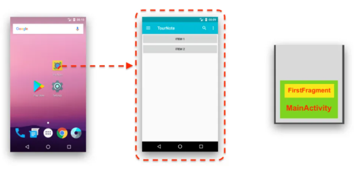

* Nếu lúc này đây người dùng nhấn nút Back từ hệ thống, 
  * dĩ nhiên là cả MainActivity và FirstFragment sẽ được lấy ra khỏi Back Stack, và xem như ứng dụng sẽ kết thúc. 
  * Vì bạn nên nhớ, FirstFragment hoàn toàn không được thêm vào MainActivity thông qua phương thức addToBackStack(), 
  nên nó không chiếm một ngăn cụ thể trong Back Stack, nó đang bị “dính” với MainActivity ở cùng một ngăn.
* Nhưng chúng ta không nhấn Back. Giả sử ở bước này bạn nhấn vào Button Item 1. Khi đó, như code của bài học trước, 
  * SecondFragment sẽ thay thế cho FirstFragment. Việc thay thế này có gọi đến addToBackStack(). 
  * Và khi đó, FirstFragment mới chính thức được đưa vào quản lý bởi Back Stack, 
  * còn SecondFragment sẽ hiển thị ở trên cùng. Mình minh họa Back Stack sẽ trông như thế này.

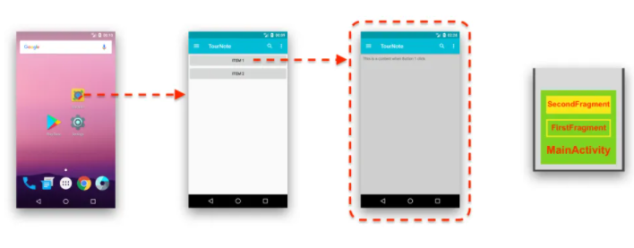

* Nhưng, nếu không có lời gọi addToBackStack() ở giai đoạn này thì sao? Thì tình huống sẽ bị thay đổi, 
  * khi này cái chỗ đang chứa FirstFragment ở Back Stack sẽ bị thay bằng SecondFragment luôn, 
  chứ không có tạo hai ô như hình trên đâu. 
  
* Tiếo theo, với Back Stack như trên kia, nếu người dùng nhấn Back. 
  * Thì cái nằm trên cùng của Back Stack lúc bấy giờ là SecondFragment. Sẽ bị lấy ra trước. 
  * MainActivity vẫn còn “sống”, với FirstFragment có sẵn từ trước đó. Nên mọi thứ sẽ trở về như ban đầu.

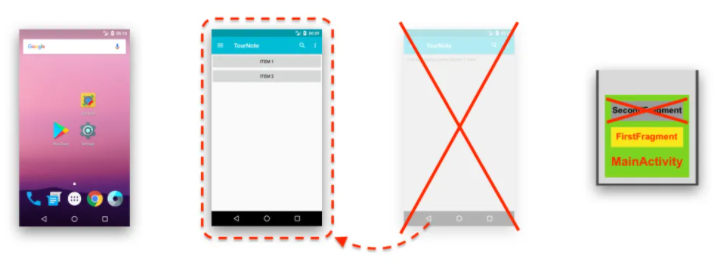

* FirstFragment lúc bấy giờ trở về là giao diện “dính” vào MainActivity như ban đầu, 
  * nên khi này nếu người dùng tiếp tục nhấn nút Back. Cả MainActivity và FirstFragment đều bị “xóa sổ”. 
  * Như hình minh họa tiếp theo.

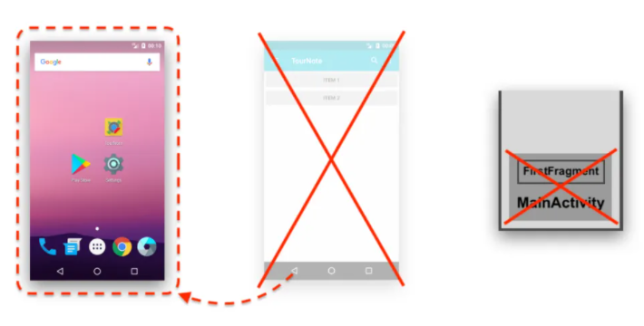

* Nếu bạn thử nghiệm addToBackStack() ở các dòng code khi gắn FirstFragment vào MainActivity, thì bạn có thể thấy, 
  * khi này FirstFragment sẽ là một ngăn trong Back Stack, 
  * và nút Back của người dùng như trên đây sẽ vẫn chưa hủy được MainActivity mà chỉ mới gỡ FirstFragment 
  ra khỏi Back Stack mà thôi.

## 28.2. Vòng Đời Fragment <a id="28.2"></a>
______________________________________________________________________________________
### 28.2.1. Sơ Đồ Minh Họa Vòng Đời Fragment <a id="28.2.1"></a>
______________________________________________________________________________________
* vòng đời Fragment cũng khá giống với vòng đời Activity mà bạn đã biết. 
* điểm khác biệt giữa Fragment Lifecycle với Activity Lifecycle là Fragment Lifecycle có nhiều phương thức callback hơn.

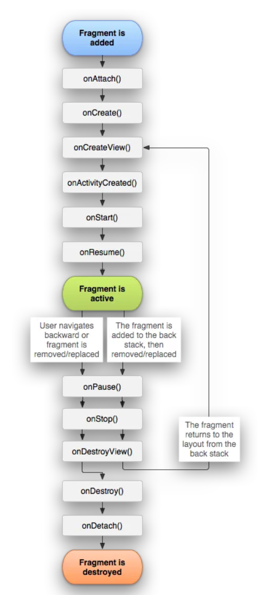

### 28.2.2. Mô Tả Sơ Đồ Vòng Đời Fragment <a id="28.2.2"></a>
______________________________________________________________________________________
* Sơ đồ bắt đầu khi Fragment được gắn vào Activity. Khi đó các callback sau được gọi lần lượt:
  * onAttach()
  * onCreate()
  * onCreateView()
  * onActivityCreated()
  * onStart()
  * onResume()
* Sau khi các callback trên được gọi, thì Fragment lúc bấy giờ mới chính thức được xem là đang chạy.
* Sau đó, nếu người dùng 
  * nhấn nút Back, 
  * hay có bất kỳ thao tác gỡ/thay thế (remove/replace) Fragment ra khỏi Activity nào, 
  * thì các callback sau sẽ được gọi
    * onPause()
    * onStop()
    * onDestroyView()
    * onDestroy()
    * onDetach()
  * khi các callback trên được gọi thì Fragment sẽ chính thức kết thúc vòng đời của nó
* Nhưng nếu Fragment được đưa vào Back Stack kèm với lệnh gỡ/thay thế, 
  * thì onDestroy() và onDetach() sẽ chưa được gọi ngay. 
  * Để khi rơi vào trường hợp sau đó khi Fragment này được hiển thị lại trong Back Stack, 
  * thì onCreateView() sẽ được gọi lại.

### 28.2.3. Các Trạng Thái Chính Trong Vòng Đời Fragment <a id="28.2.3"></a>
______________________________________________________________________________________
* các trạng thái chính này của Fragment cũng không khác gì với Activity cả.
* nhưng hãy xem các tình huống cụ thể liên quan với nhau giữa Fragment và Activity.

#### Hoạt Động (Active Hay Resume)
______________________________________________________________________________________
* Khi Fragment được gắn vào Activity, được nhìn thấy và có thể tương tác được.

#### Tạm Dừng (Pause)
______________________________________________________________________________________
* Cũng khá giống với trạng thái tạm dừng của Activity.
  * Tức là nếu Activity có chứa Fragment này bị che lấp bởi Activity khác (nhưng không bị che hoàn toàn, người dùng vẫn 
  nhìn thấy được Activity bị che lấp, chỉ là không tương tác được).
  * thì cả Activity và Fragment đó đều vào trạng thái tạm dừng.

#### Dừng (Stop)
______________________________________________________________________________________
* Cũng giống với Activity
  * Fragment bị dừng khi bị thành phần nào đó che khuất hoàn toàn. 
  * Hay bị gỡ ra khỏi Activity.
* Dừng chưa phải là kết thúc vòng đời của Fragment. 
  * Cụ thể là các trạng thái của nó vẫn còn được lưu trữ
  * để phòng trường hợp Fragment này được trở lại hiển thị cho người dùng.

#### Chết (Dead)
______________________________________________________________________________________
* Nếu Fragment bị gỡ ra khỏi Activity, nhưng không được đưa vào Back Stack trước đó, thì nó sẽ kết thúc vòng đời. 
* Hoặc khi Activity chứa Fragment này bị gỡ khỏi Back Stack, Fragment cũng sẽ chết theo.

### 28.2.4. Làm Quen Với Các Callback <a id="28.2.4"></a>
______________________________________________________________________________________
* Sau đây là ý nghĩa của từng callback

#### onAttach()
______________________________________________________________________________________
* Callback này được gọi khá sớm
  * ngay khi Activity chứa nó được kích hoạt. 
  * Hoặc ngay khi được gắn vào Activity.

* Callback này được gọi một lần duy nhất trong vòng đời Fragment. 
  * Và ở giai đoạn này Fragment đã “nhận biết” được Activity chứa nó rồi
  * nên bạn có thể tận dụng để kiểm tra sớm một số điều kiện nào đó 
  * ví dụ như các dòng code ở FirstFragment chúng ta đã từng làm.
```java
    @Override
    public void onAttach(@NonNull Context context) {
        super.onAttach(context);
        if (context instanceof OnFirstFragmentInteractionListener) {
            mListener = (OnFirstFragmentInteractionListener) context;
        } else {
            throw new RuntimeException(context.toString()
                    + " must implement OnFragmentInteractionListener");
        }
    }
```

#### onCreate()
______________________________________________________________________________________
* Callback này được gọi khi Fragment bắt đầu khởi tạo từ các dữ liệu đầu vào.
* Khác với onCreate() của Activity, rằng bạn có thể tạo giao diện cho màn hình ở callback này
* với Fragment chúng ta còn phải đợi qua callback tiếp theo mới có thể tạo giao diện được.
* Callback này cũng được gọi một lần trong vòng đời Fragment. 
  * Nên thường tận dụng để lấy dữ liệu từ bên ngoài truyền vào 
  * ví dụ như ở SecondFragment chúng ta có làm quen.
```java
    @Override
    public void onCreate(Bundle savedInstanceState) {
        super.onCreate(savedInstanceState);
        if (getArguments() != null) {
            mContent = getArguments().getString(ARG_CONTENT);
        }
    }
```

#### onCreateView()
______________________________________________________________________________________
* callback này được tận dụng cho các thiết lập về giao diện.
* callback này được gọi trong 2 trường hợp:
  * Khi Fragment bắt đầu vẽ UI lên màn hình.
  * Khi Fragment được hiển thị lại sau khi bị đưa vào Back Stack.
* Khi kết thúc callback này, hãy nhớ return một View 
  * như code ở với FirstFragment và SecondFragment. 
  * Lưu ý là chúng ta hoàn toàn có thể return null nếu Fragment không có UI.
* ví dụ ở FirstFragment
```java
    @Override
    public View onCreateView(LayoutInflater inflater, ViewGroup container,
                             Bundle savedInstanceState) {
        // Inflate the layout for this fragment
        View view = inflater.inflate(R.layout.fragment_first, container, false);

        Button btnItem1 = (Button) view.findViewById(R.id.btnItem1);
        Button btnItem2 = (Button) view.findViewById(R.id.btnItem2);
        
        btnItem1.setOnClickListener(new View.OnClickListener() {
            @Override
            public void onClick(View v) {
                if (mListener != null) {
                    mListener.onItemPressed("This is a content when Button 1 click");
                }
            }
        });

        btnItem2.setOnClickListener(new View.OnClickListener() {
            @Override
            public void onClick(View v) {
                if (mListener != null) {
                    mListener.onItemPressed("Hey, this is a Button 2 content");
                }
            }
        });

        return view;
    }
```
* ví dụ ở SecondFragment
```java
    @Override
    public View onCreateView(LayoutInflater inflater, ViewGroup container,
                             Bundle savedInstanceState) {
        // Inflate the layout for this fragment
        View view = inflater.inflate(R.layout.fragment_second, container, false);

        TextView tvContent = (TextView) view.findViewById(R.id.tvContent);
        if (!TextUtils.isEmpty(mContent)) {
            tvContent.setText(mContent);
        }

        return view;
    }
```

#### onActivityCreated()
______________________________________________________________________________________
* Callback này được gọi ngay sau khi onCreateView() được gọi. 
* Nó báo hiệu trạng thái Activity chứa nó được khởi tạo hoàn toàn. 
* Tuy ít được sử dụng hơn các callback khác, nhưng bạn cũng có thể tận dụng nó để 
  * thay đổi giao diện 
  * hay các tương tác với Activity chứa Fragment này thoải mái.

#### onStart()
______________________________________________________________________________________
* Khi Fragment bắt đầu được nhìn thấy bởi người dùng và chuẩn bị nhận tương tác.

#### onResume()
______________________________________________________________________________________
* Người dùng hoàn toàn nhìn thấy và tương tác được với Fragment.

#### onPause()
______________________________________________________________________________________
* Callback này như một dấu hiệu cho thấy rằng người dùng đang rời khỏi Fragment hiện tại. 
* Mặc dù không phải lúc nào onPause() được gọi là người dùng sẽ không còn sử dụng Fragment này. 
* Nhưng bạn nên sao lưu các dữ liệu cần thiết của Fragment ở callback này, nếu người dùng thực sự rời đi không quay lại.

#### onStop()
______________________________________________________________________________________
* Fragment chính thức không còn được nhìn thấy nữa.

#### onDestroyView()
______________________________________________________________________________________
* Chắc chắn là đối tượng View sẽ bị hủy ở callback này. 
* Và do đó các khởi tạo view của bạn ở onCreateView() sẽ nhanh chóng không còn nữa.
* Nếu như Fragment được đưa vào Back Stack, thì khi được lấy ra lại sau đó, callback onCreateView() sẽ được gọi lại.

#### onDestroy()
______________________________________________________________________________________
* Fragment đã sắp “chết”. 
* Nhưng khác với Activity, khi onDestroy() của Activity được gọi thì xem như Activity đã đến “cuối đời”. 
* Còn với Fragment, callback này chỉ như một lời “nhắc nhở” về vận mệnh của Fragment mà thôi.

#### onDetach()
______________________________________________________________________________________
* Callback này gọi đến báo hiệu Fragment sẽ được gỡ khỏi Activity đang chứa nó. Kết thúc vòng đời của Fragment.


______________________________________________________________________________________
______________________________________________________________________________________
______________________________________________________________________________________
# 29. Phân Loại Fragment <a id="29"></a>
______________________________________________________________________________________
* có nhiều loại Fragment, nhưng tất cả đều là lớp con của lớp Fragment
## 29.1. Fragment Cơ Bản <a id="29.1"></a>
______________________________________________________________________________________
* là loại Fragment đã thực hành ở những bài trước.
* Fragment cơ bản sẽ extends trực tiếp lớp Fragment.
* việc lựa chọn lớp Fragment tùy thuộc vào nhu cầu tương thích ngược của ứng dụng.

## 29.2. ListFragment <a id="29.2"></a>
______________________________________________________________________________________
* ListFragment là lớp kế thừa từ lớp Fragment.
* ListFragment giúp cho bạn có thể thiết kế ra một Fragment có chứa ListView một cách nhanh chóng.
* mặc dù chúng ta hoàn toàn có thể dùng Fragment cơ bản để thiết kế giao diện có chứa ListView.
* cũng như lớp Fragment cha, ListFragment vẫn được xây dựng trong hai gói riêng dành cho nhu cầu tương thích ngược.
  * android.app
  * android.support.v4.app (hiện tại mọi tương thích ngược đều sử dụng package androidx)
* ListFragment hay các kiến thức liên quan đến hiển thị UI dạng list này sẽ được nói đến cụ thể ở bài học về ListView.
* hiện tại ta sẽ thực hiện ví dụ với ListFragment. cách tạo Fragment như trước, tiến hành tạo bộ đôi Java và XML
  * SampleListFragment.java
  * listfragment_sample.xml
* tiến hành chỉnh sửa giao diện ở listfragment_sample.xml
```xml
<?xml version="1.0" encoding="utf-8"?>
<LinearLayout
        xmlns:android="http://schemas.android.com/apk/res/android"
        android:layout_width="match_parent"
        android:layout_height="match_parent"
        android:orientation="vertical" >

    <ListView
            android:id="@android:id/list"
            android:layout_width="match_parent"
            android:layout_height="wrap_content" >
    </ListView>

    <TextView
            android:id="@android:id/empty"
            android:layout_width="match_parent"
            android:layout_height="wrap_content" >
    </TextView>
</LinearLayout>
```
* tiến hành sửa đổi ở SampleListFragment.java
* SampleListFragment sẽ extends trực tiếp từ ListFragment chứ không phải từ Fragment
* Và implements sự kiện OnItemClickListener. 
* Với các callback của Fragment này vẫn dùng onCreateView() và onActivityCreated() 
  * để thiết kế giao diện 
  * và xây dựng adapter cho nó. 
* Tất cả những thông tin chi tiết này sẽ được nói rõ hơn ở bài học về ListView.
```java
public class ListFragmentSample extends ListFragment implements AdapterView.OnItemClickListener {
  
    private String[] planets = { "Sun", "Mercury", "Venus", "Earth", "Mars", "Jupiter", "Saturn", "Uranus", "Neptune" };
  
    public ListFragmentSample() {
        // Required empty public constructor
    }
  
    @Override
    public View onCreateView(LayoutInflater inflater, ViewGroup container,
                             Bundle savedInstanceState) {
        // Inflate the layout for this fragment
        return inflater.inflate(R.layout.fragment_list_fragment_sample, container, false);
    }
  
    @Override
    public void onActivityCreated(@Nullable Bundle savedInstanceState) {
        super.onActivityCreated(savedInstanceState);
        ArrayAdapter<String> adapter = new ArrayAdapter<String>(getActivity(), android.R.layout.simple_expandable_list_item_1, planets);
        setListAdapter(adapter);
        getListView().setOnItemClickListener(this);
    }
  
    @Override
    public void onItemClick(AdapterView<?> adapterView, View view, int position, long id) {
        Toast.makeText(getActivity(), "Item: " + position, Toast.LENGTH_SHORT).show();
    }
}
```
* Với layout của MainActivity, mình sử dụng cách hiển thị Fragment theo kiểu tĩnh. 
* file activity_main.xml sẽ như sau ở khu vực hiển thị Fragment.
```xml
<!-- Content -->
  
<LinearLayout
    android:id="@+id/activity_main_content"
    android:layout_width="match_parent"
    android:layout_height="match_parent"
    tools:context="com.yellowcode.tournote.MainActivity">
  
    <fragment
        android:layout_width="match_parent"
        android:layout_height="match_parent"
        android:name="com.yellowcode.tournote.ListFragmentSample"/>
  
</LinearLayout>
```
* Và nhờ sử dụng cách hiển thị Fragment theo kiểu tĩnh, chúng ta không cần làm gì nhiều với MainActivity.java
* chỉ cần đảm bảo xóa bỏ các dòng code add Fragment động từ các bài học trước, nếu có, ra khỏi code của MainActivity.java

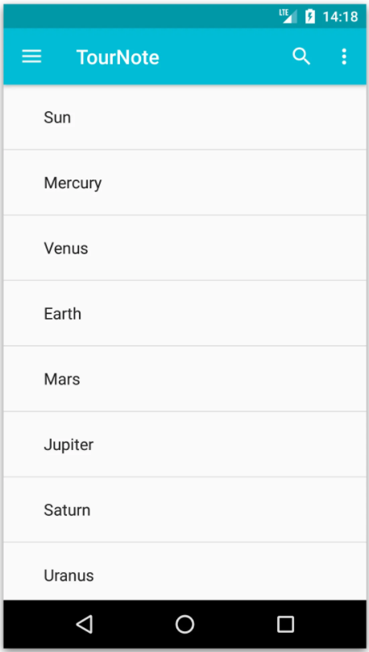

## 29.3. DialogFragment <a id="29.3"></a>
______________________________________________________________________________________
* lớp DialogFragment cũng kế thừa từ Fragment.
* Nếu như ListFragment là một dạng mở rộng nhưng khá là giống Fragment đến nỗi chúng ta hầu như cũng chẳng cần đến 
ListFragment nữa (so sánh theo tư tưởng khai triển code, qua bài về ListView bạn sẽ thấy rằng không dùng ListFragment 
cũng vẫn xây dựng được giao diện danh sách một cách tương tự). 
* Thì DialogFragment lại là một biến thể mới mẻ của Fragment. DialogFragment giúp tạo ra một dialog.
  * chính là một giao diện hiển thị đè lên trên giao diện khác 
  * và không che hoàn toàn giao diện bên dưới nó.
* DialogFragment được Android đưa ra nhằm thay thế cho Dialog cũ ngày xưa. 
* Dĩ nhiên là với DialogFragment thì chúng ta hoàn toàn có thể kế thừa được các callback từ vòng đời của Fragment. 
* Chi tiết về vấn đề này sẽ được mình nói đến ở bài học về Dialog sắp tới đây.
* Để xây dựng một DialogFragment “chơi chơi”, 
* bạn vẫn có thể tạo mới một Blank Fragment và vẫn không check chọn vào 
  * Include fragment factory methods
  * Include interface callbacks?.
* Mình giả sử với việc tạo một DialogFragment có tên là DialogFragmentSample.
  * DialogFragmentSample.java
  * fragment_dialog_fragment_sample.xml
* Thì giao diện của nó, fragment_dialog_fragment_sample.xml sẽ đại loại như sau.
```xml
<?xml version="1.0" encoding="utf-8"?>
<RelativeLayout xmlns:android="http://schemas.android.com/apk/res/android"
    xmlns:tools="http://schemas.android.com/tools"
    android:layout_width="match_parent"
    android:layout_height="match_parent" >
  
    <TextView
        android:layout_width="wrap_content"
        android:layout_height="wrap_content"
        android:layout_centerInParent="true"
        android:padding="10dp"
        android:text="This is content of DialogFragment" />
  
</RelativeLayout>
```
* Còn DialogFragmentSample.java, bạn nên kế thừa từ DialogFragment thay vì Fragment như các bài học trước.
* Chỉ cần một callback onCreateView() (hoặc onCreateDialog() mà bài học về Dialog chúng ta sẽ nói rõ hơn).
```java
public class DialogFragmentSample extends DialogFragment {
  
    public DialogFragmentSample() {
        // Required empty public constructor
    }
  
    @Override
    public View onCreateView(LayoutInflater inflater, ViewGroup container,
                             Bundle savedInstanceState) {
        // Inflate the layout for this fragment
        View view = inflater.inflate(R.layout.fragment_dialog_fragment_sample, container, false);
        getDialog().setTitle("This is title");
        return view;
    }
}
```
* Ở activity_main.xml chúng ta có thể thiết kế tạm một Button.
```xml
<!-- Content -->
  
<LinearLayout
    android:id="@+id/activity_main_content"
    android:layout_width="match_parent"
    android:layout_height="match_parent"
    android:gravity="center"
    tools:context="com.yellowcode.tournote.MainActivity">
  
    <Button
        android:id="@+id/activity_main_btn_show_dialogfragment"
        android:layout_width="wrap_content"
        android:layout_height="wrap_content"
        android:text="Show DialogFragment"/>
  
</LinearLayout>
```
* Để khi click vào Button đó ở MainActivity.java, chúng ta sẽ hiển thị DialogFragment như sau.
```java
Button btnShowDislogFragment = (Button) findViewById(R.id.activity_main_btn_show_dialogfragment);
btnShowDislogFragment.setOnClickListener(new View.OnClickListener() {
    @Override
    public void onClick(View view) {
        DialogFragmentSample dialogFragmentSample = new DialogFragmentSample();
        dialogFragmentSample.show(getSupportFragmentManager(), "Dialog Fragment");
    }
});
```

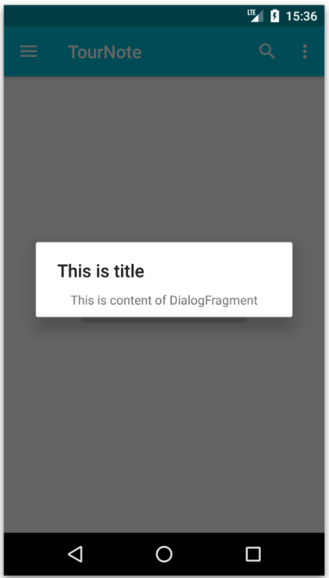


## 29.4. PreferenceFragment <a id="29.4"></a>
______________________________________________________________________________________
* PreferenceFragment cũng kế thừa từ Fragment.
* Thành phần này mang lại cho chúng ta một tùy chọn cho việc xây dựng giao diện cho màn hình Cài đặt (Settings) của ứng dụng.
* Tất nhiên ứng dụng nào cũng sẽ có vài tùy chọn cho người dùng thiết lập các thông số, như:
  * cho phép hiện thông báo lên notification hay không, 
  * hay thiết lập âm thanh cho một số chức năng nào đó,…
  * ất cả những tùy chọn này có thể được để vào trong màn hình Cài đặt.
* Và tất nhiên bạn có thể tự xây dựng loại màn hình này. 
* Tuy nhiên, việc sử dụng PreferenceFragment sẽ cho chúng ta 
  * một giao diện Cài đặt đồng nhất trên các ứng dụng có sử dụng FreferenceFragment 
  * và cả đồng nhất với màn hình Cài đặt của hệ thống nữa.
* Để nói sâu về cấu trúc của màn hình Cài đặt hay các thể loại Preference trong màn hình này là rất dài và nhiều kiến thức.
* Mình sẽ dành một bài riêng để nói về nó. Còn bài hôm nay chúng ta sẽ chỉ làm quen với các dòng code mẫu để hiểu thế nào là PreferenceFragment thôi nhé.
* Để thử nghiệm “vọc” chơi PreferenceFragment, thì bạn có thể tạo một Blank Fragment với việc không check chọn vào 
  * Include fragment factory methods?
  * Include interface callbacks?. 
  * Thậm chí bỏ luôn cả check chọn Create layout XML?, vì Fragment loại này không cần đến giao diện, 
  chúng ta sẽ dùng chính giao diện của hệ điều hành.
* Nói là không có giao diện cho PreferenceFragment, nhưng không hẳn là như vậy.
* Chúng ta chỉ dùng lại các loại Preference có sẵn từ Android, để làm giao diện cho nó, có thể xem kỹ hơn về thông 
tin này ở [link này](https://developer.android.com/guide/topics/ui/settings.html)
* Vậy việc đầu tiên sau khi chúng ta tạo PreferenceFragmentSample như trên kia, đó là thêm thư viện có hỗ trợ các loại Preference
  * chúng ta sẽ thêm vào dependencies của module.
  * ``implementation 'androidx.preference:preference:1.1.0'``
* Và đây là “giao diện” của PreferenceFragment. 
* Giao diện này được tạo ở thư mục **res/xml/** với tên là ``preferences.xml``. 
* Nội dung của giao diện này chính là các Preference định nghĩa sẵn bởi hệ thống.
```xml
<?xml version="1.0" encoding="utf-8"?>
<PreferenceScreen xmlns:android="http://schemas.android.com/apk/res/android">
  
    <PreferenceCategory
        android:title="First Section" >
  
        <CheckBoxPreference
            android:key="checkbox_preference"
            android:title="Checkbox Preference"
            android:defaultValue="true" />
  
        <EditTextPreference
            android:key="edittext_preference"
            android:title="Edit Text Preference"
            android:summary="This is a sample edit text preference."
            android:dialogTitle="Dialog Edit Text Preference"
            android:dependency="checkbox_preference" />
  
    </PreferenceCategory>
  
    <PreferenceCategory
        android:title="Second Section" >
  
        <ListPreference
            android:key="list_preference"
            android:title="List Preference"
            android:dialogTitle="Dialog List Preference"
            android:entries="@array/entries_list_preference"
            android:entryValues="@array/entryvalues_list_preference" />
  
        <Preference
            android:title="Custom Intent" >
  
            <intent android:action="android.intent.action.VIEW"
                android:data="https://yellowcodebooks.com/" />
  
        </Preference>
  
    </PreferenceCategory>
  
</PreferenceScreen>
```
* Giao diện này có sử dụng đến hai **resource string array** đã được khai báo như sau.
```xml
<string-array name="entries_list_preference">
    <item>Entry 1</item>
    <item>Entry 2</item>
    <item>Entry 3</item>
</string-array>
  
<string-array name="entryvalues_list_preference">
    <item>Value 1</item>
    <item>Value 2</item>
    <item>Value 3</item>
</string-array>
```
* Đến PreferenceFragmentSample.java
  * chúng ta nên kế thừa từ PreferenceFragment
  * sau đó chỉ định “giao diện” của Fragment này chính là file preferences.xml
  * mà chúng ta vừa tạo ra ở trên kia thông qua phương thức ``addPreferencesFromResource()`` như sau.
```java
public class PreferenceFragmentSample extends PreferenceFragment {
  
    public PreferenceFragmentSample() {
        // Required empty public constructor
    }
  
    @Override
    public void onCreate(@Nullable Bundle savedInstanceState) {
        super.onCreate(savedInstanceState);
  
        addPreferencesFromResource(R.xml.preferences);
    }
}
```
* Bạn có thể gắn Fragment này theo kiểu tĩnh như với ListFragmentSample trên kia vào MainActivity cho nhanh. 
* Kết quả của các đoạn code này khi thực thi sẽ được giao diện

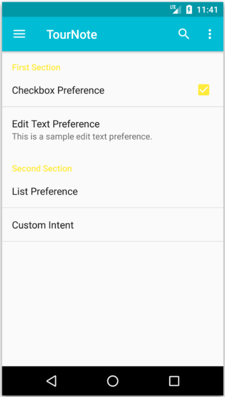

## 29.5. WebViewFragment <a id="29.5"></a>
______________________________________________________________________________________
* WebViewFragment đã bị deprecated in API level 28.
* WebViewFragment cũng được kế thừa từ Fragment.
* WebView là một vùng giao diện trên màn hình, mà ở đó chúng ta có thể hiển thị nội dung một trang web nào đó.
* Kiến thức về WebView rất thú vị, và mình dành một bài riêng để nói về nó sau này.
* WebViewFragment cũng là một Fragment mở rộng từ Fragment gốc, giúp thiết kế một Fragment với WebView bên trong nó một cách nhanh hơn. 
* Bạn có thể không cần phải sử dụng WebViewFragment mới có thể đặt WebView vào trong nó, bản thân Fragment cũng 
có thể làm được. 
* Code sau giúp bạn có cái nhìn ban đầu về WebView.
* Để thử nghiệm WebViewFragment, bạn cũng nên tạo một Blank Fragment với việc không check chọn
  * Include fragment factory methods? 
  * Include interface callbacks?
  * bỏ luôn cả check chọn Create layout XML? vì fragment loại này cũng không cần đến giao diện, vì là web mà, mọi giao diện đều dựa vào website hết cả rồi.
* Một điều hiển nhiên khi hiển thị một website, đó là bạn phải cần kết nối mạng.
* Dù cho thiết bị của bạn đã có kết nối rồi, thì bạn vẫn cần phải xin quyền được sử dụng kết nối mạng của hệ thống thông qua
  * thẻ ``uses-permission`` được định nghĩa thêm vào file ``AndroidManifest.xml`` bởi dòng sau.
```xml
<uses-permission android:name="android.permission.INTERNET" />
```
* Như mình đã nói, chúng ta chẳng cần đến giao diện, chỉ cần truyền url vào cho WebView như code dưới đây của file WebViewFragmentSample.java
```java
public class WebViewFragmentSample extends WebViewFragment {
  
  
    public WebViewFragmentSample() {
        // Required empty public constructor
    }
  
  
    @Override
    public View onCreateView(LayoutInflater inflater, ViewGroup container,
                             Bundle savedInstanceState) {
        View view = super.onCreateView(inflater, container, savedInstanceState);
  
        getWebView().getSettings().setJavaScriptEnabled(true);
        getWebView().getSettings().setSupportZoom(true);
        getWebView().getSettings().setBuiltInZoomControls(true);
        getWebView().loadUrl("https://yellowcodebooks.com/");
  
        return view;
    }
  
}
```

## 29.6. Thực Hành Xây Dựng Fragment Cho TourNote <a id="29.6"></a>
______________________________________________________________________________________
* xây dựng một Fragment, Fragment này có nhiệm vụ hiển thị nội dung trang web tương ứng với những gì mà user đã chọn lựa.
  * Cụ thể là, nếu từ MainActivity, nếu user chọn About app thì qua ContactActivity sẽ hiển thị trang Giới Thiệu
  * nếu user đã chọn Help thì qua ContactActivity sẽ hiển thị trang Liên Hệ.
* Nói rằng ContactActivity sẽ hiển thị, nhưng thực chất ContactActivity chứa đựng một WebViewFragment giúp đảm đương công việc này.

### 29.6.1. Tổ Chức Lại Package <a id="29.6.1"></a>
______________________________________________________________________________________
* nếu ứng dụng lớn và có nhiều file source code java, việc gom chung các file Fragment và Activity sẽ rất khó quản lí.
* ta cần tiến hành gom những file liên quan vào chung 1 package.
* ta sẽ tạo 2 package:
  * activities (chỉ chứa các file Activity)
  * fragments (chỉ chứa các file Fragment)
* để tạo mới package trong thư mục package mặc định của project ta thực hiện các bước sau:
  * chuột phải vào thư mục **java/[package name]/**
  * chọn **New** -> **Package**
  * Pop-up xuất hiện: đặt tên cho package muốn tạo
  * Enter
* Bước tiếp theo
  * click chọn cả hai ContactActivity và MainActivity ở cửa sổ Project bên trái
  * kéo chúng vào package activities vừa mới tạo cũng ở cửa sổ này. 
  * Popup xác nhận sau đó xuất hiện cứ nhấn vào nút Refactor.

### 29.6.2. Tạo Mới Fragment <a id="29.6.2"></a>
______________________________________________________________________________________
* trong package **fragments** tiến hành tạo AboutHelpFragment
  * không chọn Create layout XML?, vì giao diện Fragment này chính là web (để web lo giao diện).
  * Nhưng nhớ phải check chọn vào Include fragment factory methods? để Fragment này có thể nhận dữ liệu đầu vào là url.

### 29.6.3. Đừng Quên Permission <a id="29.6.3"></a>
______________________________________________________________________________________
* vì ứng dụng lúc này sẽ load 1 trang web từ internet, nên ta cần xin quyền sử dụng INTERNET từ user
* trong file ``AndroidManifest.xml``, định nghĩa 1 thẻ ``<uses-permission/>`` với tên quyền cần sử dụng là INTERNET
```xml
<uses-permission android:name="android.permission.INTERNET"/>
```
* file AndroidManifest.xml hoàn chỉnh
```xml
<?xml version="1.0" encoding="utf-8"?>
<manifest xmlns:android="http://schemas.android.com/apk/res/android"
    package="com.hienqp.tourbook">

    <uses-permission android:name="android.permission.INTERNET"/>
    
    <supports-screens
        android:largeScreens="true"
        android:normalScreens="true"
        android:smallScreens="false"
        android:xlargeScreens="true" />

    <application
        android:allowBackup="true"
        android:icon="@mipmap/ic_launcher"
        android:label="@string/app_name"
        android:roundIcon="@mipmap/ic_launcher_round"
        android:supportsRtl="true"
        android:theme="@style/Theme.TourBook">
        <activity
            android:name=".activities.ContactActivity"
            android:exported="true"></activity>
        <activity
            android:name=".activities.MainActivity"
            android:exported="true">
            <intent-filter>
                <action android:name="android.intent.action.MAIN" />

                <category android:name="android.intent.category.LAUNCHER" />
            </intent-filter>
        </activity>
    </application>

</manifest>
```

### 29.6.4. Xây Dựng AboutHelpFragment <a id="29.6.4"></a>
______________________________________________________________________________________
```java
package com.hienqp.tourbook.fragments;

import android.os.Bundle;

import android.view.LayoutInflater;
import android.view.View;
import android.view.ViewGroup;
import android.webkit.WebViewFragment;

import com.hienqp.tourbook.R;


public class AboutHelpFragment extends WebViewFragment {
    private static final String ARG_URL = "url";
    private String mUrl;

    public AboutHelpFragment() {
        // Required empty public constructor
    }

    public static AboutHelpFragment newInstance(String url) {
        AboutHelpFragment fragment = new AboutHelpFragment();
        Bundle args = new Bundle();
        args.putString(ARG_URL, url);
        fragment.setArguments(args);
        return fragment;
    }

    @Override
    public void onCreate(Bundle savedInstanceState) {
        super.onCreate(savedInstanceState);
        if (getArguments() != null) {
            mUrl = getArguments().getString(ARG_URL);
        }
    }

    @Override
    public View onCreateView(LayoutInflater inflater, ViewGroup container,
                             Bundle savedInstanceState) {
        View view =  super.onCreateView(inflater, container, savedInstanceState);

        getWebView().getSettings().setJavaScriptEnabled(true);
        getWebView().getSettings().setSupportZoom(true);
        getWebView().getSettings().setBuiltInZoomControls(true);
        getWebView().loadUrl(mUrl);

        return view;
    }
}
```

### 29.6.5. Chỉnh Sửa Giao Diện Của ContactActivity <a id="29.6.5"></a>
______________________________________________________________________________________
* sử dụng phương pháp hiển thị Fragment động ở ContactActivity.
* vì tùy theo tình huống user nhấn vào Button About hay Help ta sẽ hiển thị Fragment tương ứng với URL của mỗi Button.
* để hiển thị Fragment kiểu động trong ContactActivity thì ở file UI XML ta chỉ cần thêm 1 FrameLayout để chứa luân phiên các Fragment.
```xml
<?xml version="1.0" encoding="utf-8"?>
<androidx.constraintlayout.widget.ConstraintLayout xmlns:android="http://schemas.android.com/apk/res/android"
    xmlns:app="http://schemas.android.com/apk/res-auto"
    xmlns:tools="http://schemas.android.com/tools"
    android:layout_width="match_parent"
    android:layout_height="match_parent"
    tools:context=".activities.ContactActivity">

    <FrameLayout
        android:id="@+id/contactMainFrame"
        android:layout_width="match_parent"
        android:layout_height="match_parent"
        app:layout_constraintBottom_toBottomOf="parent"
        app:layout_constraintEnd_toEndOf="parent"
        app:layout_constraintStart_toStartOf="parent"
        app:layout_constraintTop_toTopOf="parent" />

</androidx.constraintlayout.widget.ConstraintLayout>
```

### 29.6.6. Thêm AboutHelpFragment Động Vào ContactActivity <a id="29.6.6"></a>
______________________________________________________________________________________
* ContactActivity.java sẽ được chỉnh sửa như sau:
```java
package com.hienqp.tourbook.activities;

import androidx.annotation.NonNull;
import androidx.appcompat.app.AppCompatActivity;

import android.app.FragmentManager;
import android.app.FragmentTransaction;
import android.content.Intent;
import android.os.Bundle;
import android.view.MenuItem;
import android.widget.Toast;

import com.hienqp.tourbook.R;
import com.hienqp.tourbook.fragments.AboutHelpFragment;

public class ContactActivity extends AppCompatActivity {
    public static final String KEY_SHOW_WHAT = "show_what";
    public static final String VALUE_SHOW_ABOUT = "show_about";
    public static final String VALUE_SHOW_HELP = "show_help";

    @Override
    protected void onCreate(Bundle savedInstanceState) {
        super.onCreate(savedInstanceState);
        setContentView(R.layout.activity_contact);

        // hiển thị nút Home trên ActionBar
        getSupportActionBar().setDisplayHomeAsUpEnabled(true);
        // cho phép tương tác nút Home trên ActionBar
        getSupportActionBar().setHomeButtonEnabled(true);

        Intent intent = getIntent();
        Bundle bundle = intent.getExtras();

        if (bundle != null) {
            String valueShow = bundle.getString(ContactActivity.KEY_SHOW_WHAT, "");
//            Toast.makeText(ContactActivity.this, "Show value: " + valueShow, Toast.LENGTH_SHORT).show();
            FragmentManager fragmentManager = getFragmentManager();
            FragmentTransaction fragmentTransaction = fragmentManager.beginTransaction();

            if (valueShow.equals(VALUE_SHOW_ABOUT)) {
                AboutHelpFragment aboutHelpFragment = AboutHelpFragment.newInstance("https://yellowcodebooks.com/about/");
                fragmentTransaction.add(R.id.contactMainFrame, aboutHelpFragment);
                fragmentTransaction.commit();
            } else if (valueShow.equals(VALUE_SHOW_HELP)) {
                AboutHelpFragment aboutHelpFragment = AboutHelpFragment.newInstance("https://yellowcodebooks.com/contact/");
                fragmentTransaction.add(R.id.contactMainFrame, aboutHelpFragment);
                fragmentTransaction.commit();
            }
        }

    }

    @Override
    public boolean onOptionsItemSelected(@NonNull MenuItem item) {
        switch (item.getItemId()) {
            case android.R.id.home:
                finish();
                return true;
        }
        return super.onOptionsItemSelected(item);
    }
}
```

______________________________________________________________________________________
______________________________________________________________________________________
______________________________________________________________________________________
# 30. Adapter & AdapterView Là Gì? <a id="30"></a>
______________________________________________________________________________________
* Adapter trong Android có chức năng:
  * chuyển đổi dữ liệu thô từ đầu vào DataSource
  * thành dữ liệu hiển thị lên View mà user có thể dễ dàng đọc, hiểu , tương tác được
* Hầu hết các ứng dụng không riêng ứng dụng di động, đều cần hiển thị 1 dạng giao diện đặc biệt: Danh Sách
  * danh sách các hình ảnh
  * danh sách các email
  * danh sách các ghi chú
  * ...
* Các danh sách có thể hiển thị theo:
  * chiều ngang
  * chiều dọc
  * dạng bảng (dạng lưới)
* các danh sách có thể hiển thị:
  * trên 1 vùng không gian màn hình
  * hay mỗi phần tử là 1 màn hình (view pager)
* các danh sách chứa rất nhiều loại phần tử, mỗi phần tử có thể là:
  * chỉ là text
  * chỉ là ảnh
  * cả ảnh và text
  * cả icon và text

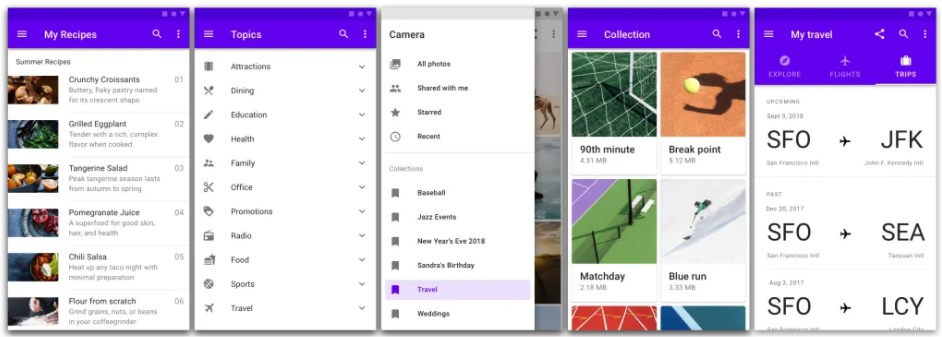

* để hiển thị những dạng danh sách đặc biệt phải dùng đến Adapter.
>**Adapter** sẽ chuyển đổi dữ liệu từ **DataSource** ban đầu thành 1 danh sách chuyên nghiệp (**AdapterView**)

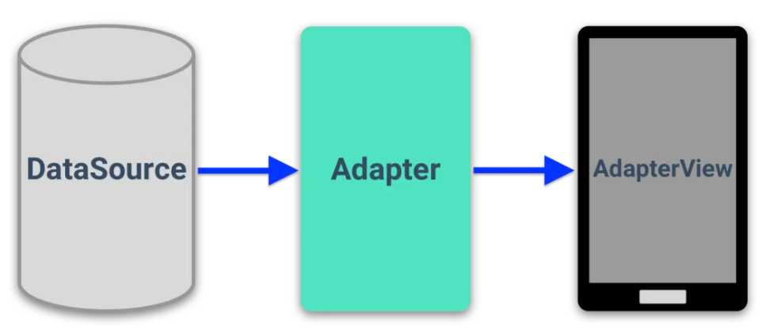

## 30.1. Những Kiến Thức Cần Tìm Hiểu Về Adapter, AdapterView, DataSource <a id="30.1"></a>
______________________________________________________________________________________
### 30.1.1. DataSource <a id="30.1.1"></a>
______________________________________________________________________________________
* DataSource thực ra là nguồn chứa dữ liệu đầu vào cho Adapter.
* cấu trúc chứa dữ liệu của DataSource có thể là mảng, List, ...
* Adapter sẽ có cách (hoặc ta tác động thêm) hiểu được các loại cấu trúc dữ liệu để chuyển chúng lên AdapterView cho user.

### 30.1.2. Adapter <a id="30.1.2"></a>
______________________________________________________________________________________
* có các loại Adapter sau:
  * ArrayAdapter
  * ExpandapleListAdapter
  * PagerAdapter
* với mỗi loại Adapter ta có thể tùy chỉnh (custom) sao cho các Adapter hoạt động theo nhu cầu.

### 30.1.3. AdapterView <a id="30.1.3"></a>
______________________________________________________________________________________
* có các loại AdapterView sau:
  * ListView
  * GridView
  * ExpandapleListView
  * Gallery
  * StackView
  * Spinner
  * RecylerView (bản chất không thuộc AdapterView nhưng công năng tương tự)

## 30.2. DataSource -> ArrayAdapter -> ListView <a id="30.2"></a>
______________________________________________________________________________________
* chúng ta sẽ sử dụng ArrayAdapter để chuyển dữ liệu từ DataSource là 1 mảng bất kỳ, hiển thị lên ListView.
* chọn ContactActivity.java để làm mẫu, vì ở Activity này còn đơn giản, dễ thao tác.

### 30.2.1. Xây Dựng DataSource <a id="30.2.1"></a>
______________________________________________________________________________________
* thực ra là tạo 1 mảng chứa các dữ liệu kiểu String.
```java
public class ContactActivity extends AppCompatActivity {
 
    // Các khai báo khác của lớp này cứ để nguyên vậy trong code của bạn, mình tạm ẩn đi cho bạn dễ nhìn
 
    private static final String[] items = {"lorem", "ipsum", "dolor",
            "sit", "amet", "consectetuer",
            "adipiscing", "elit", "morbi",
            "vel", "ligua", "vitae",
            "arcu", "aliquet", "mollis",
            "eiam", "vel", "erat",
            "placerat", "ante", "porttitor",
            "sodales", "pellentesque", "augue",
            "purus"};
 
    @Override
    protected void onCreate(Bundle savedInstanceState) {
        super.onCreate(savedInstanceState);
        setContentView(R.layout.activity_contact);
 
        // Các khai báo khác của lớp này cứ để nguyên vậy trong code của bạn, mình tạm ẩn đi cho bạn dễ nhìn
    }
 
    // Các khai báo khác của lớp này cứ để nguyên vậy trong code của bạn, mình tạm ẩn đi cho bạn dễ nhìn
}
```
* mảng items chính là DataSource

### 30.2.2. Xây Dựng AdapterView <a id="30.2.2"></a>
______________________________________________________________________________________
* AdapterView mà ta cần là ListView.
* bởi vì AdapterView thực chất là 1 View dùng để hiển thị lên màn hình, nên nó cũng có cách xây dựng như các View khác.
* AdapterView là View nên nó có thể được đặt vào giao diện của Activity.
* ở file UI XML của ContactActivity, chọn tab Design, trong Pallet danh sách các View, kéo ListView vào giao diện của ContactActivity.
* sau đó tiến hành canh chỉnh các thông số sao cho ListView chiếm hết giao diện của ContactActivity.
* đặt ID cho ListView là **my_listview**, ID này sẽ được Adapter gọi chỉ định đổ dữ liệu vào từ DataSource ở Java code.
* file UI XML của ContactActivity
```xml
<?xml version="1.0" encoding="utf-8"?>
<androidx.constraintlayout.widget.ConstraintLayout xmlns:android="http://schemas.android.com/apk/res/android"
    xmlns:app="http://schemas.android.com/apk/res-auto"
    xmlns:tools="http://schemas.android.com/tools"
    android:layout_width="match_parent"
    android:layout_height="match_parent"
    tools:context=".activities.ContactActivity">

    <ListView
        android:id="@+id/my_listview"
        android:layout_width="0dp"
        android:layout_height="0dp"
        app:layout_constraintBottom_toBottomOf="parent"
        app:layout_constraintEnd_toEndOf="parent"
        app:layout_constraintStart_toStartOf="parent"
        app:layout_constraintTop_toTopOf="parent" />
</androidx.constraintlayout.widget.ConstraintLayout>
```

### 30.2.3. Dùng Adapter Để Kết Nối DataSource Với AdapterView <a id="30.2.3"></a>
______________________________________________________________________________________
* chúng ta đã có DataSource, chính là mảng items chứa các String.
* chúng ta có AdapterView, chính là ListView dùng để hiển thị DataSource.
* tiến hành sử dụng 1 Adapter để kết nối DataSource và AdapterView lại với nhau.
* sử dụng ArrayAdapter trong ContactActivity để kết nối DataSource và AdapterView.
* code logic ở ContactActivity như sau:
```java
package com.hienqp.tourbook.activities;

import androidx.annotation.NonNull;
import androidx.appcompat.app.AppCompatActivity;

import android.os.Bundle;
import android.view.MenuItem;
import android.widget.ArrayAdapter;
import android.widget.ListView;

import com.hienqp.tourbook.R;

public class ContactActivity extends AppCompatActivity {
    public static final String KEY_SHOW_WHAT = "show_what";
    public static final String VALUE_SHOW_ABOUT = "show_about";
    public static final String VALUE_SHOW_HELP = "show_help";

    private static final String[] items = {"lorem", "ipsum", "dolor",
            "sit", "amet", "consectetuer",
            "adipiscing", "elit", "morbi",
            "vel", "ligua", "vitae",
            "arcu", "aliquet", "mollis",
            "eiam", "vel", "erat",
            "placerat", "ante", "porttitor",
            "sodales", "pellentesque", "augue",
            "purus"};

    @Override
    protected void onCreate(Bundle savedInstanceState) {
        super.onCreate(savedInstanceState);
        setContentView(R.layout.activity_contact);

        // khai báo 1 đối tượng ListView liên kết đến UI XML ListView
        ListView myListView = findViewById(R.id.my_listview);
        // khai báo đối tượng ArrayAdapter làm trung gian giữa DataSource là AdapterView
        ArrayAdapter<String> myArrayAdapter = new ArrayAdapter<>(ContactActivity.this, android.R.layout.simple_list_item_1, items);
        // gắn Adapter vào AdapterView
        myListView.setAdapter(myArrayAdapter);
    }

    @Override
    public boolean onOptionsItemSelected(@NonNull MenuItem item) {
        switch (item.getItemId()) {
            case android.R.id.home:
                finish();
                return true;
        }
        return super.onOptionsItemSelected(item);
    }
}
```
* giải thích:
  * ``ListView myListView = findViewById(R.id.my_listview);``
    * khai báo 1 đối tượng ListView liên kết với ListView UI XML
    * đối tượng ListView này sẽ được dùng để gắn Adapter lên nó, sau đó đổ dữ liệu lên UI
  * ``ArrayAdapter<String> myArrayAdapter = new ArrayAdapter<>(ContactActivity.this, android.R.layout.simple_list_item_1, items);``
    * khai báo 1 đối tượng ArrayAdapter, đối tượng này được chỉ định sẽ lấy dữ liệu kiểu String từ DataSource được chỉ định.
    * các tham số:
      * Context: ở đây Context là ContactActivity (nếu đang trong ContactActivity có thể chỉ cần truyền từ khóa ``this``)
      * ``android.R.layout.simple_list_item_1``: 1 trong các view được dựng sẵn của hệ thống, view này chỉ hiện thị đơn giản các text,
        hay ListView lúc này sẽ hiển thị danh sách các TextView, mỗi TextView hiển thị 1 String.
      * ``items``: DataSource đã khai báo trước đó là nơi dùng để lấy dữ liệu đổ lên ListView theo định dạng của tham số view thứ 2
  * ``myListView.setAdapter(myArrayAdapter);``
    * gắn Adapter vào AdapterView, lúc này AdapterView sẽ có dữ liệu từ DataSource
* sau khi thiết lập mọi thứ như trên, khi nhấn vào Button bất kỳ About hay Help (vì lúc này chưa tách bạch sự kiện click)
thì 1 danh sách các String sẽ hiển thị lên màn hình, đây là danh sách dạng scoll nên có thể kéo lên kéo xuống để xem hết
danh sách.


______________________________________________________________________________________
______________________________________________________________________________________
______________________________________________________________________________________
# 31. ListView Và ListActivity <a id="31"></a>
______________________________________________________________________________________
* ListView và ListActivity đều cùng là AdapterView dùng để hiện thị 1 danh sách theo chiều dọc màn hình.
* ListActivity khác ListView ở đặc điểm:
  * thời gian thiết kế ListActivity nhanh hơn.
  * có thể không cần đến file UI XML.

## 31.1. Xây Dựng ListActivity Không Cần Giao Diện XML <a id="31.1"></a>
______________________________________________________________________________________
* file activity_contact.xml
```xml
<?xml version="1.0" encoding="utf-8"?>
<androidx.constraintlayout.widget.ConstraintLayout xmlns:android="http://schemas.android.com/apk/res/android"
    xmlns:app="http://schemas.android.com/apk/res-auto"
    xmlns:tools="http://schemas.android.com/tools"
    android:layout_width="match_parent"
    android:layout_height="match_parent"
    tools:context=".activities.ContactActivity">

</androidx.constraintlayout.widget.ConstraintLayout>
```
* tiến hành chỉnh sửa lại ContactActivity sẽ hiển thị ListActivity mà không cần xây dựng UI XML cho ListActivity.
* thiết lập ContactActivity extends trực tiếp từ ListActivity.
```java
package com.hienqp.tourbook.activities;

import androidx.annotation.NonNull;
import android.app.ListActivity;
import android.os.Bundle;
import android.view.MenuItem;
import android.widget.ArrayAdapter;

public class ContactActivity extends ListActivity {
    public static final String KEY_SHOW_WHAT = "show_what";
    public static final String VALUE_SHOW_ABOUT = "show_about";
    public static final String VALUE_SHOW_HELP = "show_help";

    /** DataSource cho Adapter sử dụng*/
    private static final String[] items = {"lorem", "ipsum", "dolor",
            "sit", "amet", "consectetuer",
            "adipiscing", "elit", "morbi",
            "vel", "ligua", "vitae",
            "arcu", "aliquet", "mollis",
            "eiam", "vel", "erat",
            "placerat", "ante", "porttitor",
            "sodales", "pellentesque", "augue",
            "purus"};

    @Override
    protected void onCreate(Bundle savedInstanceState) {
        super.onCreate(savedInstanceState);

        /** nếu sử dụng ListActivity cho ContactActivity thì không cần setContentView
         * vì ListActivity có sẵn content là ListView cho chúng ta*/
//        setContentView(R.layout.activity_contact);

        /** ListActivity không hỗ trợ các tùy chọn hiển thị Button trên ActionBar
         * ListActivity sẽ hiển thị 1 ListView full màn hình 
         * hiển thị tùy chọn các Button trên ActionBar*/
//        // hiển thị nút Home trên ActionBar
//        getSupportActionBar().setDisplayHomeAsUpEnabled(true);
//        // cho phép tương tác nút Home trên ActionBar
//        getSupportActionBar().setHomeButtonEnabled(true);
        
        /** nếu sử dụng ListActivity, tức là có sẵn AdapterView chính là ListView
         * chỉ cần khai báo 1 Adapter, sau đó gắn Adapter vào ListView có sẵn mà không cần khai báo 1 ListView*/
        // khai báo Adapter (ArrayAdapter)
        ArrayAdapter<String> myArrayAdapter = new ArrayAdapter<>(ContactActivity.this, android.R.layout.simple_list_item_1, items);
        // gắn ArrayAdapter vào ContactActivity (lúc này là ListView của ListActivity)
        setListAdapter(myArrayAdapter);

    }

    @Override
    public boolean onOptionsItemSelected(@NonNull MenuItem item) {
        switch (item.getItemId()) {
            case android.R.id.home:
                finish();
                return true;
        }
        return super.onOptionsItemSelected(item);
    }
}
```
* giải thích:
  * ``setContentView(R.layout.activity_contact)``: phương thức set UI cho Activity khi vào ``onCreate()`` bị loại bỏ.
    * vì ContactActivity lúc này extends trực tiếp ListActivity.
    * mà ListActivity đã có UI sẵn là ListView bên trong nó.
    * nên khi ContactActivity extends ListActivity thì không cần phương thức để chỉ định giao diện cho nó nữa.
  * ``getSupportActionBar().setDisplayHomeAsUpEnabled(true);`` <br/>
    ``getSupportActionBar().setHomeButtonEnabled(true);``
    * ListActivity không hỗ trợ hiển thị ActionBar, nên phương thức ``getSupportActionBar()`` cũng bị loại bỏ.
  * ``ArrayAdapter<String> myArrayAdapter = new ArrayAdapter<>(ContactActivity.this, android.R.layout.simple_list_item_1, items);``
    * việc khai báo 1 Adapter là bắt buộc và không thay đổi, giữ nguyên như khi sử dụng ListView riêng biệt.
  * ``setListAdapter(myArrayAdapter);``
    * thực hiện gắn Adapter, nhưng không chỉ định gắn Adapter vào đâu.
    * vì lúc này ContactActivity extends ListActivity, nên ContactActivity mặc định đã có ListView là UI của nó.
    * nên việc gọi ``setListAdapter(Adapter)`` mặc định hệ thống biết là gắn vào ListView sẵn có.
* sau khi run chương trình, truy xuất đến ContactActivity, 1 ListView sẽ hiển thị nhưng không có Button Back trên ActionBar.
* nếu muốn hiển thị Button Back trên ActionBar thì phải set Theme về Theme.Holo.

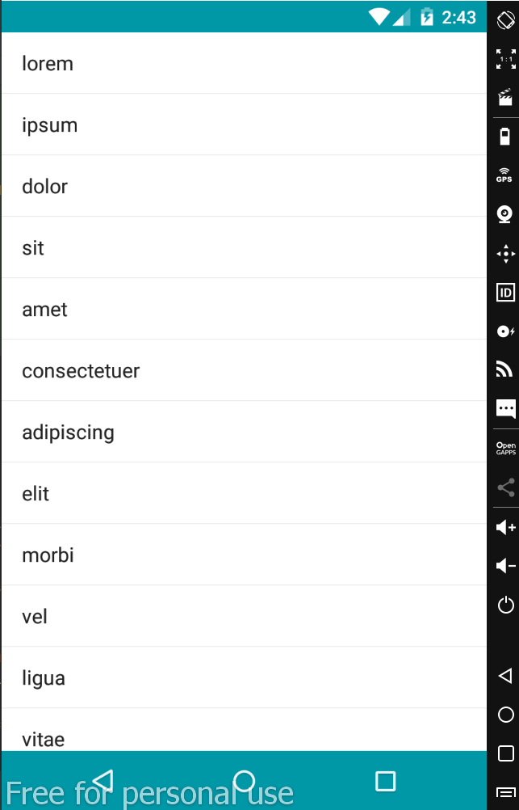

## 31.2. Xây Dựng ListActivity Với Giao Diện XML <a id="31.2"></a>
______________________________________________________________________________________
* với cách sử dụng ListActivity như trên, ta không cần xây dựng UI XML cho ListView trong ContactActivity.
* nhưng nếu yêu cầu có thêm 1 TextView bên cạnh ListView của ListActivity thì phải làm sao.
* lúc này bắt buộc ta phải chỉnh sửa thêm thắt vào ``activity_contact.xml``
* ``activity_contact.xml`` sẽ được thêm:
  * 1 ListView: phải là cài đặt thành ListView có ID của hệ thống (vì lúc này đang sử dụng ListView xây dựng sẵn của ListActivity)
  * 1 TextView: do ta custom
* file ``activity_contact.xml`` lúc này:
* với TextView ta custom bình thường.
* nhưng với ListView:
  * ID cho ListView lúc này luôn luôn phải là ``@android:id/list`` đó là quy định của ListActivity
  * hệ thống sẽ tìm đến ```@android:id/list``` để thiết lập Adapter cho nó thông qua phương thức ``setListAdapter()``
```xml
<?xml version="1.0" encoding="utf-8"?>
<androidx.constraintlayout.widget.ConstraintLayout xmlns:android="http://schemas.android.com/apk/res/android"
    xmlns:app="http://schemas.android.com/apk/res-auto"
    xmlns:tools="http://schemas.android.com/tools"
    android:layout_width="match_parent"
    android:layout_height="match_parent"
    tools:context=".activities.ContactActivity">

    <ListView
        android:id="@android:id/list"
        android:layout_width="0dp"
        android:layout_height="0dp"
        android:layout_marginTop="16dp"
        app:layout_constraintBottom_toBottomOf="parent"
        app:layout_constraintEnd_toEndOf="parent"
        app:layout_constraintStart_toStartOf="parent"
        app:layout_constraintTop_toBottomOf="@+id/myTextView"/>

    <TextView
        android:id="@+id/myTextView"
        android:layout_width="0dp"
        android:layout_height="wrap_content"
        android:layout_marginTop="16dp"
        android:gravity="center_horizontal"
        android:text="Bellow is a ListView"
        app:layout_constraintEnd_toEndOf="parent"
        app:layout_constraintStart_toStartOf="parent"
        app:layout_constraintTop_toTopOf="parent"/>

</androidx.constraintlayout.widget.ConstraintLayout>
```
* với giao diện như trên, ContactActivity.java lúc này có 1 đối tượng của riêng nó để quản lý, nên phải set UI cho nó.
* kích hoạt phương thức ``setContentView(R.layout.activity_contact);``
* ContactActivity.java
```java
package com.hienqp.tourbook.activities;

import androidx.annotation.NonNull;

import android.app.ListActivity;
import android.os.Bundle;
import android.view.MenuItem;
import android.widget.ArrayAdapter;

import com.hienqp.tourbook.R;

public class ContactActivity extends ListActivity {
    public static final String KEY_SHOW_WHAT = "show_what";
    public static final String VALUE_SHOW_ABOUT = "show_about";
    public static final String VALUE_SHOW_HELP = "show_help";

    /** DataSource cho Adapter sử dụng*/
    private static final String[] items = {"lorem", "ipsum", "dolor",
            "sit", "amet", "consectetuer",
            "adipiscing", "elit", "morbi",
            "vel", "ligua", "vitae",
            "arcu", "aliquet", "mollis",
            "eiam", "vel", "erat",
            "placerat", "ante", "porttitor",
            "sodales", "pellentesque", "augue",
            "purus"};

    @Override
    protected void onCreate(Bundle savedInstanceState) {
        super.onCreate(savedInstanceState);
        /** nếu sử dụng ListActivity kết hợp thêm 1 View khác bên cạnh ListView của ListActivity
         * ta cần phải set UI cho ContactActivity*/
        setContentView(R.layout.activity_contact);

        /** xây dụng Adapter (ArrayAdapter) và AdapterView (ListView)*/
//         //khai báo 1 đối tượng ListView liên kết đến UI XML ListView
//        ListView myListView = findViewById(R.id.my_listview);
//        // khai báo đối tượng ArrayAdapter làm trung gian giữa DataSource là AdapterView
//        ArrayAdapter<String> myArrayAdapter = new ArrayAdapter<>(ContactActivity.this, android.R.layout.simple_list_item_1, items);
//        // gắn Adapter vào AdapterView
//        myListView.setAdapter(myArrayAdapter);

        /** nếu sử dụng ListActivity, tức là có sẵn AdapterView chính là ListView
         * chỉ cần khai báo 1 Adapter, sau đó gắn Adapter vào ListView có sẵn mà không cần khai báo 1 ListView*/
        // khai báo Adapter (ArrayAdapter)
        ArrayAdapter<String> myArrayAdapter = new ArrayAdapter<>(ContactActivity.this, android.R.layout.simple_list_item_1, items);
        // gắn ArrayAdapter vào ContactActivity (lúc này là ListView của ListActivity)
        setListAdapter(myArrayAdapter);

    }

    @Override
    public boolean onOptionsItemSelected(@NonNull MenuItem item) {
        switch (item.getItemId()) {
            case android.R.id.home:
                finish();
                return true;
        }
        return super.onOptionsItemSelected(item);
    }
}
```

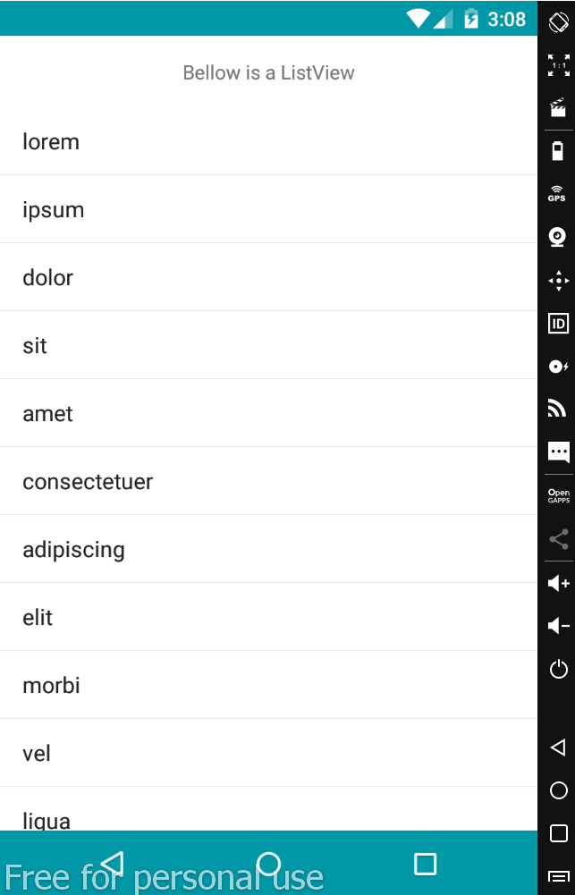

## 31.3. Sự Kiện Click Trên ListView <a id="31.3"></a>
______________________________________________________________________________________
* nếu ta thiết lập 1 View danh sách đơn thuần với:
  * DataSource
  * ArrayAdapter
  * ListView (do ta tự xây dựng)
* thì để thiết lập sự kiện khi click vào 1 phần tử bất kỳ trên ListView thì ta làm như sau:
* thông qua đối tượng ListView do ta tự xây dựng. gọi phương thức ``setOnItemClickListener()`` trong ``onCreate()``
* trong phương thức ``setOnItemClickListener()`` sẽ override phươn thức ``onItemClick()`` nơi ta sẽ xử lý logic cho sự kiện
* phương thức ``onItemClick()`` sẽ truyền vào 1 số tham số hữu dụng bởi hệ thống
  * ``int position``: là vị trí của phần tử được click trong ListView
* ở đây ta sẽ sử dụng cách xử lý đơn giản là Toast lên thông báo tên của phần tử được click ở vị trí position
* ``activity_contact.xml`` lúc này
```xml
<?xml version="1.0" encoding="utf-8"?>
<androidx.constraintlayout.widget.ConstraintLayout xmlns:android="http://schemas.android.com/apk/res/android"
    xmlns:app="http://schemas.android.com/apk/res-auto"
    xmlns:tools="http://schemas.android.com/tools"
    android:layout_width="match_parent"
    android:layout_height="match_parent"
    tools:context=".activities.ContactActivity">

    <ListView
        android:id="@+id/my_listview"
        android:layout_width="0dp"
        android:layout_height="0dp"
        app:layout_constraintBottom_toBottomOf="parent"
        app:layout_constraintEnd_toEndOf="parent"
        app:layout_constraintStart_toStartOf="parent"
        app:layout_constraintTop_toTopOf="parent" />

</androidx.constraintlayout.widget.ConstraintLayout>
```
* ``ContactActivity.java`` lúc này
```java
package com.hienqp.tourbook.activities;

import androidx.annotation.NonNull;
import androidx.appcompat.app.AppCompatActivity;

import android.os.Bundle;
import android.view.MenuItem;
import android.view.View;
import android.widget.AdapterView;
import android.widget.ArrayAdapter;
import android.widget.ListView;
import android.widget.Toast;

import com.hienqp.tourbook.R;

public class ContactActivity extends AppCompatActivity {
    public static final String KEY_SHOW_WHAT = "show_what";
    public static final String VALUE_SHOW_ABOUT = "show_about";
    public static final String VALUE_SHOW_HELP = "show_help";

    /** DataSource cho Adapter sử dụng*/
    private static final String[] items = {"lorem", "ipsum", "dolor",
            "sit", "amet", "consectetuer",
            "adipiscing", "elit", "morbi",
            "vel", "ligua", "vitae",
            "arcu", "aliquet", "mollis",
            "eiam", "vel", "erat",
            "placerat", "ante", "porttitor",
            "sodales", "pellentesque", "augue",
            "purus"};

    @Override
    protected void onCreate(Bundle savedInstanceState) {
        super.onCreate(savedInstanceState);
        /** nếu sử dụng ListActivity kết hợp thêm 1 View khác bên cạnh ListView của ListActivity
         * ta cần phải set UI cho ContactActivity*/
        setContentView(R.layout.activity_contact);

        /** nếu sử dụng ListActivity cho ContactActivity thì không cần setContentView
         * vì ListActivity có sẵn content là ListView cho chúng ta*/
//        setContentView(R.layout.activity_contact);

        /** ListActivity không hỗ trợ các tùy chọn hiển thị Button trên ActionBar
         * ListActivity sẽ hiển thị 1 ListView full màn hình
         * hiển thị tùy chọn các Button trên ActionBar*/
//        // hiển thị nút Home trên ActionBar
//        getSupportActionBar().setDisplayHomeAsUpEnabled(true);
//        // cho phép tương tác nút Home trên ActionBar
//        getSupportActionBar().setHomeButtonEnabled(true);

        /** thiết lập Intent truyền Bundle*/
//        Intent intent = getIntent();
//        Bundle bundle = intent.getExtras();
//
//        if (bundle != null) {
//            String valueShow = bundle.getString(ContactActivity.KEY_SHOW_WHAT, "");
//            Toast.makeText(ContactActivity.this, "Show value: " + valueShow, Toast.LENGTH_SHORT).show();

        /** xây dụng Adapter (ArrayAdapter) và AdapterView (ListView)*/
         //khai báo 1 đối tượng ListView liên kết đến UI XML ListView
        ListView myListView = findViewById(R.id.my_listview);
        // khai báo đối tượng ArrayAdapter làm trung gian giữa DataSource là AdapterView
        ArrayAdapter<String> myArrayAdapter = new ArrayAdapter<>(ContactActivity.this, android.R.layout.simple_list_item_1, items);
        // gắn Adapter vào AdapterView
        myListView.setAdapter(myArrayAdapter);
        /** xây dựng sự kiện click cho ListView do ta tự xây dựng*/
        myListView.setOnItemClickListener(new AdapterView.OnItemClickListener() {
            @Override
            public void onItemClick(AdapterView<?> parent, View view, int position, long id) {
                Toast.makeText(ContactActivity.this, items[position] + ": clicked", Toast.LENGTH_SHORT).show();
            }
        });

        /** nếu sử dụng ListActivity, tức là có sẵn AdapterView chính là ListView
         * chỉ cần khai báo 1 Adapter, sau đó gắn Adapter vào ListView có sẵn mà không cần khai báo 1 ListView*/
//        // khai báo Adapter (ArrayAdapter)
//        ArrayAdapter<String> myArrayAdapter = new ArrayAdapter<>(ContactActivity.this, android.R.layout.simple_list_item_1, items);
//        // gắn ArrayAdapter vào ContactActivity (lúc này là ListView của ListActivity)
//        setListAdapter(myArrayAdapter);

    }

    @Override
    public boolean onOptionsItemSelected(@NonNull MenuItem item) {
        switch (item.getItemId()) {
            case android.R.id.home:
                finish();
                return true;
        }
        return super.onOptionsItemSelected(item);
    }
}
```

## 31.4. Sự Kiện Click Trên ListActivity <a id="31.4"></a>
______________________________________________________________________________________
* trên UI sử dụng ListView mặc định của ListActivty kèm với TextView do ta xây dựng thêm.
* ta vẫn gọi đến phương thức ``setOnItemClickListener()`` nhưng phải thông qua phương thức ``getListView()``
* thông qua ``getListView()`` là vì với việc sử dụng ListActivty ta không có xây dựng cho riêng mình 1 đối tượng ListView.
* mà sử dụng đối tượng ListView của ListActivity.
* trong ``setOnItemClickListener()`` sẽ override phương thức ``onItemClick()``
* trong phương thức ``onItemClick()`` là nởi ta sẽ thiết lập logic cho sự kiện click, với các tham số được hệ thống truyền vào.
* ``activity_contact.xml`` lúc này
```xml
<?xml version="1.0" encoding="utf-8"?>
<androidx.constraintlayout.widget.ConstraintLayout xmlns:android="http://schemas.android.com/apk/res/android"
    xmlns:app="http://schemas.android.com/apk/res-auto"
    xmlns:tools="http://schemas.android.com/tools"
    android:layout_width="match_parent"
    android:layout_height="match_parent"
    tools:context=".activities.ContactActivity">

    <ListView
        android:id="@android:id/list"
        android:layout_width="0dp"
        android:layout_height="0dp"
        android:layout_marginTop="16dp"
        app:layout_constraintBottom_toBottomOf="parent"
        app:layout_constraintEnd_toEndOf="parent"
        app:layout_constraintStart_toStartOf="parent"
        app:layout_constraintTop_toBottomOf="@+id/myTextView"/>

    <TextView
        android:id="@+id/myTextView"
        android:layout_width="0dp"
        android:layout_height="wrap_content"
        android:layout_marginTop="16dp"
        android:gravity="center_horizontal"
        android:text="Bellow is a ListView"
        app:layout_constraintEnd_toEndOf="parent"
        app:layout_constraintStart_toStartOf="parent"
        app:layout_constraintTop_toTopOf="parent"/>

</androidx.constraintlayout.widget.ConstraintLayout>
```
* ``ContactActivity.java`` lúc này
```java
package com.hienqp.tourbook.activities;

import androidx.annotation.NonNull;

import android.app.ListActivity;
import android.os.Bundle;
import android.view.MenuItem;
import android.view.View;
import android.widget.AdapterView;
import android.widget.ArrayAdapter;
import android.widget.Toast;

import com.hienqp.tourbook.R;
import com.hienqp.tourbook.fragments.AboutHelpFragment;

public class ContactActivity extends ListActivity {
    public static final String KEY_SHOW_WHAT = "show_what";
    public static final String VALUE_SHOW_ABOUT = "show_about";
    public static final String VALUE_SHOW_HELP = "show_help";

    /** DataSource cho Adapter sử dụng*/
    private static final String[] items = {"lorem", "ipsum", "dolor",
            "sit", "amet", "consectetuer",
            "adipiscing", "elit", "morbi",
            "vel", "ligua", "vitae",
            "arcu", "aliquet", "mollis",
            "eiam", "vel", "erat",
            "placerat", "ante", "porttitor",
            "sodales", "pellentesque", "augue",
            "purus"};

    @Override
    protected void onCreate(Bundle savedInstanceState) {
        super.onCreate(savedInstanceState);
        /** nếu sử dụng ListActivity kết hợp thêm 1 View khác bên cạnh ListView của ListActivity
         * ta cần phải set UI cho ContactActivity*/
        setContentView(R.layout.activity_contact);

        /** nếu sử dụng ListActivity cho ContactActivity thì không cần setContentView
         * vì ListActivity có sẵn content là ListView cho chúng ta*/
//        setContentView(R.layout.activity_contact);

        /** ListActivity không hỗ trợ các tùy chọn hiển thị Button trên ActionBar
         * ListActivity sẽ hiển thị 1 ListView full màn hình
         * hiển thị tùy chọn các Button trên ActionBar*/
//        // hiển thị nút Home trên ActionBar
//        getSupportActionBar().setDisplayHomeAsUpEnabled(true);
//        // cho phép tương tác nút Home trên ActionBar
//        getSupportActionBar().setHomeButtonEnabled(true);
        
        /** xây dụng Adapter (ArrayAdapter) và AdapterView (ListView)*/
//         //khai báo 1 đối tượng ListView liên kết đến UI XML ListView
//        ListView myListView = findViewById(R.id.my_listview);
//        // khai báo đối tượng ArrayAdapter làm trung gian giữa DataSource là AdapterView
//        ArrayAdapter<String> myArrayAdapter = new ArrayAdapter<>(ContactActivity.this, android.R.layout.simple_list_item_1, items);
//        // gắn Adapter vào AdapterView
//        myListView.setAdapter(myArrayAdapter);
//        /** xây dựng sự kiện click cho ListView do ta tự xây dựng*/
//        myListView.setOnItemClickListener(new AdapterView.OnItemClickListener() {
//            @Override
//            public void onItemClick(AdapterView<?> parent, View view, int position, long id) {
//                Toast.makeText(ContactActivity.this, items[position] + ": clicked", Toast.LENGTH_SHORT).show();
//            }
//        });

        /** nếu sử dụng ListActivity, tức là có sẵn AdapterView chính là ListView
         * chỉ cần khai báo 1 Adapter, sau đó gắn Adapter vào ListView có sẵn mà không cần khai báo 1 ListView*/
        // khai báo Adapter (ArrayAdapter)
        ArrayAdapter<String> myArrayAdapter = new ArrayAdapter<>(ContactActivity.this, android.R.layout.simple_list_item_1, items);
        // gắn ArrayAdapter vào ContactActivity (lúc này là ListView của ListActivity)
        setListAdapter(myArrayAdapter);
        /** xây dựng sự kiện click cho ListView của ListActivity*/
        getListView().setOnItemClickListener(new AdapterView.OnItemClickListener() {
            @Override
            public void onItemClick(AdapterView<?> parent, View view, int position, long id) {
                Toast.makeText(ContactActivity.this, items[position] +": click", Toast.LENGTH_SHORT).show();
            }
        });

    }

    @Override
    public boolean onOptionsItemSelected(@NonNull MenuItem item) {
        switch (item.getItemId()) {
            case android.R.id.home:
                finish();
                return true;
        }
        return super.onOptionsItemSelected(item);
    }
}
```

## 31.5. Sự Kiện Click Trên ListView <a id="31.5"></a>
______________________________________________________________________________________
* phương thức bắt sự kiện click nhanh trên ListView
```java
listView.setOnItemClickListener(new AdapterView.OnItemClickListener() {
    @Override
    public void onItemClick(AdapterView<?> parent, View view, int position, long id) {
        Toast.makeText(MainActivity.this, arrayCource.get(position) + ": ID " + id + " clicked ", Toast.LENGTH_SHORT).show();
    }
});
```
* phương thức bắt sự kiện click lâu (long click) trên ListView
```java
listView.setOnItemLongClickListener(new AdapterView.OnItemLongClickListener() {
    @Override
    public boolean onItemLongClick(AdapterView<?> parent, View view, int position, long id) {
        Toast.makeText(MainActivity.this, arrayCource.get(position) + ": setOnItemLongClickListener", Toast.LENGTH_SHORT).show();
        return false;
    }
});
```

## 31.6. Thêm, Xóa, Sửa Trên ListView <a id="31.6"></a>
______________________________________________________________________________________
* sau khi thực hiện thêm xóa sửa dữ liệu trong DataSource, ta phải cập nhật lại dữ liệu trong Adapter, bằng phương thức.
* ``arrayAdapter.notifyDataSetChanged();``
* thêm
```java
buttonAddCourse.setOnClickListener(new View.OnClickListener() {
    @Override
    public void onClick(View v) {
        String course = editTextCource.getText().toString();
        if (!course.isEmpty()) {
            arrayCource.add(course);
            arrayAdapter.notifyDataSetChanged();
        }
    }
});
```
* xóa
```java
listViewCourse.setOnItemLongClickListener(new AdapterView.OnItemLongClickListener() {
    @Override
    public boolean onItemLongClick(AdapterView<?> parent, View view, int position, long id) {
        arrayCource.remove(position);
        arrayAdapter.notifyDataSetChanged();
        return false;
    }
});
```
* sửa
```java
buttonUpdate.setOnClickListener(new View.OnClickListener() {
    @Override
    public void onClick(View v) {
        arrayCource.set(currentPositionOnArrayCourse, editTextCource.getText().toString());
        arrayAdapter.notifyDataSetChanged();
    }
});
```

______________________________________________________________________________________
______________________________________________________________________________________
______________________________________________________________________________________
# 32. Custom Adapter - ListView Nâng Cao - Tạo Class Data - Tạo DataSource - Tủy Chỉnh Adapter Dựa Vào BaseAdapter <a id="32"></a>
______________________________________________________________________________________

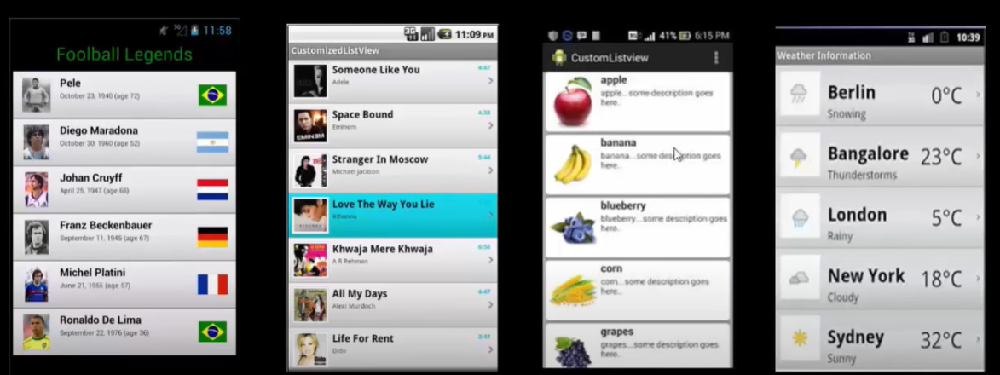

* tạo class ``Fruit.java``
```java
package com.hienqp.listviewnangcao;

public class Fruit {
    private int fruitPhoto;
    private String fruitName;
    private String fruitDescription;

    public Fruit(int fruitPhoto, String fruitName, String fruitDescription) {
        this.fruitPhoto = fruitPhoto;
        this.fruitName = fruitName;
        this.fruitDescription = fruitDescription;
    }

    public int getFruitPhoto() {
        return fruitPhoto;
    }

    public void setFruitPhoto(int fruitPhoto) {
        this.fruitPhoto = fruitPhoto;
    }

    public String getFruitName() {
        return fruitName;
    }

    public void setFruitName(String fruitName) {
        this.fruitName = fruitName;
    }

    public String getFruitDescription() {
        return fruitDescription;
    }

    public void setFruitDescription(String fruitDescription) {
        this.fruitDescription = fruitDescription;
    }
}
```
* tạo ``item_fruit_listview.xml``
* đây là UI do ta custom của 1 Item trong ListView
```xml
<?xml version="1.0" encoding="utf-8"?>
<RelativeLayout 
    xmlns:android="http://schemas.android.com/apk/res/android"
    android:layout_width="match_parent"
    android:layout_height="match_parent">

    <ImageView
        android:id="@+id/imageview_fruit_photo"
        android:layout_width="120dp"
        android:layout_height="120dp"
        android:padding="10dp" />

    <TextView
        android:textStyle="bold"
        android:layout_width="wrap_content"
        android:layout_height="wrap_content"
        android:text="Fruit Name"
        android:layout_marginTop="10dp"
        android:layout_toRightOf="@id/imageview_fruit_photo"
        android:id="@+id/textview_fruit_name"
        android:textColor="#FF0000"
        android:textSize="25sp"/>

    <TextView
        android:textStyle="italic"
        android:layout_width="wrap_content"
        android:layout_height="wrap_content"
        android:id="@+id/textview_fruit_description"
        android:layout_below="@id/textview_fruit_name"
        android:layout_toRightOf="@id/imageview_fruit_photo"
        android:textColor="#000000"
        android:layout_marginTop="10dp"
        android:textSize="15sp"
        android:text="Fruit Description"/>


</RelativeLayout>
```
* tạo ``FruitAdapter.java extends BaseAdapter``
* implement các phương thức của BaseAdapter.
```java
package com.hienqp.listviewnangcao;

import android.content.Context;
import android.view.LayoutInflater;
import android.view.View;
import android.view.ViewGroup;
import android.widget.BaseAdapter;
import android.widget.ImageView;
import android.widget.TextView;

import java.util.List;

public class FruitAdapter extends BaseAdapter {
    // Context, là Activity chỉ định
    // biến này sẽ được dùng để chỉ định nơi layout item sẽ hiển thị
    private Context context;
    // UI XML của từng item hiển thị trên ListView mà ta đã xây dựng sẵn, tương tự như android.R.layout.simple_layout_item_1 của hệ thống
    private int layoutItem;
    // List danh sách chứa các đối tượng Fruit
    private List<Fruit> fruitList;

    public FruitAdapter(Context context, int layoutItem, List<Fruit> fruitList) {
        this.context = context;
        this.layoutItem = layoutItem;
        this.fruitList = fruitList;
    }

    // trả về số dòng cho ListView
    // lấy số lượng phần tử trong fruitList trả về số dòng cho ListView
    @Override
    public int getCount() {
        return fruitList.size();
    }

    // trả về đối tượng item trong ListView
    // phương thức này chưa cần sử dụng, để mặc định
    @Override
    public Object getItem(int position) {
        return null;
    }

    // trả về ID của đối tượng item trong ListView
    // phương thức này chưa cần sử dụng, để mặc định
    @Override
    public long getItemId(int position) {
        return 0;
    }

    // phương thức trả về 1 View (item) trên ListView
    @Override
    public View getView(int position, View convertView, ViewGroup parent) {
        LayoutInflater inflater = (LayoutInflater) context.getSystemService(Context.LAYOUT_INFLATER_SERVICE);
        convertView = inflater.inflate(layoutItem, null);

        // ánh xạ
        ImageView fruitPhoto = (ImageView) convertView.findViewById(R.id.imageview_fruit_photo);
        TextView fruitName = (TextView) convertView.findViewById(R.id.textview_fruit_name);
        TextView fruitDescription = (TextView) convertView.findViewById(R.id.textview_fruit_description);

        // gán giá trị
        Fruit fruit = fruitList.get(position);

        fruitPhoto.setImageResource(fruit.getFruitPhoto());
        fruitName.setText(fruit.getFruitName());
        fruitDescription.setText(fruit.getFruitDescription());

        return convertView;
    }
}
```
* file ``MainActivity.java``
```java
package com.hienqp.listviewnangcao;

import androidx.appcompat.app.AppCompatActivity;

import android.os.Bundle;
import android.widget.ListView;

import java.util.ArrayList;

public class MainActivity extends AppCompatActivity {
    ListView listViewFruit;
    ArrayList<Fruit> fruitArrayList;
    FruitAdapter fruitAdapter;

    @Override
    protected void onCreate(Bundle savedInstanceState) {
        super.onCreate(savedInstanceState);
        setContentView(R.layout.activity_main);

        AnhXa();

        fruitAdapter = new FruitAdapter(MainActivity.this, R.layout.item_fruit_listview, fruitArrayList);
        listViewFruit.setAdapter(fruitAdapter);
    }

    private void AnhXa() {
        listViewFruit = (ListView) findViewById(R.id.listview_fruit);
        fruitArrayList = new ArrayList<>();

        fruitArrayList.add(new Fruit(R.drawable.dautay,"Dâu Tây", "Dâu Tây Đà Lạt"));
        fruitArrayList.add(new Fruit(R.drawable.cam,"Cam Sành", "Cam Sành Vĩnh Long"));
        fruitArrayList.add(new Fruit(R.drawable.chuoi,"Chuối", "Chuối Long An"));
        fruitArrayList.add(new Fruit(R.drawable.luu,"Lựu", "Lựu Hưng Yên"));
        fruitArrayList.add(new Fruit(R.drawable.nho,"Nho", "Nho Bình Thuận"));
        fruitArrayList.add(new Fruit(R.drawable.tao,"Táo", "Táo Lạng Sơn"));
    }
}
```

______________________________________________________________________________________
______________________________________________________________________________________
______________________________________________________________________________________
# 33. Custom Adapter - ListView Nâng Cao - Sử Dụng ViewHolder <a id="33"></a>
______________________________________________________________________________________
* với cài đặt FruitAdapter như trên, mỗi lần user cuộn màn hình, sẽ có những item bị ẩn, và item được hiển thị.
* mỗi lần hiển thị như vậy, FruitAdapter lại phải gọi lại phương thức ``getView()`` của nó, gây tốn tài nguyên cho việc xử lý lại.
* vì vậy ta sẽ sử dụng ViewHolder để giảm thiểu việc load lại ListView và cải thiện tốc độ hiển thị.
* trong FruitAdapter ta khai báo 1 lớp ``private class ViewHolder`` bên trong nó.
* ViewHolder có nhiệm vụ lưu trữ trạng thái của 1 item sau khi đã được ánh xạ, tránh việc phải lặp lại tiến trình xử lý.
```java
package com.hienqp.viewholder;

import android.content.Context;
import android.view.LayoutInflater;
import android.view.View;
import android.view.ViewGroup;
import android.widget.BaseAdapter;
import android.widget.ImageView;
import android.widget.TextView;

import java.util.List;

public class FruitAdapter extends BaseAdapter {
    // Context, là Activity chỉ định sẽ hiển thị
    private Context context;
    // UI XML của từng item hiển thị trên ListView mà ta đã xây dựng sẵn, tương tự như android.R.layout.simple_layout_item_1 của hệ thống
    private int layoutItem;
    // List danh sách chứa các đối tượng Fruit
    private List<Fruit> fruitList;

    public FruitAdapter(Context context, int layoutItem, List<Fruit> fruitList) {
        this.context = context;
        this.layoutItem = layoutItem;
        this.fruitList = fruitList;
    }

    // trả về số dòng cho ListView
    // lấy số lượng phần tử trong fruitList trả về số dòng cho ListView
    @Override
    public int getCount() {
        return fruitList.size();
    }

    // trả về đối tượng item trong ListView
    // phương thức này chưa cần sử dụng, để mặc định
    @Override
    public Object getItem(int position) {
        return null;
    }

    // trả về ID của đối tượng item trong ListView
    // phương thức này chưa cần sử dụng, để mặc định
    @Override
    public long getItemId(int position) {
        return 0;
    }

    // khai báo 1 private class ViewHolder
    private class ViewHolder {
        ImageView imageViewPhoto;
        TextView textViewName, textViewDescription;
    }

    // phương thức trả về mỗi View (item) cho ListView
    @Override
    public View getView(int position, View convertView, ViewGroup parent) {
        /** Sử dụng ViewHolder*/
        ViewHolder viewHolder;

        // kiểm tra convertView (item) đã được load lên ListView chưa
        // nếu chưa load (==null) ta mới tiến hành tạo ánh xạ
        if (convertView == null) {
            LayoutInflater inflater = (LayoutInflater) context.getSystemService(Context.LAYOUT_INFLATER_SERVICE);
            convertView = inflater.inflate(layoutItem, null);

            viewHolder = new ViewHolder();
            // ánh xạ
            // bây giờ giá trị của item sẽ được lưu giữ trong viewHolder
            viewHolder.imageViewPhoto = (ImageView) convertView.findViewById(R.id.imageview_fruit_photo);
            viewHolder.textViewName = (TextView) convertView.findViewById(R.id.textview_fruit_name);
            viewHolder.textViewDescription = (TextView) convertView.findViewById(R.id.textview_fruit_description);
            // sau khi có viewHolder setTag() nó cho convertView (item), lúc này item đã có giá trị
            convertView.setTag(viewHolder);
        } else {
            // viewHolder đã được setTag() cho convertView, chỉ việc lấy viewHolder ra sử dụng
            viewHolder = (ViewHolder) convertView.getTag();
        }
        // gán giá trị
        Fruit fruit = fruitList.get(position);

        // gán giá trị cho viewHolder giữ
        viewHolder.imageViewPhoto.setImageResource(fruit.getFruitPhoto());
        viewHolder.textViewName.setText(fruit.getFruitName());
        viewHolder.textViewDescription.setText(fruit.getFruitDescription());


        /** không sử dụng ViewHolder*/
//        LayoutInflater inflater = (LayoutInflater) context.getSystemService(Context.LAYOUT_INFLATER_SERVICE);
//        convertView = inflater.inflate(layoutItem, null);
//        // ánh xạ
//        ImageView fruitPhoto = (ImageView) convertView.findViewById(R.id.imageview_fruit_photo);
//        TextView fruitName = (TextView) convertView.findViewById(R.id.textview_fruit_name);
//        TextView fruitDescription = (TextView) convertView.findViewById(R.id.textview_fruit_description);

//        // gán giá trị
//        Fruit fruit = fruitList.get(position);
        
          // gán giá trị đối tượng Fruit
//        fruitPhoto.setImageResource(fruit.getFruitPhoto());
//        fruitName.setText(fruit.getFruitName());
//        fruitDescription.setText(fruit.getFruitDescription());

        return convertView;
    }
}
```

______________________________________________________________________________________
______________________________________________________________________________________
______________________________________________________________________________________
# 34. AdapterView - GridView <a id="34"></a>
______________________________________________________________________________________
* GridView là dạng AdapterView cũng là hiển thị danh sách, nhưng hình thức các View sẽ hiển thị ở dạng các ô (bảng, lưới).
* vì vậy cấu hình GridView cũng tương tự ListView.
* tạo mới Project.
* trong activity_main.xml, kéo thả vào 1 GridView
* vào MainActivity.java khai báo ánh xạ GridView
```java
package com.hienqp.gridview;

import androidx.appcompat.app.AppCompatActivity;

import android.os.Bundle;
import android.widget.ArrayAdapter;
import android.widget.GridView;


public class MainActivity extends AppCompatActivity {
    GridView gridViewName; // AdapterView
    String[] arrayName = {"A","B","C","D","E","F","G","H","I","J","K","L","M","N","O","P","Q","R","S","T","U","V","W","X","Y","Z"};

    @Override
    protected void onCreate(Bundle savedInstanceState) {
        super.onCreate(savedInstanceState);
        setContentView(R.layout.activity_main);

        gridViewName = (GridView) findViewById(R.id.gridview_name);

        ArrayAdapter arrayAdapter = new ArrayAdapter(MainActivity.this, android.R.layout.simple_list_item_1, arrayName);

        gridViewName.setAdapter(arrayAdapter);
    }
}
```
* khi run chương trình

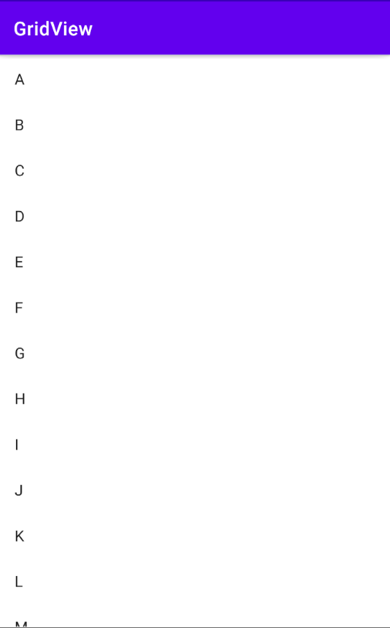

* nó hiển thị dạng danh sách 1 chiều tương tự như ListView mặc dù ta sử dụng GridView.
* trong GridView có 1 số thuộc tính hữu dụng:
  * ``android:numColumns="6"``
    * chỉ định số lượng cột sẽ hiển thị trong GridView
    * hoặc có thể truyền giá trị ``autofit`` (thường sẽ hiển thị 2 cột)
  * ``android:horizontalSpacing="5dp"`` <br/>
    ``android:verticalSpacing="5dp"``
    * chỉ định khoảng cách giữa các item trong GridView
* trong GridView ta cũng có thể bắt sự kiện click vào item tương tự như ListView.
* thông qua GridView ta có thể gọi 1 trong 2 phương thức sau để bắt sự kiện
  * ``GridView.setOnItemClickListener()``
  * ``GridView.setOnItemLongClickListener()``
    * bên trong 2 phương thức trên ta override lại ``onItemClick()`` và xử lý sự kiện trong đây
```java
package com.hienqp.gridview;

import androidx.appcompat.app.AppCompatActivity;

import android.os.Bundle;
import android.view.View;
import android.widget.AdapterView;
import android.widget.ArrayAdapter;
import android.widget.GridView;
import android.widget.Toast;


public class MainActivity extends AppCompatActivity {
    // AdapterView
    GridView gridViewName;
    // DataSource
    String[] arrayName = {"A","B","C","D","E","F","G","H","I","J","K","L","M","N","O","P","Q","R","S","T","U","V","W","X","Y","Z"};

    @Override
    protected void onCreate(Bundle savedInstanceState) {
        super.onCreate(savedInstanceState);
        setContentView(R.layout.activity_main);

        gridViewName = (GridView) findViewById(R.id.gridview_name);

        ArrayAdapter arrayAdapter = new ArrayAdapter(MainActivity.this, android.R.layout.simple_list_item_1 , arrayName);

        gridViewName.setAdapter(arrayAdapter);

        gridViewName.setOnItemClickListener(new AdapterView.OnItemClickListener() {
            @Override
            public void onItemClick(AdapterView<?> parent, View view, int position, long id) {
                Toast.makeText(MainActivity.this, String.valueOf(position), Toast.LENGTH_SHORT).show();
            }
        });
    }
}
```

______________________________________________________________________________________
______________________________________________________________________________________
______________________________________________________________________________________
# 35. AdapterView - GridView Nâng Cao <a id="35"></a>
______________________________________________________________________________________
* sử dụng GridView để hiển thị hình ảnh, và bắt sự kiện hiển thị tên của hình ảnh khi được click vào.
* xây dựng 1 mẫu UI cho việc hiển thị Item trên GridView
* file ``item_template.xml``
```xml
<?xml version="1.0" encoding="utf-8"?>
<LinearLayout xmlns:android="http://schemas.android.com/apk/res/android"
    android:layout_width="match_parent"
    android:layout_height="match_parent">

    <ImageView
        android:id="@+id/imageview_item"
        android:layout_width="100dp"
        android:layout_height="100dp"/>

</LinearLayout>
```
* xây dựng 1 class hình ảnh, có các thuộc tính tên hình ảnh, và ID của hình ảnh.
* file ``Picture.java``
```java
package com.hienqp.gridviewnangcao;

public class Picture {
    private String pictureName;
    private int pictureID;

    public Picture(String pictureName, int pictureID) {
        this.pictureName = pictureName;
        this.pictureID = pictureID;
    }

    public String getPictureName() {
        return pictureName;
    }

    public void setPictureName(String pictureName) {
        this.pictureName = pictureName;
    }

    public int getPictureID() {
        return pictureID;
    }

    public void setPictureID(int pictureID) {
        this.pictureID = pictureID;
    }
}
```
* xây dựng 1 Adapter extends từ BaseAdapter
* file ``PictureAdapter.java``
```java
package com.hienqp.gridviewnangcao;

import android.content.Context;
import android.view.LayoutInflater;
import android.view.View;
import android.view.ViewGroup;
import android.widget.BaseAdapter;
import android.widget.ImageView;

import java.util.List;

public class PictureAdapter extends BaseAdapter {
    private Context context;
    private List<Picture> pictureList;
    private int itemTemplate;

    public PictureAdapter(Context context, int itemTemplate, List<Picture> pictureList) {
        this.context = context;
        this.pictureList = pictureList;
        this.itemTemplate = itemTemplate;
    }

    @Override
    public int getCount() {
        return pictureList.size();
    }

    @Override
    public Object getItem(int position) {
        return null;
    }

    @Override
    public long getItemId(int position) {
        return 0;
    }

    private class ViewHolder {
        ImageView imageViewPicture;
    }
    @Override
    public View getView(int position, View convertView, ViewGroup parent) {
        ViewHolder viewHolder;

        if (convertView == null) {
            viewHolder = new ViewHolder();
            LayoutInflater layoutInflater = (LayoutInflater) context.getSystemService(Context.LAYOUT_INFLATER_SERVICE);
            convertView = layoutInflater.inflate(itemTemplate, null);
            viewHolder.imageViewPicture = (ImageView) convertView.findViewById(R.id.imageview_item);
            convertView.setTag(viewHolder);
        } else {
            viewHolder = (ViewHolder) convertView.getTag();
        }

        Picture picture = pictureList.get(position);
        viewHolder.imageViewPicture.setImageResource(picture.getPictureID());

        return convertView;
    }
}
```
* xây dựng UI cho màn hình sẽ hiển thị GridView
* file ``activity_main.xml``
```xml
<?xml version="1.0" encoding="utf-8"?>
<androidx.constraintlayout.widget.ConstraintLayout xmlns:android="http://schemas.android.com/apk/res/android"
    xmlns:app="http://schemas.android.com/apk/res-auto"
    xmlns:tools="http://schemas.android.com/tools"
    android:layout_width="match_parent"
    android:layout_height="match_parent"
    tools:context=".MainActivity">

    <GridView
        android:id="@+id/gridview_picture"
        android:layout_width="0dp"
        android:layout_height="0dp"
        android:horizontalSpacing="5dp"
        android:numColumns="3"
        android:verticalSpacing="5dp"
        app:layout_constraintBottom_toBottomOf="parent"
        app:layout_constraintEnd_toEndOf="parent"
        app:layout_constraintStart_toStartOf="parent"
        app:layout_constraintTop_toTopOf="parent" />
</androidx.constraintlayout.widget.ConstraintLayout>
```
* xử lý logic ở màn hình hiển thị GridView
* file ``MainActivity.java``
```java
package com.hienqp.gridviewnangcao;

import androidx.appcompat.app.AppCompatActivity;

import android.os.Bundle;
import android.view.View;
import android.widget.AdapterView;
import android.widget.ArrayAdapter;
import android.widget.GridView;
import android.widget.Toast;

import java.util.ArrayList;

public class MainActivity extends AppCompatActivity {
    ArrayList<Picture> arrayListPicture;
    PictureAdapter adapterPicture;
    GridView gridViewPicture;


    @Override
    protected void onCreate(Bundle savedInstanceState) {
        super.onCreate(savedInstanceState);
        setContentView(R.layout.activity_main);

        AnhXa();

        adapterPicture = new PictureAdapter(MainActivity.this, R.layout.item_template, arrayListPicture);
        gridViewPicture.setAdapter(adapterPicture);
        
        gridViewPicture.setOnItemClickListener(new AdapterView.OnItemClickListener() {
            @Override
            public void onItemClick(AdapterView<?> parent, View view, int position, long id) {
                Toast.makeText(MainActivity.this, arrayListPicture.get(position).getPictureName(), Toast.LENGTH_SHORT).show();
            }
        });
    }

    private void AnhXa() {
        gridViewPicture = (GridView) findViewById(R.id.gridview_picture);
        arrayListPicture = new ArrayList<>();
        arrayListPicture.add(new Picture("Hình số 1", R.drawable.pic1));
        arrayListPicture.add(new Picture("Hình số 2", R.drawable.pic2));
        arrayListPicture.add(new Picture("Hình số 3", R.drawable.pic3));
        arrayListPicture.add(new Picture("Hình số 4", R.drawable.pic4));
        arrayListPicture.add(new Picture("Hình số 5", R.drawable.pic5));
        arrayListPicture.add(new Picture("Hình số 6", R.drawable.pic6));
        arrayListPicture.add(new Picture("Hình số 7", R.drawable.pic7));
        arrayListPicture.add(new Picture("Hình số 8", R.drawable.pic8));
        arrayListPicture.add(new Picture("Hình số 9", R.drawable.pic9));
    }
}
```
______________________________________________________________________________________
______________________________________________________________________________________
______________________________________________________________________________________
# 36. Drawable Shape XML - Custom Button <a id="36"></a>
______________________________________________________________________________________
* vào thư mục **res/drawable/** tạo mới **Drawable Resource File** với Root element là **shape**
* file ``custom_button.xml``
```xml

```


______________________________________________________________________________________
______________________________________________________________________________________
______________________________________________________________________________________
# 37. Calendar - SimpleDateFormat <a id="37"></a>
______________________________________________________________________________________
* Calendar trong Android dùng để quản lý thời gian trong Android bao gồm:
  * giờ, phút, giây
  * ngày, tháng, năm
  * múi giờ
  * ...

## 37.1. Sử Dụng Calendar <a id="37.1"></a>
______________________________________________________________________________________
### Calendar Constructors
______________________________________________________________________________________
* để lấy 1 đối tượng hay instance của Calendar, ta sử dụng phương thức static getInstance() của Calendar
  * ``public static Calendar getInstance()``
  * VD: ``Calendar calendar = Calendar.getInstance();``
* ngoài ra còn nhiều phương thức **getInstance()** với các tham số truyền vào khác nhau

### Calendar Methods
______________________________________________________________________________________
* ``public final Date getTime()``
  * trả về dữ liệu kiểu Date
  * dữ liệu trả về là _**thứ, tháng, ngày, giờ, phút, giây, timezone, năm**_
  * VD: ``calendar.getTime()``
* ``public int get(int field)``
  * trả về dữ liệu kiểu int
  * dùng để lấy dữ liệu 1 trong các thành phần của dữ liệu kiểu Date (chỉ MONTH, chỉ YEAR, ...)
  * tham số truyền vào là 1 giá trị int, là field của Calendar
  * 1 số các fields thường dùng trong Calendar
    * Calendar.YEAR = 1
    * Calendar.MONTH = 2 (khi dùng field này sẽ trả về giá trị của tháng trong dãy 0-11, phải + thêm 1)
    * Calendar.WEEK_OF_YEAR = 3
    * Calendar.WEEK_OF_MONTH = 4
    * Calendar.DATE = 5
    * Calendar.DAY_OF_MONTH = 5
    * Calendar.DAY_OF_YEAR = 6
    * Calendar.DAY_OF_WEEK = 7
    * Calendar.DAY_OF_WEEK_IN_MONTH = 8
    * Calendar.AM_PM = 9
    * Calendar.HOUR = 10
    * Calendar.HOUR_OF_DAY = 11
    * Calendar.MINUTE = 12
    * Calendar.SECOND = 13
    * Calendar.MILLISECOND = 14
    * ....
* ``public final void set(int year, int month, int date)``
  * dùng để thiết lập giá trị cho Calendar theo các tham số year, month, date truyền vào
  * VD: ``calendar.set(year, month, dayOfMonth);`` các tham số year, month, dayOfMonth của onDataSet() trong DatePickerDialog

## 37.2. Sử Dụng SimpleDateFormat <a id="37.2"></a>
______________________________________________________________________________________
* SimpleDateFormat dùng để định dạng dữ liệu thời gian cần thiết theo yêu cầu dựa trên mẫu REGEX truyền vào trước đó.
* SimpleDateFormat giống như 1 máy dập khuôn, dữ liệu của Calendar là nguyên liệu
* [SimpleDateFormat Android Developer Google](https://developer.android.com/reference/java/text/SimpleDateFormat)

### SimpleDateFormat Constructors
______________________________________________________________________________________
* ``public SimpleDateFormat(String pattern)``
  * tạo 1 đối tượng SimpleDateFormat
  * String pattern: là 1 chuỗi mẫu mà dữ liệu của Calendar sẽ được trích xuất theo mẫu này
  * VD: ``SimpleDateFormat dateFormat = new SimpleDateFormat("MM-dd-yyyy");``

### SimpleDateFormat Methods
______________________________________________________________________________________
* ``public final String format(Date date)``
  * xuất dữ liệu của Date thành 1 chuỗi, dựa theo mẫu REGEX đã chỉ định trước đó ở Constructor
  * date: tham số dữ liệu kiểu Date, ví dụ dữ liệu được trả về từ Calendar
  * VD: ``String s = dateFormat.format(calendar.getTime());``
  
## 37.3. Các Pattern Letter Định Dạng Thời Gian Dùng Để Truyền Vào Constructor Của SimpleDateFormat <a id="37.3"></a>
______________________________________________________________________________________

Letter	|Date or Time Component	                            |Presentation	    |Examples	                            |Supported (API Levels)
:------:|:--------------------------------------------------|:------------------|:--------------------------------------|:---------------------------------  
G	    |Era designator	                                    |Text	            |AD	                                    |1+
y	    |Year	                                            |Year	            |1996; 96	                            |1+
Y	    |Week year	                                        |Year	            |2009; 09	                            |24+
M	    |Month in year (context sensitive)	                |Month	            |July; Jul; 07	                        |1+
L	    |Month in year (standalone form)	                |Month	            |July; Jul; 07	                        |TBD
w	    |Week in year	                                    |Number	            |27	                                    |1+
W	    |Week in month	                                    |Number	            |2	                                    |1+
D	    |Day in year	                                    |Number	            |189	                                |    1+
d	    |Day in month	                                    |Number	            |10	                                    |1+
F	    |Day of week in month	                            |Number	            |2	                                    |1+
E	    |Day name in week	                                |Text	            |Tuesday; Tue	                        |1+
u	    |Day number of week (1 = Monday, ..., 7 = Sunday)	|Number	            |1	                                    |24+
a	    |Am/pm marker	                                    |Text	            |PM	                                    |1+
H	    |Hour in day (0-23)	                                |Number	            |0	                                    |1+
k	    |Hour in day (1-24)	                                |Number	            |24	                                    |1+
K	    |Hour in am/pm (0-11)	                            |Number	            |0	                                    |1+
h	    |Hour in am/pm (1-12)	                            |Number	            |12	                                    |1+
m	    |Minute in hour	                                    |Number	            |30	                                    |1+
s	    |Second in minute	                                |Number	            |55	                                    |1+
S	    |Millisecond	                                    |Number	            |978	                                |    1+
z	    |Time zone	                                        |General time zone	|Pacific Standard Time; PST; GMT-08:00	|1+
Z	    |Time zone	                                        |RFC 822 time zone	|-0800	                                |1+
X	    |Time zone	                                        |ISO 8601 time zone	|-08; -0800; -08:00	                    |24+


## 37.4. Ví Dụ Sử Kết Hợp Các Pattern Letter Cho SimpleDateFormat Constructor <a id="37.4"></a>
______________________________________________________________________________________

Date and Time Pattern	        |Result
--------------------------------|-----------------------------
"yyyy.MM.dd G 'at' HH:mm:ss z"	|2001.07.04 AD at 12:08:56 PDT
"EEE, MMM d, ''yy"	            |Wed, Jul 4, '01
"h:mm a"	                    |12:08 PM
"hh 'o''clock' a, zzzz"	        |12 o'clock PM, Pacific Daylight Time
"K:mm a, z"	                    |0:08 PM, PDT
"yyyyy.MMMM.dd GGG hh:mm aaa"	|02001.July.04 AD 12:08 PM
"EEE, d MMM yyyy HH:mm:ss Z"	|Wed, 4 Jul 2001 12:08:56 -0700
"yyMMddHHmmssZ"	                |010704120856-0700
"yyyy-MM-dd'T'HH:mm:ss.SSSZ"	|2001-07-04T12:08:56.235-0700
"yyyy-MM-dd'T'HH:mm:ss.SSSXXX"	|2001-07-04T12:08:56.235-07:00
"YYYY-'W'ww-u"	                |2001-W27-3

______________________________________________________________________________________
______________________________________________________________________________________
______________________________________________________________________________________
# 38. Date Picker Dialog - Dialog Chọn Ngày Tháng Năm <a id="38"></a>
______________________________________________________________________________________
* giả sử ta cần xây dựng 1 EditText cho user nhập vào Ngày-Tháng-Năm.
* thay vì để user tự nhập dữ liệu từ bàn phím, ta bắt sự kiện khi user nhấn vào EditText 1 Dialog chọn Ngày-Tháng-Năm sẽ hiển thị,
user chỉ việc nhấn chọn Ngày-Tháng-Năm mong muốn và nhấn OK.

## 38.1. Sử Dụng DatePickerDialog <a id="38.1"></a>
______________________________________________________________________________________
* DatePickerDialog là 1 Dialog của hệ thống, dùng để hiển thị Dialog có chức năng chọn ngày tháng năm cho user.

### DatePickerDialog Constructors Và Phương Thức Show DatePickerDialog
______________________________________________________________________________________
* ``public DatePickerDialog(@NonNull Context context, @Nullable OnDateSetListener listener,
  int year, int month, int dayOfMonth) ``
  * dùng để khởi tạo 1 DatePickerDialog
  * có 5 tham số cần truyền vào
    * Context: màn hình nơi sẽ hiển thị DatePickerDialog
    * @Nullable OnDateSetListener: bắt sự kiện khi dữ liệu được thiết lập bởi user, cách truyền vào **[nhập new OnDateSetListener nhấn Enter]**
      * trong sự kiện user chọn ngày tháng năm có 3 tham số được truyền vào chính là dữ liệu của user chọn, mà chương trình có thể sử dụng
        * year: năm mà user đã chọn
        * month: tháng mà user đã chọn
        * dayOfMonth: ngày trong tháng mà user đã chọn
    * year, month, dayOfMonth: là những giá trị ban đầu sẽ hiển thị trên DatePickerDialog (VD: theo thời gian hiện tại trên thiết bị)
* Ví dụ:
```java
private void pickDateDialog() {
    Calendar calendar = Calendar.getInstance();
    int currentYear = calendar.get(Calendar.YEAR);
    int currentMonth = calendar.get(Calendar.MONTH);
    int currentDay = calendar.get(Calendar.DAY_OF_MONTH);
    DatePickerDialog datePickerDialog = new DatePickerDialog(MainActivity.this, new DatePickerDialog.OnDateSetListener() {
        @Override
        public void onDateSet(DatePicker view, int year, int month, int dayOfMonth) {
            calendar.set(year, month, dayOfMonth);
            SimpleDateFormat dateFormat = new SimpleDateFormat("yyyy-MMM-dd");
            String formattedDate = dateFormat.format(calendar.getTime());
            editTextPickDate.setText(formattedDate);
        }
    }, currentYear, currentMonth, currentDay);

    datePickerDialog.show();
}
```
* vì DatePickerDialog cũng là 1 loại Dialog, nên muốn nó có thể hiển thị ta gọi phương thức show() cho nó
  * ``datePickerDialog.show();``

## 38.2. Xây Dựng Project <a id="38.2"></a>
______________________________________________________________________________________
### Xây Dựng UI XML
______________________________________________________________________________________
* ở đây đơn giản là ta muốn có 1 EditText, để user nhấn vào sẽ hiển thị DatePickerDialog
```xml
<?xml version="1.0" encoding="utf-8"?>
<androidx.constraintlayout.widget.ConstraintLayout xmlns:android="http://schemas.android.com/apk/res/android"
    xmlns:app="http://schemas.android.com/apk/res-auto"
    xmlns:tools="http://schemas.android.com/tools"
    android:layout_width="match_parent"
    android:layout_height="match_parent"
    tools:context=".MainActivity"
    android:padding="10dp">

    <EditText
        android:id="@+id/edittext_pick_date"
        android:layout_width="match_parent"
        android:layout_height="wrap_content"
        android:hint="Chọn Ngày"
        app:layout_constraintEnd_toEndOf="parent"
        app:layout_constraintStart_toStartOf="parent"
        app:layout_constraintTop_toTopOf="parent"/>

</androidx.constraintlayout.widget.ConstraintLayout>
```

### Xây Dựng Logic Ở MainActivity.java
______________________________________________________________________________________
* khai báo, ánh xạ cho EditText
* bắt sự kiện click vào EditText sẽ gọi đến method hiển thị DatePickerDialog
* trong method hiển thị DatePickerDialog
  * xây dựng DatePickerDialog đồng thời bắt sự kiện user chọn ngày sẽ gán dữ liệu cho EditText
  * sau khi hoàn thành bước trên tiến hành gọi phương thức show() để DatePickerDialog có thể hiển thị

### MainActivity.java Hoàn Chỉnh
______________________________________________________________________________________
```java
package com.hienqp.datepickerdialogdemo;

import androidx.appcompat.app.AppCompatActivity;

import android.app.DatePickerDialog;
import android.os.Bundle;
import android.view.View;
import android.widget.DatePicker;
import android.widget.EditText;

import java.text.SimpleDateFormat;
import java.util.Calendar;

public class MainActivity extends AppCompatActivity {
    EditText editTextPickDate;

    @Override
    protected void onCreate(Bundle savedInstanceState) {
        super.onCreate(savedInstanceState);
        setContentView(R.layout.activity_main);

        editTextPickDate = (EditText) findViewById(R.id.edittext_pick_date);
        editTextPickDate.setOnClickListener(new View.OnClickListener() {
            @Override
            public void onClick(View v) {
                pickDateDialog();
            }
        });
    }

    private void pickDateDialog() {
        Calendar calendar = Calendar.getInstance();
        int currentYear = calendar.get(Calendar.YEAR);
        int currentMonth = calendar.get(Calendar.MONTH);
        int currentDay = calendar.get(Calendar.DAY_OF_MONTH);
        DatePickerDialog datePickerDialog = new DatePickerDialog(MainActivity.this, new DatePickerDialog.OnDateSetListener() {
            @Override
            public void onDateSet(DatePicker view, int year, int month, int dayOfMonth) {
                calendar.set(year, month, dayOfMonth);
                SimpleDateFormat dateFormat = new SimpleDateFormat("yyyy-MMM-dd");
                String formattedDate = dateFormat.format(calendar.getTime());
                editTextPickDate.setText(formattedDate);
            }
        }, currentYear, currentMonth, currentDay);

        datePickerDialog.show();
    }
}
```

## 38.3. Xây Dựng Project Đếm Ngày Giữa 2 Khoảng Thời Gian Cho Trước <a id="38.3"></a>
______________________________________________________________________________________
### File UI XML
______________________________________________________________________________________
```xml
<?xml version="1.0" encoding="utf-8"?>
<androidx.constraintlayout.widget.ConstraintLayout xmlns:android="http://schemas.android.com/apk/res/android"
    xmlns:app="http://schemas.android.com/apk/res-auto"
    xmlns:tools="http://schemas.android.com/tools"
    android:layout_width="match_parent"
    android:layout_height="match_parent"
    android:padding="10dp"
    tools:context=".MainActivity">


    <EditText
        android:id="@+id/editText_start_date"
        android:layout_width="0dp"
        android:layout_height="wrap_content"
        android:layout_marginTop="20dp"
        android:ems="10"
        android:hint="Chọn ngày bắt đầu"
        android:inputType="date"
        android:textSize="30sp"
        app:layout_constraintEnd_toEndOf="parent"
        app:layout_constraintStart_toStartOf="parent"
        app:layout_constraintTop_toTopOf="parent" />

    <EditText
        android:id="@+id/editText_current_date"
        android:layout_width="0dp"
        android:layout_height="wrap_content"
        android:layout_marginTop="20dp"
        android:ems="10"
        android:hint="Chọn ngày hiện tại"
        android:inputType="date"
        android:textSize="30sp"
        app:layout_constraintEnd_toEndOf="parent"
        app:layout_constraintStart_toStartOf="parent"
        app:layout_constraintTop_toBottomOf="@+id/editText_start_date" />

    <Button
        android:id="@+id/button_calculate"
        android:layout_width="wrap_content"
        android:layout_height="wrap_content"
        android:layout_marginTop="20dp"
        android:text="Calculate"
        android:textSize="40sp"
        android:textStyle="bold"
        app:layout_constraintEnd_toEndOf="parent"
        app:layout_constraintStart_toStartOf="parent"
        app:layout_constraintTop_toBottomOf="@+id/editText_current_date" />

    <TextView
        android:id="@+id/textView_result"
        android:layout_width="0dp"
        android:layout_height="0dp"
        android:layout_marginTop="40dp"
        android:text="TextView"
        app:layout_constraintBottom_toBottomOf="parent"
        app:layout_constraintEnd_toEndOf="parent"
        app:layout_constraintStart_toStartOf="parent"
        app:layout_constraintTop_toBottomOf="@+id/button_calculate" />
</androidx.constraintlayout.widget.ConstraintLayout>
```

### File MainActivity.java
______________________________________________________________________________________
```java
package com.hienqp.demngayxaem;

import androidx.appcompat.app.AppCompatActivity;

import android.app.DatePickerDialog;
import android.os.Bundle;
import android.view.View;
import android.widget.Button;
import android.widget.DatePicker;
import android.widget.EditText;
import android.widget.TextView;
import android.widget.Toast;

import java.text.SimpleDateFormat;
import java.util.Calendar;

public class MainActivity extends AppCompatActivity {
    EditText editTextStartDate, editTextCurrentDate;
    Button buttonCalculate;
    TextView textViewResult;
    Calendar calendarStart, calendarCurrent;
    SimpleDateFormat simpleDateFormat;

    @Override
    protected void onCreate(Bundle savedInstanceState) {
        super.onCreate(savedInstanceState);
        setContentView(R.layout.activity_main);

        captureViewOfLayout();
        simpleDateFormat = new SimpleDateFormat("dd/MMM/yyyy");

        editTextStartDate.setOnClickListener(new View.OnClickListener() {
            @Override
            public void onClick(View v) {
                pickStartDate();
            }
        });

        editTextCurrentDate.setOnClickListener(new View.OnClickListener() {
            @Override
            public void onClick(View v) {
                pickCurrentDate();
            }
        });

        buttonCalculate.setOnClickListener(new View.OnClickListener() {
            @Override
            public void onClick(View v) {
                int duration = (int) ((calendarCurrent.getTimeInMillis() - calendarStart.getTimeInMillis()) / (1000*60*60*24));
                if (duration < 0) {
                    Toast.makeText(MainActivity.this, "Vui lòng chọn ngày hiện tại sau ngày bắt đầu", Toast.LENGTH_SHORT).show();
                } else {
                    textViewResult.setText("Số ngày xa nhau: \n" + duration);
                }
            }
        });

    }

    private void pickStartDate() {
        calendarStart = Calendar.getInstance();
        int yearStart = calendarStart.get(Calendar.YEAR);
        int monthStart = calendarStart.get(Calendar.MONTH);
        int dayStart = calendarStart.get(Calendar.DATE);
        DatePickerDialog pickerDialog = new DatePickerDialog(MainActivity.this, new DatePickerDialog.OnDateSetListener() {
            @Override
            public void onDateSet(DatePicker view, int year, int month, int dayOfMonth) {
                calendarStart.set(year, month, dayOfMonth);
                editTextStartDate.setText(simpleDateFormat.format(calendarStart.getTime()));
            }
        }, yearStart, monthStart, dayStart);
        pickerDialog.show();
    }

    private void pickCurrentDate() {
        calendarCurrent = Calendar.getInstance();
        int yearStart = calendarCurrent.get(Calendar.YEAR);
        int monthStart = calendarCurrent.get(Calendar.MONTH);
        int dayStart = calendarCurrent.get(Calendar.DATE);
        DatePickerDialog pickerDialog = new DatePickerDialog(MainActivity.this, new DatePickerDialog.OnDateSetListener() {
            @Override
            public void onDateSet(DatePicker view, int year, int month, int dayOfMonth) {
                calendarCurrent.set(year, month, dayOfMonth);
                editTextCurrentDate.setText(simpleDateFormat.format(calendarCurrent.getTime()));
            }
        }, yearStart, monthStart, dayStart);
        pickerDialog.show();
    }

    private void captureViewOfLayout() {
        editTextStartDate = (EditText) findViewById(R.id.editText_start_date);
        editTextCurrentDate = (EditText) findViewById(R.id.editText_current_date);
        buttonCalculate = (Button) findViewById(R.id.button_calculate);
        textViewResult = (TextView) findViewById(R.id.textView_result);
    }
}
```

______________________________________________________________________________________
______________________________________________________________________________________
______________________________________________________________________________________
# 39. Time Picker Dialog - Dialog Chọn Giờ Phút Giây <a id="39"></a>
* TimePickerDialog là 1 Dialog của hệ thống, được sử dụng để user có thể chọn giờ phút mà không cần nhập dữ liệu từ bàn phím.
* giúp hạn chế user nhập sai dữ liệu và sai định dạng giờ phút.

## 39.1. TimePickerDialog Constructor Và Phương Thức Show TimePickerDialog <a id="39.1"></a>
______________________________________________________________________________________
* ``public TimePickerDialog(Context context, OnTimeSetListener listener, int hourOfDay, int minute, boolean is24HourView)``
  * dùng để khởi tạo 1 TimePickerDialog
  * có 5 tham số truyền vào
    * Context: màn hình nơi TimePickerDialog sẽ được hiển thị
    * OnTimeSetListener: bắt sự kiện khi user chọn xong thời gian, cách truyền tham số **[nhập new OnTimeSetListener nhấn Enter]**
      * trong sự kiện user chọn thời gian, có 2 tham số được truyền vào bởi dữ liệu user đã chọn, mà chương trình có thể sử dụng
        * hourOfDay: giờ mà user đã chọn
        * minute: phút mà user đã chọn
    * hourOfDay: đây là giờ mặc định mà TimePickerDialog sẽ hiển thị đầu tiên khi được gọi
    * minute: đây là phút mặc định mà TimePickerDialog sẽ hiển thị đầu tiên khi được gọi
    * is24HourView: chỉ định hiển thị kiểu giờ 24 hay không.
* ví dụ:
```java
private void pickTimeDialog() {
    calendar = Calendar.getInstance();
    int defaultHourOfDay = calendar.get(Calendar.HOUR_OF_DAY);
    int defaultMinute = calendar.get(Calendar.MINUTE);
    int defaultYear = calendar.get(Calendar.YEAR);
    int defaultMonth = calendar.get(Calendar.MONTH) + 1;
    int defaultDate = calendar.get(Calendar.DAY_OF_MONTH);
    TimePickerDialog timePickerDialog = new TimePickerDialog(MainActivity.this, new TimePickerDialog.OnTimeSetListener() {
        @Override
        public void onTimeSet(TimePicker view, int hourOfDay, int minute) {
            SimpleDateFormat formattedTime = new SimpleDateFormat("HH:mm:ss");
            calendar.set(defaultYear,
                    defaultMonth,
                    defaultDate,
                    hourOfDay,
                    minute);
            textViewTime.setText(formattedTime.format(calendar.getTime()) + "\n");
            textViewTime.append(calendar.get(Calendar.YEAR) + "\n");
            textViewTime.append(calendar.get(Calendar.MONTH) + "\n");
            textViewTime.append(calendar.get(Calendar.DATE) + "\n");

        }
    }, defaultHourOfDay, defaultMinute, true);
    timePickerDialog.show();
}
```
* vì TimePickerDialog cũng thuộc loại Dialog, nên sau khi xây dựng xong TimePickerDialog bắt buột phải gọi phương thức show()
để TimePickerDialog có thể hiển thị lên màn hình
  * ``timePickerDialog.show();``

## 39.2. Ví Dụ Sử Dụng TimePickerDialog <a id="39.2"></a>
______________________________________________________________________________________
### UI XML activity_main.xml
______________________________________________________________________________________
* dựng 1 TextView, dùng để bắt sự kiện click và set nội dung khi người dùng chọn xong thời gian.
```xml
<?xml version="1.0" encoding="utf-8"?>
<androidx.constraintlayout.widget.ConstraintLayout xmlns:android="http://schemas.android.com/apk/res/android"
    xmlns:app="http://schemas.android.com/apk/res-auto"
    xmlns:tools="http://schemas.android.com/tools"
    android:layout_width="match_parent"
    android:layout_height="match_parent"
    tools:context=".MainActivity">

    <TextView
        android:id="@+id/textview_time"
        android:layout_width="wrap_content"
        android:layout_height="wrap_content"
        android:text="Chọn Thời Gian"
        android:textSize="24sp"
        android:textStyle="bold"
        app:layout_constraintBottom_toBottomOf="parent"
        app:layout_constraintLeft_toLeftOf="parent"
        app:layout_constraintRight_toRightOf="parent"
        app:layout_constraintTop_toTopOf="parent" />

</androidx.constraintlayout.widget.ConstraintLayout>
```

### File Logic MainActivity.java
______________________________________________________________________________________
* khai báo, ánh xạ, bắt sự kiện click TextView
* sau khi click vào TextView, sẽ gọi đến method hiển thị TimePickerDialog
* trong method xây dựng TimePickerDialog, bắt sự kiện user chọn thời gian, thì sẽ set nội dung cho TextView với dữ
liệu user đã chọn
```java
package com.hienqp.timepickerdialogdemo;

import androidx.appcompat.app.AppCompatActivity;

import android.app.TimePickerDialog;
import android.os.Bundle;
import android.view.View;
import android.widget.TextView;
import android.widget.TimePicker;

import java.text.SimpleDateFormat;
import java.util.Calendar;

public class MainActivity extends AppCompatActivity {
    TextView textViewTime;
    Calendar calendar;

    @Override
    protected void onCreate(Bundle savedInstanceState) {
        super.onCreate(savedInstanceState);
        setContentView(R.layout.activity_main);

        textViewTime = (TextView) findViewById(R.id.textview_time);
        textViewTime.setOnClickListener(new View.OnClickListener() {
            @Override
            public void onClick(View v) {
                pickTimeDialog();
            }
        });
    }

    private void pickTimeDialog() {
        // Sử dụng Calendar
        calendar = Calendar.getInstance();
        // giờ và phút mặc định sẽ hiển thị khi TimePickerDialog được gọi lần đầu tiên
        int defaultHourOfDay = calendar.get(Calendar.HOUR_OF_DAY);
        int defaultMinute = calendar.get(Calendar.MINUTE);
        // năm, tháng, ngày mặc định dùng để set dữ liệu cho Calendar (Calendar cần 3 tham số này khi set dữ liệu)
        int defaultYear = calendar.get(Calendar.YEAR);
        int defaultMonth = calendar.get(Calendar.MONTH) + 1;
        int defaultDate = calendar.get(Calendar.DAY_OF_MONTH);
        
        // construct 1 đối tượng TimePickerDialog với các tham số
        // Context:
        // phương thức nặc danh bắt sự kiện user chọn thời gian new TimePickerDialog.OnTimeSetListener()
        // defaultHourOfDay: giờ mặc định của Calendar
        // defaultMinute: phút mặc định của Calendar
        // giá trị boolean is24HourView (chọn View 24h hay không)
        TimePickerDialog timePickerDialog = new TimePickerDialog(MainActivity.this, new TimePickerDialog.OnTimeSetListener() {
            @Override
            public void onTimeSet(TimePicker view, int hourOfDay, int minute) {
                // chọn mẫu định dạng cho hiển thị thời gian
                SimpleDateFormat formattedTime = new SimpleDateFormat("HH:mm:ss");
                
                // set thời gian cho Calendar trong đó ngoài năm, tháng, ngày mặc định cần thiết
                // ta còn truyền thêm giá trị hourOfDay và minute do user đã chọn
                calendar.set(defaultYear,
                        defaultMonth,
                        defaultDate,
                        hourOfDay,
                        minute);
                // setText cho TextView, dữ liệu được lấy từ phương thức format() thông qua đối tượng của SimpleDateFormat
                textViewTime.setText(formattedTime.format(calendar.getTime()) + "\n");
                textViewTime.append(calendar.get(Calendar.YEAR) + "\n");
                textViewTime.append(calendar.get(Calendar.MONTH) + "\n");
                textViewTime.append(calendar.get(Calendar.DATE) + "\n");

            }
        }, defaultHourOfDay, defaultMinute, true);
        
        // phải gọi show() thì TimePickerDialog mới có thể hiển thị
        timePickerDialog.show();
    }
}
```

______________________________________________________________________________________
______________________________________________________________________________________
______________________________________________________________________________________
# 40. Shared Preferences - Lưu Trữ Dữ Liệu Kích Cỡ Nhỏ <a id="40"></a>
______________________________________________________________________________________
* Shared Preferences là nơi bạn có thể lưu trữ các thông tin dưới dạng key-value được xây dựng sẵn trong hệ điều hành Android.
* Bạn cũng có thể chọn một chế độ lưu trữ riêng tư (PRIVATE) mà các ứng dụng khác không thể truy cập vào các tập tin này, chính vì vậy nó là an toàn.
* Shared Preferences dùng để lưu trữ các dữ liệu đơn giản (nguyên thủy) theo Project được cài đặt, khi Project bị gỡ cài đặt dữ liệu
này cũng sẽ mất đi.
* ví dụ trong 1 trò chơi, user có thể tùy chỉnh âm lượng, độ sáng, hay vài thuộc tính đơn giản, ta có thể dùng Shared Preferences
để lưu những giá trị này, để khi user mở lại ứng dụng mà không cần phải tỉnh chỉnh lại.
* hoặc ví dụ như giá trị login ở màn hình login, user có thể nhấn checkbox chọn lưu tài khoản và mật khẩu cho lần đăng nhập
sau, thì khi đăng nhập lần sau user không phải thực hiện thao tác login lại lần nữa.

## 40.1. Cấu trúc bên trong của Shared Preferences <a id="40.1"></a>
______________________________________________________________________________________
* Bạn có thể hình dung cấu trúc bên trong **Shared Preferences** là một bộ nhớ **in-memory (RAM)** đặt trên một bộ nhớ **disk-storage (External Storage)**.
* Mọi thao tác đều đi qua bộ nhớ **in-memory** đầu tiên sau đó mới đến **disk-storage** trong trường hợp cần thiết.
* Bộ nhớ **In-Memory** về bản chất là một **Hash-Map**, điều đó cho phép các thao tác đều có độ phức tạp là **O(1)** khi chạy.
```java
HashMap<String, [Any]> map = HashMap<>()
```
* **Disk Storage** thực chất là một file xml được cấu trúc như sau:
```xml
<?xml version='1.0' encoding='utf-8' standalone='yes' ?>
<map>
    <string name="KEY">value</string>
</map>
```

## 40.2. Sử dụng Shared Preferences <a id="40.2"></a>
______________________________________________________________________________________
### 40.2.1. Lấy (Get) instance của Shared Preferences <a id="40.2.1"></a>
______________________________________________________________________________________
* Sử dụng hàm **getSharedPreferences(Name, Mode)** để lấy 1 **instance** của **Shared Preferences** với 
  * **Name** là tên của **Shared Preferences**
  * **Mode** của SharedPreference:
    * **MODE_PRIVATE**: chỉ ứng dụng có thể truy nhập vào
    * **MODE_WORLD_READABLE**: các ứng dụng khác có thể đọc được nội dung nhưng không thể sửa hoặc thêm
    * **MODE_WORLD_WRITABLE**: Ứng dụng khác có thể đọc/ghi nội dung
    * **MODE_MULTI_PROCESS**: Nhiều process có thể cùng chỉnh sửa SharedPreference
* Đoạn code dưới đây sẽ lấy một instance của shared preferences với tên "PREF". 
* Instance này có thể được sử dụng trong phạm vi toàn bộ ứng dụng bất cứ đâu nó được lấy về.
  * ``SharedPreferences pref1 = getSharedPreferences("PREF1", MODE_PRIVATE);``
  * ``SharedPreferences pref2 = getSharedPreferences("PREF2", MODE_PRIVATE)``
* Mỗi một shared preferences sẽ có instance riêng dựa trên Name của preference.
* pref và pref2 là 2 instance khác nhau bởi vì chúng được lấy từ 2 Shared Preferences khác tên.
* Không quan trọng trong context nào (Activity, Fragment, Application, ...) mà nó được gọi, 
nó luôn luôn trả về instance giống nhau khi bạn gọi method trên với tên giống nhau. 
* Điều này đảm bảo rằng bạn luôn luôn nhận được dữ liệu mới nhất được lưu.

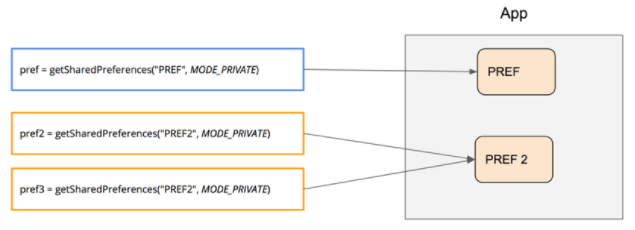

* pref2 và pref3 sử dụng cùng một tên Shared Preferences trong lệnh gọi nên chúng là cùng 1 instance

### 40.2.2. Lấy (Get) dữ liệu trong Shared Preferences <a id="40.2.2"></a>
______________________________________________________________________________________
* Tất cả các thao tác được đi qua bộ nhớ In-Memory, điều đó có nghĩa là ngay lập tức và tránh được các thao tác I/O. 
* Bởi vì tất cả các thao tác đi qua bộ nhớ in-memory nên nó đảm bảo rằng giá trị trả về sẽ là giá trị mới nhất.
* **Các hàm lấy dữ liệu**: các tham số truyền vào **\[keyString, defaultValue]**
  * getBoolean()
  * getInt()
  * getLong()
  * getFloat()
  * getString()
* ví dụ
  * ``String value = pref.getString(key, null)``

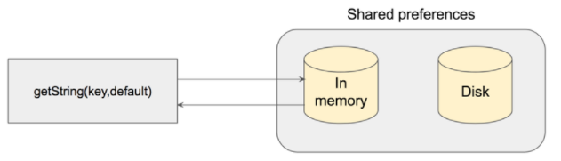

* Chú ý: Nếu lần đầu dữ liệu được tải lên, nó sẽ đợi cho đến khi dữ liệu được loaded vào bộ nhớ in-memory từ disk storage.

### 40.2.3. Lưu (Put) dữ liệu trong Shared Preferences <a id="40.2.3"></a>
______________________________________________________________________________________
#### Lấy Editor của SharedPreferences để thực hiện thao tác Lưu dữ liệu
______________________________________________________________________________________
* để lưu dữ liệu vào 1 SharedPreferences chỉ định, ta thực hiện lấy 1 đối tượng Editor của SharedPreferences đó bằng cách
gọi phương thức **edit()** thông qua SharedPreferences chỉ định
  * ``SharedPreferences.Editor editor = sharedPreferences.edit();``

#### Các Phương thức Put dữ liệu
______________________________________________________________________________________
* **Các hàm lưu dữ liệu**: tham số truyền vào là **\[keyString]**
  * putBoolean()
  * putInt()
  * putLong()
  * putFloat()
  * putString()

#### Put dữ liệu thông qua commit() 
______________________________________________________________________________________
* Lưu dữ liệu vào in-memory trước sau đó thực hiện ghi vào disk một cách đồng bộ. 
* Bởi vì có sự tham gia của thao tác I/O, main thread sẽ bị blocked cho đến khi data được ghi hết vào disk storage. 
* Đây là một thao tác kém hiệu quả so với apply()
* Bởi vì thao tác ghi dữ liệu lên disk storage là đồng bộ cho nên trạng thái trả về sẽ là một biến boolean. 
* Do đó bạn có thể xác nhận rằng liệu thao tác mà bạn thực hiện có thành công hay không bằng cách kiểm tra kết quả trả về.
* ví dụ
  * ``boolean result = editor.putString(keyString, "value-to-write").commit()``

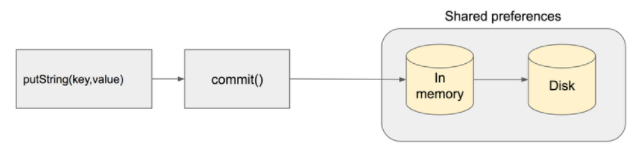

#### Put dữ liệu thông qua apply()
______________________________________________________________________________________
* Lưu giá trị vào in-memory trước sau đó ghi dữ liệu một cách bất đồng bộ vào disk-storage. 
* Main thread sẽ không bị blocked và không phải đợi thao tác trên disk nữa. 
* Tuy thao tác ghi lên disk storage là asynchronous nhưng bất kỳ thao tác read ngay sau lời gọi apply() sẽ đều trả 
về kết quả là mới nhất bởi vì thao tác read(get) sẽ được thực thi thông qua in-memory.
* Bởi vì thao tác ghi dữ liệu lên disk-storage là asynchronous, sẽ không có giá trị nào được trả về. 
* Do đó bạn không thể xác nhận được là liệu thao tác bạn thực thi có thành công hay không,
* ví dụ
  * ``editor.putString(keyString, "value-to-write").apply();``

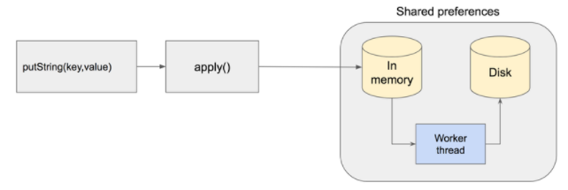

### 40.2.4. Xóa (Remove) dữ liệu trong Shared Preferences <a id="40.2.4"></a>
______________________________________________________________________________________
* thông qua Editor của SharedPreferences chỉ định ta có thể thực hiện remove() bất kỳ Entry nào trong SharedPreferences chỉ định
* sau khi thực hiện remove() các Entry ta cũng phải gọi đến 1 trong 2 phương thức apply() hoặc commit() thông qua Editor
* ví dụ
  * ``editor.remove(keyString).apply();``

### 40.2.5. Các thao tác khác trong Shared Preferences <a id="40.2.5"></a>
______________________________________________________________________________________
* Ngoại trừ việc put và get, shared preferences còn cung cấp các thao tác sau:
  * Kiểm tra xem một key có tồn tại hay không
  * Lắng nghe việc thay đổi của shared preferences thông qua listener
  * Đọc toàn bộ các entries thành map
  * Xóa bỏ một entry
  * Xóa bỏ toàn bộ các entries (Clear all)

### 40.2.6. Bonus Shared Preferences <a id="40.2.6"></a>
______________________________________________________________________________________
* Shared preferences phạm vi ứng dụng được lưu tại đường dẫn
  * ``data/data/<YOUR_APP_ID>/shared_prefs/<SHARED_PREF_NAME>.xml``
* Bạn có thể lấy nó ra và mở ra xem dữ liệu bên trong.
* trong Android Studio thực hiện các bước sau để mở file SharedPreferences XML
  * View > Tool Windows > Device File Explorer
  * chọn Virtual Device (Thiết bị máy ảo) đang cài đặt Project
  * chọn đường dẫn data/data/<YOUR_APP_ID-PackageNameProject>/shared_prefs/<SHARED_PREF_NAME>.xml
  * mở file <SHARED_PREF_NAME>.xml sẽ thấy những liệu được lưu bên trong nếu Logic trong Project chưa xóa nó đi

* ví dụ về SharedPreferences
```java
    private void removeDataLoginFromSharedPreferences() {
        editor.remove(SharedPreferencesInformation.USER_NAME_SHARED_PREFERENCES);
        editor.remove(SharedPreferencesInformation.PASSWORD_SHARED_PREFERENCES);
        editor.remove(SharedPreferencesInformation.IS_CHECKED_SHARED_PREFERENCES);
        editor.apply();
    }

    private void putDataLoginIntoSharedPreferences(String userName, String password) {
        editor.putString(SharedPreferencesInformation.USER_NAME_SHARED_PREFERENCES, userName);
        editor.putString(SharedPreferencesInformation.PASSWORD_SHARED_PREFERENCES, password);
        editor.putBoolean(SharedPreferencesInformation.IS_CHECKED_SHARED_PREFERENCES, true);
        editor.apply();
    }

    private void getDataFromSharedPreferences() {
        editTextUserName.setText(sharedPreferences.getString(SharedPreferencesInformation.USER_NAME_SHARED_PREFERENCES, ""));
        editTextPassword.setText(sharedPreferences.getString(SharedPreferencesInformation.PASSWORD_SHARED_PREFERENCES, ""));
        checkBoxRememberLogin.setChecked(sharedPreferences.getBoolean(SharedPreferencesInformation.IS_CHECKED_SHARED_PREFERENCES, false));
    }
```

### 40.2.7. Ứng Dụng Lưu Trạng Thái Login Với Shared Preferences <a id="40.2.7"></a>
______________________________________________________________________________________
* **activity_main.xml**
```xml
<?xml version="1.0" encoding="utf-8"?>
<androidx.constraintlayout.widget.ConstraintLayout xmlns:android="http://schemas.android.com/apk/res/android"
    xmlns:app="http://schemas.android.com/apk/res-auto"
    xmlns:tools="http://schemas.android.com/tools"
    android:layout_width="match_parent"
    android:layout_height="match_parent"
    tools:context=".MainActivity">

    <TextView
        android:id="@+id/textView"
        android:layout_width="wrap_content"
        android:layout_height="wrap_content"
        android:layout_marginTop="32dp"
        android:text="Đăng Nhập Hệ Thống"
        android:textColor="#F10909"
        android:textSize="34sp"
        android:textStyle="bold"
        app:layout_constraintLeft_toLeftOf="parent"
        app:layout_constraintRight_toRightOf="parent"
        app:layout_constraintTop_toTopOf="parent" />

    <EditText
        android:id="@+id/editText_user_name"
        android:layout_width="0dp"
        android:layout_height="wrap_content"
        android:layout_marginStart="32dp"
        android:layout_marginTop="32dp"
        android:layout_marginEnd="32dp"
        android:ems="10"
        android:hint="Nhập Tài Khoản"
        android:inputType="textPersonName"
        app:layout_constraintEnd_toEndOf="parent"
        app:layout_constraintStart_toStartOf="parent"
        app:layout_constraintTop_toBottomOf="@+id/textView" />

    <EditText
        android:id="@+id/editText_password"
        android:layout_width="0dp"
        android:layout_height="wrap_content"
        android:layout_marginStart="32dp"
        android:layout_marginTop="8dp"
        android:layout_marginEnd="32dp"
        android:ems="10"
        android:hint="Nhập Mật Khẩu"
        android:inputType="textPassword"
        app:layout_constraintEnd_toEndOf="parent"
        app:layout_constraintHorizontal_bias="0.0"
        app:layout_constraintStart_toStartOf="parent"
        app:layout_constraintTop_toBottomOf="@+id/editText_user_name" />

    <CheckBox
        android:id="@+id/checkBox_remember_login"
        android:layout_width="wrap_content"
        android:layout_height="wrap_content"
        android:layout_marginStart="32dp"
        android:layout_marginTop="16dp"
        android:text="Ghi nhớ tài khoản và mật khẩu cho lần sau"
        app:layout_constraintEnd_toEndOf="parent"
        app:layout_constraintHorizontal_bias="0.0"
        app:layout_constraintStart_toStartOf="parent"
        app:layout_constraintTop_toBottomOf="@+id/editText_password" />

    <Button
        android:id="@+id/button_login"
        android:layout_width="wrap_content"
        android:layout_height="wrap_content"
        android:layout_marginTop="16dp"
        android:text="Đăng Nhập"
        app:layout_constraintEnd_toEndOf="parent"
        app:layout_constraintStart_toStartOf="parent"
        app:layout_constraintTop_toBottomOf="@+id/checkBox_remember_login" />

</androidx.constraintlayout.widget.ConstraintLayout>
```
* **MainActivity.java**
```java
package com.hienqp.loginsharedpreferences;

import androidx.appcompat.app.AppCompatActivity;

import android.content.SharedPreferences;
import android.os.Bundle;
import android.view.View;
import android.widget.Button;
import android.widget.CheckBox;
import android.widget.EditText;
import android.widget.Toast;

public class MainActivity extends AppCompatActivity {
    EditText editTextUserName;
    EditText editTextPassword;
    CheckBox checkBoxRememberLogin;
    Button buttonLogin;

    SharedPreferences sharedPreferences;
    SharedPreferences.Editor editor;

    private static final String systemUserName = "babebap";
    private static final String systemPassword = "30092019";
    private static final String successfulLoginNotification = "Đăng nhập thành công";
    private static final String failedLoginNotification = "Đăng nhập thất bại";


    @Override
    protected void onCreate(Bundle savedInstanceState) {
        super.onCreate(savedInstanceState);
        setContentView(R.layout.activity_main);

        captureObjectViewFromLayout();

        // get Instance Shared Preferences
        getInstanceOfSharedPreferences();

        // get Data from Shared Preferences
        getDataFromSharedPreferences();

        buttonLogin.setOnClickListener(new View.OnClickListener() {
            @Override
            public void onClick(View v) {
                checkLoginSession();
            }
        });
    }

    private void getInstanceOfSharedPreferences() {
        sharedPreferences = getSharedPreferences(SharedPreferencesInformation.DATA_LOGIN_SHARED_PREFERENCES, MODE_PRIVATE);
        editor = sharedPreferences.edit();
    }

    private void captureObjectViewFromLayout() {
        editTextUserName = (EditText) findViewById(R.id.editText_user_name);
        editTextPassword = (EditText) findViewById(R.id.editText_password);
        checkBoxRememberLogin = (CheckBox) findViewById(R.id.checkBox_remember_login);
        buttonLogin = (Button) findViewById(R.id.button_login);
    }

    private void checkLoginSession() {
        String userName = editTextUserName.getText().toString().trim();
        String password = editTextPassword.getText().toString().trim();

        if (userName.equals(systemUserName) && password.equals(systemPassword)) {
            Toast.makeText(MainActivity.this, successfulLoginNotification, Toast.LENGTH_SHORT).show();

            // kiểm tra user có check vào tùy chọn lưu tài khoản mật khẩu cho lần đăng nhập sau hay không
            if (checkBoxRememberLogin.isChecked()) {
                putDataLoginIntoSharedPreferences(userName, password);
            } else {
                removeDataLoginFromSharedPreferences();
            }
        } else {
            Toast.makeText(MainActivity.this, failedLoginNotification, Toast.LENGTH_SHORT).show();
        }
    }

    private void removeDataLoginFromSharedPreferences() {
        editor.remove(SharedPreferencesInformation.USER_NAME_SHARED_PREFERENCES);
        editor.remove(SharedPreferencesInformation.PASSWORD_SHARED_PREFERENCES);
        editor.remove(SharedPreferencesInformation.IS_CHECKED_SHARED_PREFERENCES);
        editor.apply();
    }

    private void putDataLoginIntoSharedPreferences(String userName, String password) {
        editor.putString(SharedPreferencesInformation.USER_NAME_SHARED_PREFERENCES, userName);
        editor.putString(SharedPreferencesInformation.PASSWORD_SHARED_PREFERENCES, password);
        editor.putBoolean(SharedPreferencesInformation.IS_CHECKED_SHARED_PREFERENCES, true);
        editor.apply();
    }

    private void getDataFromSharedPreferences() {
        editTextUserName.setText(sharedPreferences.getString(SharedPreferencesInformation.USER_NAME_SHARED_PREFERENCES, ""));
        editTextPassword.setText(sharedPreferences.getString(SharedPreferencesInformation.PASSWORD_SHARED_PREFERENCES, ""));
        checkBoxRememberLogin.setChecked(sharedPreferences.getBoolean(SharedPreferencesInformation.IS_CHECKED_SHARED_PREFERENCES, false));
    }
}
```
* **SharedPreferencesInformation.java**
```java
package com.hienqp.loginsharedpreferences;


public class SharedPreferencesInformation {
    public static final String DATA_LOGIN_SHARED_PREFERENCES = "name for data of login";
    public static final String USER_NAME_SHARED_PREFERENCES = "username";
    public static final String PASSWORD_SHARED_PREFERENCES = "password";
    public static final String IS_CHECKED_SHARED_PREFERENCES = "ischecked";
}
```

______________________________________________________________________________________
______________________________________________________________________________________
______________________________________________________________________________________
# 41. Animation - Hiệu Ứng <a id"41"></a>
______________________________________________________________________________________
#### Tạo UI XML Cho Animation
______________________________________________________________________________________
* tạo thư mục chứa file UI XML của Animation
  * chuột phải thư mục **res/** -> **Android Resource Directory**
  * chọn Resource type: **anim**
  * OK
* tạo file UI XML trong thư mục **res/anim/**
  * chuộc phải thư mục **res/anim/** -> **Animation Resource File**
  * File name: đặt tên cho file Animation (VD: anim_alpha)
  * Root element: **set**
  * OK
* tùy chỉnh cho file UI XML Animation vừa tạo
```xml
<?xml version="1.0" encoding="utf-8"?>
<set
    xmlns:android="http://schemas.android.com/apk/res/android">
    <alpha/>
    <rotate/>
    <scale/>
    <translate/>
    <set/>
</set>
```
* trong file animation vừa tạo
  * thẻ Root: set
  * các thẻ con ta thêm vào tùy vào hiệu ứng animation cần thực hiện

#### Các Thuộc Tính Của Root element <set>
______________________________________________________________________________________
* thuộc tính của thẻ ``<set>``
  * ``android:fillAfter="true"``
    * giữ lại trạng thái cuối cùng kết thúc của animation (lưu ý: phải có điểm kết thúc cho animation, thuộc tính này mới có hiệu quả)
  * ``android:startOffset="2000"``
    * thời gian bắt đầu thực hiện hiệu ứng (tính bằng millisecond)
  * ``android:repeatMode="restart"``
    * kiểu lặp lại hiệu ứng với 2 giá trị
        * ``restart``
        * ``reverse``
  * ``android:duration="100"``
    * thời gian diễn ra hiệu ứng, tính bằng millisecond 

#### Các Thuộc Tính Chung Của Các Loại Animation
______________________________________________________________________________________
* ``android:duration="100"``
  * thời gian diễn ra hiệu ứng, tính bằng millisecond
* ``android:repeatCount="3"``
  * số lần lặp lại hiệu ứng
    * chỉ định cụ thể bằng số nguyên dương
    * chỉ định vô hạn: ``infinite``
* ``android:repeatMode="restart"``
  * kiểu lặp lại hiệu ứng với 2 giá trị
    * ``restart``
    * ``reverse``
* ``android:startOffset="2000"``
  * thời gian bắt đầu thực hiện hiệu ứng (tính bằng millisecond)

#### Truy Xuất UI XML Animation Từ Java Code
______________________________________________________________________________________
* khởi tạo đối tượng Animation và load Animation từ file Animation XML
* sử dụng phương thức ``loadAnimation(Context, Resource-animation)`` thông qua ``AnimationUtils``
  * ``Animation animationAlpha = AnimationUtils.loadAnimation(MainActivity.this, R.anim.[tên_của_animation_file_xml]);``
* khởi động file Animation cho View
  * ``v.startAnimation(animationAlpha);``
* VD về Animation Alpha
* **anim_alpha.xml**
```xml
<?xml version="1.0" encoding="utf-8"?>
<set
    xmlns:android="http://schemas.android.com/apk/res/android"
    android:fillAfter="true">
    <alpha
        android:fromAlpha="1.0"
        android:toAlpha="0.1"
        android:duration="100"
        android:repeatCount="3"
        android:repeatMode="restart"/>
    <rotate/>
    <scale/>
    <translate/>
</set>
```
* **MainActivity.java**
```java
package com.hienqp.alpha;

import androidx.appcompat.app.AppCompatActivity;

import android.os.Bundle;
import android.view.View;
import android.view.animation.Animation;
import android.view.animation.AnimationUtils;
import android.widget.ImageView;

public class MainActivity extends AppCompatActivity {
    ImageView imageViewAlpha;

    @Override
    protected void onCreate(Bundle savedInstanceState) {
        super.onCreate(savedInstanceState);
        setContentView(R.layout.activity_main);

        imageViewAlpha = (ImageView) findViewById(R.id.imageView_alpha);

        Animation animationAlpha = AnimationUtils.loadAnimation(MainActivity.this, R.anim.anim_alpha);

        imageViewAlpha.setOnClickListener(new View.OnClickListener() {
            @Override
            public void onClick(View v) {
                v.startAnimation(animationAlpha);
            }
        });
    }
}
```
## 41.1. Animation Alpha - hiệu ứng chuyển độ trong suốt <a id="41.1"></a>
______________________________________________________________________________________
* Animation Alpha được khai báo là thẻ con của ``<set></set>`` với thẻ
  * ``<alpha/>``
* các thuộc tính đặc trưng của Animation Alpha
  * ``android:fromAlpha="1.0"``
    * bắt đầu từ giá trị chỉ định
  * ``android:toAlpha="0.1"``
    * đến giá trị chỉ định (nếu giá trị = 0, View sẽ biến mất trong suốt hoàn toàn)
* **anim_alpha.xml**
```xml
<?xml version="1.0" encoding="utf-8"?>
<set
    xmlns:android="http://schemas.android.com/apk/res/android"
    android:fillAfter="true">
    <alpha
        android:fromAlpha="1.0"
        android:toAlpha="0.1"
        android:duration="100"
        android:repeatCount="3"
        android:repeatMode="restart"/>
    <rotate/>
    <scale/>
    <translate/>
</set>
```
## 41.2. Animation Rotate - hiệu ứng xoay <a id="41.2"></a>
______________________________________________________________________________________
* Animation Rotate được khai báo là thẻ con của ``<set></set>`` với thẻ
    * ``<rotate/>``
* các thuộc tính đặc trưng của Animation Rotate
  * ``android:fromDegrees="0"``
    * góc bắt đầu xoay (tính bằng độ radian)
  * ``android:toDegrees="360"``
    * góc dừng xoay
  * ``android:pivotX="50%"``
    * tọa độ điểm gốc X của View
  * ``android:pivotY="50%"``
    * tọa độ điểm gốc Y của View
* **anim_rotate.xml**
```xml
<?xml version="1.0" encoding="utf-8"?>
<set xmlns:android="http://schemas.android.com/apk/res/android">
    <rotate
        android:fromDegrees="0"
        android:toDegrees="360"
        android:pivotX="50%"
        android:pivotY="50%"
        android:duration="2000"/>
</set>
```

## 41.3. Animation Scale - hiệu ứng zoom <a id="41.3"></a>
______________________________________________________________________________________
* Animation Scale được khai báo là thẻ con của ``<set></set>`` với thẻ
    * ``<scale/>``
* các thuộc tính đặc trưng của Animation Scale
  * ``android:fromXScale="1"``
    * tỉ lệ bắt đầu scale theo hướng X
  * ``android:fromYScale="1"``
    * tỉ lệ bắt đầu scale theo hướng Y
  * ``android:toXScale="0"``
    * tỉ lệ kết thúc scale theo hướng X
  * ``android:toYScale="0"``
    * tỉ lệ kết thúc scale theo hướng Y
  * ``android:pivotX="50%"``
    * tỉ lệ tâm điểm scale theo tọa độ X
  * ``android:pivotY="50%"``
    * tỉ lệ tâm điểm scale theo tọa độ Y
* lưu ý:
  * nếu tỉ lệ scale từ nhỏ đến lớn, là hiệu ứng phóng to
  * nếu tỉ lệ scale từ lớn đến nhỏ, là hiệu ứng thu nhỏ
* **anim_scale.xml**
```xml
<?xml version="1.0" encoding="utf-8"?>
<set xmlns:android="http://schemas.android.com/apk/res/android"
    android:fillAfter="true">
    <scale
        android:duration="2000"
        android:fromXScale="1"
        android:fromYScale="1"
        android:pivotX="50%"
        android:pivotY="50%"
        android:toXScale="0"
        android:toYScale="0" />
</set>
```

## 41.4. Animation Translate - hiệu ứng di chuyển <a id="41.4"></a>
______________________________________________________________________________________
* Animation Translate được khai báo là thẻ con của ``<set></set>`` với thẻ
    * ``<translate/>``
* các thuộc tính đặc trưng của Animation Translate
  * ``android:fromXDelta="0"``
    * tọa độ bắt đầu di chuyển theo chiều X
  * ``android:fromYDelta="0"``
    * tọa độ bắt đầu di chuyển theo chiều Y
  * ``android:toXDelta="510"``
    * tọa độ sẽ di chuyển đến theo chiều X
  * ``android:toYDelta="510"``
    * tọa độ sẽ di chuyển đến theo chiều Y
* **anim_translate.xml**
```xml
<?xml version="1.0" encoding="utf-8"?>
<set xmlns:android="http://schemas.android.com/apk/res/android"
    android:fillAfter="true">
    <translate
        android:duration="2000"
        android:fromXDelta="0"
        android:toXDelta="510"/>
    <translate
        android:startOffset="2000"
        android:duration="2000"
        android:fromYDelta="0"
        android:toYDelta="510"/>
    <translate
        android:startOffset="4000"
        android:duration="2000"
        android:fromXDelta="0"
        android:toXDelta="-510"/>
    <translate
        android:startOffset="6000"
        android:duration="2000"
        android:fromXDelta="0"
        android:toXDelta="510"
        android:fromYDelta="0"
        android:toYDelta="-510"/>
</set>
```

______________________________________________________________________________________
______________________________________________________________________________________
______________________________________________________________________________________
# 42. Animation Trong Intent <a id="42"></a>
______________________________________________________________________________________
## File UI XML Animation
______________________________________________________________________________________
* Intent thường được sử dụng để chuyển đổi giữa các màn hình hoặc truyền dữ liệu giữa các màn hình.
* ví dụ ta muốn khi kích hoạt Intent sẽ custom lại hiệu ứng chuyển đổi màn hình theo nhu cầu.
* ý tưởng như sau:
  * khi 1 màn hình xuất hiện thì màn hình hiện tại sẽ biến mất, như vậy sẽ có 2 hiệu ứng
    * xuất hiện
    * biến mất
* giải quyết vấn đề:
  * giả sử ta muốn hiệu ứng từ trái sang phải, nghĩa là: 
    * màn hình hiện tại sẽ di chuyển sang phải và biến mất
    * màn hình được kích hoạt sẽ xuất hiện từ bên trái di chuyển sang phải và lấp đầy màn hình điện thoại
  * thời gian giữa 2 hiệu ứng trên phải có thời gian diễn ra tương đương nhau
  * hiệu ứng di chuyển ta dùng animation translate
  * di chuyển từ trái sang phải:
    * di chuyển theo chiều X
    * vì không biết chính xác phải di chuyển tỉ lệ bao nhiêu, nên ta sẽ sử dụng đơn vị % cho tỉ lệ
    * đường biên bắt đầu (biên trái nếu theo LTR - biên phải nếu theo RTL) là 0%
      * -100% (ở ngoài màn hình so với biên bắt đầu)
      * 0% (ngay biên bắt đầu màn hình)
      * 100% (ngay biên kết thúc màn hình)
* **enter.xml**
```xml
<?xml version="1.0" encoding="utf-8"?>
<set xmlns:android="http://schemas.android.com/apk/res/android">
<!--    hiệu ứng di chuyển vào từ bên trái màn hình -->
    <translate
            android:fromXDelta="-100%"
            android:toXDelta="0%"
            android:duration="1000"/>
<!--    hiệu ứng độ trong suốt rõ dần đồng thời với hiệu ứng di chuyển -->
    <alpha
            android:fromAlpha="0"
            android:toAlpha="1"
            android:duration="1000"/>
</set>
```
* **exit.xml**
```xml
<?xml version="1.0" encoding="utf-8"?>
<set xmlns:android="http://schemas.android.com/apk/res/android">
<!--    hiệu ứng di chuyển ra bên phải màn hình -->
    <translate
        android:fromXDelta="0%"
        android:toXDelta="100%"
        android:duration="1000"/>
<!--    hiệu ứng trong suốt mờ dần và biến mất cùng lúc với hiệu ứng di chuyển -->
    <alpha
        android:fromAlpha="1"
        android:toAlpha="0"
        android:duration="1000"/>
</set>
```

## File Logic Java
______________________________________________________________________________________
* trong Logic code: ta gọi phương thức thực hiện hiệu ứng chuyển tiếp
  * ngay khi kích hoạt Activity với Intent - ``startActivity()``
  * hoặc ngay khi kết thúc 1 Activity - ``finish()``
* phương thức thực hiện hiệu ứng chuyển tiếp - transition
  * ``public void overridePendingTransition(int enterAnim, int exitAnim)``
    * ``enterAnim``: Resource Animation enter (vào - xuất hiện)
    * ``exitAnim``: Resource Animation exit (ra - biến mất)
* **MainActivity.java**
```java
package com.hienqp.animationofintent;

import androidx.appcompat.app.AppCompatActivity;

import android.content.Intent;
import android.os.Bundle;
import android.view.View;
import android.widget.Button;

public class MainActivity extends AppCompatActivity {
    Button buttonMain;

    @Override
    protected void onCreate(Bundle savedInstanceState) {
        super.onCreate(savedInstanceState);
        setContentView(R.layout.activity_main);

        buttonMain = (Button) findViewById(R.id.button_main);
        buttonMain.setOnClickListener(new View.OnClickListener() {
            @Override
            public void onClick(View v) {
                startActivity(new Intent(MainActivity.this, SecondActivity.class));
                overridePendingTransition(R.anim.enter, R.anim.exit);
            }
        });
    }
}
```
* **SecondActivity.java**
```java
package com.hienqp.animationofintent;

import androidx.appcompat.app.AppCompatActivity;

import android.content.Intent;
import android.os.Bundle;
import android.view.View;
import android.widget.Button;

public class SecondActivity extends AppCompatActivity {
    Button buttonSecond;

    @Override
    protected void onCreate(Bundle savedInstanceState) {
        super.onCreate(savedInstanceState);
        setContentView(R.layout.activity_second);

        buttonSecond = (Button) findViewById(R.id.button_second);
        buttonSecond.setOnClickListener(new View.OnClickListener() {
            @Override
            public void onClick(View v) {
                finish();
                overridePendingTransition(R.anim.enter, R.anim.exit);
            }
        });
    }
}
```

______________________________________________________________________________________
______________________________________________________________________________________
______________________________________________________________________________________
# 43. Animation Trong ListView <a id="43"></a>
______________________________________________________________________________________
* sử dụng lại Project ListView-ViewHolder
## File UI XML Animation
______________________________________________________________________________________
* giả sử ta muốn mỗi View hiển thị trên ListView với hiệu ứng bất kỳ.
* xây dựng Animation, giả sử dùng hiệu ứng scale
* **anim_scale.xml**
```xml
<?xml version="1.0" encoding="utf-8"?>
<set xmlns:android="http://schemas.android.com/apk/res/android">
    <scale
        android:fromXScale="10%"
        android:toXScale="100%"
        android:fromYScale="10%"
        android:toYScale="100%"
        android:duration="1000"/>
</set>
```

## File Adapter
______________________________________________________________________________________
* FruitAdapter là Adapter chịu trách nhiệm sẽ đổ từng View lên ListView
* trước khi FruitAdapter trả về về 1 View, ta load hiệu ứng cho View đó trước khi return nó.
* cách thiết lập hiệu ứng cho nó tương tự như cách thông thường
  * khởi tạo đối tượng Animation với hiệu ứng chỉ định ở Context chỉ định
  * khởi động Animation từ View cần thiết lập hiệu ứng
* **FruitAdapter.java**
```java
package com.hienqp.viewholder;

import android.content.Context;
import android.view.LayoutInflater;
import android.view.View;
import android.view.ViewGroup;
import android.view.animation.Animation;
import android.view.animation.AnimationUtils;
import android.widget.BaseAdapter;
import android.widget.ImageView;
import android.widget.TextView;

import java.util.List;

public class FruitAdapter extends BaseAdapter {
    // Context, là Activity chỉ định sẽ hiển thị
    private Context context;
    // UI XML của từng item hiển thị trên ListView mà ta đã xây dựng sẵn, tương tự như android.R.layout.simple_layout_item_1 của hệ thống
    private int layoutItem;
    // List danh sách chứa các đối tượng Fruit
    private List<Fruit> fruitList;

    public FruitAdapter(Context context, int layoutItem, List<Fruit> fruitList) {
        this.context = context;
        this.layoutItem = layoutItem;
        this.fruitList = fruitList;
    }

    // trả về số dòng cho ListView
    // lấy số lượng phần tử trong fruitList trả về số dòng cho ListView
    @Override
    public int getCount() {
        return fruitList.size();
    }

    // trả về đối tượng item trong ListView
    // phương thức này chưa cần sử dụng, để mặc định
    @Override
    public Object getItem(int position) {
        return null;
    }

    // trả về ID của đối tượng item trong ListView
    // phương thức này chưa cần sử dụng, để mặc định
    @Override
    public long getItemId(int position) {
        return 0;
    }

    // khai báo 1 private class ViewHolder
    private class ViewHolder {
        ImageView imageViewPhoto;
        TextView textViewName, textViewDescription;
    }

    // phương thức trả về mỗi View (item) cho ListView
    @Override
    public View getView(int position, View convertView, ViewGroup parent) {
        /** Sử dụng ViewHolder*/
        ViewHolder viewHolder;

        // kiểm tra convertView (item) đã được load lên ListView chưa
        // nếu chưa load (==null) ta mới tiến hành tạo ánh xạ
        if (convertView == null) {
            LayoutInflater inflater = (LayoutInflater) context.getSystemService(Context.LAYOUT_INFLATER_SERVICE);
            convertView = inflater.inflate(layoutItem, null);

            viewHolder = new ViewHolder();
            // ánh xạ
            // bây giờ giá trị của item sẽ được lưu giữ trong viewHolder
            viewHolder.imageViewPhoto = (ImageView) convertView.findViewById(R.id.imageview_fruit_photo);
            viewHolder.textViewName = (TextView) convertView.findViewById(R.id.textview_fruit_name);
            viewHolder.textViewDescription = (TextView) convertView.findViewById(R.id.textview_fruit_description);
            // sau khi có viewHolder setTag() nó cho convertView (item), lúc này item đã có giá trị
            convertView.setTag(viewHolder);
        } else {
            // viewHolder đã được setTag() cho convertView, chỉ việc lấy viewHolder ra sử dụng
            viewHolder = (ViewHolder) convertView.getTag();
        }
        // gán giá trị
        Fruit fruit = fruitList.get(position);

        // gán giá trị cho viewHolder giữ
        viewHolder.imageViewPhoto.setImageResource(fruit.getFruitPhoto());
        viewHolder.textViewName.setText(fruit.getFruitName());
        viewHolder.textViewDescription.setText(fruit.getFruitDescription());


        /** không sử dụng ViewHolder*/
//        LayoutInflater inflater = (LayoutInflater) context.getSystemService(Context.LAYOUT_INFLATER_SERVICE);
//        convertView = inflater.inflate(layoutItem, null);
//        // ánh xạ
//        ImageView fruitPhoto = (ImageView) convertView.findViewById(R.id.imageview_fruit_photo);
//        TextView fruitName = (TextView) convertView.findViewById(R.id.textview_fruit_name);
//        TextView fruitDescription = (TextView) convertView.findViewById(R.id.textview_fruit_description);

//        // gán giá trị
//        Fruit fruit = fruitList.get(position);

          // gán giá trị đối tượng Fruit
//        fruitPhoto.setImageResource(fruit.getFruitPhoto());
//        fruitName.setText(fruit.getFruitName());
//        fruitDescription.setText(fruit.getFruitDescription());

        /** Sử dụng Animation Scale cho mỗi View xuất hiện trên ListView */
        Animation animation = AnimationUtils.loadAnimation(context, R.anim.anim_scale);
        convertView.startAnimation(animation);

        return convertView;
    }
}
```

______________________________________________________________________________________
______________________________________________________________________________________
______________________________________________________________________________________
# 44. AsyncTask - Kỹ Thuật Quản Lý Luồng Dữ Liệu <a id="44"></a>
______________________________________________________________________________________
* AsyncTask là 1 abstract class
```java
@Deprecated
public abstract class AsyncTask<Params, Progress, Result> {
    
}
```
* AsyncTask được thiết kế như là một lớp trợ giúp cho Thread và Handler. 
* Nó nên được sử dụng cho các hoạt động ngắn (Khoảng vài giây). 
* Nếu bạn muốn có một luồng (thread) chạy trong một thời gian dài bạn nên sử dụng các lớp được cung cấp bởi java.util.concurrent, chẳng hạn 
  * Executor
  * ThreadPoolExecutor
  * FutureTask.
* AsyncTask được đưa vào Android từ API Level 3, và bị đánh dấu là lỗi thời (deprecated) từ API Level 30 (Ạndroid 11).

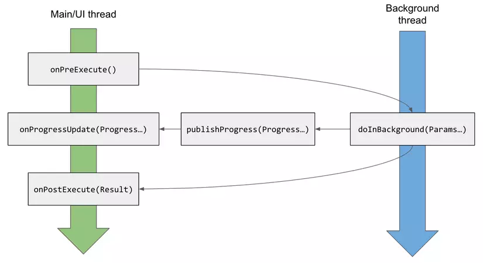

* trong AsyncTask
  * onPreExecute(): được gọi đầu tiên khi công việc được execute()
  * onPostExecute(): được gọi khi kết thúc công việc
  * doInBackground(): xử lý logic dữ liệu - không xử lý giao diện (phương thức này bắt buộc phải implements)
  * onProgressUpdate(): cập nhật giao diện từ dữ liệu cung cấp từ doInBackground() băng publishProgress()
  * doInBackground() và onProgressUpdate() thực thi song song nếu có xử lý giao diện

## 44.1. AsyncTask - Cách Sử Dụng <a id="44.1"></a>
______________________________________________________________________________________
* Trong AsyncTask<Params, Progress, Result> có 3 đối số là các Generic Type:
  * Params: Là giá trị (biến) được truyền vào khi gọi thực thi tiến trình onPreExecute và doInBackground
  * Progress: Là giá trị (biến) dùng để update giao diện diện lúc tiến trình thực thi, biến này sẽ được truyền vào hàm 
  onProgressUpdate.
  * Result: Là biến dùng để lưu trữ kết quả trả về sau khi tiến trình thực hiện xong, biến này sẽ được truyền cho onPostExecute.
* Những đối số nào không sử dụng trong quá trình thực thi tiến trình thì ta thay bằng Void.
______________________________________________________________________________________
* Thông thường trong 1 AsyncTask sẽ chứa 4 hàm, đó là :
  * onPreExecute() : Tự động được gọi đầu tiên khi tiến trình được kích hoạt.
  * doInBackground(): Được thực thi trong quá trình tiến trình chạy nền, thông qua hàm này để ta gọi hàm onProgressUpdate 
  để cập nhật giao diện (gọi lệnh publishProgress). 
  Ta không thể cập nhật giao diện trong hàm doInBackground().
  * onProgressUpdate(): Dùng để cập nhật giao diện lúc runtime
  * onPostExecute(): Sau khi tiến trình kết thúc thì hàm này sẽ tự động xảy ra. Ta có thể lấy được kết quả trả về sau 
  khi thực hiện tiến trình kết thúc ở đây.
* Trong 4 hàm trên thì hàm doInBackground() bắt buộc phải tồn tại, còn các hàm khác có thể khuyết, nhưng các bạn nên sử 
dụng đầy đủ 4 hàm đã nêu.
* để thực thi đối tượng AsyncTask gọi phương thức execute()
______________________________________________________________________________________
* Tóm lại: để sử dụng abstract class AsyncTask
  * tạo 1 class dùng để thực hiện 1 công việc nào đó extends AsyncTask
  * truyền 3 đối số cần thiết để sử dụng trong những phương thức cần thiết cho AsyncTask
  * implements 4 phương thức sau khi thực hiện 2 bước trên
    * ``onPreExecute()`` : được gọi đầu tiên khi đối tượng của class công việc được ``execute()``
    * ``doInBackground()`` : xử lý logic dữ liệu (không xử lý giao diện - dùng ``publishProgress()`` đẩy dữ liệu cho onProgressUpdate() xử lý giao diện)
    * ``publishProgress()`` : truyền 1 mảng kiểu dữ liệu chỉ định cho ``onProgressUpdate()``
    * ``onProgressUpdate()`` : cập nhật giao diện từ dữ liệu (phần tử của mảng kiểu dữ liệu chỉ định) được truyền vào từ phương thức ``publishProgress()`` thông qua ``doInBackground()``
    * ``onPostExecute()`` : được gọi khi kết thúc công việc, nhận dữ liệu return từ ``doInBackground()``
  * tại nơi cần xử lý logic đa tiến trình, thực thi đối tượng của class công việc với ``execute()``
    * ``execute()`` : dùng để thực thi công việc, nếu ``doInBackground()`` cần **Params** đầu vào, thì phương thức ``execute()`` là nơi sẽ truyền vào. 

## 44.2. AsyncTask - Ví Dụ Sử Dụng AsyncTask <a id="44.2"></a>
______________________________________________________________________________________
* giả sử ta xây dụng 1 ứng dụng giả lập hiển thị tiến trình công việc xử lý khi nhấn vào Button
  * đầu tiên sẽ thông báo tiến trình bắt đầu
  * sau đó vừa xử lý vừa cập nhật giao diện
  * cuối cùng thông báo kết thúc tiến trình

### File UI XML activity_main.xml
______________________________________________________________________________________
```xml
<?xml version="1.0" encoding="utf-8"?>
<androidx.constraintlayout.widget.ConstraintLayout xmlns:android="http://schemas.android.com/apk/res/android"
    xmlns:app="http://schemas.android.com/apk/res-auto"
    xmlns:tools="http://schemas.android.com/tools"
    android:layout_width="match_parent"
    android:layout_height="match_parent"
    tools:context=".MainActivity">

    <TextView
        android:id="@+id/textView_update"
        android:layout_width="wrap_content"
        android:layout_height="wrap_content"
        android:text="Hello World!"
        app:layout_constraintBottom_toBottomOf="parent"
        app:layout_constraintEnd_toEndOf="parent"
        app:layout_constraintLeft_toLeftOf="parent"
        app:layout_constraintRight_toRightOf="parent"
        app:layout_constraintStart_toStartOf="parent"
        app:layout_constraintTop_toBottomOf="@+id/button_process"
        app:layout_constraintVertical_bias="0.057" />

    <Button
        android:id="@+id/button_process"
        android:layout_width="wrap_content"
        android:layout_height="wrap_content"
        android:layout_marginTop="28dp"
        android:text="Process"
        app:layout_constraintEnd_toEndOf="parent"
        app:layout_constraintHorizontal_bias="0.498"
        app:layout_constraintStart_toStartOf="parent"
        app:layout_constraintTop_toTopOf="parent" />

</androidx.constraintlayout.widget.ConstraintLayout>
```

### File Progress Task extends AsyncTask - UpdateTextView.java
______________________________________________________________________________________
```java
package com.hienqp.asynctask;

import android.app.Activity;
import android.os.AsyncTask;
import android.widget.TextView;


public class UpdateTextView extends AsyncTask<Void, String, String> {
    private Activity activity;
    private TextView textViewUpdate;

    public UpdateTextView(Activity activity) {
        this.activity = activity;
        textViewUpdate = (TextView) activity.findViewById(R.id.textView_update);
    }

    @Override
    protected void onPreExecute() {
        super.onPreExecute();
        textViewUpdate.setText("Bắt đầu...\n");
    }

    @Override
    protected String doInBackground(Void... voids) {
        for (int i = 0; i < 10; i++) {
            try {
                Thread.sleep(1000);
            } catch (InterruptedException e) {
                e.printStackTrace();
            }
            publishProgress(String.valueOf(i));
        }
        return "Kết thúc...\n";
    }

    @Override
    protected void onProgressUpdate(String... values) {
        super.onProgressUpdate(values);
        textViewUpdate.append("Thực hiện công việc " + values[0] + "\n");
    }

    @Override
    protected void onPostExecute(String s) {
        super.onPostExecute(s);
        textViewUpdate.append(s);
    }
}
```

### File MainActivity.java
______________________________________________________________________________________
```java
package com.hienqp.asynctask;

import androidx.appcompat.app.AppCompatActivity;

import android.os.Bundle;
import android.view.View;
import android.widget.Button;

public class MainActivity extends AppCompatActivity {
    Button buttonProcess;

    @Override
    protected void onCreate(Bundle savedInstanceState) {
        super.onCreate(savedInstanceState);
        setContentView(R.layout.activity_main);

        buttonProcess = (Button) findViewById(R.id.button_process);
        buttonProcess.setOnClickListener(new View.OnClickListener() {
            @Override
            public void onClick(View v) {
                new UpdateTextView(MainActivity.this).execute();
            }
        });
    }
}
```

______________________________________________________________________________________
______________________________________________________________________________________
______________________________________________________________________________________
# 45. AsyncTask - Tải Hình Ảnh Từ Internet <a id="45"></a>
______________________________________________________________________________________
* giả sử ta cần xây dựng 1 công việc, khi nhấn vào 1 Button thì sẽ load 1 hình ảnh từ Internet và gắn vào ImageView
* cần chuẩn bị:
  * 1 đường dẫn URL của hình ảnh cần load
  * khai báo sử dụng quyền INTERNET trong AndroidManifest.xml
* để load hình ảnh từ 1 URL, ta sử dụng InputStream mở kết nối từ URL chỉ định và lấy luồng dữ liệu
* sau khi có được luông dữ liệu về hình ảnh, sử dụng BitmapFactory decodestream luồng dữ liệu về kiểu Bitmap
* có được ảnh Bitmap ta gán ảnh đó lên ImageView

# 45.1. AndroidManifest.xml Internet <a id="45.1"></a>
______________________________________________________________________________________
```xml
<?xml version="1.0" encoding="utf-8"?>
<manifest xmlns:android="http://schemas.android.com/apk/res/android"
    package="com.hienqp.loadimagefrominternet">

    <uses-permission android:name="android.permission.INTERNET"/>
    <application
        android:allowBackup="true"
        android:icon="@mipmap/ic_launcher"
        android:label="@string/app_name"
        android:roundIcon="@mipmap/ic_launcher_round"
        android:supportsRtl="true"
        android:theme="@style/Theme.LoadImageFromInternet">
        <activity
            android:name=".MainActivity"
            android:exported="true">
            <intent-filter>
                <action android:name="android.intent.action.MAIN" />

                <category android:name="android.intent.category.LAUNCHER" />
            </intent-filter>
        </activity>
    </application>

</manifest>
```

# 45.2. LoadImageFromInternetAsyncTask.java <a id="45.2"></a>
______________________________________________________________________________________
```java
package com.hienqp.loadimagefrominternet;

import android.app.Activity;
import android.graphics.Bitmap;
import android.graphics.BitmapFactory;
import android.os.AsyncTask;
import android.widget.ImageView;

import java.io.IOException;
import java.io.InputStream;
import java.net.MalformedURLException;
import java.net.URL;

public class LoadImageFromInternetAsyncTask extends AsyncTask<String, Void, Bitmap> {
    private Activity activity;
    private Bitmap bitmapImage;
    private ImageView imageView;

    public LoadImageFromInternetAsyncTask(Activity activity, ImageView imageViewDisplayImage) {
        this.activity = activity;
        this.imageView = imageViewDisplayImage;
    }

    @Override
    protected void onPreExecute() {
        super.onPreExecute();
    }

    @Override
    protected Bitmap doInBackground(String... strings) {
        try {
            URL url = new URL(strings[0]);

            InputStream inputStream = url.openConnection().getInputStream();

            bitmapImage = BitmapFactory.decodeStream(inputStream);

        } catch (MalformedURLException e) {
            e.printStackTrace();
        } catch (IOException e) {
            e.printStackTrace();
        }
        return bitmapImage;
    }

    @Override
    protected void onProgressUpdate(Void... values) {
        super.onProgressUpdate(values);
    }

    @Override
    protected void onPostExecute(Bitmap bitmap) {
        super.onPostExecute(bitmap);

        imageView.setImageBitmap(bitmap);
    }
}
```

# 45.3. MainActivity.java <a id="45.3"></a>
______________________________________________________________________________________
```java
package com.hienqp.loadimagefrominternet;

import androidx.appcompat.app.AppCompatActivity;

import android.os.Bundle;
import android.view.View;
import android.widget.Button;
import android.widget.ImageView;

public class MainActivity extends AppCompatActivity {
    Button buttonLoadImage;
    ImageView imageViewDisplayImage;
    String url = "https://kenh14cdn.com/thumb_w/640/pr/2021/1615871991234-23-0-431-653-crop-1615872000798-63751495502707.jpg";

    @Override
    protected void onCreate(Bundle savedInstanceState) {
        super.onCreate(savedInstanceState);
        setContentView(R.layout.activity_main);

        captureObjectViewFromLayout();

        buttonLoadImage.setOnClickListener(new View.OnClickListener() {
            @Override
            public void onClick(View v) {
                new LoadImageFromInternetAsyncTask(MainActivity.this, imageViewDisplayImage).execute(url);
            }
        });
    }

    private void captureObjectViewFromLayout() {
        buttonLoadImage = (Button) findViewById(R.id.button_load_image);
        imageViewDisplayImage = (ImageView) findViewById(R.id.imageView_display_image);
    }
}
```

# 45.4. activity_main.xml <a id="45.4"></a>
______________________________________________________________________________________
```xml
<?xml version="1.0" encoding="utf-8"?>
<androidx.constraintlayout.widget.ConstraintLayout xmlns:android="http://schemas.android.com/apk/res/android"
    xmlns:app="http://schemas.android.com/apk/res-auto"
    xmlns:tools="http://schemas.android.com/tools"
    android:layout_width="match_parent"
    android:layout_height="match_parent"
    tools:context=".MainActivity">

    <Button
        android:id="@+id/button_load_image"
        android:layout_width="wrap_content"
        android:layout_height="wrap_content"
        android:layout_marginTop="16dp"
        android:text="Load Image"
        app:layout_constraintEnd_toEndOf="parent"
        app:layout_constraintStart_toStartOf="parent"
        app:layout_constraintTop_toTopOf="parent" />

    <ImageView
        android:id="@+id/imageView_display_image"
        android:layout_width="0dp"
        android:layout_height="0dp"
        android:layout_marginStart="16dp"
        android:layout_marginTop="16dp"
        android:layout_marginEnd="16dp"
        android:layout_marginBottom="16dp"
        app:layout_constraintBottom_toBottomOf="parent"
        app:layout_constraintEnd_toEndOf="parent"
        app:layout_constraintStart_toStartOf="parent"
        app:layout_constraintTop_toBottomOf="@+id/button_load_image"
        tools:srcCompat="@tools:sample/avatars" />
</androidx.constraintlayout.widget.ConstraintLayout>
```

______________________________________________________________________________________
______________________________________________________________________________________
______________________________________________________________________________________
# 46. AsyncTask - Đọc Nội Dung Từ Website <a id="46"></a>
______________________________________________________________________________________
* giả sử ta cần xây dựng tác vụ đọc nội dung source code của 1 Website

## 46.1. AndroidManifest.xml <a id="46.1"></a>
______________________________________________________________________________________
```xml
<?xml version="1.0" encoding="utf-8"?>
<manifest xmlns:android="http://schemas.android.com/apk/res/android"
    package="com.hienqp.readcontentfromwebsite">

    <uses-permission android:name="android.permission.INTERNET"/>
    <application
        android:allowBackup="true"
        android:icon="@mipmap/ic_launcher"
        android:label="@string/app_name"
        android:roundIcon="@mipmap/ic_launcher_round"
        android:supportsRtl="true"
        android:theme="@style/Theme.ReadContentFromWebsite">
        <activity
            android:name=".MainActivity"
            android:exported="true">
            <intent-filter>
                <action android:name="android.intent.action.MAIN" />

                <category android:name="android.intent.category.LAUNCHER" />
            </intent-filter>
        </activity>
    </application>

</manifest>
```

## 46.2. activity_main.xml <a id="46.2"></a>
______________________________________________________________________________________
```java
<?xml version="1.0" encoding="utf-8"?>
<androidx.constraintlayout.widget.ConstraintLayout xmlns:android="http://schemas.android.com/apk/res/android"
    xmlns:app="http://schemas.android.com/apk/res-auto"
    xmlns:tools="http://schemas.android.com/tools"
    android:layout_width="match_parent"
    android:layout_height="match_parent"
    tools:context=".MainActivity">

    <ScrollView
        android:layout_width="match_parent"
        android:layout_height="match_parent"
        android:layout_marginStart="8dp"
        android:layout_marginTop="8dp"
        android:layout_marginEnd="8dp"
        android:layout_marginBottom="8dp"
        app:layout_constraintBottom_toBottomOf="parent"
        app:layout_constraintEnd_toEndOf="parent"
        app:layout_constraintStart_toStartOf="parent"
        app:layout_constraintTop_toTopOf="parent">

        <TextView
            android:id="@+id/textView_source_code_website"
            android:layout_width="match_parent"
            android:layout_height="match_parent"
            android:text="Hello World!"
            android:textSize="8sp"
            app:layout_constraintBottom_toBottomOf="parent"
            app:layout_constraintLeft_toLeftOf="parent"
            app:layout_constraintRight_toRightOf="parent"
            app:layout_constraintStart_toStartOf="parent"
            app:layout_constraintTop_toTopOf="parent"/>
    </ScrollView>

</androidx.constraintlayout.widget.ConstraintLayout>
```
## 46.3. MainActivity.java <a id="46.3"></a>
______________________________________________________________________________________
```java
package com.hienqp.readcontentfromwebsite;

import androidx.appcompat.app.AppCompatActivity;

import android.os.AsyncTask;
import android.os.Bundle;
import android.widget.TextView;

import java.io.BufferedReader;
import java.io.IOException;
import java.io.InputStream;
import java.io.InputStreamReader;
import java.net.MalformedURLException;
import java.net.URL;
import java.net.URLConnection;

public class MainActivity extends AppCompatActivity {
    String url = "https://openplanning.net/12751/android-asynctask";
    TextView textViewSourceCodeWebsite;

    @Override
    protected void onCreate(Bundle savedInstanceState) {
        super.onCreate(savedInstanceState);
        setContentView(R.layout.activity_main);

        textViewSourceCodeWebsite = (TextView) findViewById(R.id.textView_source_code_website);
        new ReadContentWebsiteAsyncTask().execute(url);
    }

    private class ReadContentWebsiteAsyncTask extends AsyncTask<String, Void, String> {
        @Override
        protected String doInBackground(String... strings) {
            StringBuilder stringBuilder = new StringBuilder();
            try {
                URL url = new URL(strings[0]);
                URLConnection urlConnection = url.openConnection();
                InputStream inputStream = urlConnection.getInputStream();
                InputStreamReader inputStreamReader = new InputStreamReader(inputStream);
                BufferedReader bufferedReader = new BufferedReader(inputStreamReader);

                String line = "";

                while ((line = bufferedReader.readLine()) != null) {
                    stringBuilder.append(line + "\n");
                }

                bufferedReader.close();

            } catch (MalformedURLException e) {
                e.printStackTrace();
            } catch (IOException e) {
                e.printStackTrace();
            }
            return stringBuilder.toString();
        }

        @Override
        protected void onPostExecute(String s) {
            super.onPostExecute(s);

            textViewSourceCodeWebsite.setText(s);
        }
    }
}
```

______________________________________________________________________________________
______________________________________________________________________________________
______________________________________________________________________________________
# 47. AsyncTask - Xây Dựng Ứng Dụng Đọc Báo Với RSS XML Của Website <a id="47"></a>
______________________________________________________________________________________
* RSS là 1 file XML được dùng để tổng hợp và chia sẻ các tin tức một cách ngắn gọn từ các website trên internet.
* RSS giúp người đọc dễ dàng cập nhật những bài viết mới từ nhiều trang web khác nhau mà không cần phải vào đến từng trang để đọc.
* để xem được nội dung của file RSS XML từ 1 Website bất kỳ ta thực hiện các bước sau:
  * truy cập vào 1 Website (thông thường những trang tin tức sẽ cung cấp RSS)
  * mở đường dẫn RSS (1 trang hiển thị các đường dẫn đến các RSS con)
  * mở 1 đường dẫn RSS con (mở chức năng xem source code trên trình duyệt)
* sau khi mở 1 file RSS ở định dạng XML trên trình duyệt, ta sẽ đọc được nội dung các thông tin tóm tắt dưới dạng tài liệu XML.
* file RSS XML con này sẽ được đọc từ ứng dụng tổng hợp tin tức mà ta cần xây dựng

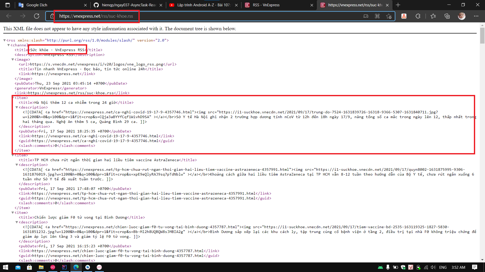

* trong đó nội dung trong cặp thẻ ``<item></item>`` chính là những nội dung ta cần lọc ra để sử dụng cho ứng dụng tổng hợp tin tức.

## 47.1. Các Bước Để Xây Dựng 1 Ứng Dụng Đọc Tin Tức Từ RSS Của Website <a id="47.1"></a>
______________________________________________________________________________________
### 47.1.1. AndroidManifest.xml - Khai Báo Quyền Sử Dụng INTERNET <a id="47.1.1"></a>
______________________________________________________________________________________
* vì ta cần đọc nội dung của RSS XML từ INTERNET, nên ta cần khai báo quyền sử dụng INTERNET trong AndroidManifest.xml
```xml
<?xml version="1.0" encoding="utf-8"?>
<manifest xmlns:android="http://schemas.android.com/apk/res/android"
    package="com.hienqp.collectnewsrssapp">
<!--    thêm dòng khai báo sử dụng quyền uses-permission INTERNET -->
    <uses-permission android:name="android.permission.INTERNET" />
<!--    các dòng khai báo khác giữ nguyên -->
</manifest>
```

### 47.1.2. activity_main.xml - Hiển Thị Dạng ListView (Danh Sách Các Item Lấy Được Từ RSS XML) <a id="47.1.2"></a>
______________________________________________________________________________________
* giao diện của Main Activity sẽ là dạng ListView
* mỗi dòng View trên ListView này hiển thị ``title`` của mỗi ``item`` lấy được từ RSS XML
* khi click vào các dòng View này sẽ kích hoạt Activity hiển thị nội dung Website từ ``link`` của mỗi ``item``
```xml
<?xml version="1.0" encoding="utf-8"?>
<androidx.constraintlayout.widget.ConstraintLayout xmlns:android="http://schemas.android.com/apk/res/android"
    xmlns:app="http://schemas.android.com/apk/res-auto"
    xmlns:tools="http://schemas.android.com/tools"
    android:layout_width="match_parent"
    android:layout_height="match_parent"
    tools:context=".MainActivity">

    <ListView
        android:id="@+id/listView_title"
        android:layout_width="0dp"
        android:layout_height="0dp"
        android:layout_marginStart="8dp"
        android:layout_marginTop="8dp"
        android:layout_marginEnd="8dp"
        android:layout_marginBottom="8dp"
        app:layout_constraintBottom_toBottomOf="parent"
        app:layout_constraintEnd_toEndOf="parent"
        app:layout_constraintStart_toStartOf="parent"
        app:layout_constraintTop_toTopOf="parent" />
</androidx.constraintlayout.widget.ConstraintLayout>
```

### 47.1.3. MainActivity.java <a id="47.1.3"></a>
______________________________________________________________________________________
#### Xây Dựng Phần Hiển Thị ListView
______________________________________________________________________________________
* khai báo DataSource: ArrayList danh sách các ``title`` của các ``item``
* khai báo ArrayAdapter: Adapter dùng kết nối giữa DataSource và AdapterView
* khai báo ListView: là AdapterView sẽ hiển thị danh sách các View ``title``
* khai báo ArrayList danh sách các ``link`` của các ``item`` (dữ liệu ``link`` này sẽ được truyền cho Activity hiển thị nội dung)
* set sự kiện click cho mỗi Item của ListView, kích hoạt Intent với dữ liệu truyền đi là ``link``

#### Xây Dựng 1 AsyncTask Dùng Để Đọc Source Code Của RSS XML
______________________________________________________________________________________
* AsyncTask này có nhiệm vụ:
  * ở doInBackgroud()
    * lấy 1 InputStream từ việc mở kết nối đến URL của RSS XML chỉ định, và trả về 1 String thô là nội dung toàn bộ RSS XML đó
  * ở onPostExecute()
    * nhận String thô nội dung của toàn bộ RSS XML chỉ định
    * khai báo 1 đối tượng XMLDOMParser từ class XMLDOMParser xây dựng dưới đây
    * khai báo 1 đối tượng Document thông qua đối tượng XMLDOMParser với nội dung của Document là String thô
    * khai báo 1 đối tượng NodeList là danh sách các node lấy được từ Document với REGEX của mỗi node là ``item`` (mỗi node tương ứng 1 item)
    * sử dụng for-loop chạy qua NodeList, ở mỗi node ta lấy danh sách các Element của node đó
      * lấy giá trị của Element có REGEX chỉ định là ``title`` ở node hiện tại, add vào ArrayList title
      * lấy giá trị của Element có REGEX chỉ định là ``link`` ở node hiện tại, add vào ArrayList link
```java
package com.hienqp.collectnewsrssapp;

import androidx.appcompat.app.AppCompatActivity;

import android.content.Intent;
import android.os.AsyncTask;
import android.os.Bundle;
import android.view.View;
import android.widget.AdapterView;
import android.widget.ArrayAdapter;
import android.widget.ListView;

import org.w3c.dom.Document;
import org.w3c.dom.Element;
import org.w3c.dom.NodeList;

import java.io.BufferedReader;
import java.io.IOException;
import java.io.InputStream;
import java.io.InputStreamReader;
import java.net.MalformedURLException;
import java.net.URL;
import java.util.ArrayList;

public class MainActivity extends AppCompatActivity {
    private String url = "https://vnexpress.net/rss/suc-khoe.rss";

    ListView listViewTitle;
    ArrayList<String> arrayListTitle;
    ArrayList<String> arrayListLink;

    ArrayAdapter arrayAdapter;

    @Override
    protected void onCreate(Bundle savedInstanceState) {
        super.onCreate(savedInstanceState);
        setContentView(R.layout.activity_main);

        listViewTitle = (ListView) findViewById(R.id.listView_title);
        arrayListTitle = new ArrayList<>();
        arrayListLink = new ArrayList<>();

        arrayAdapter = new ArrayAdapter(MainActivity.this, android.R.layout.simple_list_item_1, arrayListTitle);
        listViewTitle.setAdapter(arrayAdapter);

        new ReadRssAsyncTask().execute(url);

        listViewTitle.setOnItemClickListener(new AdapterView.OnItemClickListener() {
            @Override
            public void onItemClick(AdapterView<?> parent, View view, int position, long id) {
                Intent intent = new Intent(MainActivity.this, DetailContentOfTitleActivity.class);
                intent.putExtra("title_link", arrayListLink.get(position));
                startActivity(intent);
            }
        });
    }

    private class ReadRssAsyncTask extends AsyncTask<String, Void, String> {
        @Override
        protected String doInBackground(String... strings) {
            StringBuilder stringBuilder = new StringBuilder();
            try {
                URL url = new URL(strings[0]);
                InputStream inputStream = url.openConnection().getInputStream();
                InputStreamReader inputStreamReader = new InputStreamReader(inputStream);
                BufferedReader bufferedReader = new BufferedReader(inputStreamReader);
                String line = "";
                while ((line = bufferedReader.readLine()) != null) {
                    stringBuilder.append(line);
                }
                bufferedReader.close();
            } catch (MalformedURLException e) {
                e.printStackTrace();
            } catch (IOException e) {
                e.printStackTrace();
            }

            return stringBuilder.toString();
        }

        @Override
        protected void onPostExecute(String s) {
            super.onPostExecute(s);


            XMLDOMParser xmldomParser = new XMLDOMParser();

            Document document = xmldomParser.getDocument(s);

            NodeList nodeList = document.getElementsByTagName("item");

            String title = "";
            String link = "";
            for (int i = 0; i < nodeList.getLength(); i++) {
                Element element = (Element) nodeList.item(i);
                title = xmldomParser.getValue(element, "title");
                link = xmldomParser.getValue(element, "link");
                arrayListTitle.add(title);
                arrayListLink.add(link);
            }
            arrayAdapter.notifyDataSetChanged();
        }
    }

}
```
### 47.1.4. XMLDOMParser.java <a id="47.1.4"></a>
______________________________________________________________________________________
* xây dựng 1 class XMLDOMParser.java dùng để Parse Document Object Model XML theo mẫu sau.
```java
package com.hienqp.collectnewsrssapp;

import android.util.Log;
import org.w3c.dom.Document;
import org.w3c.dom.Element;
import org.w3c.dom.Node;
import org.w3c.dom.NodeList;
import org.xml.sax.InputSource;
import org.xml.sax.SAXException;
import java.io.IOException;
import java.io.StringReader;
import javax.xml.parsers.DocumentBuilder;
import javax.xml.parsers.DocumentBuilderFactory;
import javax.xml.parsers.ParserConfigurationException;

public class XMLDOMParser {
    public Document getDocument(String xml)
    {
        Document document = null;
        DocumentBuilderFactory factory = DocumentBuilderFactory.newInstance();
        try{
            DocumentBuilder db = factory.newDocumentBuilder();
            InputSource is = new InputSource();
            is.setCharacterStream(new StringReader(xml));
            is.setEncoding("UTF-8");
            document = db.parse(is);
        }catch(ParserConfigurationException e)
        {
            Log.e("Error: ", e.getMessage(), e);
            return null;
        }
        catch (SAXException e) {
            Log.e("Error: ", e.getMessage(), e);
            return null;
        }
        catch(IOException e){
            Log.e("Error: ", e.getMessage(), e);
            return null;
        }
        return document;
    }
    public String getValue(Element item, String name)
    {
        NodeList nodes = item.getElementsByTagName(name);
        return this.getTextNodeValue(nodes.item(0));
    }
    private final String getTextNodeValue(Node elem) {
        Node child;
        if( elem != null){
            if (elem.hasChildNodes()){
                for( child = elem.getFirstChild(); child != null; child = child.getNextSibling() ){
                    if( child.getNodeType() == Node.TEXT_NODE  ){
                        return child.getNodeValue();
                    }
                }
            }
        }
        return "";
    }
}
```

### 47.1.5. activity_detail_content_of_title.xml - UI XML Hiển Thị Dạng WebView Của Mỗi Item Ở ListView <a id="47.1.5"></a>
______________________________________________________________________________________
* DetailContentOfTitleActivity là Activity dùng để hiện thị 1 trang Web của mỗi View được click ở MainActivity
```xml
<?xml version="1.0" encoding="utf-8"?>
<androidx.constraintlayout.widget.ConstraintLayout xmlns:android="http://schemas.android.com/apk/res/android"
    xmlns:app="http://schemas.android.com/apk/res-auto"
    xmlns:tools="http://schemas.android.com/tools"
    android:layout_width="match_parent"
    android:layout_height="match_parent"
    tools:context=".DetailContentOfTitleActivity">

    <WebView
        android:id="@+id/webView_display_detail_content_of_title"
        android:layout_width="0dp"
        android:layout_height="0dp"
        android:layout_marginStart="8dp"
        android:layout_marginTop="8dp"
        android:layout_marginEnd="8dp"
        android:layout_marginBottom="8dp"
        app:layout_constraintBottom_toBottomOf="parent"
        app:layout_constraintEnd_toEndOf="parent"
        app:layout_constraintStart_toStartOf="parent"
        app:layout_constraintTop_toTopOf="parent" />
</androidx.constraintlayout.widget.ConstraintLayout>
```

### 47.1.6. DetailContentOfTitleActivity.java <a id="47.1.6"></a>
______________________________________________________________________________________
```java
package com.hienqp.collectnewsrssapp;

import androidx.appcompat.app.AppCompatActivity;

import android.content.Intent;
import android.os.Bundle;
import android.webkit.WebView;
import android.webkit.WebViewClient;

public class DetailContentOfTitleActivity extends AppCompatActivity {
    WebView webView;

    @Override
    protected void onCreate(Bundle savedInstanceState) {
        super.onCreate(savedInstanceState);
        setContentView(R.layout.activity_detail_content_of_title);

        webView = (WebView) findViewById(R.id.webView_display_detail_content_of_title);

        Intent intent = getIntent();
        String link = intent.getStringExtra("title_link");

        webView.loadUrl(link);

        // thiết lập nếu có đường dẫn khác được kích hoạt trong WebView hiện tại, sẽ không mở đường
        // dẫn đó ở Activity Browser hệ thống, mà vẫn mở trong WebView hiện tại của ứng dụng
        webView.setWebViewClient(new WebViewClient());
    }
}
```
______________________________________________________________________________________
______________________________________________________________________________________
______________________________________________________________________________________
# 48. JSON - JavaScript Object Notation <a id="48"></a>
______________________________________________________________________________________
* JSON cũng tương tự như XML, cũng là 1 kiểu định dạng dữ liệu.
* đối với XML sử dụng thẻ mở thẻ đóng, và dữ liệu nằm ở giữa.
* JSON thì sử dụng khái niệm name và value của name kèm theo.
* JSON là một chuẩn định dạng dữ liệu rất phổ biến ngày nay. Việc trao đổi dữ liệu giữa Server và Client người ta thường 
ưa thích sử dụng JSON.
* Các ứng dụng có mô hình Client Server như 
  * ứng dụng đọc báo, ứng dụng chat, ứng dụng mạng xã hội… 
  * thì thường client sẽ request lên server 
  * và sau đó server sẽ trả dữ liệu cho client dưới dạng JSON. 
  * Nhiệm vụ của Client lúc này là parse JSON để hiển thị ra màn hình.
* trang chủ của JSON: [https://www.json.org/json-en.html]("https://www.json.org/json-en.html")

## 48.1. JSON - Giới Thiệu <a id="48.1"></a>
______________________________________________________________________________________
* JSON (JavaScript Object Notation) là 1 định dạng hoán vị dữ liệu gọn nhẹ.
* JSON có các đặc điểm sau:
  * nó dễ dàng được đọc (read) và viết (write) bởi con người.
  * nó dễ dàng được phân giải (parse) và tạo (generate) bởi chương trình máy.
  * JSON là 1 định dạng kiểu text mà hoàn toàn độc lập với các ngôn ngữ hoàn chỉnh 
  (thuộc họ hàng với các ngôn ngữ họ hàng C, gồm có C, C++, C#, Java, JavaScript, Perl, Python, và nhiều ngôn ngữ khác). 
  Những đặc tính đó đã tạo nên JSON 1 ngôn ngữ hoán vị dữ liệu lý tưởng.
* JSON được xây dựng trên 2 cấu trúc:
  * 1 collection của các cặp ``name/value``, trong những ngôn ngữ khác, điều này được nhận ra như là 1 object, record, 
  struct, dictionary, hash table, key-list, associative array.
  * 1 ordered list of value, trong hầu hết những ngôn ngữ khác, điều này được nhận ra như 1 array, vector, list hoặc sequence.
	
* 
## 48.2. JSON - Các Hình Thức <a id="48.2"></a>
______________________________________________________________________________________
### 48.2.1. Object form <a id="48.2.1"></a>
______________________________________________________________________________________
* hình thức Object là 1 tập hợp chưa được sắp xếp của các cặp ``name/value``.
* 1 hình thức Object:
  * được bắt đầu với ``{``
  * kết thúc với ``}``
  * cặp ``name/value``
    * bắt đầu với 1 String là ``name``
    * theo sau là dấu ``:``
    * kết thúc là 1 giá trị ``value``
  * các cặp ``name/value`` được phân cách bởi dấu ``,``

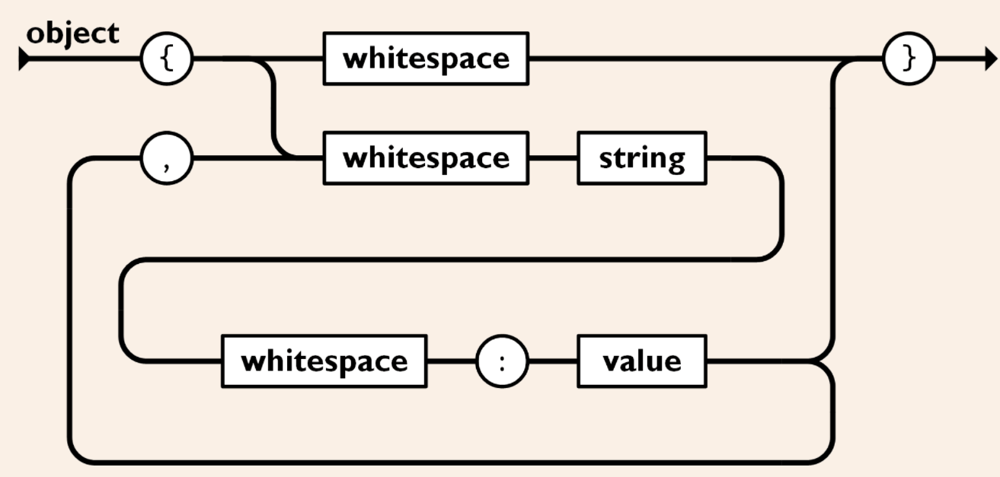

### 48.2.2. Array form <a id="48.2.2"></a>
______________________________________________________________________________________
* hình thức Array là 1 tập hợp các ``value`` (giá trị) đã được sắp xếp
* 1 hình thức Array:
  * bắt đầu với ``[``
  * kết thúc với ``]``
  * ở giữa là các ``value`` được phân cách bởi dấu ``,`` nếu có nhiều hơn 1 ``value``

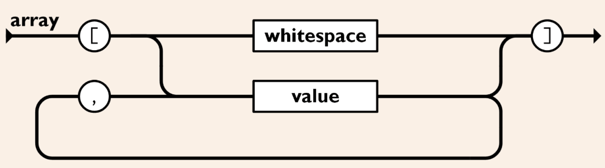

### 48.2.3. Value form <a id="48.2.3"></a>
______________________________________________________________________________________
* 1 ``value`` có thể là:
  * 1 String trong cặp ``""``
  * 1 con số
  * 1 giá trị boolean ``true``, ``false``
  * 1 giá trị ``null``
  * 1 Object
  * 1 Array

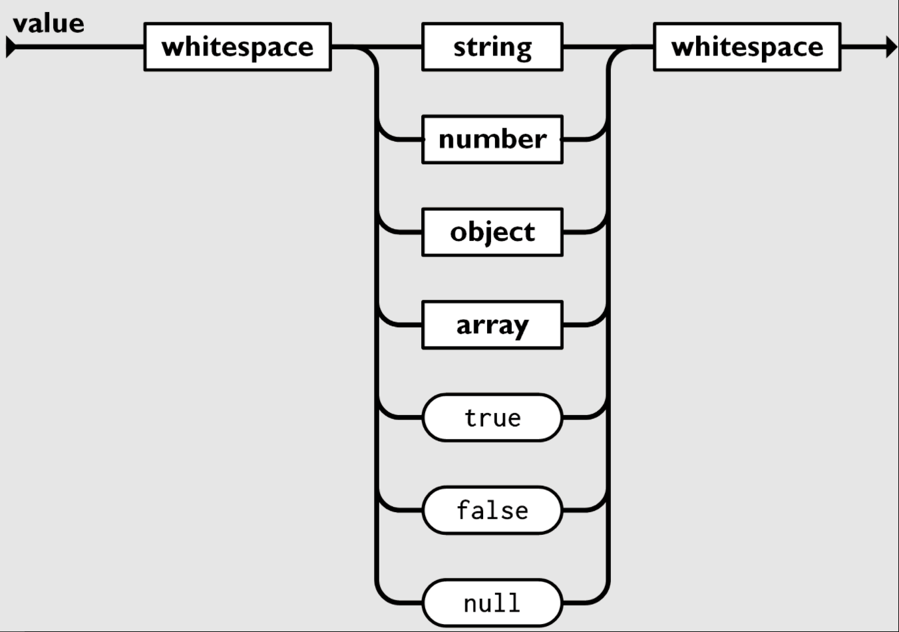

### 48.2.4. String form <a id="48.2.4"></a>
______________________________________________________________________________________
* 1 String được bắt đầu và kết thúc bởi cặp nháy đôi ``""``
* 1 String có thể là:
  * String rỗng (empty)
  * bất kỳ ký tự Unicode
  * các ký tự đặc biệt nằm sau dấu backslash escapes ``\ ``
    * quotation mark ``"``
    * reverse solidus ``\ ``
    * solidus ``/``
    * backspace ``b``
    * formfeed ``f``
    * linefeed ``n``
    * carriage return ``r``
    * horizontal tab ``t``
    * 4 hex digits ``u``

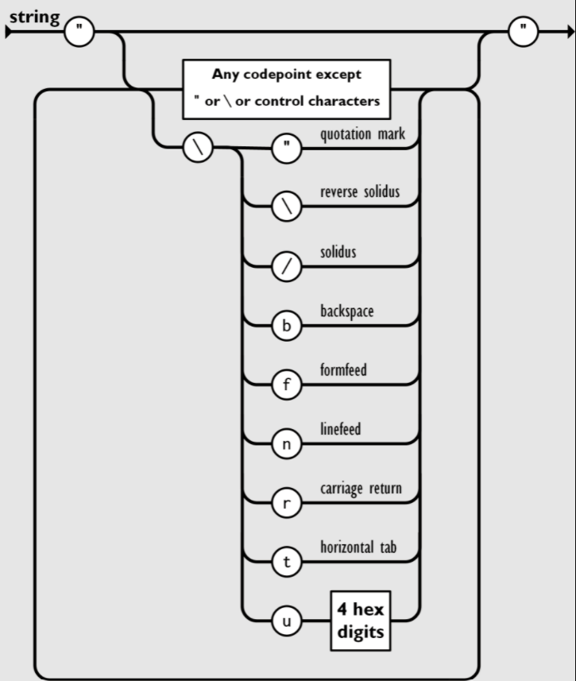

### 48.2.5. Number form <a id="48.2.5"></a>
______________________________________________________________________________________
* 1 Number rất giống số trong C hoặc Java, ngoại trừ định dạng octal và hexadecimal không được sử dụng

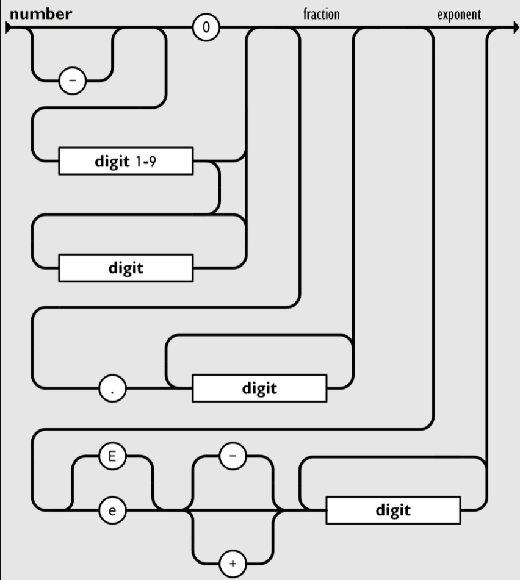

### 48.2.6. Whitespace form <a id="48.2.6"></a>
______________________________________________________________________________________
* Whitespace có thể được chèn vào giữa bất kỳ cặp token, ngoại trừ 1 vài chi tiết encoding hoàn toàn mô tả ngôn ngữ
* Whitespace có thể là 
  * dấu cách ``space``
  * dấu xuống dòng (linefeed) ``\n``
  * dấu cấp dòng (carriage return) ``\r``
  * dấu tab ``\t``

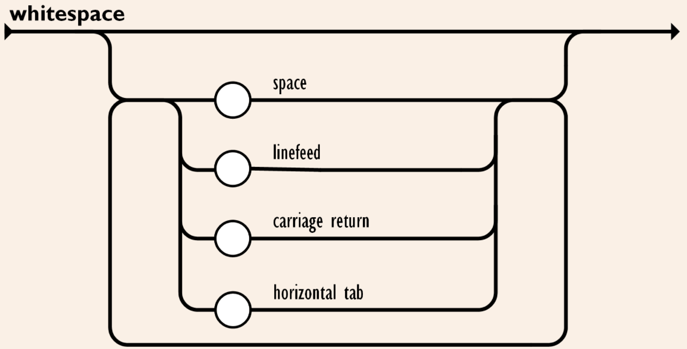

______________________________________________________________________________________
______________________________________________________________________________________
______________________________________________________________________________________
# 49. JSON Object Form <a id="49"></a>
______________________________________________________________________________________
* thử viết 1 file file JSON thủ công
* Searh Google với từ khóa JSON Formatter hoặc vào trang [https://jsonformatter.curiousconcept.com/#]("https://jsonformatter.curiousconcept.com/#")
* nhập theo mẫu sau:

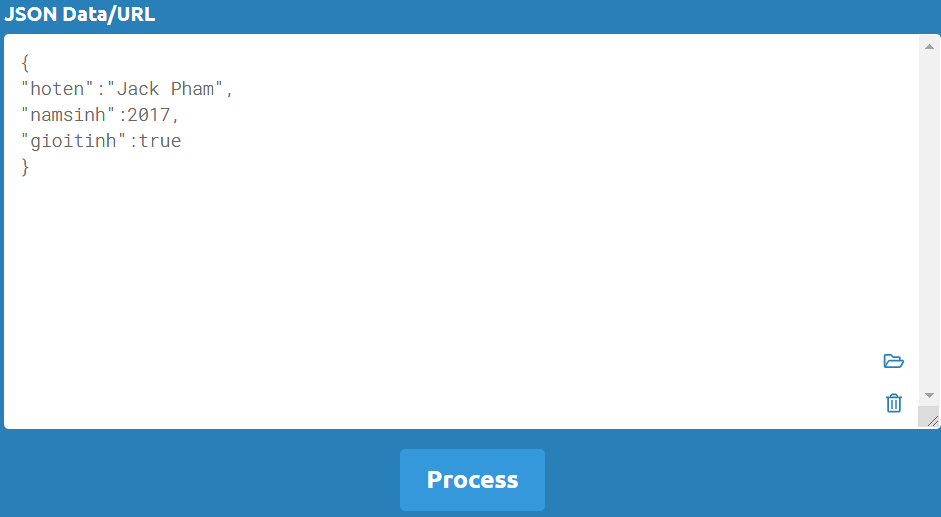

* nhấn Process ta sẽ được file mẫu hoàn chỉnh theo hình thức JSON Object

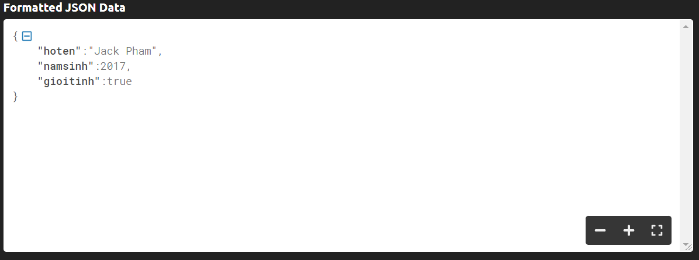

## 49.1. Thực Hành Với JSON Object Form <a id="49.1"></a>
______________________________________________________________________________________
* vào link [https://khoapham.vn/KhoaPhamTraining/json/tien/demo1.json]("https://khoapham.vn/KhoaPhamTraining/json/tien/demo1.json")
* copy nội dung của file demo1.json paste vào trang [https://jsonformatter.curiousconcept.com/#]("https://jsonformatter.curiousconcept.com/#") và Process nó
* nội dung của demo1.json
```json
{
    "monhoc" : "Lập trình Android" ,
    "noihoc" : "Trung Tâm Đào Tạo Tin Học Khoa Phạm",
    "website": "http://khoapham.vn",
    "fanpage": "http://facebook.com/khoapham.vn",
    "logo"   : "http://khoapham.vn/public/images/logo-370.png"
}
```
* file demo1.json là hình thức JSON Object, và ở đây chỉ có duy nhất 1 Object với cá thuộc tính name và value

## 49.2. Đọc demo1.json từ Android <a id="49.2"></a>
______________________________________________________________________________________
* vì file demo1.json nằm ở INTERNET nên cần phải khai báo quyền sử dụng INTERNET ở AndroidManifest.xml
```xml
<?xml version="1.0" encoding="utf-8"?>
<manifest xmlns:android="http://schemas.android.com/apk/res/android"
    package="com.hienqp.jsonobject">

    <uses-permission android:name="android.permission.INTERNET"/>
    <application
        android:allowBackup="true"
        android:icon="@mipmap/ic_launcher"
        android:label="@string/app_name"
        android:roundIcon="@mipmap/ic_launcher_round"
        android:supportsRtl="true"
        android:theme="@style/Theme.JSONObject">
        <activity
            android:name=".MainActivity"
            android:exported="true">
            <intent-filter>
                <action android:name="android.intent.action.MAIN" />

                <category android:name="android.intent.category.LAUNCHER" />
            </intent-filter>
        </activity>
    </application>

</manifest>
```
* sử dụng AsyncTask để đọc dữ liệu từ INTERNET ở đường dẫn UR chỉ định
  * ở doInBackground
    * khai báo 1 đối tượng URL với đường dẫn chỉ định đến file demo1.json
    * mở kết nối stream nhị phân InputStream thông qua đối tượng URL
    * chuyển InputStream sang stream ký tự InputStreamReader
    * chuyển InputStreamReader sang BufferReader để tối ưu việc đọc dữ liệu từ stream
    * trẩ về chuỗi ký tự đọc được từ đường dân cho onPostExecute
  * ở onPostExecute
    * tạo 1 đối tượng JSONObject dùng để parse dữ liệu chuỗi ký tự nhận được thành đối tượng Object
    * thông qua đối tượng JSONObject get từng thuộc tính của đối tượng với tên của thuộc tính phải được chỉ định chính xác
* ở đây ta chỉ thực hành đơn giản là show thống báo kiểu Toast đối với từng thuộc tính của đối tượng được trả về ở MainActivity.java
* **MainActivity.java**
```java
package com.hienqp.jsonobject;

import androidx.appcompat.app.AppCompatActivity;

import android.os.AsyncTask;
import android.os.Bundle;
import android.widget.Toast;

import org.json.JSONException;
import org.json.JSONObject;

import java.io.BufferedReader;
import java.io.IOException;
import java.io.InputStreamReader;
import java.net.MalformedURLException;
import java.net.URL;

public class MainActivity extends AppCompatActivity {

    @Override
    protected void onCreate(Bundle savedInstanceState) {
        super.onCreate(savedInstanceState);
        setContentView(R.layout.activity_main);

        new ReadJSONObject().execute("https://khoapham.vn/KhoaPhamTraining/json/tien/demo1.json");
    }

    private class ReadJSONObject extends AsyncTask<String, Void, String> {
        @Override
        protected String doInBackground(String... strings) {
            StringBuilder stringBuilder = new StringBuilder();
            try {
                URL url = new URL(strings[0]);
                InputStreamReader inputStreamReader = new InputStreamReader(url.openConnection().getInputStream());
                BufferedReader bufferedReader = new BufferedReader(inputStreamReader);

                String line = "";
                while ((line = bufferedReader.readLine()) != null) {
                    stringBuilder.append(line);
                }
                bufferedReader.close();
            } catch (MalformedURLException e) {
                e.printStackTrace();
            } catch (IOException e) {
                e.printStackTrace();
            }
            return stringBuilder.toString();
        }

        @Override
        protected void onPostExecute(String s) {
            super.onPostExecute(s);

            StringBuilder stringBuilder = new StringBuilder();
            try {
                JSONObject jsonObject = new JSONObject(s);
                String monhoc = jsonObject.getString("monhoc");
                String noihoc = jsonObject.getString("noihoc");
                String website = jsonObject.getString("website");
                String fanpage = jsonObject.getString("fanpage");
                String logo = jsonObject.getString("logo");

                stringBuilder.append(monhoc).append("\n");
                stringBuilder.append(noihoc).append("\n");
                stringBuilder.append(website).append("\n");
                stringBuilder.append(fanpage).append("\n");
                stringBuilder.append(logo).append("\n");

                String string = stringBuilder.toString();

                Toast.makeText(MainActivity.this, string, Toast.LENGTH_SHORT).show();
            } catch (JSONException e) {
                e.printStackTrace();
            }
        }
    }

}
```

______________________________________________________________________________________
______________________________________________________________________________________
______________________________________________________________________________________
# 50. JSON Array Form <a id="50"></a>
______________________________________________________________________________________
* xây dựng 1 ứng dụng đọc 1 file .json từ link [https://khoapham.vn/KhoaPhamTraining/json/tien/demo2.json]("https://khoapham.vn/KhoaPhamTraining/json/tien/demo2.json")
* nội dung của demo2.json
```json
{"danhsach": [
  { "khoahoc" : "Lập trình Android" },
  { "khoahoc" : "Lập trình iOS" },
  { "khoahoc" : "Lập trình PHP" },
  { "khoahoc" : "Lập trình NodeJS" },
  { "khoahoc" : "Lập trình Unity" }
]}
```
* phân tích file demo2.json
  * đây là 1 JSONObject (object demo2)
  * trong JSONObject này có 1 thuộc tính là JSONArray (array danhsach)
  * trong JSONArray này chứa các JSONObject con
  * mỗi JSONObject con này có 1 thuộc tính kiểu String có tên là khoahoc

## 50.1. AndroidManifest.xml - INTERNET <a id="50.1"></a>
______________________________________________________________________________________
* ứng dụng sẽ đọc nội dung của file .json từ đường link trên INTERNET, nên cần phải khai báo quyền sử dụng INTERNET trong AndroidManifest.xml
```xml
<?xml version="1.0" encoding="utf-8"?>
<manifest xmlns:android="http://schemas.android.com/apk/res/android"
    package="com.hienqp.jsonarray">

    <uses-permission android:name="android.permission.INTERNET"/>
    <application
        android:allowBackup="true"
        android:icon="@mipmap/ic_launcher"
        android:label="@string/app_name"
        android:roundIcon="@mipmap/ic_launcher_round"
        android:supportsRtl="true"
        android:theme="@style/Theme.JSONArray">
        <activity
            android:name=".MainActivity"
            android:exported="true">
            <intent-filter>
                <action android:name="android.intent.action.MAIN" />

                <category android:name="android.intent.category.LAUNCHER" />
            </intent-filter>
        </activity>
    </application>

</manifest>
```
## 50.2. MainActivity.java <a id="50.2"></a>
______________________________________________________________________________________
* ở bài thực hành này chỉ cần Toast nội dung đọc được lên màn hình nên không cần xây dựng giao diện phức tạp.
* trong MainActivity.java, xây dựng 1 AsyncTask, trong đó
  * ở doInBackground
    * khai báo 1 đối tượng URL với đường dẫn là tham số truyền vào từ ``execute()``
    * khai báo 1 đối tượng InputStream và mở kết nối  stream từ đối tượng URL
    * chuyển InputStream sang stream ký tự InputStreamReader
    * chuyển InputStreamReader sang BufferReader
    * từ đối tượng BufferReader lấy nội dung thô của file demo2.json và return cho onPostExecute
  * ở onPostExecute
    * sử dụng JSONObject lấy object của demo2.json (vì thực tế demo2.json là 1 object)
    * từ JSONObject lấy ra thuộc tính mảng có tên là danhsach bằng JSONArray
    * sau khi có được mảng danhsach chứa các object
      * sử dụng for-loop duyệt qua mảng danhsach
      * mỗi phần tử là 1 object nên lần nữa sử dụng JSONObject lấy ra object từ mảng danhsach
      * lấy ra thuộc tính của từng object trong danhsach với tên thuộc tính chỉ định là khoahoc
* **MainActivity.java**
```java
package com.hienqp.jsonarray;

import androidx.appcompat.app.AppCompatActivity;

import android.os.AsyncTask;
import android.os.Bundle;
import android.widget.Toast;

import org.json.JSONArray;
import org.json.JSONException;
import org.json.JSONObject;

import java.io.BufferedReader;
import java.io.IOException;
import java.io.InputStream;
import java.io.InputStreamReader;
import java.net.MalformedURLException;
import java.net.URL;

public class MainActivity extends AppCompatActivity {

    @Override
    protected void onCreate(Bundle savedInstanceState) {
        super.onCreate(savedInstanceState);
        setContentView(R.layout.activity_main);

        new ReadJSON().execute("https://khoapham.vn/KhoaPhamTraining/json/tien/demo2.json");
    }

    private class ReadJSON extends AsyncTask<String, Void, String> {
        StringBuilder stringBuilder = new StringBuilder();

        @Override
        protected String doInBackground(String... strings) {
            try {
                URL url = new URL(strings[0]);
                InputStream inputStream = url.openConnection().getInputStream();
                InputStreamReader inputStreamReader = new InputStreamReader(inputStream);
                BufferedReader bufferedReader = new BufferedReader(inputStreamReader);

                String line = "";
                while ((line = bufferedReader.readLine()) != null) {
                    stringBuilder.append(line);
                }
            } catch (MalformedURLException e) {
                e.printStackTrace();
            } catch (IOException e) {
                e.printStackTrace();
            }
            return stringBuilder.toString();
        }

        @Override
        protected void onPostExecute(String s) {
            super.onPostExecute(s);
            try {
                JSONObject object = new JSONObject(s);
                JSONArray array = object.getJSONArray("danhsach");

                for (int i = 0; i < array.length(); i++) {
                    JSONObject subObject = array.getJSONObject(i);
                    String valueSubObject = subObject.getString("khoahoc");
                    Toast.makeText(MainActivity.this, valueSubObject, Toast.LENGTH_SHORT).show();
                }
            } catch (JSONException e) {
                e.printStackTrace();
            }
        }
    }
}
```

______________________________________________________________________________________
______________________________________________________________________________________
______________________________________________________________________________________
# 51. JSON - Cấu Hình Ngôn Ngữ Hiển Thị Cho Ứng Dụng <a id="51"></a>
______________________________________________________________________________________
* xây dựng giao diện với tùy chọn ngôn ngữ hiển thị trên màn hình.
* giả sử ta cần xây dựng giao diện:
  * 1 button chọn ngôn ngữ tiếng Anh
  * 1 button chọn ngôn ngữ tiếng Việt
  * khi user nhấn chọn bất kỳ button nào, thì View trên màn hình sẽ hiển thị nội dung với ngôn ngữ đã chọn
* file demo3.json ở đường dẫn [https://khoapham.vn/KhoaPhamTraining/json/tien/demo3.json]("https://khoapham.vn/KhoaPhamTraining/json/tien/demo3.json") có nội dung như sau
```json
{
  "language": {
    "en": {
      "name":"Khoa Pham Training",
	  "address":"90 - 92 Le Thi Rieng",
	  "course1":"Android",
	  "course2":"PHP",
	  "course3":"iOS"
    },
    "vn": {
      "name":"Trung tâm đào tạo tin học Khoa Phạm",
	  "address":"Số 90 - 92 Lê Thị Riêng",
	  "course1":"Lập trình Android",
	  "course2":"Lập trình PHP",
	  "course3":"Lập trình iOS"
    }
  }
}
```

## 51.1. activity_main.xml - Xây Dựng Giao Diện <a id="51.1"></a>
______________________________________________________________________________________
```xml
<?xml version="1.0" encoding="utf-8"?>
<androidx.constraintlayout.widget.ConstraintLayout xmlns:android="http://schemas.android.com/apk/res/android"
    xmlns:app="http://schemas.android.com/apk/res-auto"
    xmlns:tools="http://schemas.android.com/tools"
    android:layout_width="match_parent"
    android:layout_height="match_parent"
    tools:context=".MainActivity">

    <ImageButton
        android:id="@+id/imageButton_vn"
        android:layout_width="100dp"
        android:layout_height="100dp"
        android:layout_marginStart="16dp"
        android:layout_marginTop="16dp"
        android:background="@null"
        android:scaleType="fitXY"
        app:layout_constraintStart_toStartOf="parent"
        app:layout_constraintTop_toTopOf="parent"
        app:srcCompat="@drawable/vietnam_flag" />

    <ImageButton
        android:id="@+id/imageButton_en"
        android:layout_width="100dp"
        android:layout_height="100dp"
        android:layout_marginTop="16dp"
        android:layout_marginEnd="16dp"
        android:background="@null"
        android:padding="10dp"
        android:scaleType="fitXY"
        app:layout_constraintEnd_toEndOf="parent"
        app:layout_constraintTop_toTopOf="parent"
        app:srcCompat="@drawable/usa_flag" />

    <TextView
        android:id="@+id/textView_information"
        android:layout_width="0dp"
        android:layout_height="wrap_content"
        android:layout_marginStart="32dp"
        android:layout_marginTop="40dp"
        android:layout_marginEnd="32dp"
        app:layout_constraintEnd_toEndOf="parent"
        app:layout_constraintHorizontal_bias="0.498"
        app:layout_constraintStart_toStartOf="parent"
        app:layout_constraintTop_toBottomOf="@+id/imageButton_vn" />
</androidx.constraintlayout.widget.ConstraintLayout>
```

## 51.2. MainActivity.java <a id="51.2"></a>
______________________________________________________________________________________
```java
package com.hienqp.jsonobjectlanguage;

import androidx.appcompat.app.AppCompatActivity;

import android.os.AsyncTask;
import android.os.Bundle;
import android.view.View;
import android.widget.ImageButton;
import android.widget.TextView;

import org.json.JSONException;
import org.json.JSONObject;

import java.io.BufferedReader;
import java.io.IOException;
import java.io.InputStream;
import java.io.InputStreamReader;
import java.net.MalformedURLException;
import java.net.URL;

public class MainActivity extends AppCompatActivity {
    ImageButton imageButtonVN, imageButtonEN;
    TextView textViewInformation;

    String content;

    @Override
    protected void onCreate(Bundle savedInstanceState) {
        super.onCreate(savedInstanceState);
        setContentView(R.layout.activity_main);

        captureViewObjectFromLayout();

        // khi thực thi AsyncTask với đường dẫn INTERNET phải khai báo uses-permission INTERNET trong AndroidManifest.xml
        new ReadJSONAsyncTask().execute("https://khoapham.vn/KhoaPhamTraining/json/tien/demo3.json");

        imageButtonVN.setOnClickListener(new View.OnClickListener() {
            @Override
            public void onClick(View v) {
                chooseLanguage("vn");
            }
        });

        imageButtonEN.setOnClickListener(new View.OnClickListener() {
            @Override
            public void onClick(View v) {
                chooseLanguage("en");
            }
        });
    }

    private class ReadJSONAsyncTask extends AsyncTask<String, Void, String> {
        StringBuilder stringBuilder = new StringBuilder();
        @Override
        protected String doInBackground(String... strings) {
            try {
                URL url = new URL(strings[0]);
                InputStream inputStream = url.openConnection().getInputStream();
                InputStreamReader inputStreamReader = new InputStreamReader(inputStream);
                BufferedReader bufferedReader = new BufferedReader(inputStreamReader);

                String line = "";
                while ((line = bufferedReader.readLine()) != null) {
                    stringBuilder.append(line);
                }
            } catch (MalformedURLException e) {
                e.printStackTrace();
            } catch (IOException e) {
                e.printStackTrace();
            }
            return stringBuilder.toString();
        }

        @Override
        protected void onPostExecute(String s) {
            super.onPostExecute(s);

            content = s;

            chooseLanguage("vn");
        }
    }

    private void chooseLanguage(String languageCode) {
        try {
            JSONObject object = new JSONObject(content);
            JSONObject languageObject = object.getJSONObject("language");
            JSONObject vnLanguageObject = languageObject.getJSONObject(languageCode);
            String name = vnLanguageObject.getString("name");
            String address = vnLanguageObject.getString("address");
            String course1 = vnLanguageObject.getString("course1");
            String course2 = vnLanguageObject.getString("course2");
            String course3 = vnLanguageObject.getString("course3");

            displayToTextView(name, address, course1, course2, course3);

        } catch (JSONException e) {
            e.printStackTrace();
        }
    }

    private void displayToTextView(String name, String address, String course1, String course2, String course3) {
        textViewInformation.setText(name + "\n" + address + "\n" + course1 + "\n" + course2 + "\n" + course3);
    }

    private void captureViewObjectFromLayout() {
        imageButtonEN = (ImageButton) findViewById(R.id.imageButton_en);
        imageButtonVN = (ImageButton) findViewById(R.id.imageButton_vn);
        textViewInformation = (TextView) findViewById(R.id.textView_information );
    }
}
```

______________________________________________________________________________________ 
______________________________________________________________________________________ 
______________________________________________________________________________________ 
# 52. JSON Array Object <a id="52"></a>                   
______________________________________________________________________________________
* đọc 1 file .json mảng các đối tượng từ INTERNET
* file demo4.json ở đường dẫn [https://khoapham.vn/KhoaPhamTraining/json/tien/demo4.json]("https://khoapham.vn/KhoaPhamTraining/json/tien/demo4.json")
```json
[
  {"khoahoc"  :  "Lập trình Android"  , "hocphi" : "4000000"},
  {"khoahoc"  :  "Lập trình iOS", "hocphi" : "4500000"},
  {"khoahoc"  :  "Lập trình PHP"   , "hocphi" : "4000000"},
  {"khoahoc"  :  "Lập trình NodeJS"    , "hocphi" : "3000000"},
  {"khoahoc"  :  "Lập trình Unity"     , "hocphi" : "3500000"}
]
```
* sau khi đọc được file demo4.json, sử dụng ListView để hiển thị dữ liệu đầu ra

## 52.1. activity_main.xml <a id="52.1"></a>
______________________________________________________________________________________
```xml
<?xml version="1.0" encoding="utf-8"?>
<androidx.constraintlayout.widget.ConstraintLayout xmlns:android="http://schemas.android.com/apk/res/android"
    xmlns:app="http://schemas.android.com/apk/res-auto"
    xmlns:tools="http://schemas.android.com/tools"
    android:layout_width="match_parent"
    android:layout_height="match_parent"
    tools:context=".MainActivity">

    <ListView
        android:id="@+id/listView_course"
        android:layout_width="0dp"
        android:layout_height="0dp"
        android:layout_marginStart="8dp"
        android:layout_marginTop="8dp"
        android:layout_marginEnd="8dp"
        android:layout_marginBottom="8dp"
        app:layout_constraintBottom_toBottomOf="parent"
        app:layout_constraintEnd_toEndOf="parent"
        app:layout_constraintStart_toStartOf="parent"
        app:layout_constraintTop_toTopOf="parent" />
</androidx.constraintlayout.widget.ConstraintLayout>
```

# 52.2. MainActivity.java <a id="52.2"></a>
______________________________________________________________________________________
```java
package com.hienqp.jsonarrayobject;

import androidx.appcompat.app.AppCompatActivity;

import android.os.AsyncTask;
import android.os.Bundle;
import android.widget.ArrayAdapter;
import android.widget.ListView;

import org.json.JSONArray;
import org.json.JSONException;
import org.json.JSONObject;

import java.io.BufferedReader;
import java.io.IOException;
import java.io.InputStream;
import java.io.InputStreamReader;
import java.net.MalformedURLException;
import java.net.URL;
import java.util.ArrayList;

public class MainActivity extends AppCompatActivity {
    ListView listViewCourse;
    ArrayList<String> arrayCourse;
    ArrayAdapter arrayAdapter;

    @Override
    protected void onCreate(Bundle savedInstanceState) {
        super.onCreate(savedInstanceState);
        setContentView(R.layout.activity_main);

        captureViewObjectFromLayout();

        // sau khi execute() AsyncTask với đường dẫn INTERNET chỉ định phải khai báo uses-permission trong AndroidManifest.xml
        new ReadJSONAsyncTask().execute("https://khoapham.vn/KhoaPhamTraining/json/tien/demo4.json");

        listViewCourse.setAdapter(arrayAdapter);
    }

    private void captureViewObjectFromLayout() {
        listViewCourse = (ListView) findViewById(R.id.listView_course);
        arrayCourse = new ArrayList<>();
        arrayAdapter = new ArrayAdapter(MainActivity.this, android.R.layout.simple_list_item_1, arrayCourse);
    }

    private class ReadJSONAsyncTask extends AsyncTask<String, Void, String> {

        StringBuilder stringBuilder = new StringBuilder();

        @Override
        protected String doInBackground(String... strings) {
            try {
                URL url = new URL(strings[0]);
                InputStream inputStream = url.openConnection().getInputStream();
                InputStreamReader inputStreamReader = new InputStreamReader(inputStream);
                BufferedReader bufferedReader = new BufferedReader(inputStreamReader);

                String line = "";
                while ((line = bufferedReader.readLine()) != null) {
                    stringBuilder.append(line);
                }

                bufferedReader.close();

            } catch (MalformedURLException e) {
                e.printStackTrace();
            } catch (IOException e) {
                e.printStackTrace();
            }

            return stringBuilder.toString();
        }

        @Override
        protected void onPostExecute(String s) {
            super.onPostExecute(s);

            try {
                JSONArray array = new JSONArray(s);

                for (int i = 0; i < array.length(); i++) {
                    JSONObject object = array.getJSONObject(i);
                    String course = object.getString("khoahoc");
                    String fee = object.getString("hocphi");

                    arrayCourse.add(course + " - " + fee);
                }

                arrayAdapter.notifyDataSetChanged();

            } catch (JSONException e) {
                e.printStackTrace();
            }
        }
    }
}
```

______________________________________________________________________________________
______________________________________________________________________________________
______________________________________________________________________________________
# 53. Volley API - Thư Viện Networking Thao Tác Với Các Network API <a id="53"></a>
______________________________________________________________________________________
* Volley được sử dụng cho Android 2.2 API 8 trở lên.
* Volley library Android là thư viện networking cho các dự án Android.
* Volley được dùng để quản lý các network request, giúp cho developer đơn giản hóa việc thực hiện kết nối và xử lý kết quả trả về từ server.
* Volley hỗ trợ đầy đủ các HTTP request như GET, POST, PUT, DELETE. 
* Ngoài ra, các thư viện network kiểu như Volley có tính năng network cache rất hữu ích.
* Tất cả request được cache nhằm đảm bảo khi reload, sẽ có kết quả nhanh hơn. 
* Ngoài ra, response được lưu trong memory nên với các response có dữ liệu như JSON, Image, String… thì rất hiệu quả.
* Volley là một HTTP library giúp các app Android kết nối mạng đơn giản, developer viết code ít hơn. 
* Đặc biệt là thư viện Volley giúp tăng tốc độ ứng dụng nhờ hỗ trợ cache.

## 53.1. Volley API - Một Số Tính Năng Nổi Bật <a id="53.1"></a>
______________________________________________________________________________________
* Hỗ trợ lên schedule để tạo request
* Cho phép cùng lúc thực hiện nhiều request trên các thread khác nhau theo độ ưu tiên.
* Cache trên Disk hay RAM
* Cho phép hủy một request.
* Dễ dàng tùy chỉnh cho phù hợp với yêu cầu của ứng dụng. Như thiết lập retry, back off.
* Dễ debug.

>Ngoài Volley ra thì còn một thư viện Networking Android cũng rất mạnh mẽ và phổ biến khác nữa, đó là Retrofit.

## 53.2. Volley API - Cách Sử Dụng <a id="53.2"></a>
______________________________________________________________________________________
* Volley Networking API có cách sử dụng hiệu quả hơn so với AsyncTask, nhưng so với AsyncTask thì:
  * Volley chỉ thao tác với các Network API, AsyncTask thì cả Local và Network
  * Volley phải khai báo thư viện sử dụng trong build.gradle module của Project, còn AsyncTask được tích hợp sẵn khi khởi tạo Project
  * Volley khi sử dụng phải khai báo quyền sử dụng INTERNET trong AndroidManifest.xml

### 53.2.1. Volley API - Khai Báo Sử Dụng INTERNET Trong AndroidManifest.xml <a id="53.2.1"></a>
______________________________________________________________________________________
* Volley là Networking API thao tác với các Network API, nên khi sử dụng phải khai báo quyền sử dụng INTERNET.
```xml
<?xml version="1.0" encoding="utf-8"?>
<manifest ...>
...
    <uses-permission android:name="android.permission.INTERNET"/>
    <uses-permission android:name="android.permission.ACCESS_NETWORK_STATE"/>
...
</manifest>
```

### 53.2.2. Volley API - Thêm Thư Viện Volley Vào Gradle Module Của Project <a id="53.2.2"></a>
______________________________________________________________________________________
* nếu AsyncTask là API tích hợp sẵn khi tạo mới Project.
* thì Volley API Networking phải được thêm vào thủ công bằng cách khai báo trong file build.gradle cấp độ Module.
* trong khối dependencies của build.gradle Module ta thêm vào đường dẫn nhúng về Volley API mới nhất từ trang [https://developer.android.com/training/volley]("https://developer.android.com/training/volley")
```groovy
dependencies {
    ...
    implementation 'com.android.volley:volley:1.2.1'
}
```
* sau khi khai báo đường dẫn nhúng Volley API Networking phải nhấn Sync Now để đồng bộ cập nhật lại thông tin cho Project.

### 53.2.3. Volley API - Các Lớp Sử Dụng Trong Volley <a id="53.2.3"></a>
______________________________________________________________________________________
* RequestQueue: hàng đợi để giữ các yêu cầu.
* Request: lớp cơ sở của các Request trong Volley và chứa thông tin về yêu cầu HTTP.
* StringRequest: kế thừa từ Request và là lớp đại diện cho yêu cầu trả về chuỗi.
* JSONObjectRequest: là HTTP yêu cầu, có phản hồi trả về là JSONObject.
* JSONArrayRequest: là HTTP yêu cầu, có phản hồi trả về là JSONArray.
* ImageRequest: là HTTP yêu cầu, có phản hồi trả về là Bitmap.

### 53.2.4. Volley API - Các Bước Sử Dụng <a id="53.2.4"></a>
______________________________________________________________________________________
* để sử dụng Volley ta cần thực hiện các bước sau:
  * khởi tạo 1 đối tượng RequestQueue thông qua phương thức static ``newRequestQueue(Context)`` của Volley
    * ``RequestQueue mRequestQueue = Volley.newRequestQueue(context);``
  * khởi tạo các Request theo nhu cầu:
    * Request
    * StringRequest
    * JSONObjectRequest
    * JSONArrayRequest
    * ImageRequest
  * thêm các Request vào RequestQueue
    * ``mRequestQueue.add(request);``

## 53.3. Volley API - StringRequest <a id="53.3"></a>
______________________________________________________________________________________
* StringRequest class
```java
public class StringRequest extends Request<String> {
    
}
```
* StringRequest là 1 Request truy xuất nội dung tại 1 URL chỉ định dưới dạng 1 String.
* khởi tạo 1 đối tượng StringRequest thông qua Constructor
```java
StringRequest stringRequest = new StringRequest(Request.Method.GET, url,
        new Response.Listener<String>() {
            @Override
            public void onResponse(String response) {
                Toast.makeText(MainActivity.this, response, Toast.LENGTH_SHORT).show();
            }
        },
        new Response.ErrorListener() {
            @Override
            public void onErrorResponse(VolleyError error) {
                Log.d("Error", "Error: \n" + error);
            }
        });
```
* có 4 tham số cần truyền vào StringRequest Constructor 
  * tham số chỉ định Method cho Request: ``Request.Method.[TÊN_METHOD]``
    * ```java
      public abstract class Request<T> implements Comparable<Request<T>> {
          /** Supported request methods. */
          public interface Method {
              int DEPRECATED_GET_OR_POST = -1;
              int GET = 0;
              int POST = 1;
              int PUT = 2;
              int DELETE = 3;
              int HEAD = 4;
              int OPTIONS = 5;
              int TRACE = 6;
              int PATCH = 7;
          }
      }
      ```
  * chuỗi URL chỉ định truy xuất nội dung
  * 1 Listener phản hồi kết quả yêu cầu truy xuất thành công
    * truyền vào Anonymous Object ``new Response.Listener<String>() { }`` và implements ``onResponse(response)``
    * kết quả trả về trong phương thức ``onResponse(response)`` sẽ được dùng cho logic của ứng dụng
  * 1 ErrorListener phản hồi Error khi yêu cầu truy xuất thất bại
    * truyền vào Anonymous Object ``new Response.ErrorListener() { }`` và implements ``onErrorResponse(error)``
    * error trả về trong phương thức ``onErrorResponse(error)`` có thể dược dùng trong Logcat để Debug

### 53.3.1. Volley API - StringRequest - Ví Dụ Truy Xuất Source Code Của 1 Website <a id="53.3.1"></a>
______________________________________________________________________________________
* ở AsyncTask ta cũng có thể lấy nội dung của 1 Website về dưới dạng 1 String, nhưng phải trả qua các bước kết nối Stream.
* với Volley API ta có thể bỏ qua các bước đó.

#### Thao Tác Ở build.gradle Module Và AndroidManifest.xml
______________________________________________________________________________________
* đầu tiên để có thể sử dụng Volley API Networking, ta cần nhúng API này vào Project, bằng cách thêm dòng lệnh add API 
vào khối dependencies với phiên bản Volley mới nhất
```groovy
dependencies {
...
    implementation 'com.android.volley:volley:1.2.1'
}
```
* vì Volley là Networking API chỉ thao tác với Network nên trong AndroidManifest.xml cần phải khác báo quyền sử dụng INTERNET
```xml
<manifest xmlns:android="http://schemas.android.com/apk/res/android"
    package="com.hienqp.stringrequest">

    <uses-permission android:name="android.permission.INTERNET"/>
    <uses-permission android:name="android.permission.ACCESS_NETWORK_STATE"/>
</manifest>
```

#### MainActivity.java
______________________________________________________________________________________
* ở ví dụ này ta chỉ Toast lên màn hình để kiểm tra nên không cần xây dựng giao diện phức tạp
```java
package com.hienqp.stringrequest;

import androidx.appcompat.app.AppCompatActivity;

import android.os.Bundle;
import android.util.Log;
import android.widget.Toast;

import com.android.volley.Request;
import com.android.volley.RequestQueue;
import com.android.volley.Response;
import com.android.volley.VolleyError;
import com.android.volley.toolbox.StringRequest;
import com.android.volley.toolbox.Volley;

public class MainActivity extends AppCompatActivity {

    @Override
    protected void onCreate(Bundle savedInstanceState) {
        super.onCreate(savedInstanceState);
        setContentView(R.layout.activity_main);

        // khởi tạo RequestQueue
        RequestQueue requestQueue = Volley.newRequestQueue(MainActivity.this);

        String url = "https://online.khoapham.vn/";

        // khởi tạo StringRequest
        StringRequest stringRequest = new StringRequest(Request.Method.GET, url,
                new Response.Listener<String>() {
                    @Override
                    public void onResponse(String response) {
                        Toast.makeText(MainActivity.this, response, Toast.LENGTH_SHORT).show();
                    }
                },
                new Response.ErrorListener() {
                    @Override
                    public void onErrorResponse(VolleyError error) {
                        Log.d("LOI", "Lỗi: \n" + error);
                    }
                });

        // ở RequestQueue add StringRequest
        requestQueue.add(stringRequest);
    }
}
```

## 53.4. Volley API - JSONObjectRequest <a id="53.4"></a>
______________________________________________________________________________________
* JSONObjectRequest class
```java
public class JsonObjectRequest extends JsonRequest<JSONObject> {
    
}
```
* JSONObjectRequest dùng để gửi Request truy xuất 1 JSONObject tại URL chỉ định, nội dung response là 1 JSONObject sẽ được
trả về.
* khởi tạo JSONObjectRequest thông qua Constructor
```java
JsonObjectRequest jsonObjectRequest = new JsonObjectRequest(Request.Method.GET, url, null,
        new Response.Listener<JSONObject>() {
            @Override
            public void onResponse(JSONObject response) {
                Toast.makeText(MainActivity.this, response.toString(), Toast.LENGTH_SHORT).show();
            }
        },
        new Response.ErrorListener() {
            @Override
            public void onErrorResponse(VolleyError error) {
                Toast.makeText(MainActivity.this, "Lỗi", Toast.LENGTH_SHORT).show();
            }
        });
```
* có 5 tham số cần truyền vào JsonObjectRequest Constructor
  * tham số chỉ định Method cho Request: ``Request.Method.[TÊN_METHOD]``
    * ```java
      public abstract class Request<T> implements Comparable<Request<T>> {
        /** Supported request methods. */
        public interface Method {
            int DEPRECATED_GET_OR_POST = -1;
            int GET = 0;
            int POST = 1;
            int PUT = 2;
            int DELETE = 3;
            int HEAD = 4;
            int OPTIONS = 5;
            int TRACE = 6;
            int PATCH = 7;
        }
      }
      ```
  * chuỗi URL chỉ định truy xuất nội dung
  * JSONObject (``null`` nếu sử dụng Method.GET vì đang nhận chứ không phải gửi đi)
  * 1 Listener phản hồi kết quả yêu cầu truy xuất thành công
      * truyền vào Anonymous Object ``new Response.Listener<JSONObject>() { }`` và implements ``onResponse(response)``
      * kết quả trả về trong phương thức ``onResponse(response)`` sẽ được dùng cho logic của ứng dụng
  * 1 ErrorListener phản hồi Error khi yêu cầu truy xuất thất bại
      * truyền vào Anonymous Object ``new Response.ErrorListener() { }`` và implements ``onErrorResponse(error)``
      * error trả về trong phương thức ``onErrorResponse(error)`` có thể dược dùng trong Logcat để Debug

### 53.4.1. JSONObjectRequest - Truy Xuất 1 JSONObject Từ 1 URL <a id="53.4.1"></a>
______________________________________________________________________________________
#### Thao Tác Ở build.gradle Module Và AndroidManifest.xml
______________________________________________________________________________________
* đầu tiên để có thể sử dụng Volley API Networking, ta cần nhúng API này vào Project, bằng cách thêm dòng lệnh add API
  vào khối dependencies với phiên bản Volley mới nhất
```groovy
dependencies {
...
    implementation 'com.android.volley:volley:1.2.1'
}
```
* vì Volley là Networking API chỉ thao tác với Network nên trong AndroidManifest.xml cần phải khác báo quyền sử dụng INTERNET
```xml
<manifest xmlns:android="http://schemas.android.com/apk/res/android"
    package="com.hienqp.stringrequest">

    <uses-permission android:name="android.permission.INTERNET"/>
    <uses-permission android:name="android.permission.ACCESS_NETWORK_STATE"/>
</manifest>
```

#### MainActivity.java
______________________________________________________________________________________
* ở ví dụ này ta chỉ Toast lên màn hình để kiểm tra nên không cần xây dựng giao diện phức tạp
```java
package com.hienqp.jsonobjectrequest;

import androidx.appcompat.app.AppCompatActivity;

import android.os.Bundle;
import android.widget.Toast;

import com.android.volley.Request;
import com.android.volley.RequestQueue;
import com.android.volley.Response;
import com.android.volley.VolleyError;
import com.android.volley.toolbox.JsonObjectRequest;
import com.android.volley.toolbox.Volley;

import org.json.JSONException;
import org.json.JSONObject;

public class MainActivity extends AppCompatActivity {

    @Override
    protected void onCreate(Bundle savedInstanceState) {
        super.onCreate(savedInstanceState);
        setContentView(R.layout.activity_main);

        RequestQueue requestQueue = Volley.newRequestQueue(MainActivity.this);

        String url = "https://khoapham.vn/KhoaPhamTraining/json/tien/demo1.json";

        JsonObjectRequest jsonObjectRequest = new JsonObjectRequest(Request.Method.GET, url, null,
                new Response.Listener<JSONObject>() {
                    @Override
                    public void onResponse(JSONObject response) {
                        String s = "";
                        try {
                            String monhoc = response.getString("monhoc");
                            String noihoc = response.getString("noihoc");
                            String website = response.getString("website");
                            String fanpage = response.getString("fanpage");
                            String logo = response.getString("logo");

                            s = monhoc + "\n" + noihoc + "\n" + website + "\n" + fanpage + "\n" + logo;
                        } catch (JSONException e) {
                            e.printStackTrace();
                        }

                        Toast.makeText(MainActivity.this, s, Toast.LENGTH_SHORT).show();
                    }
                },
                new Response.ErrorListener() {
                    @Override
                    public void onErrorResponse(VolleyError error) {
                        Toast.makeText(MainActivity.this, "Lỗi", Toast.LENGTH_SHORT).show();
                    }
                });

        requestQueue.add(jsonObjectRequest);
    }
}
```

## 53.5. Volley API - JSONArrayRequest <a id="53.5"></a>
______________________________________________________________________________________
* JSONArrayRequest class
```java
public class JsonArrayRequest extends JsonRequest<JSONArray> {
    
}
```
* JSONArrayRequest dùng để Request truy xuất 1 JSONArray từ URL chỉ định, nội dung response là 1 JSONArray. 
* khởi tạo JSONArrayRequest thông qua Constructor
```java
JsonArrayRequest jsonArrayRequest = new JsonArrayRequest(Request.Method.GET, url, null,
        new Response.Listener<JSONArray>() {
            @Override
            public void onResponse(JSONArray response) {
                
            }
        },
        new Response.ErrorListener() {
            @Override
            public void onErrorResponse(VolleyError error) {
                
            }
        });
```
* có 5 tham số cần truyền vào JSONArrayRequest Constructor
    * tham số chỉ định Method cho Request: ``Request.Method.[TÊN_METHOD]``
        * ```java
      public abstract class Request<T> implements Comparable<Request<T>> {
        /** Supported request methods. */
        public interface Method {
            int DEPRECATED_GET_OR_POST = -1;
            int GET = 0;
            int POST = 1;
            int PUT = 2;
            int DELETE = 3;
            int HEAD = 4;
            int OPTIONS = 5;
            int TRACE = 6;
            int PATCH = 7;
        }
      }
      ```
    * chuỗi URL chỉ định truy xuất nội dung
    * JSONArray (``null`` nếu sử dụng Method.GET vì đang nhận chứ không phải gửi đi)
    * 1 Listener phản hồi kết quả yêu cầu truy xuất thành công
        * truyền vào Anonymous Object ``new Response.Listener<JSONArray>() { }`` và implements ``onResponse(response)``
        * kết quả trả về trong phương thức ``onResponse(response)`` sẽ được dùng cho logic của ứng dụng
    * 1 ErrorListener phản hồi Error khi yêu cầu truy xuất thất bại
        * truyền vào Anonymous Object ``new Response.ErrorListener() { }`` và implements ``onErrorResponse(error)``
        * error trả về trong phương thức ``onErrorResponse(error)`` có thể dược dùng trong Logcat để Debug

### 53.5.1. JSONArrayRequest - Ví Dụ Truy Xuất 1 JSONArray Từ URL Chỉ Định <a id="53.5.1"></a>
______________________________________________________________________________________
#### Thao Tác Ở build.gradle Module Và AndroidManifest.xml
______________________________________________________________________________________
* đầu tiên để có thể sử dụng Volley API Networking, ta cần nhúng API này vào Project, bằng cách thêm dòng lệnh add API
  vào khối dependencies với phiên bản Volley mới nhất
```groovy
dependencies {
...
    implementation 'com.android.volley:volley:1.2.1'
}
```
* vì Volley là Networking API chỉ thao tác với Network nên trong AndroidManifest.xml cần phải khác báo quyền sử dụng INTERNET
```xml
<manifest xmlns:android="http://schemas.android.com/apk/res/android"
    package="com.hienqp.stringrequest">

    <uses-permission android:name="android.permission.INTERNET"/>
    <uses-permission android:name="android.permission.ACCESS_NETWORK_STATE"/>
</manifest>
```

#### MainActivity.java
______________________________________________________________________________________
* ở ví dụ này ta chỉ Toast lên màn hình để kiểm tra nên không cần xây dựng giao diện phức tạp
```java
package com.hienqp.jsonarrayrequest;

import androidx.appcompat.app.AppCompatActivity;

import android.os.Bundle;
import android.widget.Toast;

import com.android.volley.Request;
import com.android.volley.RequestQueue;
import com.android.volley.Response;
import com.android.volley.VolleyError;
import com.android.volley.toolbox.JsonArrayRequest;
import com.android.volley.toolbox.Volley;

import org.json.JSONArray;
import org.json.JSONException;
import org.json.JSONObject;

public class MainActivity extends AppCompatActivity {

    @Override
    protected void onCreate(Bundle savedInstanceState) {
        super.onCreate(savedInstanceState);
        setContentView(R.layout.activity_main);

        RequestQueue requestQueue = Volley.newRequestQueue(MainActivity.this);

        String url = "https://khoapham.vn/KhoaPhamTraining/json/tien/demo4.json";

        JsonArrayRequest jsonArrayRequest = new JsonArrayRequest(Request.Method.GET, url, null,
                new Response.Listener<JSONArray>() {
                    @Override
                    public void onResponse(JSONArray response) {

                        for (int i = 0; i < response.length(); i++) {
                            try {
                                JSONObject object = response.getJSONObject(i);
                                String khoahoc = object.getString("khoahoc");
                                String hocphi = object.getString("hocphi");

                                Toast.makeText(MainActivity.this, khoahoc + " - " + hocphi, Toast.LENGTH_SHORT).show();
                            } catch (JSONException e) {
                                e.printStackTrace();
                            }
                        }
                    }
                },
                new Response.ErrorListener() {
                    @Override
                    public void onErrorResponse(VolleyError error) {
                        Toast.makeText(MainActivity.this, "Error \n" + error.toString(), Toast.LENGTH_SHORT).show();
                    }
                });

        requestQueue.add(jsonArrayRequest);
    }
}
```

## 53.6. Volley API - ImageRequest <a id="53.6"></a>
______________________________________________________________________________________
* ImageRequest class
```java
public class ImageRequest extends Request<Bitmap> {
    
}
```
* ImageRequest dùng để Request 1 Bitmap từ URL chỉ định, nội dung response là 1 Bitmap.
* khởi tạo ImageRequest thông qua Constructor
```java
ImageRequest imageRequest = new ImageRequest(url,
        new Response.Listener<Bitmap>() {
            @Override
            public void onResponse(Bitmap response) {
                
            }
        },
        0,
        0,
        null,
        null,
        new Response.ErrorListener() {
            @Override
            public void onErrorResponse(VolleyError error) {
                
            }
        });
```
* có 7 tham số cần truyền vào Constructor ImageRequest
  * String URL chỉ định GET nội dung Bitmap
  * 1 Listener phản hồi kết quả yêu cầu truy xuất thành công
    * truyền vào Anonymous Object ``new Response.Listener<Bitmap>() { }`` và implements ``onResponse(response)``
    * kết quả trả về trong phương thức ``onResponse(response)`` sẽ được dùng cho logic của ứng dụng
  * giá trị int maxWidth chỉ định chiều rộng tối đa cho Bitmap trả về, muốn mặc định để 0
  * giá trị int maxHeight chỉ định chiều cao tối đa cho Bitmap trả về, muốn mặc định để 0
  * ImageView.ScaleType cho Bitmap trả về, muốn mặc định để null
    * MATRIX
    * FIT_XY
    * FIT_START
    * FIT_CENTER
    * FIT_END
    * CENTER
    * CENTER_CROP
    * CENTER_INSIDE
  * Bitmap.Config cho Bitmap trả về, muốn mặc định để null
    * ALPHA_8
    * RGB_565
    * ARGB_4444
    * ARGB_8888
    * RGBA_F16
    * HARDWARE
  * 1 ErrorListener phản hồi Error khi yêu cầu truy xuất thất bại
    * truyền vào Anonymous Object ``new Response.ErrorListener() { }`` và implements ``onErrorResponse(error)``
    * error trả về trong phương thức ``onErrorResponse(error)`` có thể dược dùng trong Logcat để Debug

### 53.6.1. ImageRequest - Ví Dụ Truy Xuất 1 Bitmap Từ URL Chỉ Định <a id="53.6.1"></a>
______________________________________________________________________________________
#### Thao Tác Ở build.gradle Module Và AndroidManifest.xml
______________________________________________________________________________________
* đầu tiên để có thể sử dụng Volley API Networking, ta cần nhúng API này vào Project, bằng cách thêm dòng lệnh add API
  vào khối dependencies với phiên bản Volley mới nhất
```groovy
dependencies {
...
    implementation 'com.android.volley:volley:1.2.1'
}
```
* vì Volley là Networking API chỉ thao tác với Network nên trong AndroidManifest.xml cần phải khác báo quyền sử dụng INTERNET
```xml
<manifest xmlns:android="http://schemas.android.com/apk/res/android"
    package="com.hienqp.stringrequest">

    <uses-permission android:name="android.permission.INTERNET"/>
    <uses-permission android:name="android.permission.ACCESS_NETWORK_STATE"/>
</manifest>
```

#### activity_main.xml
______________________________________________________________________________________
* sau khi có được nội dung là ảnh Bitmap, ta cần xây dựng 1 ImageView để hiển thị anh Bitmap.
```xml
<?xml version="1.0" encoding="utf-8"?>
<androidx.constraintlayout.widget.ConstraintLayout xmlns:android="http://schemas.android.com/apk/res/android"
    xmlns:app="http://schemas.android.com/apk/res-auto"
    xmlns:tools="http://schemas.android.com/tools"
    android:layout_width="match_parent"
    android:layout_height="match_parent"
    tools:context=".MainActivity">

    <ImageView
        android:id="@+id/imageView_display"
        android:layout_width="wrap_content"
        android:layout_height="wrap_content"
        app:layout_constraintBottom_toBottomOf="parent"
        app:layout_constraintEnd_toEndOf="parent"
        app:layout_constraintStart_toStartOf="parent"
        app:layout_constraintTop_toTopOf="parent"
        tools:srcCompat="@tools:sample/backgrounds/scenic" />
</androidx.constraintlayout.widget.ConstraintLayout>
```

#### MainActivity.java
______________________________________________________________________________________
```java
package com.hienqp.imagerequest;

import androidx.appcompat.app.AppCompatActivity;

import android.graphics.Bitmap;
import android.os.Bundle;
import android.widget.ImageView;
import android.widget.Toast;

import com.android.volley.RequestQueue;
import com.android.volley.Response;
import com.android.volley.VolleyError;
import com.android.volley.toolbox.ImageRequest;
import com.android.volley.toolbox.Volley;

public class MainActivity extends AppCompatActivity {
    ImageView imageViewDisplay;

    @Override
    protected void onCreate(Bundle savedInstanceState) {
        super.onCreate(savedInstanceState);
        setContentView(R.layout.activity_main);

        imageViewDisplay = (ImageView) findViewById(R.id.imageView_display);

        String url = "https://online.khoapham.vn/teacher/img/profile/khoa.jpg";

        RequestQueue requestQueue = Volley.newRequestQueue(MainActivity.this);

        ImageRequest imageRequest = new ImageRequest(url,
                new Response.Listener<Bitmap>() {
                    @Override
                    public void onResponse(Bitmap response) {
                        imageViewDisplay.setImageBitmap(response);
                    }
                },
                0,
                0,
                null,
                null,
                new Response.ErrorListener() {
                    @Override
                    public void onErrorResponse(VolleyError error) {
                        Toast.makeText(MainActivity.this, "Lỗi: " + error.toString(), Toast.LENGTH_SHORT).show();
                    }
                });

        requestQueue.add(imageRequest);
    }
}
```


## 53.7. Volley API - Singleton (Design Pattern) <a id="53.7"></a>
______________________________________________________________________________________
* Nếu ta khởi tạo RequestQueue bằng cách gọi Volley.newRequestQueue(context) n lần thì có n RequestQueue được tạo ra (tốn kém tài nguyên). 
* Ứng dụng chỉ cần duy nhất 1 RequestQueue sử dụng cho toàn app (Activity, Fragment, Service, ...). 
* Vì vậy sử dụng Singleton để thiết kế lớp VolleySingleton để có nhiệm vụ quản lý RequestQueue.
* class VolleySingleton được thiết kế dựa trên Pattern Singleton
```java
package com.hienqp.volleysingletonpattern;

import android.content.Context;

import com.android.volley.RequestQueue;
import com.android.volley.toolbox.Volley;

public class VolleySingleton {
    private static final String TAG = "VolleySingleton";
    private RequestQueue mRequestQueue;
    private static VolleySingleton sInstance;

    private VolleySingleton(Context context) {
        if (mRequestQueue == null)
            mRequestQueue = Volley.newRequestQueue(context.getApplicationContext());
    }

    public static synchronized VolleySingleton getInstance(Context context) {
        if (sInstance == null)
            sInstance = new VolleySingleton(context);
        return sInstance;
    }

    public RequestQueue getRequestQueue() {
        return mRequestQueue;
    }
}
```
* giả sử ta có hàng trăm Request cần thêm vào RequestQueue đi chăng nữa từ bất kỳ Context nào đi chăng nữa, thì ta chỉ cần gọi:
```java
VolleySingleton.getInstance(this).getRequestQueue().add(stringRequest);
VolleySingleton.getInstance(this).getRequestQueue().add(jsonObjectRequest);
VolleySingleton.getInstance(this).getRequestQueue().add(imageRequest);
VolleySingleton.getInstance(this).getRequestQueue().add(jsonArrayRequest);
```
* Giải thích:

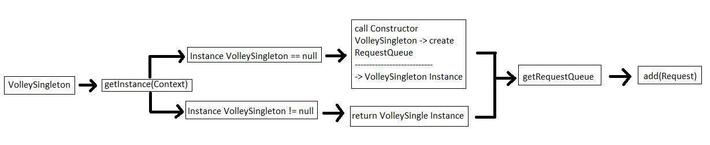

* **MainActivity.java**
```java
package com.hienqp.volleysingletonpattern;

import androidx.appcompat.app.AppCompatActivity;

import android.graphics.Bitmap;
import android.os.Bundle;
import android.widget.ImageView;
import android.widget.Toast;

import com.android.volley.Request;
import com.android.volley.Response;
import com.android.volley.VolleyError;
import com.android.volley.toolbox.ImageRequest;
import com.android.volley.toolbox.JsonArrayRequest;
import com.android.volley.toolbox.JsonObjectRequest;
import com.android.volley.toolbox.StringRequest;

import org.json.JSONArray;
import org.json.JSONObject;

import java.util.Locale;

public class MainActivity extends AppCompatActivity {
    ImageView imageView;

    @Override
    protected void onCreate(Bundle savedInstanceState) {
        super.onCreate(savedInstanceState);
        setContentView(R.layout.activity_main);

        imageView = (ImageView) findViewById(R.id.imageView);
        String jsonObjectURL = "https://khoapham.vn/KhoaPhamTraining/json/tien/demo1.json";
        String jsonArrayURL = "https://khoapham.vn/KhoaPhamTraining/json/tien/demo4.json";
        String imageURL = "https://online.khoapham.vn/teacher/img/profile/khoa.jpg";
        String stringURL = "https://online.khoapham.vn/";

        StringRequest stringRequest = new StringRequest(
                Request.Method.GET,
                stringURL,
                new Response.Listener<String>() {
                    @Override
                    public void onResponse(String response) {
                        Toast.makeText(MainActivity.this, response.toString(), Toast.LENGTH_SHORT).show();
                    }
                },
                new Response.ErrorListener() {
                    @Override
                    public void onErrorResponse(VolleyError error) {

                    }
                }
        );

        JsonObjectRequest jsonObjectRequest = new JsonObjectRequest(
                Request.Method.GET,
                jsonObjectURL,
                null,
                new Response.Listener<JSONObject>() {
                    @Override
                    public void onResponse(JSONObject response) {
                        Toast.makeText(MainActivity.this, response.toString(), Toast.LENGTH_SHORT).show();
                    }
                },
                new Response.ErrorListener() {
                    @Override
                    public void onErrorResponse(VolleyError error) {

                    }
                }
        );

        JsonArrayRequest jsonArrayRequest = new JsonArrayRequest(
                Request.Method.GET,
                jsonArrayURL,
                null,
                new Response.Listener<JSONArray>() {
                    @Override
                    public void onResponse(JSONArray response) {
                        Toast.makeText(MainActivity.this, response.toString(), Toast.LENGTH_SHORT).show();
                    }
                },
                new Response.ErrorListener() {
                    @Override
                    public void onErrorResponse(VolleyError error) {

                    }
                }
        );

        ImageRequest imageRequest = new ImageRequest(
                imageURL,
                new Response.Listener<Bitmap>() {
                    @Override
                    public void onResponse(Bitmap response) {
                        imageView.setImageBitmap(response);
                    }
                },
                0,
                0,
                null,
                null,
                new Response.ErrorListener() {
                    @Override
                    public void onErrorResponse(VolleyError error) {

                    }
                }
        );

        VolleySingleton.getInstance(MainActivity.this).getRequestQueue().add(stringRequest);
        VolleySingleton.getInstance(MainActivity.this).getRequestQueue().add(jsonObjectRequest);
        VolleySingleton.getInstance(MainActivity.this).getRequestQueue().add(jsonArrayRequest);
        VolleySingleton.getInstance(MainActivity.this).getRequestQueue().add(imageRequest);
    }
}
```

______________________________________________________________________________________
______________________________________________________________________________________
______________________________________________________________________________________
# 54. Media Local - raw Resource <a id="54"></a>
______________________________________________________________________________________
## 54.1. raw Resource Directory <a id="54.1"></a>
______________________________________________________________________________________
* raw Resource là thu mục dùng để quản lý các file sound và video.
* để tạo thư mục raw resource:
  * chuột phải thư mục **res/** -> **New** -> **Android Resource Directory**
  * Resource type: raw
  * OK
* ta có thể copy/paste file sound hoặc video vào thư mục **res/raw/**
* lưu ý:
  * tên file phải hoàn toàn viết thường
  * bắt đầu bằng 1 chữ cái
  * có thể chứa dấu gạch chân ``_``

## 54.2. MediaPlayer - Play Sound Từ raw Resource <a id="54.2"></a>
______________________________________________________________________________________
* giả sử ta cần start() 1 file sound từ raw tại 1 sự kiện nào đó.
* đầu tiên, khởi tạo 1 đối tượng MediaPlayer từ phương thức static MediaPlayer.create(Context, int_ResourceID)
  * ``MediaPlayer mediaPlayer = MediaPlayer.create(MainActivity.this, R.raw.co_don_danh_cho_ai_remix_lee_ken_nal);``
* sau đó từ đối tượng MediaPlayer vừa khởi tạo, ta gọi phương thức start()
  * ``mediaPlayer.start();``

## 54.3. Ví Dụ Play 1 File Sound Local <a id="54.3"></a>
______________________________________________________________________________________
### 54.3.1. activity_main.xml <a id="54.3.1"></a>
______________________________________________________________________________________
* thiết kế 1 Button, khi nhấn vào sẽ phát file sound trong thư mục raw
```xml
<?xml version="1.0" encoding="utf-8"?>
<androidx.constraintlayout.widget.ConstraintLayout xmlns:android="http://schemas.android.com/apk/res/android"
    xmlns:app="http://schemas.android.com/apk/res-auto"
    xmlns:tools="http://schemas.android.com/tools"
    android:layout_width="match_parent"
    android:layout_height="match_parent"
    tools:context=".MainActivity">

    <Button
        android:id="@+id/button_play"
        android:layout_width="wrap_content"
        android:layout_height="wrap_content"
        android:layout_marginStart="16dp"
        android:layout_marginTop="16dp"
        android:text="Play"
        app:layout_constraintStart_toStartOf="parent"
        app:layout_constraintTop_toTopOf="parent" />
</androidx.constraintlayout.widget.ConstraintLayout>
```

### 54.3.2. MainActivity.java <a id="54.3.2"></a>
______________________________________________________________________________________
* thiết lập sự kiện click Button sẽ play file sound
```java
package com.hienqp.sound;

import androidx.appcompat.app.AppCompatActivity;

import android.media.MediaPlayer;
import android.os.Bundle;
import android.view.View;
import android.widget.Button;

public class MainActivity extends AppCompatActivity {
    Button buttonPlay;

    @Override
    protected void onCreate(Bundle savedInstanceState) {
        super.onCreate(savedInstanceState);
        setContentView(R.layout.activity_main);

        captureViewObjectFromLayout();

        buttonPlay.setOnClickListener(new View.OnClickListener() {
            @Override
            public void onClick(View v) {
                MediaPlayer mediaPlayer = MediaPlayer.create(MainActivity.this, R.raw.co_don_danh_cho_ai_remix_lee_ken_nal);
                mediaPlayer.start();
            }
        });
    }

    private void captureViewObjectFromLayout() {
        buttonPlay = (Button) findViewById(R.id.button_play);
    }
}
```

## 54.4. MediaPlayer - VideoView Và MediaController <a id="54.4"></a>
______________________________________________________________________________________
* để play 1 video ở local, ta phải copy/paste 1 file video vào raw resource, quy tắc đặt tên cho video tương tự như sound.
* UI XML xây dựng 1 VideoView dùng để hiển thị video.
* ở Logic code:
  * khởi tạo 1 Uri đường dẫn đến file video trong raw resource từ phương thức ``Uri.parse(String);``
    * cú pháp String truyền vào ``Uri.parse(String)``
      * ``"android.resource://" + getPackageName() + "/" + R.raw.[tên_video]``
    * ``Uri uri = Uri.parse("android.resource://" + getPackageName() + "/" + R.raw.thay_long_remix_nal_tvk_legiaquan);``
  * gắn video Uri cho VideoView bằng cách gọi phương thức setVideoURI(Uri) thông qua VideoView
    * ``videoViewDisplayMp4.setVideoURI(uri);``
  * sau đó start() VideoView để phát video từ Uri chỉ định
    * ``videoViewDisplayMp4.start();``
  * để hiển thị trình điều khiển (các Button lùi, tiến, dừng, Seekbar tua nhanh)
    * khởi tạo 1 MediaController bằng Constructor với tham số truyền vào là Context
      * ``MediaController mediaController = new MediaController(MainActivity.this);``
    * để hiển thị MediaController ta phải làm đầy đủ 2 bước sau
      * gọi phương thức ``setMediaPlayer(VideoView)`` thông qua MediaController
        * ``mediaController.setMediaPlayer(videoViewDisplayMp4);``
      * gọi phương thức ``setMediaController(MediaController)`` thông qua VideoView
        * ``videoViewDisplayMp4.setMediaController(mediaController);``

### 54.4.1. activity_main.xml <a id="54.4.1"></a>
______________________________________________________________________________________
* dựng 1 VideoView để hiển thị Video
```xml
<?xml version="1.0" encoding="utf-8"?>
<androidx.constraintlayout.widget.ConstraintLayout xmlns:android="http://schemas.android.com/apk/res/android"
    xmlns:app="http://schemas.android.com/apk/res-auto"
    xmlns:tools="http://schemas.android.com/tools"
    android:layout_width="match_parent"
    android:layout_height="match_parent"
    tools:context=".MainActivity">

    <Button
        android:id="@+id/button_play_video"
        android:layout_width="wrap_content"
        android:layout_height="wrap_content"
        android:layout_marginTop="16dp"
        android:text="Play Video"
        app:layout_constraintEnd_toEndOf="parent"
        app:layout_constraintStart_toStartOf="parent"
        app:layout_constraintTop_toTopOf="parent" />

    <VideoView
        android:id="@+id/videoView_display_mp4"
        android:layout_width="411dp"
        android:layout_height="426dp"
        android:layout_marginStart="8dp"
        android:layout_marginTop="32dp"
        android:layout_marginEnd="8dp"
        android:layout_marginBottom="32dp"
        app:layout_constraintBottom_toBottomOf="parent"
        app:layout_constraintEnd_toEndOf="parent"
        app:layout_constraintStart_toStartOf="parent"
        app:layout_constraintTop_toBottomOf="@+id/button_play_video" />
</androidx.constraintlayout.widget.ConstraintLayout>
```

### 54.4.2. MainActivity.java <a id="54.4.2"></a>
______________________________________________________________________________________
```java
package com.hienqp.video;

import androidx.appcompat.app.AppCompatActivity;

import android.net.Uri;
import android.os.Bundle;
import android.view.View;
import android.widget.Button;
import android.widget.MediaController;
import android.widget.VideoView;

public class MainActivity extends AppCompatActivity {
    Button buttonPlayVideo;
    VideoView videoViewDisplayMp4;

    @Override
    protected void onCreate(Bundle savedInstanceState) {
        super.onCreate(savedInstanceState);
        setContentView(R.layout.activity_main);

        captureViewObjectFromLayout();

        buttonPlayVideo.setOnClickListener(new View.OnClickListener() {
            @Override
            public void onClick(View v) {
                Uri uri = Uri.parse("android.resource://" + getPackageName() + "/" + R.raw.thay_long_remix_nal_tvk_legiaquan);
                videoViewDisplayMp4.setVideoURI(uri);
                videoViewDisplayMp4.start();

                MediaController mediaController = new MediaController(MainActivity.this);

                mediaController.setMediaPlayer(videoViewDisplayMp4);
                videoViewDisplayMp4.setMediaController(mediaController);
            }
        });
    }

    private void captureViewObjectFromLayout() {
        buttonPlayVideo = (Button) findViewById(R.id.button_play_video);
        videoViewDisplayMp4 = (VideoView) findViewById(R.id.videoView_display_mp4);
    }
}
```

______________________________________________________________________________________
______________________________________________________________________________________
______________________________________________________________________________________
# 55. Media Online <a id="55"></a>
______________________________________________________________________________________
## 55.1. Media Online Sound <a id="55.1"></a>
______________________________________________________________________________________
* để có thể start() 1 Media Sound Online, trước tiên ứng dụng phải sủ dụng được quyền INTERNET khai báo trong AndroidManifest.xml
```xml
<?xml version="1.0" encoding="utf-8"?>
<manifest>
....
    <uses-permission android:name="android.permission.INTERNET"/>
    <uses-permission android:name="android.permission.ACCESS_NETWORK_STATE"/>
...
</manifest>
```
* xử lý Logic Code
  * cần phải có đường dẫn truy cập đến file Sound từ Server Online
    * ``String urlMP3 = "https://khoapham.vn/download/vietnamoi.mp3";``
  * khai báo 1 đối tượng MediaPlayer từ Constructor
    * ``MediaPlayer mediaPlayer = new MediaPlayer();``
  * thiết lập loại Audio Stream cho MediaPlayer tham số truyền vào là ``AudioManager.STREAM_MUSIC``
    * ``mediaPlayer.setAudioStreamType(AudioManager.STREAM_MUSIC);``
  * thiết lập DataSource (đường dẫn chứa file Sound) cho MediaPlayer
    * ``mediaPlayer.setDataSource(urlMP3);``
  * gọi ``prepareAsync()`` để load dữ liệu từ những thông tin đã thiết lập cho MediaPlayer
    * ``mediaPlayer.prepareAsync();``
  * gọi phương thức Listener khi dữ liệu đã chuẩn bị hoàn tất cho MediaPlayer, truyền vào Anonymous Object ``OnPreparedListener``
    * ```java
      mediaPlayer.setOnPreparedListener(new MediaPlayer.OnPreparedListener() {
          @Override
          public void onPrepared(MediaPlayer mp) {
              mp.start();
          }
      });
      ```
  * override phương thức ``onPrepared(MediaPlayer)`` của interface ``OnPreparedListener``, trong phương thức ta start() đối tượng MediaPlayer được truyền vào
    * ```java
        @Override
        public void onPrepared(MediaPlayer mp) {
            mp.start();
        }
     ```
______________________________________________________________________________________
* file **AndroidManifest.xml**
```xml
<?xml version="1.0" encoding="utf-8"?>
<manifest xmlns:android="http://schemas.android.com/apk/res/android"
    package="com.hienqp.sound">

    <uses-permission android:name="android.permission.INTERNET"/>
    <uses-permission android:name="android.permission.ACCESS_NETWORK_STATE"/>
    <application
        android:allowBackup="true"
        android:icon="@mipmap/ic_launcher"
        android:label="@string/app_name"
        android:roundIcon="@mipmap/ic_launcher_round"
        android:supportsRtl="true"
        android:theme="@style/Theme.Sound">
        <activity
            android:name=".MainActivity"
            android:exported="true">
            <intent-filter>
                <action android:name="android.intent.action.MAIN" />

                <category android:name="android.intent.category.LAUNCHER" />
            </intent-filter>
        </activity>
    </application>

</manifest>
```
______________________________________________________________________________________
* file **activity_main.xml**
```xml
<?xml version="1.0" encoding="utf-8"?>
<androidx.constraintlayout.widget.ConstraintLayout xmlns:android="http://schemas.android.com/apk/res/android"
    xmlns:app="http://schemas.android.com/apk/res-auto"
    xmlns:tools="http://schemas.android.com/tools"
    android:layout_width="match_parent"
    android:layout_height="match_parent"
    tools:context=".MainActivity">

    <Button
        android:id="@+id/button_play"
        android:layout_width="wrap_content"
        android:layout_height="wrap_content"
        android:layout_marginStart="16dp"
        android:layout_marginTop="16dp"
        android:text="Play Mp3 Online"
        app:layout_constraintStart_toStartOf="parent"
        app:layout_constraintTop_toTopOf="parent" />

    <ProgressBar
        android:id="@+id/progressBar_load"
        style="?android:attr/progressBarStyle"
        android:layout_width="wrap_content"
        android:layout_height="wrap_content"
        android:layout_marginStart="20dp"
        android:layout_marginTop="16dp"
        app:layout_constraintStart_toEndOf="@+id/button_play"
        app:layout_constraintTop_toTopOf="parent" />
</androidx.constraintlayout.widget.ConstraintLayout>
```
______________________________________________________________________________________
* file **MainActivity.java**
```java
package com.hienqp.sound;

import androidx.appcompat.app.AppCompatActivity;

import android.media.AudioManager;
import android.media.MediaPlayer;
import android.os.Bundle;
import android.view.View;
import android.widget.Button;
import android.widget.ProgressBar;

import java.io.IOException;

public class MainActivity extends AppCompatActivity {
    String urlMP3 = "https://khoapham.vn/download/vietnamoi.mp3";

    Button buttonPlay;
    ProgressBar progressBarLoad;

    @Override
    protected void onCreate(Bundle savedInstanceState) {
        super.onCreate(savedInstanceState);
        setContentView(R.layout.activity_main);

        captureViewObjectFromLayout();

        progressBarLoad.setVisibility(View.GONE);
        buttonPlay.setOnClickListener(new View.OnClickListener() {
            @Override
            public void onClick(View v) {
                MediaPlayer mediaPlayer = new MediaPlayer();
                mediaPlayer.setAudioStreamType(AudioManager.STREAM_MUSIC);
                try {
                    mediaPlayer.setDataSource(urlMP3);
                    mediaPlayer.prepareAsync();
                    progressBarLoad.setVisibility(View.VISIBLE);
                    mediaPlayer.setOnPreparedListener(new MediaPlayer.OnPreparedListener() {
                        @Override
                        public void onPrepared(MediaPlayer mp) {
                            progressBarLoad.setVisibility(View.GONE);
                            mp.start();
                        }
                    });
                } catch (IOException e) {
                    e.printStackTrace();
                }
            }
        });
    }

    private void captureViewObjectFromLayout() {
        buttonPlay = (Button) findViewById(R.id.button_play);
        progressBarLoad = (ProgressBar) findViewById(R.id.progressBar_load);
    }
}
```

## 55.2. Media Online Video <a id="55.2"></a>
______________________________________________________________________________________
* việc phát Video từ Server Online tương tự như phát Video từ Local
* đầu tiên phải khai báo quyền sử dụng INTERNET trong AndroidManifest.xml
```xml
<?xml version="1.0" encoding="utf-8"?>
<manifest>
....
    <uses-permission android:name="android.permission.INTERNET"/>
    <uses-permission android:name="android.permission.ACCESS_NETWORK_STATE"/>
...
</manifest>
```
* chuẩn bị 1 đường dẫn đến Server Online chứa file Video
  * ``String url = "https://khoapham.vn/download/vuoncaovietnam.mp4";``
* dựng 1 VideoView dùng để chứa Video được phát
* khởi tạo đối tượng Uri từ phương thức ``Uri.parse(String)`` tham số truyền vào là đường dẫn đến Server file Video
  * ``Uri uri = Uri.parse(url);``
* thiết lập Video Uri cho VideoView
  * ``videoView.setVideoURI(uri);``
* start() Video từ Uri chỉ định thông qua VideoView
  * ``videoView.start();``
* ngoài ra có thể thiết lập MediaController cho VideoView để điều khiển các thao tác dừng, kế tiếp, hay trở về trên VideoView
  * ``MediaController mediaController = new MediaController(MainActivity.this);`` <br/>
  ``videoView.setMediaController(mediaController);``

______________________________________________________________________________________
* file **AndroidManifest.xml**
```xml
<?xml version="1.0" encoding="utf-8"?>
<manifest xmlns:android="http://schemas.android.com/apk/res/android"
    package="com.hienqp.video">

    <uses-permission android:name="android.permission.INTERNET"/>
    <uses-permission android:name="android.permission.ACCESS_NETWORK_STATE"/>
    <application
        android:allowBackup="true"
        android:icon="@mipmap/ic_launcher"
        android:label="@string/app_name"
        android:roundIcon="@mipmap/ic_launcher_round"
        android:supportsRtl="true"
        android:theme="@style/Theme.Video">
        <activity
            android:name=".MainActivity"
            android:exported="true">
            <intent-filter>
                <action android:name="android.intent.action.MAIN" />

                <category android:name="android.intent.category.LAUNCHER" />
            </intent-filter>
        </activity>
    </application>

</manifest>
```

______________________________________________________________________________________
* file **activity_main.xml**
```xml
<?xml version="1.0" encoding="utf-8"?>
<androidx.constraintlayout.widget.ConstraintLayout xmlns:android="http://schemas.android.com/apk/res/android"
    xmlns:app="http://schemas.android.com/apk/res-auto"
    xmlns:tools="http://schemas.android.com/tools"
    android:layout_width="match_parent"
    android:layout_height="match_parent"
    tools:context=".MainActivity">

    <Button
        android:id="@+id/button_play"
        android:layout_width="wrap_content"
        android:layout_height="wrap_content"
        android:layout_marginTop="16dp"
        android:text="Play MP4"
        app:layout_constraintEnd_toEndOf="parent"
        app:layout_constraintStart_toStartOf="parent"
        app:layout_constraintTop_toTopOf="parent" />

    <VideoView
        android:id="@+id/videoView"
        android:layout_width="0dp"
        android:layout_height="282dp"
        android:layout_marginStart="8dp"
        android:layout_marginTop="20dp"
        android:layout_marginEnd="8dp"
        app:layout_constraintEnd_toEndOf="parent"
        app:layout_constraintHorizontal_bias="0.0"
        app:layout_constraintStart_toStartOf="parent"
        app:layout_constraintTop_toBottomOf="@+id/button_play" />
</androidx.constraintlayout.widget.ConstraintLayout>
```

______________________________________________________________________________________
* file **MainActivity.java**
```java
package com.hienqp.video;

import androidx.appcompat.app.AppCompatActivity;

import android.net.Uri;
import android.os.Bundle;
import android.view.View;
import android.widget.Button;
import android.widget.MediaController;
import android.widget.VideoView;

public class MainActivity extends AppCompatActivity {
    Button buttonPlay;
    VideoView videoView;

    String url = "https://khoapham.vn/download/vuoncaovietnam.mp4";

    @Override
    protected void onCreate(Bundle savedInstanceState) {
        super.onCreate(savedInstanceState);
        setContentView(R.layout.activity_main);

        captureViewObjectFromLayout();

        buttonPlay.setOnClickListener(new View.OnClickListener() {
            @Override
            public void onClick(View v) {
                Uri uri = Uri.parse(url);
                videoView.setVideoURI(uri);
                MediaController mediaController = new MediaController(MainActivity.this);
                videoView.setMediaController(mediaController);
                videoView.start();
            }
        });
    }

    private void captureViewObjectFromLayout() {
        buttonPlay = (Button) findViewById(R.id.button_play);
        videoView = (VideoView) findViewById(R.id.videoView);
    }
}
```

______________________________________________________________________________________
______________________________________________________________________________________
______________________________________________________________________________________
# 56. SQLite - Local DataBase Trong Android (Cơ Sỡ Dữ Liệu Cục Bộ) <a id="56"></a>
______________________________________________________________________________________
## 56.1. SQLite database <a id="56.1"></a>
______________________________________________________________________________________
* SQLite là một cơ sở dữ liệu SQL mã nguồn mở, nó lưu trữ dữ liệu vào một tập tin văn bản trên một thiết bị. mặc định đã được tích hợp trên thiết bị Android.
* Để truy cập dữ liệu này, bạn không cần phải thiết lập bất kỳ loại kết nối nào cho nó như JDBC, ODBC, ...


### 56.2. Cách sử dụng SQLite <a id="56.2"></a>
______________________________________________________________________________________
* Đầu tiên, để thao tác với SQLite, ta phải dùng 2 đối tượng
  * SQLiteOpenHelper: đối tượng dùng để tạo, nâng cấp, đóng mở kết nối CSDL
  * SQLiteDatabase: đối tượng dùng để thực thi các câu lệnh SQL trên một CSDL

### 56.2.1. SQLiteOpenHelper <a id="56.2.1"></a>
______________________________________________________________________________________
#### SQLiteOpenHelper
______________________________________________________________________________________
```java
public abstract class SQLiteOpenHelper implements AutoCloseable {
    
}
```

#### SQLiteOpenHelper có 2 Constructor
______________________________________________________________________________________
* một constructor 4 tham số, ta chủ yếu làm việc với constructor 4 tham số
```java
public SQLiteOpenHelper(
        @Nullable Context context, 
            @Nullable String name,
                @Nullable CursorFactory factory, 
                    int version) {
    //...
}
```

Data Type      |Parameter Name |Description
---------------|---------------|---------------------------------------------------
Context        |context        |Context là một lớp trừu tượng của hệ thống, chứa thông tin môi trường ứng dụng, cung cấp các phương thức để có thể tương tác với hệ điều hành, giúp chúng ta dễ dàng truy cập và tương tác tới các tài nguyên của hệ thống...
String         |name           |tên chỉ định cho database
CursorFactory  |factory        |con trỏ dùng để query data, ở constructor này thường để ``null``
int            |version        |chỉ định số phiên bản của database (bắt đầu từ 1)
______________________________________________________________________________________
* một constructor 5 tham số
```java
public SQLiteOpenHelper(
        @Nullable Context context, 
            @Nullable String name,
                @Nullable CursorFactory factory, 
                    int version,
                        @Nullable DatabaseErrorHandler errorHandler) {
    //...
}
```

#### khi ``extends SQLiteOpenHelper`` ta phải override 2 phương thức: ``onCreate()`` và ``onUpgrade()``
______________________________________________________________________________________ 
* ``onCreate()``
  * khi ta yêu cầu truy cập database nhưng database chưa được khởi tạo phương thức này sẽ  được gọi bởi Framework.
  * ở đây ta phải viết code khởi tạo database, cụ thể là khởi tạo bảng (chú ý: khi khởi tạo bảng phải đặt ID là khóa chính)
```java
@Override
public void onCreate(SQLiteDatabase db) {

}
```
______________________________________________________________________________________ 
* ``onUpgrade()``
  * phương thức này được dùng khi ứng dụng của bạn có nhiều phiên bản database đc thêm vào.
  * Nó sẽ cập nhật database hiện có hoặc khởi tạo lại thông qua onCreate().
```java
@Override
public void onUpgrade(SQLiteDatabase db, int oldVersion, int newVersion) {

}
```

#### SQLiteOpenHelper có 2 phương thức dùng để khởi tạo SQLiteDatabase
______________________________________________________________________________________ 
* ``getWritableDatabase()``
  * dùng để tạo hoặc mở 1 database dùng để ĐỌC VÀ GHI
```java
public SQLiteDatabase getWritableDatabase() {
    //...
}
```
______________________________________________________________________________________ 
* ``getReadableDatabase()``
  * dùng để tạo hoặc mở 1 database dùng để CHỈ ĐỌC
```java
public SQLiteDatabase getReadableDatabase() {
    //...    
}
```

### 56.2.2. SQLiteDatabase <a id="56.2.2"></a>
______________________________________________________________________________________
#### SQLiteDatabase
______________________________________________________________________________________
```java
public final class SQLiteDatabase extends SQLiteClosable {
    
}
```

#### SQLiteDatabase Methods
______________________________________________________________________________________
* SQLiteDatabase có các phương thức sau dùng để làm việc với **SQLite**

Method      |Description
____________|_________________________________________________________________________
insert()    |dùng để chèn thêm 1 dòng vào database
update()    |dùng để cập nhật (sửa đổi) 1 dòng trong database
delete()    |dùng để xóa 1 dòng trong database
query()     |dùng để truy vấn database và trả về Cursor
rawQuery()  |dùng để truy vấn database từ câu lệnh SQL trực tiếp và trả về Cursor
execSQL()   |thực thi câu lệnh SQL trực tiếp vào database nhưng không trả về dữ liệu (CREATE, INSERT, UPDATE, DELETE, ...)

##### query()
______________________________________________________________________________________
* phương thức query() dùng để truy vấn vào database, và dữ liệu trả về là 1 con trỏ Cursor
  * ``public Cursor query()``
* có 4 phương thức nạp chồng query() với những tham số khác nhau như sau:
______________________________________________________________________________________
* phương thức 1
```java
public Cursor query(
                boolean distinct, 
                String table, 
                String[] columns, 
                String selection, 
                String[] selectionArgs, 
                String groupBy, 
                String having, 
                String orderBy, 
                String limit
        ) {
    //...
}
```
______________________________________________________________________________________
* phương thức 2
```java
public Cursor query(
                boolean distinct, 
                String table, 
                String[] columns,
                String selection, 
                String[] selectionArgs, 
                String groupBy,
                String having, 
                String orderBy, 
                String limit, 
                CancellationSignal cancellationSignal
        ) {
    //...
}
```
______________________________________________________________________________________
* phương thức 3
```java
public Cursor query(
                String table, 
                String[] columns, 
                String selection,
                String[] selectionArgs, 
                String groupBy, 
                String having,
                String orderBy
        ) {
    //...
}
```
______________________________________________________________________________________
* phương thức 4
```java
public Cursor query(
                String table, 
                String[] columns, 
                String selection,
                String[] selectionArgs, 
                String groupBy, 
                String having,
                String orderBy, 
                String limit
        ) {
    //...
}
```
______________________________________________________________________________________
* các tham số của phương thức query()

Return Data Type   |Parameter Name       |Description
-------------------|---------------------|---------------------------------------------------
boolean            | distinct            |``true`` nếu muốn mỗi dòng là duy nhất (không trùng lặp)
String             | table               |tên table của database (tên của database và tên table là khác nhau)
String[]           | columns             |mảng các cột sẽ trả về (tương tự lệnh SQL SELECT cột_1 cột_2 ...), <br/> để ``null`` sẽ trả về tất cả các cột (tương tự lệnh SQL SELECT *)
String             | selection           |lệnh SQL điều kiện để 1 dòng được trả về, để ``null`` thì tất cả các dòng đều được trả về từ table chỉ định
String[]           | selectionArgs       |thường để ``null``
String             | groupBy             |thường để ``null``
String             | having              |thường để ``null``
String             | orderBy             |thường để ``null``
String             | limit               |giới hạn số dòng được trả về, để ``null`` thì không giới hạn số dòng được trả về
CancellationSignal | cancellationSignal  |thường để ``null``

##### insert()
______________________________________________________________________________________
* phương thức này dùng để chèn 1 dòng vào table, nếu dòng truyền vào hoàn toàn rỗng thì giá trị ``null`` sẽ được chèn vào table
* phương thức insert()
```java
public long insert(String table, String nullColumnHack, ContentValues values) {
    //...
}
```
* các tham số truyền vào insert()

Return Data Type   |Parameter Name       |Description
-------------------|---------------------|-------------------------------------------------
String             |table                |tên table
String             |nullColumnHack       |thường để ``null`` (khi values empty, tham số này sẽ được sử dụng)
ContentValues      |values               |đây là kiểu dữ liệu Map, chứa các cặp key/value, key là tên cột, value là giá trị của cột, các cặp key/value tạo thành 1 dòng

* ví dụ ta tạo 1 dòng sau đó insert dòng đó vào table
```java
// tạo 1 dòng, với các cột full_name, student_id, gender, year, kèm với giá trị tương ứng
ContentValues row = new ContentValues();
row.put("full_name", "vncoder.vn");
row.put("student_id", "2021");
row.put("gender", 1);
row.put("year", 21);
        
// insert dòng vừa tạo vào table
database.insert(DATABASE_NAME,null,row);
```

##### update()
______________________________________________________________________________________ 
* phương thức này dùng để cập nhật thay đổi cho các dòng trong bảng của database
* phương thức update()
```java
public int update(String table, ContentValues values, String whereClause, String[] whereArgs) {
    //...
}
```

* các tham số truyền vào update()

Return Data Type   |Parameter Name       |Description
-------------------|---------------------|------------------------------------------------
String             |table                |tên table
ContentValues      |values               |đây là kiểu dữ liệu Map, chứa các cặp key/value, key là tên cột, value là giá trị của cột, các cặp key/value tạo thành 1 dòng
String             |whereClause          |(vị trí update) chuỗi lệnh SQL WHERE clause để xác nhận update, nếu để ``null`` thì update sẽ áp dụng cho tất cả các dòng, <br/>có thể thêm dấu ``?`` vào whereClause, dấu ``?`` sẽ được thay thế bởi whereArgs 
String[]           |whereArgs            |(giá trị chỉ định cho vị trí update) nếu whereClause chứa dấu ``?``, nếu đã chỉ định whereArgs rõ ở whereClause, thì tham số này có thể để ``null``

* Ví dụ, ta có một đối tượng sinh viên được lưu trữ trong CSDL như sau
  * _id = 2 (khóa chính)
  * full_name = “vncoder.vn"
  * student_id = “20192010”
  * gender = 1
  * year = 21

* và một đối tượng SQLiteDatabase là sqlDB.
* Ta muốn update bản ghi này cho year = 22.
* Đầu tiên cần lấy ra được bản ghi, sử dụng câu lệnh query()
```java
Cursor cursor = null;
cursor = sqlDB.query(
        TABLE_NAME, null, 
        "student_id = " + studentID, 
        null, 
        null, 
        null, 
        null
        );

cursor.moveToFirst();

SinhVien sv = new SinhVien(
        cursor.getInt(0),
        cursor.getString(1), 
        cursor.getString(2), 
        cursor.getInt(3), 
        22
        );
```
* ở đây điều quan trọng là ta lấy ra được khóa chính ``_id`` là ``cursor.getInt(0)``, sau đó gán thuộc tính ``year`` 
của đối tượng **sv** có ``_id = cursor.getInt(0)``
* đây chính là điểm mấu chốt giúp ta có được điều kiện update
* tiếp theo ta thực hiện update
```java
ContentValues ct = new ContentValues();

ct.put("full_name", sv.fullName);
ct.put("student_id", sv.studentID);
ct.put("gender", sv.gender);
ct.put("year", sv.year);

sqlDB.update(TABLE_NAME, ct, "_id = " + sv.id, null );
```

#### ContentValues
______________________________________________________________________________________
* các đối tượng ContentValues cho phép xác định ``key-value`` (ContentValues là 1 cấu trúc Map)
  * ``key`` đại diện nhận dạng cột của table
  * ``value`` đại diện nội dung bản ghi (record) của ``key`` tương ứng
* ContentValues có thể được sử để ``insert`` và ``update`` các mục của database
* Ví dụ:
```java
ContentValues ct = new ContentValues();
ct.put("full_name", "vncoder.vn");
ct.put("student_id", "20192010");
ct.put("gender", 1);
ct.put("year", 21);
```
* full_name, student_id, gender, year là tên các cột, và bên cạnh là giá trị của chúng.

#### Cursor
______________________________________________________________________________________
* đối tượng Cursor hiểu đơn giản là 1 con trỏ, trỏ đến kết quả trả về của câu truy vấn
* ví dụ con trỏ này trỏ đến table trả về của câu truy vấn
```java
Cursor cursor = database.query(TABLE_NAME, null, null, null, null, null, null);
```
* 1 số phương thức của Cursor
  * ``cursor.getCount();`` - trả về số dòng trong table
  * ``cursor.moveToFirst();`` - di chuyển con trỏ đến dòng đầu tiên của table
  * ``cursor.moveToNext();`` - di chuyển con trỏ đến dòng tiếp theo
  * ``cursor.isAfterLast();`` - trả về ``true`` nếu con trỏ ra khỏi dòng cuối cùng trong table
  * ``cursor.getString(int keyPosition);`` - lấy giá trị kiểu String ở cột chỉ định (giá trị của cột trong table bắt đầu từ 0)
  * ``cursor.getInt(int keyPosition);`` - lấy giá trị kiểu int ở cột chỉ định